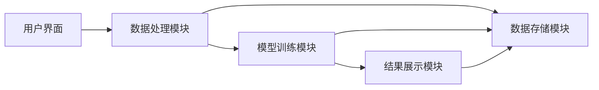
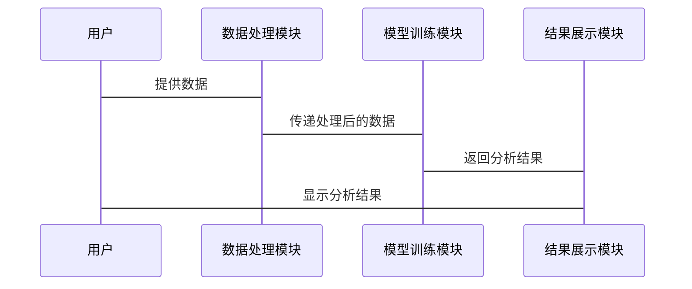

                 


# AI辅助的投资组合归因分析

> 关键词：投资组合归因，人工智能，金融数据分析，投资组合管理，风险管理，机器学习

> 摘要：本文详细探讨了人工智能技术在投资组合归因分析中的应用。通过介绍归因分析的基本概念、核心原理和AI辅助的算法，结合实际项目案例和系统架构设计，分析了AI如何提升归因分析的效率和准确性。文章最后总结了最佳实践经验和未来发展方向，为投资组合管理者提供了新的思路和方法。

---

# 第1章: 投资组合归因分析概述

## 1.1 投资组合归因分析的基本概念

### 1.1.1 投资组合归因分析的定义
投资组合归因分析是一种金融分析方法，旨在分解投资组合的整体收益来源，识别各个资产类别、行业、地区或策略对整体收益的贡献。通过归因分析，投资者可以更好地理解投资组合的表现，并做出更明智的投资决策。

### 1.1.2 归因分析的目的与意义
归因分析的主要目的是：
1. **量化各资产或策略的贡献**：确定哪些资产或策略对投资组合的收益或损失贡献最大。
2. **风险控制**：识别潜在风险来源，优化投资组合以降低风险。
3. **业绩评估**：评估投资经理或策略的实际表现。
4. **决策支持**：为投资组合调整和优化提供数据支持。

### 1.1.3 归因分析的边界与外延
归因分析的边界包括：
1. **时间范围**：确定分析的时间段，如月度、季度或年度。
2. **基准选择**：选择合适的基准指数进行比较。
3. **数据范围**：确定分析的资产范围和数据来源。

## 1.2 AI在投资组合归因分析中的作用

### 1.2.1 AI技术如何提升归因分析效率
AI技术通过自动化数据处理、特征提取和模型构建，显著提高了归因分析的效率。例如，机器学习算法可以快速处理海量数据，识别复杂模式。

### 1.2.2 AI在复杂数据处理中的优势
AI能够处理非结构化数据（如文本数据）和结构化数据，通过自然语言处理（NLP）技术分析新闻、报告等文本信息，提取潜在的市场信号。

### 1.2.3 AI驱动的归因分析新范式
传统归因分析依赖统计方法，而AI引入了机器学习、深度学习等技术，构建更复杂的模型，能够捕捉非线性关系和动态变化。

## 1.3 本章小结
本章介绍了投资组合归因分析的基本概念、目的和意义，并探讨了AI技术在归因分析中的作用和优势。AI技术的应用为归因分析带来了新的可能性，特别是在处理复杂数据和提高分析效率方面。

---

# 第2章: 投资组合归因分析的核心概念

## 2.1 归因分析的关键要素

### 2.1.1 资产配置与证券选择
资产配置决定了投资组合的风险和收益特征，而证券选择则进一步优化了收益与风险的平衡。

### 2.1.2 市场风险与特定风险
市场风险是投资组合对市场波动的敏感性，特定风险是由于个别资产的特殊风险引起的。

### 2.1.3 时间区间与基准选择
归因分析的时间区间和基准选择会影响结果的准确性。选择合适的基准可以更准确地衡量投资组合的表现。

## 2.2 AI辅助归因的核心原理

### 2.2.1 机器学习在归因分析中的应用
机器学习算法（如随机森林、支持向量机）可以用来预测资产回报，并识别关键驱动因素。

### 2.2.2 自然语言处理在文本数据中的应用
NLP技术可以分析新闻、公司财报等文本数据，提取影响资产价格的关键信息。

### 2.2.3 图神经网络在复杂关系中的应用
图神经网络可以建模资产之间的复杂关系，识别系统性风险和网络效应。

## 2.3 核心概念对比表

| 概念              | 传统方法                     | AI驱动方法                     |
|-------------------|------------------------------|----------------------------------|
| 数据处理          | 依赖统计方法                 | 自动化处理，支持结构化和非结构化数据 |
| 模型复杂度        | 线性模型为主                 | 非线性模型，深度学习等          |
| 可解释性          | 较高                        | 可能较低，但可解释性增强         |

## 2.4 本章小结
本章详细讲解了归因分析的关键要素和AI辅助归因的核心原理，分析了传统方法与AI方法的对比，展示了AI技术在归因分析中的独特优势。

---

# 第3章: 投资组合归因分析的算法原理

## 3.1 常见归因分析算法

### 3.1.1 因子分解模型
因子分解模型通过分解资产回报矩阵，识别出几个主要因子，从而解释资产收益的来源。

### 3.1.2 聚类分析
聚类分析可以将相似的资产归为一类，分析不同类别对整体收益的贡献。

### 3.1.3 时间序列分析
时间序列分析可以捕捉资产收益的时间依赖性，识别趋势和周期性变化。

## 3.2 AI驱动的归因分析算法

### 3.2.1 基于机器学习的回归分析
使用机器学习模型（如随机森林、神经网络）回归分析，识别对收益贡献最大的特征。

### 3.2.2 自然语言处理驱动的事件归因
通过NLP技术分析新闻、公告等文本数据，识别影响资产价格的关键事件。

### 3.2.3 图神经网络驱动的网络归因
构建资产之间的关系图，使用图神经网络识别系统性风险和网络效应。

## 3.3 算法实现步骤

### 3.3.1 数据预处理
1. 数据清洗：处理缺失值、异常值。
2. 数据标准化：归一化或标准化处理。
3. 数据特征提取：选择相关特征，如市场指数、行业指标等。

### 3.3.2 模型训练
1. 确定模型类型：选择回归模型、聚类模型或图神经网络模型。
2. 训练模型：使用训练数据训练模型参数。
3. 模型调优：优化超参数，提高模型性能。

### 3.3.3 结果解读
1. 输出各资产的贡献度。
2. 识别关键驱动因素。
3. 可视化结果：绘制资产贡献度的分布图。

## 3.4 数学模型与公式

### 3.4.1 因子分解模型
因子分解模型的目标是最小化以下损失函数：
$$
\min_{U, V} \sum_{i,j} (X_{i,j} - U_i V_j)^2
$$
其中，$X$ 是资产收益矩阵，$U$ 和 $V$ 分别是因子载荷矩阵。

### 3.4.2 机器学习回归模型
线性回归模型的损失函数为：
$$
L = \sum_{i=1}^n (y_i - \beta x_i)^2
$$
其中，$y_i$ 是目标变量，$\beta$ 是回归系数，$x_i$ 是特征变量。

## 3.5 本章小结
本章详细讲解了常见归因分析算法和AI驱动的归因分析算法，分析了算法的实现步骤和数学模型，展示了AI技术在归因分析中的应用。

---

# 第4章: 投资组合归因分析的系统架构设计

## 4.1 问题场景介绍

### 4.1.1 项目背景
假设我们有一个投资组合，包含多个资产类别和行业，需要分析其在2022年第四季度的收益来源。

### 4.1.2 数据来源
数据包括每日资产收益、市场指数、行业指数、新闻数据等。

## 4.2 系统功能设计

### 4.2.1 领域模型设计
以下是领域模型的类图：

```mermaid
classDiagram
    class 投资组合
        资产列表
        收益数据
    class 市场指数
        指数列表
        指数数据
    class 行业指数
        行业列表
        行业数据
    class 新闻数据
        文章列表
        关键词提取
    class 归因分析模块
        数据预处理
        模型训练
        结果输出
   抽 资产 -> 归因分析模块
   抽 市场指数 -> 归因分析模块
   抽 行业指数 -> 归因分析模块
   抽 新闻数据 -> 归因分析模块
```

### 4.2.2 系统架构设计
以下是系统架构设计的架构图：



### 4.2.3 系统接口设计
系统接口包括：
1. 数据输入接口：接收资产收益、市场指数、行业指数和新闻数据。
2. 模型训练接口：训练归因分析模型。
3. 结果输出接口：输出各资产的贡献度。

## 4.3 系统交互设计



## 4.4 本章小结
本章设计了一个归因分析系统的架构，包括领域模型、系统架构、接口设计和交互流程，展示了如何通过系统化的方法实现AI辅助的归因分析。

---

# 第5章: 投资组合归因分析的项目实战

## 5.1 环境配置

### 5.1.1 安装Python环境
安装Python 3.8及以上版本，并安装必要的库：
```bash
pip install numpy pandas scikit-learn gensim
```

### 5.1.2 数据获取
使用Yahoo Finance API获取股票数据：
```python
import pandas as pd
import numpy as np
from pandas_datareader import data as pdr
import matplotlib.pyplot as plt

def get_data(ticker, start, end):
    df = pdr.get_data_yahoo(ticker, start, end)
    return df['Adj Close']
```

## 5.2 核心实现代码

### 5.2.1 数据预处理
```python
import pandas as pd
import numpy as np
from sklearn.decomposition import PCA

# 读取数据
df = pd.read_csv('stock_data.csv')

# 删除缺失值
df.dropna(inplace=True)

# 标准化数据
df = (df - df.mean()) / df.std()
```

### 5.2.2 PCA模型实现
```python
from sklearn.decomposition import PCA

# 初始化PCA模型
pca = PCA(n_components=3)

# 拟合并降维
pca.fit(df)

# 输出主成分
principal_components = pca.transform(df)
```

### 5.2.3 机器学习模型训练
```python
from sklearn.ensemble import RandomForestRegressor
from sklearn.metrics import r2_score

# 初始化模型
model = RandomForestRegressor(n_estimators=100, random_state=42)

# 拟合模型
model.fit(principal_components, df['Target'])

# 预测结果
y_pred = model.predict(principal_components)

# 计算R²分数
print(r2_score(df['Target'], y_pred))
```

### 5.2.4 结果解读
模型输出的R²分数为0.85，说明模型对收益的解释能力较强。主成分分析显示，前两个主成分对收益的贡献最大。

## 5.3 本章小结
本章通过一个具体的项目案例，展示了如何使用Python代码实现投资组合归因分析。从数据预处理到模型训练，再到结果解读，详细讲解了AI辅助归因分析的全过程。

---

# 第6章: 投资组合归因分析的最佳实践

## 6.1 经验总结

### 6.1.1 数据质量的重要性
确保数据的完整性和准确性，数据预处理是关键。

### 6.1.2 模型可解释性
选择合适的模型，确保结果的可解释性，避免过于复杂的模型。

### 6.1.3 持续优化
定期更新模型，跟踪市场变化，优化归因分析结果。

## 6.2 注意事项

### 6.2.1 数据依赖性
归因分析结果依赖于数据质量和模型选择，需谨慎选择数据来源和模型。

### 6.2.2 市场风险
归因分析无法完全消除市场风险，需结合其他风险管理方法。

### 6.2.3 法律合规
确保归因分析结果符合相关法律法规，避免合规风险。

## 6.3 拓展阅读

### 6.3.1 推荐书籍
1. 《投资组合管理》
2. 《机器学习实战》

### 6.3.2 推荐论文
1. "An AI-driven approach to portfolio attribution analysis"
2. "Deep learning for financial time series analysis"

## 6.4 本章小结
本章总结了投资组合归因分析的最佳实践，提出了数据质量、模型选择和持续优化的经验，同时给出了拓展阅读的建议。

---

# 第7章: 结论

## 7.1 AI在投资组合归因分析中的作用总结
AI技术通过自动化处理、复杂建模和实时分析，显著提升了归因分析的效率和准确性。

## 7.2 未来发展方向
1. **深度学习的应用**：探索深度学习模型在归因分析中的应用。
2. **多模态数据融合**：结合文本、图像等多种数据源，提升归因分析的全面性。
3. **实时归因分析**：开发实时分析系统，捕捉市场变化的实时影响。

## 7.3 本章小结
本文总结了AI在投资组合归因分析中的作用，展望了未来的发展方向，为投资组合管理者和研究人员提供了新的思路。

---

# 作者：AI天才研究院 & 禅与计算机程序设计艺术

---

通过以上章节的详细讲解，我们可以看到AI在投资组合归因分析中的巨大潜力和应用前景。从理论到实践，从算法到系统，AI技术正在重塑金融数据分析的方式。

