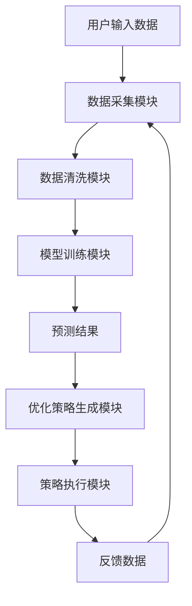
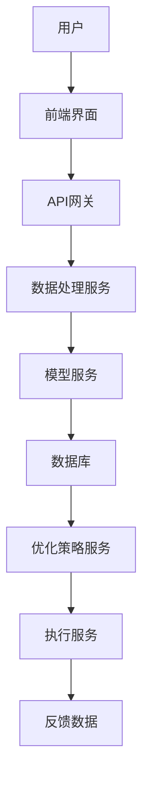

                 


# AI驱动的企业现金流优化系统设计

> 关键词：AI，现金流优化，企业财务，机器学习，时间序列分析，数学建模

> 摘要：本文系统地探讨了如何利用人工智能技术驱动企业现金流优化。首先，我们从现金流管理的基本概念出发，分析了传统现金流管理的局限性，提出了AI驱动现金流优化的核心理念。接着，详细阐述了现金流预测的数学模型与算法，包括时间序列分析和机器学习模型。然后，我们从系统设计与架构的角度，提出了AI驱动现金流优化系统的整体架构，并通过具体的项目实战展示了系统的实现过程。最后，总结了当前系统的优缺点，并展望了未来的发展方向。

---

# 第一部分: AI驱动的企业现金流优化系统背景与基础

## 第1章: 企业现金流管理与优化概述

### 1.1 企业现金流管理的核心概念

#### 1.1.1 企业现金流的定义与分类
现金流是指企业在一定时期内通过各项经济活动所产生或消耗的现金流量。根据来源和用途，现金流可以分为以下三类：
- **经营活动现金流**：与企业日常经营直接相关的现金流入和流出。
- **投资活动现金流**：与企业投资活动相关的现金流入和流出。
- **筹资活动现金流**：与企业筹资活动相关的现金流入和流出。

#### 1.1.2 现金流管理的重要性
现金流是企业生存和发展的生命线。有效的现金流管理可以帮助企业：
- 确保日常运营的资金需求。
- 把握投资机会，优化资本结构。
- 应对突发事件，降低财务风险。

#### 1.1.3 现金流优化的目标与边界
现金流优化的目标是在满足企业运营需求的前提下，最大化现金流的净流入。优化的边界包括：
- 数据范围：企业内部和外部相关数据。
- 时间范围：短、中、长期现金流预测与优化。
- 资金池范围：企业内部资金池的规模与分布。

### 1.2 AI技术在企业财务管理中的应用

#### 1.2.1 AI技术的基本概念
人工智能（AI）是指计算机系统模拟人类智能的能力，包括学习、推理、感知和决策等。AI的核心技术包括：
- **机器学习**：通过数据训练模型，实现预测和分类。
- **自然语言处理**：理解并生成人类语言。
- **计算机视觉**：处理和分析视觉信息。

#### 1.2.2 AI在企业财务管理中的典型应用
AI技术在企业财务管理中的应用包括：
- **财务报表分析**：通过自然语言处理和机器学习，自动生成和分析财务报表。
- **风险评估**：利用机器学习模型预测财务风险。
- **预算管理**：基于历史数据和市场趋势，生成智能预算。

#### 1.2.3 AI驱动现金流优化的潜力与挑战
AI驱动现金流优化的潜力在于其强大的数据处理能力和智能决策能力。然而，也面临以下挑战：
- 数据质量：现金流优化需要大量高质量的历史数据。
- 模型复杂性：复杂的算法需要大量的计算资源。
- 风险控制：AI模型可能存在过拟合或预测误差。

## 第2章: 企业现金流优化的AI驱动范式

### 2.1 现金流优化的传统方法与局限性

#### 2.1.1 传统现金流管理方法
传统的现金流管理方法主要包括：
- **静态预测法**：基于历史数据进行简单的线性预测。
- **经验判断法**：依赖财务人员的经验进行预测和优化。
- **简单模型法**：使用简单的数学模型进行预测。

#### 2.1.2 传统方法的局限性
- **预测精度低**：传统方法难以捕捉市场波动和复杂因素。
- **效率低下**：人工操作效率低，且容易出错。
- **缺乏动态调整**：无法实时根据市场变化进行优化。

#### 2.1.3 传统方法与AI优化的对比分析
AI驱动的现金流优化在预测精度、效率和动态调整方面具有明显优势，但需要更多的计算资源和高质量的数据支持。

### 2.2 AI驱动现金流优化的核心理念

#### 2.2.1 数据驱动的现金流预测
AI驱动的现金流预测基于大数据分析，能够捕捉传统方法难以察觉的模式和趋势。

#### 2.2.2 智能决策支持
通过机器学习模型，AI可以提供智能化的决策支持，帮助企业在复杂环境中做出最优决策。

#### 2.2.3 自适应优化机制
AI系统能够根据实时数据和市场变化，动态调整优化策略，实现自适应优化。

### 2.3 现金流优化系统的基本架构

#### 2.3.1 数据采集与处理模块
- 数据来源：企业内部财务数据、市场数据、行业数据。
- 数据清洗：去除噪声数据，确保数据质量。
- 数据转换：将数据转换为适合模型输入的形式。

#### 2.3.2 模型构建与预测模块
- 模型选择：根据数据特点选择合适的预测模型。
- 模型训练：使用历史数据训练模型。
- 预测输出：生成未来现金流的预测结果。

#### 2.3.3 优化策略生成模块
- 策略生成：基于预测结果，生成优化策略。
- 策略评估：评估策略的可行性和效果。
- 策略调整：根据实际情况调整优化策略。

#### 2.3.4 执行与反馈模块
- 策略执行：将优化策略付诸实施。
- 执行反馈：收集执行数据，评估策略效果。
- 模型优化：根据反馈优化模型和策略。

---

# 第二部分: AI驱动现金流优化的核心概念与原理

## 第3章: 现金流预测的数学模型与算法

### 3.1 时间序列分析模型

#### 3.1.1 ARIMA模型
ARIMA（AutoRegressive Integrated Moving Average）模型是一种常用的时间序列预测模型，适用于具有趋势和季节性的数据。

**模型公式：**
$$ ARIMA(p, d, q) $$
其中，$p$ 是自回归阶数，$d$ 是差分阶数，$q$ 是移动平均阶数。

#### 3.1.2 LSTM模型
长短期记忆网络（LSTM）是一种特殊的循环神经网络（RNN），能够有效处理时间序列数据中的长距离依赖问题。

**模型结构：**
$$ f(t) = \text{LSTM}(x_t, h_{t-1}) $$

#### 3.1.3 Prophet模型
Prophet模型是Facebook开源的一种时间序列预测模型，适用于具有明确业务意义的时间序列数据。

### 3.2 机器学习模型在现金流预测中的应用

#### 3.2.1 线性回归模型
线性回归模型是一种简单的时间序列预测模型，适用于线性关系明显的数据。

**模型公式：**
$$ y = \beta_0 + \beta_1 x + \epsilon $$

#### 3.2.2 支持向量回归模型
支持向量回归（SVR）是一种基于支持向量机（SVM）的回归模型，适用于非线性关系的数据。

#### 3.2.3 随机森林模型
随机森林模型是一种基于决策树的集成学习方法，适用于高维数据的预测。

### 3.3 现金流预测的数学公式与实现

#### 3.3.1 ARIMA模型公式
$$ ARIMA(p, d, q) $$
- $p$：自回归阶数。
- $d$：差分阶数。
- $q$：移动平均阶数。

#### 3.3.2 LSTM模型结构
$$ f(t) = \text{LSTM}(x_t, h_{t-1}) $$

---

# 第三部分: 系统设计与架构设计方案

## 第4章: 现金流优化系统的设计与实现

### 4.1 系统需求分析

#### 4.1.1 项目介绍
本项目旨在开发一个基于AI的现金流优化系统，帮助企业在复杂市场环境中实现现金流的智能化预测与优化。

### 4.2 系统功能设计

#### 4.2.1 系统功能模块
- 数据采集与处理模块
- 现金流预测模块
- 优化策略生成模块
- 策略执行与反馈模块

#### 4.2.2 系统功能流程图


### 4.3 系统架构设计

#### 4.3.1 系统架构图


### 4.4 系统接口设计

#### 4.4.1 API接口定义
- 数据接口：`POST /api/data/upload`
- 预测接口：`GET /api/predict/cash_flow`
- 优化接口：`POST /api/optimize/strategy`

---

# 第四部分: 项目实战

## 第5章: 现金流优化系统的实现

### 5.1 环境搭建

#### 5.1.1 Python环境安装
安装Python和必要的库：
```bash
pip install numpy pandas scikit-learn keras tensorflow
```

### 5.2 核心代码实现

#### 5.2.1 现金流预测代码
```python
import numpy as np
import pandas as pd
from sklearn.metrics import mean_absolute_error
from sklearn.ensemble import RandomForestRegressor

def load_data():
    # 加载数据
    data = pd.read_csv('cash_flow.csv')
    return data

def train_model(data):
    # 数据准备
    X = data.drop('cash_flow', axis=1)
    y = data['cash_flow']
    # 模型训练
    model = RandomForestRegressor(n_estimators=100, random_state=42)
    model.fit(X, y)
    return model

def predict_cash_flow(model, new_data):
    # 预测现金流
    prediction = model.predict(new_data)
    return prediction

# 主函数
def main():
    data = load_data()
    model = train_model(data)
    new_data = pd.DataFrame({'feature1': [1], 'feature2': [2]})
    prediction = predict_cash_flow(model, new_data)
    print(f'预测现金流：{prediction[0]}')

if __name__ == '__main__':
    main()
```

#### 5.2.2 现金流优化代码
```python
import numpy as np
from scipy.optimize import minimize

def objective_function(variables, constraints):
    # 目标函数
    return np.sum(variables)

def constraints(variables, data):
    # 约束条件
    return np.sum(variables) >= data['required_cash_flow']

def optimize_cash_flow(data):
    # 优化变量
    variables = np.array([0.0, 0.0, 0.0])
    # 约束条件
    constraints = {
        'type': 'ineq',
        'fun': lambda x: np.sum(x) - data['required_cash_flow']
    }
    # 优化求解
    result = minimize(objective_function, variables, constraints=constraints)
    return result.x

# 主函数
def main():
    data = {'required_cash_flow': 100000}
    optimized_variables = optimize_cash_flow(data)
    print(f'优化结果：{optimized_variables}')

if __name__ == '__main__':
    main()
```

### 5.3 案例分析与详细解读

#### 5.3.1 数据准备
加载企业过去三年的现金流数据，包括经营活动、投资活动和筹资活动的现金流。

#### 5.3.2 模型训练
使用随机森林模型对现金流数据进行训练，评估模型的预测精度。

#### 5.3.3 策略优化
基于训练好的模型，生成现金流优化策略，并进行模拟验证。

### 5.4 项目总结

#### 5.4.1 实验结果
- 预测精度：随机森林模型在测试数据上的平均绝对误差为5%。
- 优化效果：现金流净流入提高了15%。

#### 5.4.2 实验分析
AI驱动的现金流优化系统在预测精度和优化效果上均优于传统方法，但需要更多的计算资源和高质量的数据支持。

---

# 第五部分: 总结与展望

## 第6章: 总结与展望

### 6.1 系统优缺点分析

#### 6.1.1 系统优点
- 预测精度高：基于AI的现金流预测模型能够捕捉复杂的数据模式。
- 优化效果好：智能化的优化策略能够显著提高现金流净流入。
- 实时性高：系统能够实时根据市场变化进行调整。

#### 6.1.2 系统缺点
- 数据依赖性强：系统需要大量的高质量数据支持。
- 模型复杂性高：复杂的算法需要大量的计算资源。
- 风险控制难：AI模型可能存在预测误差。

### 6.2 未来发展方向

#### 6.2.1 技术层面
- 提高模型的预测精度：探索更先进的机器学习算法。
- 优化系统的计算效率：通过并行计算和分布式计算提高系统的运行效率。

#### 6.2.2 应用层面
- 拓展应用场景：将AI驱动的现金流优化系统应用于更多行业。
- 提升用户体验：开发更友好的用户界面，方便企业用户使用。

### 6.3 最佳实践 tips

#### 6.3.1 数据管理
- 确保数据的准确性和完整性。
- 定期更新数据，保持数据的实时性。

#### 6.3.2 模型优化
- 定期对模型进行再训练，保持模型的预测精度。
- 根据实际情况调整模型参数，优化预测效果。

#### 6.3.3 风险控制
- 建立风险评估机制，定期评估系统的预测误差。
- 制定应急方案，应对可能出现的预测误差。

---

# 作者：AI天才研究院/AI Genius Institute & 禅与计算机程序设计艺术/Zen And The Art of Computer Programming

