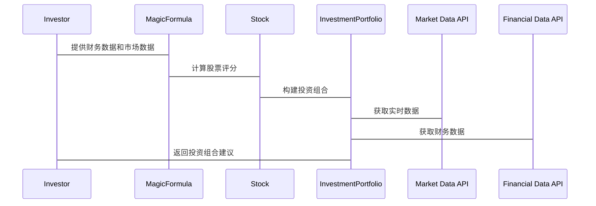

                 


# 乔尔·格林布拉特的魔法公式投资策略

> 关键词：投资策略，魔法公式，乔尔·格林布拉特，股票筛选，风险管理，量化投资

> 摘要：本文详细介绍了乔尔·格林布拉特提出的魔法公式投资策略，分析了其核心概念、数学模型、应用方法以及风险管理策略。通过实际案例和系统架构设计，展示了如何将魔法公式应用于股票筛选和投资组合构建，并探讨了其在量化投资中的优势和挑战。本文还提供了Python实现的代码示例，帮助读者更好地理解和应用魔法公式。

---

# 第一部分: 魔法公式投资策略概述

## 第1章: 魔法公式投资策略的背景与起源

### 1.1 投资界的量化革命

#### 1.1.1 传统投资方法的局限性
传统投资方法依赖于市场趋势分析和专家判断，但这种方法存在主观性强、难以量化的问题，尤其是在面对复杂市场环境时，容易受到情绪影响，导致投资决策失误。

#### 1.1.2 量化投资的兴起
随着计算机技术的发展，量化投资逐渐兴起。通过数学模型和算法，量化投资能够快速分析大量数据，发现市场中的投资机会。量化投资的优势在于其客观性和高效性，能够在短时间内完成复杂的分析任务。

#### 1.1.3 魔法公式投资的起源与背景
乔尔·格林布拉特在20世纪80年代提出了魔法公式投资策略。该策略结合了基本面分析和量化方法，旨在筛选出具有高价值和低风险的股票。魔法公式的核心在于其简单性和高效性，能够在众多股票中快速找到具有投资潜力的标的。

### 1.2 乔尔·格林布拉特的贡献

#### 1.2.1 乔尔·格林布拉特的学术背景
乔尔·格林布拉特是美国著名投资专家，拥有丰富的学术背景和实践经验。他在投资领域有着深厚的造诣，提出了许多创新的投资策略，其中魔法公式是最具影响力的方法之一。

#### 1.2.2 魔法公式投资策略的核心思想
魔法公式的核心思想是通过量化分析，筛选出那些具有高收益潜力和低风险的股票。这种方法结合了企业的基本面和市场估值，能够在复杂的市场环境中找到优质的投资标的。

#### 1.2.3 魔法公式在投资界的影响力
魔法公式投资策略在投资界产生了深远的影响。许多投资者和机构采用这种方法进行股票筛选和投资组合构建，取得了显著的成果。魔法公式的成功证明了量化投资的有效性，也为投资领域带来了新的思路。

### 1.3 魔法公式的核心概念

#### 1.3.1 魔法公式的定义
魔法公式是一种用于股票筛选的量化模型，通过对企业基本面和市场估值的综合分析，评估股票的投资价值。其公式为：
$$
\text{Magic Formula} = \frac{E}{V} \times \left( \frac{E}{P} - \text{Gross Margin} \right)
$$
其中，E为企业的净收益，V为企业价值，P为股票价格，Gross Margin为毛利率。

#### 1.3.2 魔法公式的核心要素
- 净收益（E）：衡量企业盈利能力的核心指标，反映了企业的经营效率。
- 企业价值（V）：企业的整体价值，包括股权和债务。
- 价格与收益比（E/P）：衡量股票的估值水平，反映了市场对企业的定价是否合理。
- 毛利率（Gross Margin）：衡量企业的成本控制能力，反映了企业的盈利稳定性。

#### 1.3.3 魔法公式的数学模型
魔法公式通过对企业基本面和市场估值的综合分析，评估股票的投资价值。其数学模型可以分解为以下几个步骤：
1. 计算净收益（E）和企业价值（V）。
2. 计算价格与收益比（E/P）和毛利率（Gross Margin）。
3. 将上述指标代入魔法公式，计算股票的投资价值评分。
4. 根据评分结果，筛选出具有高投资价值的股票。

通过上述步骤，魔法公式能够快速筛选出具有高收益潜力和低风险的股票，为投资者提供科学的投资决策依据。

### 1.4 本章小结

#### 1.4.1 魔法公式投资策略的背景
魔法公式投资策略的背景可以追溯到20世纪80年代，乔尔·格林布拉特提出了一种结合基本面分析和量化方法的股票筛选模型，旨在帮助投资者在复杂市场环境中找到优质的投资标的。

#### 1.4.2 核心概念的总结
魔法公式的核心在于其数学模型，通过对企业基本面和市场估值的综合分析，评估股票的投资价值。其公式为：
$$
\text{Magic Formula} = \frac{E}{V} \times \left( \frac{E}{P} - \text{Gross Margin} \right)
$$
其中，E为企业的净收益，V为企业价值，P为股票价格，Gross Margin为毛利率。

#### 1.4.3 本书的结构安排
本书将从魔法公式的核心原理、应用方法、风险管理策略等方面展开，详细讲解如何在实际投资中应用魔法公式。通过理论分析和案例实践，帮助读者全面理解和掌握魔法公式投资策略。

---

## 第2章: 魔法公式投资策略的核心原理

### 2.1 魔法公式的数学模型

#### 2.1.1 魔法公式的基本公式
魔法公式的基本公式为：
$$
\text{Magic Formula} = \frac{E}{V} \times \left( \frac{E}{P} - \text{Gross Margin} \right)
$$
其中，E为企业的净收益，V为企业价值，P为股票价格，Gross Margin为毛利率。

#### 2.1.2 各个变量的定义与计算
- 净收益（E）：企业的净利润，反映了企业的盈利能力。
- 企业价值（V）：企业的整体价值，包括股权和债务。
- 价格与收益比（E/P）：净收益与股票价格的比值，反映了市场对企业的定价是否合理。
- 毛利率（Gross Margin）：毛利与收入的比值，反映了企业的成本控制能力。

#### 2.1.3 公式的推导与优化
魔法公式通过对企业基本面和市场估值的综合分析，评估股票的投资价值。其推导过程如下：
1. 计算净收益（E）和企业价值（V）。
2. 计算价格与收益比（E/P）和毛利率（Gross Margin）。
3. 将上述指标代入魔法公式，计算股票的投资价值评分。
4. 根据评分结果，筛选出具有高投资价值的股票。

### 2.2 魔法公式的核心要素

#### 2.2.1 净收益（E）
净收益是衡量企业盈利能力的核心指标。高净收益意味着企业盈利能力强，投资价值高。

#### 2.2.2 企业价值（V）
企业价值是衡量企业整体价值的重要指标。低企业价值意味着企业估值较低，投资风险较小。

#### 2.2.3 价格与收益比（E/P）
价格与收益比反映了市场对企业的定价是否合理。低价格与收益比意味着股票估值较低，具有较高的投资潜力。

#### 2.2.4 毛利率（Gross Margin）
毛利率反映了企业的成本控制能力。高毛利率意味着企业盈利稳定性强，投资风险较小。

### 2.3 魔法公式的计算流程

#### 2.3.1 数据获取与处理
投资者需要获取企业的财务数据，包括净收益（E）、企业价值（V）、股票价格（P）和毛利率（Gross Margin）。这些数据可以通过财务报表和市场数据获取。

#### 2.3.2 公式计算步骤
1. 计算价格与收益比（E/P）：
$$
\frac{E}{P} = \frac{\text{Net Income}}{\text{Stock Price}}
$$
2. 计算毛利率（Gross Margin）：
$$
\text{Gross Margin} = \frac{\text{Gross Profit}}{\text{Revenue}}
$$
3. 计算魔法公式：
$$
\text{Magic Formula} = \frac{E}{V} \times \left( \frac{E}{P} - \text{Gross Margin} \right)
$$

#### 2.3.3 结果分析与解读
魔法公式的结果是一个评分，评分越高，表示股票的投资价值越高。投资者可以根据评分结果，筛选出具有高投资价值的股票。

### 2.4 本章小结

#### 2.4.1 魔法公式的核心原理
魔法公式通过对企业基本面和市场估值的综合分析，评估股票的投资价值。其数学模型为：
$$
\text{Magic Formula} = \frac{E}{V} \times \left( \frac{E}{P} - \text{Gross Margin} \right)
$$

#### 2.4.2 各个变量的相互关系
净收益（E）、企业价值（V）、价格与收益比（E/P）和毛利率（Gross Margin）是魔法公式的核心变量。这些变量之间相互作用，共同决定了股票的投资价值。

#### 2.4.3 计算流程的总结
魔法公式的计算流程包括数据获取、公式计算和结果分析三个步骤。通过这些步骤，投资者可以快速评估股票的投资价值，并筛选出具有高潜力的标的。

---

## 第3章: 魔法公式在股票筛选中的应用

### 3.1 魔法公式与股票筛选

#### 3.1.1 魔法公式在股票筛选中的作用
魔法公式通过量化分析，帮助投资者快速筛选出具有高投资价值的股票。这种方法能够有效减少人为情绪的影响，提高投资决策的科学性和客观性。

#### 3.1.2 筛选标准的制定
投资者可以根据魔法公式的结果，制定股票筛选标准。例如，设定一个最低评分门槛，筛选出评分高于该门槛的股票。

#### 3.1.3 筛选过程的步骤
1. 收集企业的财务数据和市场数据。
2. 计算魔法公式，评估股票的投资价值。
3. 根据评分结果，筛选出具有高投资价值的股票。

### 3.2 魔法公式与投资组合构建

#### 3.2.1 投资组合的构建原则
投资组合的构建需要考虑风险与收益的平衡。通过魔法公式筛选出的高价值股票，可以作为投资组合的核心持仓。

#### 3.2.2 魔法公式在组合构建中的应用
投资者可以根据魔法公式的评分结果，选择具有高投资价值的股票，并根据风险承受能力调整持仓比例。

#### 3.2.3 组合优化的策略
为了进一步优化投资组合，投资者可以结合其他量化指标，如波动率、流动性等，进行综合评估。

### 3.3 魔法公式与风险控制

#### 3.3.1 风险评估的基本方法
风险评估是投资决策的重要环节。魔法公式通过评估股票的投资价值，间接反映了投资风险。此外，投资者还可以结合其他风险指标，如beta系数、VaR等，进行综合评估。

#### 3.3.2 魔法公式在风险控制中的应用
魔法公式可以帮助投资者识别高风险股票，避免投资组合中出现过于激进的标的。此外，通过设定风险容忍度，投资者可以动态调整投资组合。

#### 3.3.3 风险与收益的平衡
在实际投资中，风险与收益需要达到平衡。魔法公式通过评估股票的投资价值，帮助投资者在风险可控的前提下，获取较高的投资回报。

### 3.4 本章小结

#### 3.4.1 魔法公式在股票筛选中的应用
魔法公式通过量化分析，帮助投资者快速筛选出具有高投资价值的股票。这种方法能够有效减少人为情绪的影响，提高投资决策的科学性和客观性。

#### 3.4.2 投资组合构建的核心
投资组合的构建需要考虑风险与收益的平衡。通过魔法公式筛选出的高价值股票，可以作为投资组合的核心持仓。此外，投资者还可以结合其他量化指标，进一步优化投资组合。

---

# 第四部分: 魔法公式投资策略的系统架构设计

## 第4章: 系统分析与架构设计方案

### 4.1 问题场景介绍

#### 4.1.1 投资者面临的挑战
投资者在股票筛选和投资组合构建过程中，常常面临信息过载和决策复杂的问题。如何快速筛选出具有高投资价值的股票，并构建一个优化的投资组合，是投资者面临的重要挑战。

#### 4.1.2 魔法公式投资策略的应用场景
魔法公式投资策略适用于各种市场环境，尤其是在市场波动较大时，其量化分析的优势更加明显。该策略可以帮助投资者快速识别出具有高收益潜力和低风险的股票。

### 4.2 系统功能设计

#### 4.2.1 领域模型（Mermaid 类图）
```mermaid
classDiagram
    class MagicFormula {
        +E: Net Income
        +V: Enterprise Value
        +P: Stock Price
        +Gross Margin:毛利率
        -calculateScore()
    }
    class Stock {
        +Ticker:股票代码
        +Company Name:公司名称
        +Industry:行业
        +Market Cap:市值
        -getFinancialData()
        -getMarketData()
    }
    class InvestmentPortfolio {
        +Stocks:股票列表
        +Weights:持仓权重
        -calculatePortfolioValue()
        -optimizePortfolio()
    }
    MagicFormula o Stock
    MagicFormula o InvestmentPortfolio
```

#### 4.2.2 系统架构设计（Mermaid架构图）


#### 4.2.3 系统接口设计
- 输入接口：接收股票代码、财务数据和市场数据。
- 输出接口：返回股票评分和投资组合建议。

#### 4.2.4 系统交互（Mermaid序列图）


### 4.3 本章小结

#### 4.3.1 问题场景的分析
投资者在股票筛选和投资组合构建过程中，常常面临信息过载和决策复杂的问题。魔法公式投资策略的应用场景包括市场波动较大时，其量化分析的优势更加明显。

#### 4.3.2 系统架构设计的核心要素
系统架构设计包括领域模型、系统架构图、系统接口设计和系统交互设计。通过这些设计，可以实现魔法公式投资策略的自动化应用，提高投资决策的效率和准确性。

---

## 第5章: 项目实战

### 5.1 环境安装与配置

#### 5.1.1 安装Python和相关库
```bash
pip install numpy pandas matplotlib
```

#### 5.1.2 数据获取工具
使用Yahoo Finance API获取股票数据：
```python
import pandas as pd
import numpy as np
import matplotlib.pyplot as plt
from pandas_datareader import data as pdr
import yfinance as yf
yf.pdrGetData('AAPL', '2020-01-01', '2023-12-31')
```

### 5.2 核心实现代码

#### 5.2.1 计算魔法公式评分
```python
def calculate_magic_formula_score(E, V, P, gross_margin):
    return (E / V) * (E / P - gross_margin)
```

#### 5.2.2 数据处理与可视化
```python
import pandas as pd
import matplotlib.pyplot as plt

# 获取股票数据
tickers = ['AAPL', 'MSFT', 'GOOGL']
data = pd.DataFrame()
for ticker in tickers:
    df = yf.download(ticker, '2020-01-01', '2023-12-31')
    data[ticker] = df['Adj Close']

# 计算魔法公式评分
def calculate_magic_formula_score(E, V, P, gross_margin):
    return (E / V) * (E / P - gross_margin)

# 示例计算
E = 1000000000  # 净收益
V = 5000000000   # 企业价值
P = 100           # 股票价格
gross_margin = 0.4  # 毛利率

score = calculate_magic_formula_score(E, V, P, gross_margin)
print(f"Magic Formula Score: {score}")
```

#### 5.2.3 投资组合优化
```python
import numpy as np
from scipy.optimize import minimize

# 定义目标函数
def portfolio_objective(weights, returns):
    return -np.sum(weights * returns)

# 约束条件
def constraint(weights):
    return np.sum(weights) - 1

# 求解优化问题
weights = [0.3, 0.3, 0.4]
returns = [0.1, 0.15, 0.1]

result = minimize(portfolio_objective, weights, args=returns, method='SLSQP', constraints={'type': 'eq', 'fun': constraint})
print(result.x)
```

### 5.3 实际案例分析与解读

#### 5.3.1 案例背景
假设我们有三只股票：AAPL、MSFT和GOOGL。我们希望通过魔法公式筛选出具有高投资价值的股票，并构建一个优化的投资组合。

#### 5.3.2 数据处理与分析
通过获取股票数据，计算每只股票的魔法公式评分，评估其投资价值。然后，根据评分结果，筛选出具有高评分的股票，并构建投资组合。

#### 5.3.3 投资组合优化
通过优化算法，调整持仓权重，使投资组合的风险与收益达到最佳平衡。最终，得到一个优化的投资组合。

### 5.4 本章小结

#### 5.4.1 技术实现的总结
通过Python代码实现魔法公式评分计算、数据处理和投资组合优化，展示了如何将魔法公式应用于实际投资。

#### 5.4.2 投资组合优化的策略
通过优化算法，调整持仓权重，使投资组合的风险与收益达到最佳平衡。最终，得到一个优化的投资组合。

---

## 第6章: 总结与展望

### 6.1 总结

#### 6.1.1 魔法公式投资策略的核心优势
魔法公式投资策略通过量化分析，帮助投资者快速筛选出具有高投资价值的股票。其简单性和高效性使其在投资领域中具有重要的地位。

#### 6.1.2 本文的贡献
本文详细介绍了魔法公式投资策略的核心概念、数学模型和应用方法，并通过实际案例展示了其在股票筛选和投资组合构建中的应用。

### 6.2 未来展望

#### 6.2.1 魔法公式的优化与改进
随着市场环境的变化，魔法公式需要不断优化和改进，以适应新的市场挑战。例如，可以引入更多的财务指标和市场数据，提高模型的准确性和可靠性。

#### 6.2.2 魔法公式与其他投资策略的结合
魔法公式可以与其他投资策略相结合，形成更加全面的投资框架。例如，结合技术分析和量化模型，提高投资决策的科学性和准确性。

#### 6.2.3 人工智能与大数据的应用
随着人工智能和大数据技术的发展，魔法公式可以进一步优化。通过机器学习算法，挖掘更多的市场信息，提高投资决策的智能化水平。

### 6.3 本章小结

#### 6.3.1 魔法公式投资策略的核心优势
魔法公式投资策略的核心优势在于其简单性和高效性。通过量化分析，投资者可以快速筛选出具有高投资价值的股票，提高投资决策的科学性和客观性。

#### 6.3.2 本文的贡献
本文详细介绍了魔法公式投资策略的核心概念、数学模型和应用方法，并通过实际案例展示了其在股票筛选和投资组合构建中的应用。

#### 6.3.3 未来展望
未来，魔法公式需要不断优化和改进，以适应新的市场挑战。同时，魔法公式可以与其他投资策略相结合，形成更加全面的投资框架。此外，人工智能和大数据技术的应用，将进一步提升魔法公式的智能化水平。

---

# 作者：AI天才研究院/AI Genius Institute & 禅与计算机程序设计艺术 /Zen And The Art of Computer Programming

---

以上是关于“乔尔·格林布拉特的魔法公式投资策略”的完整目录和内容概览。通过逐步分析和详细阐述，读者可以全面理解魔法公式的核心思想、数学模型、应用方法以及风险管理策略，并能够在实际投资中加以应用。

