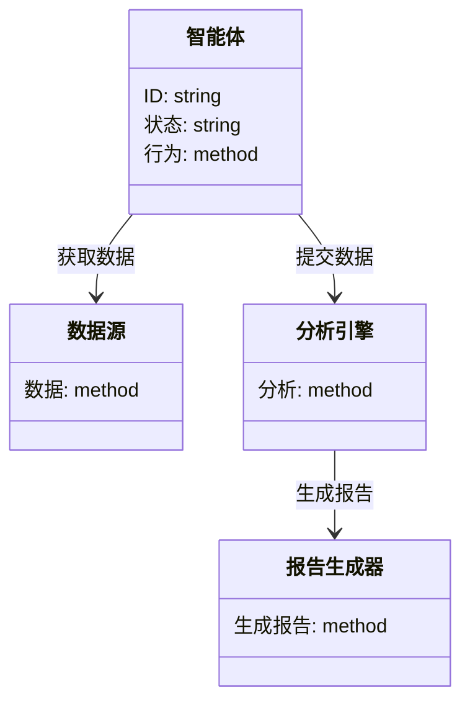
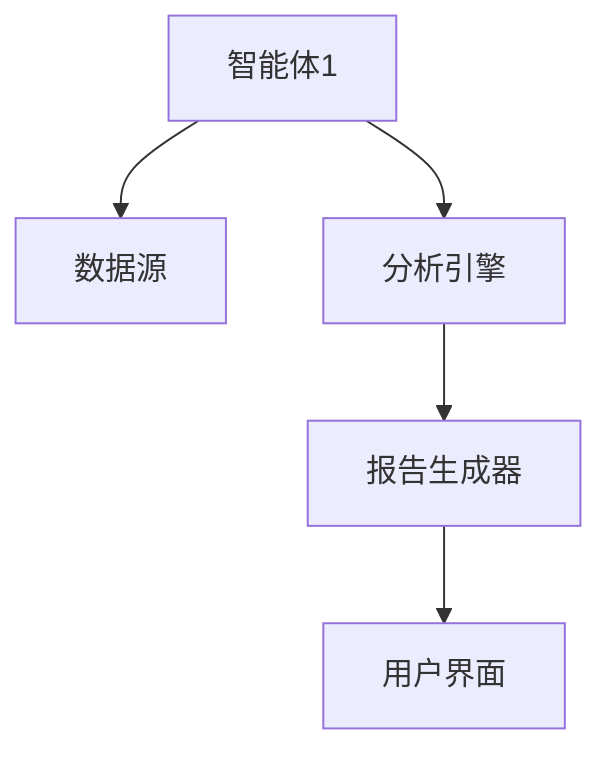
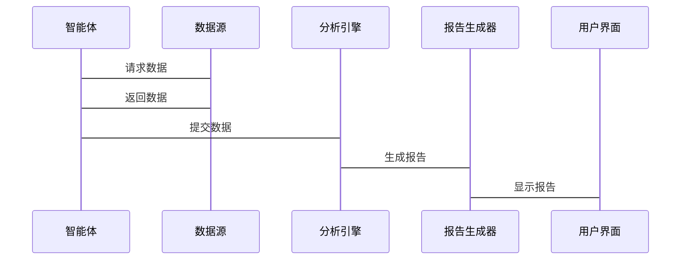

                 


# 利用多智能体系统进行全面的ESG因素分析

> 关键词：多智能体系统，ESG分析，分布式计算，协同优化，系统架构

> 摘要：本文探讨了如何利用多智能体系统进行全面的ESG（环境、社会和治理）因素分析。通过结合多智能体系统的分布式计算和协作优化能力，我们能够更高效地处理ESG分析中的复杂问题。文章从背景介绍、核心概念、算法原理、系统架构设计、项目实战等多方面进行详细分析，旨在为读者提供一个全面的视角，了解多智能体系统在ESG分析中的应用及其优势。

---

## 第1章: 多智能体系统与ESG分析的背景介绍

### 1.1 多智能体系统的定义与特点

#### 1.1.1 多智能体系统的定义
多智能体系统（Multi-Agent System, MAS）是由多个智能体组成的分布式系统，这些智能体能够通过自主决策和协作完成特定任务。每个智能体都有一定的认知能力、学习能力和执行能力，能够独立或协同工作。

#### 1.1.2 多智能体系统的核心特点
- **分布性**：智能体分布在网络中，各自处理不同的子任务。
- **自主性**：每个智能体能够自主决策，无需中央控制。
- **协作性**：智能体之间通过通信和协调完成共同目标。
- **反应性**：能够实时感知环境变化并做出反应。

#### 1.1.3 多智能体系统的主要应用场景
- **分布式计算**：如分布式任务分配、负载均衡。
- **智能控制**：如自动驾驶、智能交通系统。
- **数据挖掘与分析**：如大数据分析、模式识别。

### 1.2 ESG分析的核心概念

#### 1.2.1 ESG的定义与内涵
ESG分析是指从环境、社会和治理三个维度对企业或组织进行综合评估。环境因素关注企业的碳排放、资源利用效率；社会因素关注企业对员工、社区和社会的影响；治理因素关注企业的管理结构、透明度和合规性。

#### 1.2.2 ESG分析的背景与意义
随着全球对可持续发展的关注增加，ESG分析已成为企业风险管理、投资决策和政策制定的重要工具。通过ESG分析，可以识别企业的潜在风险，评估其社会价值和治理能力。

#### 1.2.3 ESG分析的边界与外延
- **边界**：主要关注企业的直接环境、社会和治理影响。
- **外延**：延伸至企业供应链、产品生命周期、社会影响力等方面。

### 1.3 多智能体系统与ESG分析的结合背景

#### 1.3.1 当前ESG分析的挑战
- 数据量大：ESG分析涉及大量非结构化数据，如文本报告、社交媒体信息。
- 多维度：需要同时考虑环境、社会和治理三个维度。
- 动态性：企业ESG表现会随时间变化，需要实时更新。

#### 1.3.2 多智能体系统的优势
- 分布式计算能力：能够处理大量数据和复杂任务。
- 协作能力：智能体之间可以分工协作，提高分析效率。
- 自适应性：能够实时响应数据变化和环境变化。

#### 1.3.3 结合的必要性与可行性
- 必要性：传统方法难以应对ESG分析的复杂性和动态性。
- 可行性：多智能体系统具备分布式计算和协作能力，适合处理ESG分析中的多维度问题。

---

## 第2章: 多智能体系统与ESG分析的核心概念与联系

### 2.1 多智能体系统的原理

#### 2.1.1 多智能体系统的组成
- **智能体**：具有感知、决策和执行能力的个体。
- **通信机制**：智能体之间交换信息的方式，如消息传递、共享数据库。
- **协作机制**：智能体之间协调完成任务的方式，如任务分配、协同决策。

#### 2.1.2 多智能体系统的通信机制
- **消息传递**：智能体通过发送消息进行信息交换。
- **中间件**：使用中间件（如JMS）实现智能体之间的通信。

#### 2.1.3 多智能体系统的协作机制
- **任务分配**：根据智能体的能力分配任务。
- **协同决策**：多个智能体共同决策，如分布式共识算法。

### 2.2 ESG分析的原理

#### 2.2.1 环境因素的分析方法
- **碳排放计算**：基于企业的能源消耗数据，计算碳排放量。
- **资源利用效率**：分析企业对水、能源等资源的使用效率。

#### 2.2.2 社会因素的分析方法
- **员工满意度**：通过调查、数据分析员工满意度。
- **社会责任履行**：评估企业对社区、公益事业的贡献。

#### 2.2.3 治理因素的分析方法
- **管理结构**：分析企业的组织架构、决策流程。
- **合规性**：评估企业是否遵守相关法律法规。

### 2.3 多智能体系统与ESG分析的联系

#### 2.3.1 多智能体系统在ESG分析中的作用
- **数据采集**：智能体负责从不同来源采集环境、社会和治理数据。
- **数据处理**：智能体对数据进行清洗、分析和建模。
- **结果输出**：智能体协同生成最终的ESG评估报告。

#### 2.3.2 ESG分析对多智能体系统的反馈机制
- **动态调整**：根据ESG分析结果，智能体调整自身的行为策略。
- **协作优化**：根据分析结果优化智能体之间的协作方式。

#### 2.3.3 多智能体系统与ESG分析的协同优化
- **协同优化目标**：提高ESG分析的效率和准确性。
- **优化方法**：通过智能体之间的协同学习和自适应调整实现优化。

---

## 第3章: 多智能体系统与ESG分析的算法原理

### 3.1 多智能体系统的算法原理

#### 3.1.1 分布式计算的原理
- **分布式计算**：任务分解到多个节点上并行计算。
- **通信与同步**：节点之间通过通信机制同步数据和结果。

#### 3.1.2 多智能体系统的通信协议
- **异步通信**：智能体之间异步交换信息，减少通信开销。
- **同步通信**：所有智能体同步通信，确保数据一致性。

#### 3.1.3 多智能体系统的协作算法
- **分布式共识算法**：如拜占庭容错（BFT）算法，用于智能体之间达成共识。
- **任务分配算法**：如负载均衡算法，用于智能体之间分配任务。

### 3.2 ESG分析的算法原理

#### 3.2.1 环境因素的计算方法
- **碳排放计算模型**：基于企业的能源消耗数据，计算碳排放量。
  $$\text{碳排放量} = \sum_{i=1}^{n} (\text{能源消耗}_i \times \text{碳排放系数}_i)$$
- **资源利用效率评估**：通过指标（如单位产品水耗）进行评估。

#### 3.2.2 社会因素的计算方法
- **员工满意度模型**：通过调查数据和机器学习模型预测员工满意度。
- **社会责任履行评分**：根据企业社会责任报告和第三方评估结果进行评分。

#### 3.2.3 治理因素的计算方法
- **管理结构优化**：通过流程优化和组织结构调整提高治理效率。
- **合规性评估**：通过法律文本分析和实时监控评估企业合规性。

### 3.3 多智能体系统与ESG分析的协同算法

#### 3.3.1 协同算法的数学模型
- **协同优化模型**：通过数学建模描述智能体之间的协同关系。
  $$\text{优化目标} = \sum_{i=1}^{n} f_i(\text{智能体}_i)$$
  其中，$f_i$ 表示智能体 $i$ 的优化目标。

#### 3.3.2 协同算法的实现步骤
1. **任务分解**：将ESG分析任务分解为多个子任务。
2. **智能体分配**：根据智能体的能力分配子任务。
3. **协同计算**：智能体协同完成计算，生成中间结果。
4. **结果整合**：整合各智能体的结果，生成最终的ESG评估报告。

#### 3.3.3 协同算法的优化方法
- **并行计算**：通过并行计算提高计算效率。
- **动态调整**：根据计算负载动态调整智能体的分工。

---

## 第4章: 多智能体系统与ESG分析的系统分析与架构设计方案

### 4.1 系统分析

#### 4.1.1 问题场景介绍
- **数据来源**：环境、社会和治理数据来自企业报告、公开数据等。
- **数据类型**：结构化数据和非结构化数据。
- **分析需求**：实时分析，动态更新。

#### 4.1.2 系统功能需求
- **数据采集**：从多种数据源采集环境、社会和治理数据。
- **数据分析**：对数据进行清洗、分析和建模。
- **结果输出**：生成ESG评估报告和可视化结果。

### 4.2 系统架构设计

#### 4.2.1 领域模型类图


#### 4.2.2 系统架构图


#### 4.2.3 接口设计
- **数据接口**：智能体与数据源之间的接口。
- **分析接口**：智能体与分析引擎之间的接口。
- **报告接口**：分析引擎与报告生成器之间的接口。

#### 4.2.4 交互序列图


---

## 第5章: 多智能体系统与ESG分析的项目实战

### 5.1 环境安装与配置

#### 5.1.1 安装依赖
- **Python**：安装Python 3.8以上版本。
- **库**：安装`numpy`, `pandas`, `networkx`, `matplotlib`等。

#### 5.1.2 环境配置
- **虚拟环境**：使用`virtualenv`创建虚拟环境。
- **配置文件**：配置数据源和接口信息。

### 5.2 核心代码实现

#### 5.2.1 智能体类
```python
class Agent:
    def __init__(self, id):
        self.id = id
        self.state = "idle"

    def get_data(self, data_source):
        # 从数据源获取数据
        pass

    def analyze(self, data, engine):
        # 提交数据到分析引擎
        pass
```

#### 5.2.2 数据源类
```python
class DataSource:
    def __init__(self):
        self.data = {}

    def provide_data(self, agent):
        # 返回数据给智能体
        pass
```

#### 5.2.3 分析引擎类
```python
class AnalyzeEngine:
    def __init__(self):
        self.results = {}

    def process_data(self, data, agent):
        # 处理数据并返回结果
        pass
```

#### 5.2.4 报告生成器类
```python
class ReportGenerator:
    def __init__(self):
        self.reports = []

    def generate_report(self, results):
        # 生成报告
        pass
```

### 5.3 案例分析与结果解读

#### 5.3.1 案例背景
- 某企业需要进行ESG分析，涉及环境、社会和治理三个维度。

#### 5.3.2 数据采集
- 从企业报告、公开数据、社交媒体等获取数据。

#### 5.3.3 数据分析
- 使用多智能体系统对数据进行清洗、分析和建模。

#### 5.3.4 结果输出
- 生成ESG评估报告，包括环境、社会和治理评分及改进建议。

### 5.4 项目小结

#### 5.4.1 核心代码实现
- 智能体类、数据源类、分析引擎类和报告生成器类的实现。

#### 5.4.2 实际应用中的问题与解决方案
- **数据一致性问题**：通过数据清洗和校对解决。
- **通信延迟问题**：优化通信协议和增加缓存机制。

---

## 第6章: 多智能体系统与ESG分析的最佳实践、小结与注意事项

### 6.1 最佳实践

#### 6.1.1 系统设计
- **模块化设计**：智能体功能模块化，便于扩展和维护。
- **容错设计**：设计容错机制，确保系统稳定性。

#### 6.1.2 代码实现
- **代码复用**：尽量复用已有代码，减少重复开发。
- **单元测试**：对关键模块进行单元测试，确保功能正确。

#### 6.1.3 系统优化
- **性能优化**：通过并行计算和负载均衡提高系统效率。
- **数据优化**：优化数据存储和处理方式，减少资源消耗。

### 6.2 小结

通过多智能体系统与ESG分析的结合，我们能够更高效、更准确地进行ESG评估。多智能体系统的分布式计算和协作能力为ESG分析提供了新的解决方案，能够应对传统方法难以处理的复杂性和动态性问题。

### 6.3 注意事项

- **数据隐私**：注意数据隐私和安全问题，确保数据不被泄露。
- **系统维护**：定期维护和更新系统，确保其稳定性和安全性。
- **团队协作**：多智能体系统开发需要团队协作，确保各模块协调工作。

---

## 第7章: 展望与总结

### 7.1 展望

随着人工智能技术的不断发展，多智能体系统与ESG分析的结合将更加紧密。未来，多智能体系统在ESG分析中的应用将更加广泛，涵盖更多领域，如金融投资、企业风险管理等。

### 7.2 总结

本文详细探讨了多智能体系统在ESG分析中的应用，从背景介绍、核心概念、算法原理到系统架构设计和项目实战，为读者提供了一个全面的视角。通过本文的分析，我们能够更好地理解多智能体系统与ESG分析的结合方式及其优势。

---

## 作者：AI天才研究院/AI Genius Institute & 禅与计算机程序设计艺术 /Zen And The Art of Computer Programming

