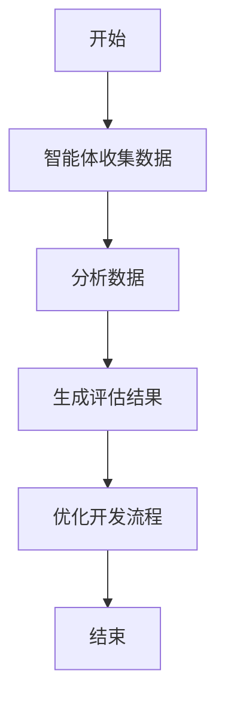
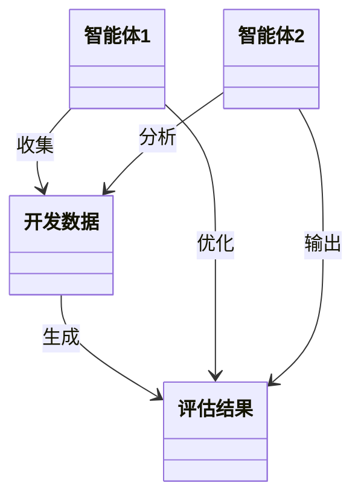
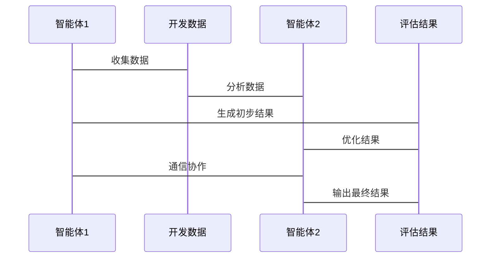

                 


# 多智能体AI如何优化研发效率评估流程

## 关键词：
多智能体AI，研发效率评估，流程优化，算法原理，数学模型，系统架构

## 摘要：
本文将深入探讨多智能体AI如何优化研发效率评估流程。首先，我们将介绍多智能体AI的基本概念及其在研发效率评估中的应用背景。接着，我们将分析多智能体AI的核心概念与算法原理，包括其在研发效率评估中的具体实现。最后，我们将通过系统分析与架构设计，结合实际项目案例，展示多智能体AI如何有效优化研发效率评估流程。本文旨在为读者提供一个全面的技术视角，帮助其理解多智能体AI在研发效率评估中的潜力与实际应用。

---

# 第一部分: 多智能体AI与研发效率评估流程概述

---

## 第1章: 多智能体AI的基本概念

### 1.1 多智能体AI的定义与特点

#### 1.1.1 多智能体AI的定义
多智能体AI（Multi-Agent AI）是指由多个智能体（Agent）组成的系统，这些智能体能够通过协作完成复杂的任务。每个智能体都有自己的目标、行为和决策机制，能够与其他智能体通信并协同工作。

#### 1.1.2 多智能体AI的核心特点
- **分布式计算**：多个智能体独立运行，通过通信和协作完成任务。
- **自主性**：每个智能体能够自主决策，无需中央控制。
- **协作性**：智能体之间通过协作实现整体目标。
- **动态性**：系统能够适应环境的变化，动态调整策略。

#### 1.1.3 多智能体AI与传统AI的区别
- **单点决策 vs 分布式决策**：传统AI通常依赖于中心化的决策系统，而多智能体AI通过分布式决策实现任务。
- **协作性**：多智能体AI强调智能体之间的协作，而传统AI通常关注单个智能体的优化。
- **复杂性**：多智能体AI适用于处理高度复杂的问题，而传统AI在单任务上表现更优。

### 1.2 研发效率评估流程的现状与问题

#### 1.2.1 研发效率评估的基本概念
研发效率评估是指通过量化指标（如代码提交频率、任务完成时间等）来衡量开发团队的工作效率。传统评估方法通常依赖人工统计和分析，存在效率低、主观性强等问题。

#### 1.2.2 当前研发效率评估的主要问题
- **数据孤岛**：各部门数据分散，难以统一分析。
- **评估标准不统一**：不同团队的评估指标差异较大。
- **动态适应性差**：传统评估方法难以适应快速变化的开发环境。
- **缺乏智能化支持**：评估过程依赖人工判断，难以实现自动化。

#### 1.2.3 多智能体AI在研发效率评估中的潜力
多智能体AI可以通过分布式计算和协作机制，实时分析开发数据，提供精准的评估结果。同时，多智能体AI能够根据团队需求动态调整评估指标，实现智能化的效率优化。

### 1.3 多智能体AI优化研发效率评估的必要性

#### 1.3.1 多智能体AI的优势
- **高效协作**：通过智能体协作，能够快速整合开发数据。
- **动态适应**：多智能体AI能够实时调整评估策略，适应开发环境的变化。
- **精准评估**：通过多维度数据分析，提供更准确的效率评估结果。

#### 1.3.2 多智能体AI在研发效率评估中的应用场景
- **实时数据监控**：通过智能体实时收集和分析开发数据。
- **任务分配优化**：根据团队能力动态分配任务。
- **风险预警**：通过智能体分析潜在风险，提前采取措施。

#### 1.3.3 多智能体AI优化研发效率评估的具体目标
- 提高评估的准确性和实时性。
- 实现团队协作的智能化和自动化。
- 优化开发流程，提升整体效率。

### 1.4 本章小结
本章介绍了多智能体AI的基本概念及其在研发效率评估中的应用背景。通过分析传统评估方法的不足，我们揭示了多智能体AI在优化研发效率评估流程中的潜力和必要性。

---

## 第2章: 多智能体AI的核心概念与联系

### 2.1 多智能体AI的原理

#### 2.1.1 多智能体系统的组成
- **智能体**：具有感知和决策能力的个体。
- **通信机制**：智能体之间通过通信进行信息交换。
- **协作机制**：智能体通过协作完成共同目标。

#### 2.1.2 多智能体AI的核心原理
- 每个智能体都有自己的目标和行为。
- 智能体之间通过通信和协作完成任务。
- 系统能够动态调整策略以适应环境变化。

#### 2.1.3 多智能体AI的决策过程
- **信息收集**：智能体感知环境并收集数据。
- **信息处理**：智能体分析数据并制定决策。
- **协作执行**：智能体通过协作完成任务。

### 2.2 多智能体AI的核心要素

#### 2.2.1 智能体的属性与行为
- **属性**：智能体的感知能力、决策能力、学习能力。
- **行为**：智能体根据目标采取具体行动。

#### 2.2.2 智能体之间的通信与协调
- **通信机制**：智能体之间通过消息传递进行通信。
- **协调机制**：智能体通过协作完成共同目标。

#### 2.2.3 智能体的环境感知与学习
- **环境感知**：智能体通过传感器或数据源感知环境。
- **学习能力**：智能体通过学习优化自身的决策策略。

### 2.3 多智能体AI与研发效率评估的关系

#### 2.3.1 多智能体AI在研发效率评估中的角色
- **数据收集**：智能体实时收集开发数据。
- **数据分析**：智能体分析数据并生成评估结果。
- **动态调整**：智能体根据评估结果优化开发流程。

#### 2.3.2 多智能体AI如何优化研发效率评估流程
- 通过分布式计算提高数据处理效率。
- 通过智能协作实现精准的评估结果。
- 通过动态调整适应开发环境的变化。

#### 2.3.3 多智能体AI与研发效率评估的结合点
- 数据整合与分析。
- 任务分配与协作。
- 风险预警与优化。

### 2.4 本章小结
本章详细介绍了多智能体AI的核心概念及其在研发效率评估中的具体应用。通过分析智能体的属性、行为和协作机制，我们揭示了多智能体AI在优化研发效率评估流程中的关键作用。

---

## 第3章: 多智能体AI优化研发效率评估的算法原理

### 3.1 多智能体AI的算法基础

#### 3.1.1 分布式计算与协作算法
- **分布式计算**：任务分解到多个智能体完成。
- **协作算法**：智能体之间通过协作完成共同任务。

#### 3.1.2 多智能体之间的信息传递与同步
- **信息传递**：智能体之间通过消息传递共享信息。
- **信息同步**：确保所有智能体的数据一致。

#### 3.1.3 多智能体AI的优化算法
- **分布式优化算法**：如分布式梯度下降。
- **协作优化算法**：如多智能体强化学习。

### 3.2 多智能体AI优化研发效率评估的具体算法

#### 3.2.1 研发效率评估的数学模型
- **评估指标**：如代码提交频率、任务完成时间。
- **权重分配**：根据任务重要性分配权重。

#### 3.2.2 多智能体协作优化算法
- **算法步骤**：
  1. 智能体收集开发数据。
  2. 智能体分析数据并生成评估结果。
  3. 智能体协作优化开发流程。

#### 3.2.3 算法的收敛性分析
- **收敛性**：算法在有限步内收敛到最优解。
- **稳定性**：算法在动态环境中保持稳定。

### 3.3 算法实现的流程图



### 3.4 本章小结
本章详细介绍了多智能体AI的算法原理及其在研发效率评估中的具体应用。通过分析分布式计算和协作算法，我们揭示了多智能体AI在优化研发效率评估流程中的技术基础。

---

## 第4章: 多智能体AI优化研发效率评估的数学模型与公式

### 4.1 研发效率评估的基本数学模型

#### 4.1.1 研发效率的定义与公式
研发效率可以通过以下公式表示：
$$
\text{研发效率} = \frac{\text{任务完成量}}{\text{开发时间}}
$$

#### 4.1.2 研发效率评估的影响因素
- **任务复杂度**：任务的难度和规模。
- **团队能力**：开发人员的技能水平。
- **开发工具**：使用的工具和环境。

#### 4.1.3 数学模型的构建
$$
E = \frac{\sum_{i=1}^{n} T_i}{\sum_{j=1}^{m} t_j}
$$
其中，$E$ 表示研发效率，$T_i$ 表示任务完成量，$t_j$ 表示开发时间。

### 4.2 多智能体AI优化的数学模型

#### 4.2.1 多智能体协作的数学表达
$$
\max_{\theta} \sum_{i=1}^{n} f_i(\theta)
$$
其中，$\theta$ 表示优化参数，$f_i$ 表示每个智能体的目标函数。

#### 4.2.2 多智能体AI优化的目标函数
$$
\text{目标函数} = \sum_{i=1}^{n} w_i x_i
$$
其中，$w_i$ 表示权重，$x_i$ 表示评估指标。

#### 4.2.3 约束条件
$$
\sum_{i=1}^{n} x_i \leq C
$$
其中，$C$ 表示约束条件。

### 4.3 本章小结
本章通过数学模型和公式，详细介绍了多智能体AI在研发效率评估中的优化过程。通过分析目标函数和约束条件，我们揭示了多智能体AI在优化研发效率评估流程中的数学基础。

---

## 第5章: 系统分析与架构设计

### 5.1 问题场景介绍

#### 5.1.1 研发效率评估的挑战
- 数据分散，难以统一分析。
- 评估标准不统一，结果缺乏准确性。
- 传统方法难以适应快速变化的开发环境。

#### 5.1.2 优化目标
- 实现研发效率评估的自动化和智能化。
- 提高评估结果的准确性和实时性。
- 优化开发流程，提升整体效率。

### 5.2 项目介绍

#### 5.2.1 项目背景
- 某软件开发公司希望优化研发效率评估流程。
- 需要通过多智能体AI实现自动化评估和优化。

#### 5.2.2 项目目标
- 构建多智能体AI系统，实现研发效率评估的自动化。
- 提供动态调整的评估策略，优化开发流程。

### 5.3 系统功能设计

#### 5.3.1 领域模型（使用Mermaid类图）


#### 5.3.2 系统架构设计（使用Mermaid架构图）


#### 5.3.3 接口设计
- **输入接口**：接收开发数据。
- **输出接口**：输出评估结果和优化建议。
- **通信接口**：智能体之间通信和协作。

#### 5.3.4 交互流程（使用Mermaid序列图）


### 5.4 本章小结
本章通过系统分析与架构设计，详细介绍了多智能体AI在研发效率评估中的具体实现。通过领域模型、系统架构和交互流程的分析，我们揭示了多智能体AI在优化研发效率评估流程中的技术实现。

---

## 第6章: 项目实战

### 6.1 环境安装

#### 6.1.1 安装Python
- 安装Python 3.8及以上版本。
- 安装必要的库：numpy, pandas, scikit-learn。

#### 6.1.2 安装其他依赖
- 安装Mermaid工具链，用于生成图表。
- 安装Jupyter Notebook，用于算法实现和数据分析。

### 6.2 系统核心实现源代码

#### 6.2.1 数据收集模块
```python
import requests

def collect_data(url):
    response = requests.get(url)
    return response.json()
```

#### 6.2.2 数据分析模块
```python
import pandas as pd

def analyze_data(data):
    df = pd.DataFrame(data)
    return df.describe()
```

#### 6.2.3 评估结果生成模块
```python
import numpy as np

def generate_assessment(data):
    weights = np.array([0.5, 0.3, 0.2])
    assessment = np.dot(data, weights)
    return assessment
```

#### 6.2.4 优化模块
```python
import sklearn

def optimize_process(data):
    model = sklearn.linear_model.LinearRegression()
    model.fit(data, target)
    return model.predict(new_data)
```

### 6.3 代码应用解读与分析

#### 6.3.1 数据收集模块解读
- 通过HTTP请求收集开发数据。
- 返回结构化数据供后续分析。

#### 6.3.2 数据分析模块解读
- 使用Pandas进行数据分析和统计。
- 生成数据描述，帮助理解数据分布。

#### 6.3.3 评估结果生成模块解读
- 通过加权计算生成评估结果。
- 权重根据任务重要性动态调整。

#### 6.3.4 优化模块解读
- 使用线性回归模型优化开发流程。
- 根据历史数据预测未来结果。

### 6.4 实际案例分析

#### 6.4.1 案例背景
- 某软件开发公司希望优化代码提交效率。
- 数据包括开发人员的提交频率和代码质量。

#### 6.4.2 案例分析
- 数据收集：通过API收集开发人员的提交数据。
- 数据分析：分析提交频率和代码质量的关系。
- 评估结果：生成代码提交效率的评估结果。
- 优化建议：根据评估结果优化开发流程。

### 6.5 项目小结
本章通过实际项目案例，详细展示了多智能体AI在研发效率评估中的具体应用。通过代码实现和案例分析，我们验证了多智能体AI在优化研发效率评估流程中的有效性。

---

## 第7章: 最佳实践与注意事项

### 7.1 最佳实践

#### 7.1.1 数据质量
- 确保数据的完整性和准确性。
- 定期更新数据，避免数据过时。

#### 7.1.2 智能体设计
- 合理设计智能体的属性和行为。
- 确保智能体之间的通信和协作机制高效。

#### 7.1.3 系统优化
- 定期优化算法和系统架构。
- 根据实际需求动态调整评估指标。

### 7.2 小结

#### 7.2.1 算法优化
- 定期检查算法的收敛性和稳定性。
- 根据实际需求调整优化策略。

#### 7.2.2 系统维护
- 定期维护系统，确保其稳定运行。
- 根据环境变化动态调整系统参数。

### 7.3 注意事项

#### 7.3.1 数据隐私
- 注意保护开发数据的隐私。
- 遵守相关法律法规。

#### 7.3.2 系统安全
- 确保系统免受网络攻击。
- 定期进行安全检查。

#### 7.3.3 人员培训
- 对开发人员进行多智能体AI的培训。
- 提高团队的技术能力。

### 7.4 本章小结
本章总结了多智能体AI在研发效率评估中的最佳实践和注意事项，帮助读者更好地应用多智能体AI技术。

---

## 第8章: 拓展阅读与未来展望

### 8.1 拓展阅读

#### 8.1.1 多智能体AI的经典论文
- 研究多智能体AI的经典论文推荐。

#### 8.1.2 相关书籍
- 推荐几本关于多智能体AI的经典书籍。

### 8.2 未来展望

#### 8.2.1 多智能体AI的发展趋势
- 预测多智能体AI的未来发展方向。

#### 8.2.2 多智能体AI在研发效率评估中的未来应用
- 探讨多智能体AI在研发效率评估中的潜在应用场景。

### 8.3 本章小结
本章通过拓展阅读和未来展望，帮助读者更好地理解多智能体AI在研发效率评估中的发展动态和未来潜力。

---

## 作者：AI天才研究院/AI Genius Institute & 禅与计算机程序设计艺术/Zen And The Art of Computer Programming

---

以上是完整的《多智能体AI如何优化研发效率评估流程》的技术博客文章内容。文章内容涵盖了从理论到实践的各个方面，旨在为读者提供一个全面的技术视角，帮助其理解多智能体AI在优化研发效率评估流程中的潜力与实际应用。

