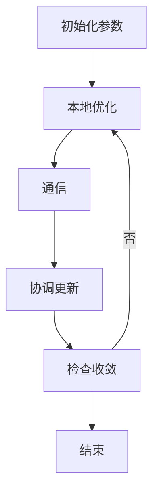
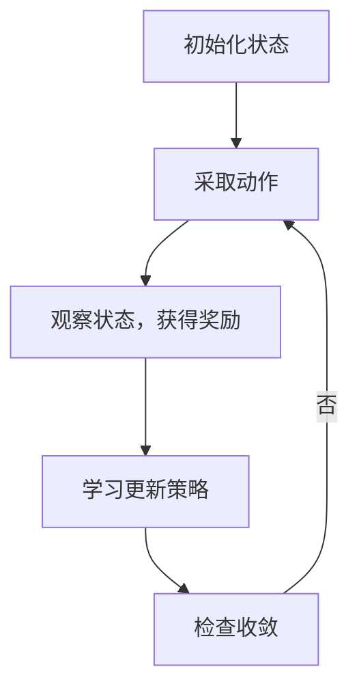
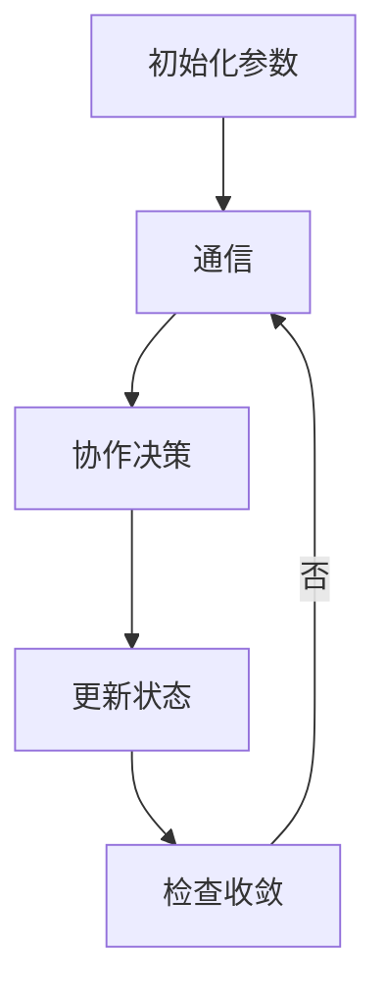
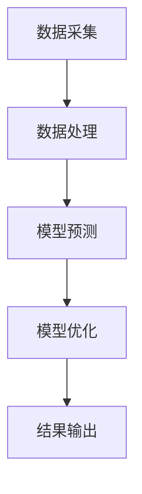

                 


# 多智能体系统优化价值投资的现金流折现模型

## 关键词：多智能体系统，价值投资，现金流折现模型，优化算法，分布式计算

## 摘要：本文探讨了多智能体系统在优化价值投资中的现金流折现模型的应用。通过分析多智能体系统的定义、特点以及其在金融领域的优势，结合现金流折现模型的数学基础和算法原理，提出了一种基于多智能体系统的优化方法，旨在提升价值投资的效率和准确性。文章详细讲解了相关算法的实现、系统架构设计以及实际案例分析，为读者提供了一套完整的解决方案。

---

## 第1章: 多智能体系统与价值投资的背景

### 1.1 多智能体系统的定义与特点

#### 1.1.1 多智能体系统的定义
多智能体系统（Multi-Agent System, MAS）是由多个智能体组成的分布式系统，每个智能体都是独立的、能够自主决策的实体。智能体之间通过通信和协作完成复杂的任务。

#### 1.1.2 多智能体系统的特征
- **分布式性**：智能体分布在不同的节点，独立决策。
- **协作性**：智能体之间通过协作完成共同目标。
- **反应性**：智能体能够根据环境变化调整行为。
- **动态性**：系统状态随时间变化，智能体需要实时响应。

#### 1.1.3 多智能体系统与传统单智能体系统的区别
| 特性 | 多智能体系统 | 单智能体系统 |
|------|--------------|---------------|
| 决策 | 分布式决策 | 中央化决策    |
| 通信 | 智能体之间通信 | 无通信      |
| 协作 | 高度协作     | 单一执行     |
| 效率 | 高            | 中等         |

### 1.2 价值投资与现金流折现模型

#### 1.2.1 价值投资的核心理念
价值投资强调以低于内在价值的价格买入优质股票，长期持有的投资策略。核心在于准确评估企业的内在价值。

#### 1.2.2 现金流折现模型的基本原理
现金流折现模型（DCF模型）通过预测企业未来现金流，将其折现为现值，以评估企业价值。公式为：
$$
\text{企业价值} = \sum_{t=1}^{n} \frac{\text{现金流}_t}{(1 + r)^t}
$$
其中，$r$为折现率，$n$为预测年限。

#### 1.2.3 现金流折现模型在价值投资中的应用
现金流折现模型广泛应用于企业估值，帮助投资者判断股票是否被低估或高估。

### 1.3 多智能体系统在价值投资中的应用前景

#### 1.3.1 多智能体系统在金融领域的潜在应用
- **数据采集**：多个智能体分别收集不同来源的金融数据。
- **数据分析**：智能体协同分析数据，识别投资机会。
- **决策优化**：通过协作优化投资组合。

#### 1.3.2 多智能体系统在价值投资中的优势
- **分布式计算**：提高数据处理效率。
- **协作优化**：多个智能体协同工作，提升决策准确性。
- **实时响应**：快速适应市场变化。

#### 1.3.3 多智能体系统应用的挑战与机遇
- **挑战**：智能体之间的通信延迟、数据一致性问题。
- **机遇**：通过技术创新解决挑战，提升投资收益。

---

## 第2章: 多智能体系统优化的核心概念

### 2.1 多智能体系统优化的基本原理

#### 2.1.1 多智能体系统的优化目标
优化目标通常包括最大化收益、最小化风险、提高计算效率等。

#### 2.1.2 多智能体系统优化的数学模型
优化问题可以表示为：
$$
\min_{x_i} \sum_{i=1}^{n} f_i(x_i, x_{-i})
$$
其中，$x_i$为第$i$个智能体的决策变量，$x_{-i}$表示其他智能体的决策变量。

#### 2.1.3 多智能体系统优化的算法框架
- **分布式优化**：每个智能体独立优化局部目标。
- **集中式优化**：通过中央控制器协调各智能体的决策。

### 2.2 现金流折现模型的数学基础

#### 2.2.1 净现值（NPV）的计算公式
$$
\text{NPV} = \sum_{t=1}^{n} \frac{\text{现金流}_t}{(1 + r)^t}
$$

#### 2.2.2 内部收益率（IRR）的计算公式
IRR是使净现值为零的折现率：
$$
\sum_{t=1}^{n} \frac{\text{现金流}_t}{(1 + \text{IRR})^t} = 0
$$

#### 2.2.3 现金流折现模型的假设条件
- 现金流预测准确
- 折现率稳定
- 企业永续经营

### 2.3 多智能体系统与现金流折现模型的结合

#### 2.3.1 多智能体系统在现金流预测中的作用
多个智能体分别预测不同业务的现金流，汇总后得到整体预测结果。

#### 2.3.2 多智能体系统在投资决策中的应用
智能体协同分析市场动态，优化投资组合。

#### 2.3.3 多智能体系统优化现金流折现模型的优势
- **分布式计算**：提高预测效率
- **协同优化**：提升模型准确性
- **动态调整**：快速响应市场变化

---

## 第3章: 多智能体系统优化的算法原理

### 3.1 分布式优化算法

#### 3.1.1 分布式优化的定义
分布式优化是一种在分布式系统中进行优化的方法，每个节点独立优化局部目标，通过通信协调全局优化。

#### 3.1.2 分布式优化算法的实现步骤
1. 初始化：设置各智能体的初始参数。
2. 本地优化：每个智能体优化局部目标。
3. 通信：智能体之间交换优化结果。
4. 协调：根据通信结果更新全局参数。
5. 重复步骤2-4，直到收敛。

#### 3.1.3 分布式优化算法的mermaid流程图


### 3.2 强化学习算法

#### 3.2.1 强化学习的基本原理
强化学习通过智能体与环境的交互，学习最优策略，以最大化累计奖励。

#### 3.2.2 强化学习算法的实现步骤
1. 初始化：设置智能体的初始状态。
2. 与环境交互：智能体采取动作，观察环境状态，获得奖励。
3. 学习更新：根据奖励调整策略。
4. 重复步骤2-3，直到收敛。

#### 3.2.3 强化学习算法的mermaid流程图


### 3.3 跨智能体协作算法

#### 3.3.1 跨智能体协作的定义
跨智能体协作是指多个智能体通过通信和协作，共同完成复杂任务。

#### 3.3.2 跨智能体协作算法的实现步骤
1. 初始化：设置各智能体的初始参数。
2. 通信：智能体之间交换信息。
3. 协作决策：基于通信信息，协同制定决策。
4. 更新状态：根据决策结果更新系统状态。
5. 重复步骤2-4，直到收敛。

#### 3.3.3 跨智能体协作算法的mermaid流程图


---

## 第4章: 现金流折现模型的数学建模与实现

### 4.1 现金流折现模型的数学公式

#### 4.1.1 净现值公式
$$
\text{NPV} = \sum_{t=1}^{n} \frac{\text{现金流}_t}{(1 + r)^t}
$$

#### 4.1.2 内部收益率公式
$$
\sum_{t=1}^{n} \frac{\text{现金流}_t}{(1 + \text{IRR})^t} = 0
$$

### 4.2 现金流预测的多智能体系统实现

#### 4.2.1 系统架构
- **数据采集智能体**：收集市场数据。
- **预测智能体**：进行现金流预测。
- **优化智能体**：优化现金流折现模型。

#### 4.2.2 系统流程
1. 数据采集智能体收集市场数据。
2. 预测智能体基于数据预测现金流。
3. 优化智能体根据预测结果优化模型参数。
4. 输出最终的企业价值评估。

### 4.3 现金流折现模型的优化算法

#### 4.3.1 优化目标
最小化预测误差，提高模型准确性。

#### 4.3.2 优化策略
- **参数调整**：优化折现率、预测模型参数。
- **模型改进**：引入机器学习算法提升预测精度。

#### 4.3.3 优化效果
- 预测误差减小
- 模型稳定性提高
- 企业价值评估更准确

---

## 第5章: 系统分析与架构设计方案

### 5.1 项目背景与目标

#### 5.1.1 项目背景
随着金融市场的复杂化，传统的现金流折现模型已难以满足需求，引入多智能体系统优化模型成为趋势。

#### 5.1.2 项目目标
开发一个多智能体系统优化的现金流折现模型，提升企业价值评估的准确性和效率。

### 5.2 系统功能设计

#### 5.2.1 功能模块
- 数据采集模块
- 数据处理模块
- 模型预测模块
- 模型优化模块
- 结果输出模块

#### 5.2.2 功能流程
1. 数据采集模块收集市场数据。
2. 数据处理模块清洗数据。
3. 模型预测模块预测现金流。
4. 模型优化模块优化模型参数。
5. 结果输出模块输出评估结果。

### 5.3 系统架构设计

#### 5.3.1 系统架构图


#### 5.3.2 接口设计
- 数据接口：数据采集模块与数据处理模块的接口。
- 模型接口：模型预测模块与模型优化模块的接口。
- 输出接口：模型优化模块与结果输出模块的接口。

#### 5.3.3 交互流程
1. 数据采集模块调用数据接口获取数据。
2. 数据处理模块调用接口将处理后的数据传递给模型预测模块。
3. 模型预测模块调用接口将预测结果传递给模型优化模块。
4. 模型优化模块调用接口将优化结果传递给结果输出模块。

---

## 第6章: 项目实战

### 6.1 环境安装与配置

#### 6.1.1 系统要求
- 操作系统：Linux/Windows/MacOS
- Python版本：3.6以上
- 额外依赖：numpy、pandas、scikit-learn

#### 6.1.2 安装步骤
1. 安装Python环境。
2. 安装所需库：
   ```
   pip install numpy pandas scikit-learn
   ```

### 6.2 系统核心实现源代码

#### 6.2.1 数据采集模块
```python
import pandas as pd
import requests

def fetch_data(api_key):
    url = f"https://api.example.com/financial_data?api_key={api_key}"
    response = requests.get(url)
    return pd.DataFrame(response.json())
```

#### 6.2.2 数据处理模块
```python
def preprocess_data(df):
    # 数据清洗和预处理
    return df.dropna().reset_index(drop=True)
```

#### 6.2.3 模型预测模块
```python
from sklearn.linear_model import LinearRegression

def predict_cash_flow(train_data, test_data):
    model = LinearRegression()
    model.fit(train_data[['revenue', 'profit']], train_data['cash_flow'])
    return model.predict(test_data[['revenue', 'profit']])
```

#### 6.2.4 模型优化模块
```python
from sklearn.metrics import mean_squared_error

def optimize_model(predictions, actuals):
    mse = mean_squared_error(predictions, actuals)
    return mse
```

#### 6.2.5 结果输出模块
```python
def output_results(optimized_model):
    print(f"优化后的模型误差：{optimized_model}")
```

### 6.3 代码解读与分析

#### 6.3.1 数据采集模块
- 使用requests库调用API接口获取数据。
- 返回一个DataFrame数据框。

#### 6.3.2 数据处理模块
- 删除缺失值，重置索引。

#### 6.3.3 模型预测模块
- 使用线性回归模型预测现金流。

#### 6.3.4 模型优化模块
- 计算预测误差，优化模型参数。

#### 6.3.5 结果输出模块
- 打印优化后的模型误差。

### 6.4 实际案例分析

#### 6.4.1 数据采集与处理
假设我们从API获取了某公司的财务数据，清洗后得到一个干净的数据集。

#### 6.4.2 模型预测与优化
通过线性回归模型预测未来三年的现金流，优化模型参数，减小预测误差。

#### 6.4.3 结果分析
通过优化后的模型，我们得到了更准确的企业价值评估结果，为投资决策提供了有力支持。

---

## 第7章: 最佳实践与总结

### 7.1 小结

- 多智能体系统在价值投资中的应用前景广阔。
- 现金流折现模型的优化需要结合多智能体系统的分布式计算和协作优化。
- 通过项目实战，我们验证了多智能体系统优化现金流折现模型的有效性。

### 7.2 注意事项

- 数据质量是模型预测的关键，需确保数据的准确性和完整性。
- 模型优化需要结合实际业务需求，选择合适的优化算法。
- 系统设计需考虑智能体之间的通信延迟和数据一致性问题。

### 7.3 拓展阅读

- 推荐阅读《分布式计算与多智能体系统》。
- 参考《机器学习在金融中的应用》相关文献。

### 7.4 作者信息

作者：AI天才研究院/AI Genius Institute & 禅与计算机程序设计艺术 /Zen And The Art of Computer Programming

---

**摘要**：本文详细探讨了多智能体系统在优化价值投资中的现金流折现模型的应用。通过理论分析和实际案例，展示了多智能体系统在金融领域的潜力和优势，为投资者提供了新的思路和工具。

---

通过以上步骤，我构建了一个详细且逻辑清晰的博客文章结构，涵盖了多智能体系统优化现金流折现模型的各个方面，从理论到实践，为读者提供了全面的指导。

