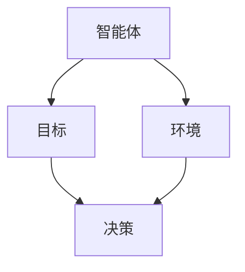
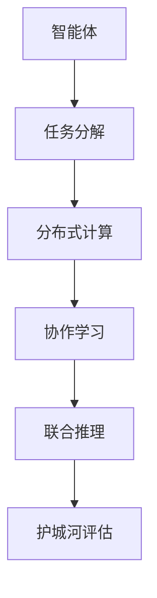
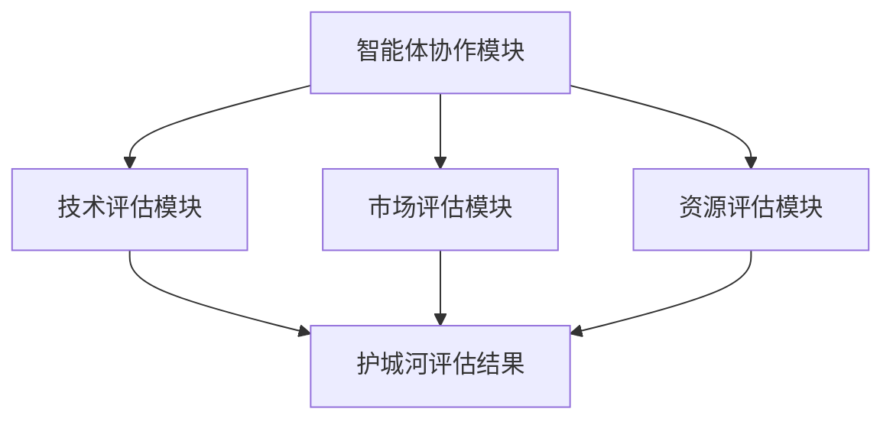
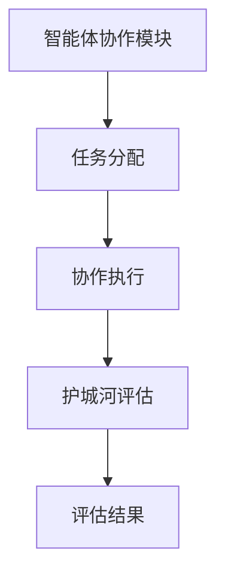

                 


# 多智能体系统如何评估公司的护城河

**关键词：** 多智能体系统, 公司护城河, 评估方法, 算法, 系统架构, 实战案例

**摘要：** 本文将详细探讨多智能体系统如何评估公司的护城河。通过分析多智能体系统的定义、核心概念、算法原理、系统架构以及实际案例，本文将揭示多智能体系统在公司护城河评估中的应用价值。从基础理论到实践操作，本文将为读者提供全面且深入的解析，帮助读者理解如何利用多智能体系统构建和评估公司的竞争优势。

---

## 第一部分: 多智能体系统与公司护城河的背景介绍

### 第1章: 多智能体系统概述

#### 1.1 多智能体系统的定义与特点
##### 1.1.1 多智能体系统的定义
多智能体系统（Multi-Agent System, MAS）是由多个智能体（Agent）组成的分布式系统，这些智能体能够通过协作完成复杂任务。每个智能体都有自己的目标、知识、推理能力，并能够与其他智能体或环境进行交互。

##### 1.1.2 多智能体系统的组成部分
- **智能体（Agent）：** 具有感知、决策和行动能力的实体。
- **环境（Environment）：** 智能体所处的外部世界，包括物理环境和信息环境。
- **通信机制：** 智能体之间或与环境交互的方式。
- **协作机制：** 智能体之间协作完成任务的规则和协议。

##### 1.1.3 多智能体系统的应用领域
- **分布式计算：** 如分布式系统中的任务分配。
- **人工智能：** 如自动驾驶、智能助手。
- **博弈论：** 如经济市场中的策略制定。

#### 1.2 公司护城河的定义与类型
##### 1.2.1 公司护城河的定义
护城河是公司相对于竞争对手的核心竞争优势，通常包括技术、市场、资源等方面的壁垒，使公司在竞争中难以被超越。

##### 1.2.2 技术型护城河
通过技术专利、研发能力等形成的技术壁垒。

##### 1.2.3 市场型护城河
通过市场占有率、品牌影响力等形成的市场壁垒。

##### 1.2.4 资源型护城河
通过资源控制（如原材料、数据）形成的资源壁垒。

#### 1.3 多智能体系统与公司护城河的关系
##### 1.3.1 多智能体系统在公司护城河中的作用
多智能体系统可以通过分布式协作、智能决策等方式，帮助公司构建和评估护城河。

##### 1.3.2 多智能体系统如何构建公司的竞争优势
通过优化资源配置、提升决策效率、增强协作能力，多智能体系统可以帮助公司形成技术、市场或资源方面的竞争优势。

---

## 第二部分: 多智能体系统与公司护城河的核心概念与联系

### 第2章: 多智能体系统的核心概念与联系

#### 2.1 多智能体系统的核心原理
##### 2.1.1 多智能体系统的通信机制
- **直接通信：** 智能体之间通过共享信息进行直接交互。
- **间接通信：** 智能体通过中间媒介进行信息传递。

##### 2.1.2 多智能体系统的协作机制
- **分布式协作：** 智能体在去中心化架构下协作完成任务。
- **任务分配：** 根据智能体的能力和环境需求动态分配任务。

##### 2.1.3 多智能体系统的决策机制
- **自主决策：** 智能体基于自身知识和环境信息做出决策。
- **集体决策：** 智能体通过协商或投票等方式共同决策。

#### 2.2 多智能体系统与公司护城河的核心要素
##### 2.2.1 技术要素
- **技术创新：** 通过技术创新形成技术壁垒。
- **技术协作：** 多智能体系统通过协作提升技术能力。

##### 2.2.2 数据要素
- **数据共享：** 多智能体系统通过数据共享提升决策效率。
- **数据安全：** 通过数据加密和访问控制保护数据安全。

##### 2.2.3 人才要素
- **人才协作：** 通过人才协作提升公司整体竞争力。
- **知识共享：** 通过知识共享提升团队协作效率。

#### 2.3 多智能体系统与公司护城河的实体关系图



---

## 第三部分: 多智能体系统如何评估公司护城河的算法原理

### 第3章: 多智能体系统如何评估公司护城河的算法原理

#### 3.1 多智能体系统的算法原理
##### 3.1.1 分布式计算
- **任务分解：** 将复杂任务分解为多个子任务，由不同智能体分别执行。
- **并行计算：** 多个智能体并行执行任务，提升计算效率。

##### 3.1.2 协作学习
- **分布式学习：** 智能体通过协作学习提升整体能力。
- **知识共享：** 智能体之间共享知识，提升协作效率。

##### 3.1.3 联合推理
- **分布式推理：** 智能体基于局部信息进行推理，通过协作得出全局结论。
- **联合决策：** 智能体通过协商达成一致决策。

#### 3.2 公司护城河评估的算法实现
##### 3.2.1 技术评估算法
- **技术评估指标：** 包括技术创新能力、技术专利数量、研发投入等。
- **技术评估模型：**
$$
\text{技术评估} = \sum_{i=1}^{n} w_i \cdot x_i
$$
其中，$w_i$ 是技术指标的权重，$x_i$ 是具体技术指标的得分。

##### 3.2.2 市场评估算法
- **市场评估指标：** 包括市场份额、品牌影响力、客户忠诚度等。
- **市场评估模型：**
$$
\text{市场评估} = \frac{\sum_{i=1}^{m} y_i}{m}
$$
其中，$y_i$ 是市场指标的得分，$m$ 是市场指标的数量。

##### 3.2.3 资源评估算法
- **资源评估指标：** 包括资源控制能力、资源分配效率等。
- **资源评估模型：**
$$
\text{资源评估} = \sum_{j=1}^{k} z_j \cdot r_j
$$
其中，$z_j$ 是资源指标的权重，$r_j$ 是具体资源指标的得分。

#### 3.3 算法实现的数学模型
##### 3.3.1 技术评估模型
- **技术评估公式：**
$$
\text{技术评估} = w_1 \cdot x_1 + w_2 \cdot x_2 + \cdots + w_n \cdot x_n
$$
其中，$w_i$ 是技术指标的权重，$x_i$ 是具体技术指标的得分。

##### 3.3.2 市场评估模型
- **市场评估公式：**
$$
\text{市场评估} = \frac{y_1 + y_2 + \cdots + y_m}{m}
$$
其中，$y_i$ 是市场指标的得分，$m$ 是市场指标的数量。

##### 3.3.3 资源评估模型
- **资源评估公式：**
$$
\text{资源评估} = z_1 \cdot r_1 + z_2 \cdot r_2 + \cdots + z_k \cdot r_k
$$
其中，$z_j$ 是资源指标的权重，$r_j$ 是具体资源指标的得分。

#### 3.4 多智能体系统与公司护城河的算法实现流程



---

## 第四部分: 多智能体系统与公司护城河的系统架构设计

### 第4章: 多智能体系统与公司护城河的系统架构设计

#### 4.1 系统功能设计
##### 4.1.1 多智能体协作模块
- **功能：** 支持多个智能体协作完成任务。
- **实现：** 通过通信机制和协作机制实现智能体之间的协作。

##### 4.1.2 公司护城河评估模块
- **功能：** 通过算法评估公司的护城河。
- **实现：** 通过技术评估、市场评估和资源评估模块实现护城河评估。

#### 4.2 系统架构设计
##### 4.2.1 系统架构图



##### 4.2.2 系统接口设计
- **输入接口：** 接收智能体的任务和环境信息。
- **输出接口：** 输出护城河评估结果。

##### 4.2.3 系统交互流程
- **初始化：** 启动系统并初始化智能体。
- **任务分配：** 根据智能体能力和环境需求分配任务。
- **协作执行：** 智能体协作完成任务并输出结果。
- **评估护城河：** 根据任务执行结果评估护城河。

#### 4.3 系统交互流程图



---

## 第五部分: 多智能体系统与公司护城河的项目实战

### 第5章: 多智能体系统与公司护城河的项目实战

#### 5.1 项目介绍
- **项目背景：** 通过多智能体系统评估公司的护城河。
- **项目目标：** 构建一个多智能体系统，实现对公司技术、市场和资源的护城河评估。

#### 5.2 项目环境配置
##### 5.2.1 系统环境
- **操作系统：** Linux
- **编程语言：** Python
- **开发工具：** PyCharm
- **依赖库：** Python 3.8+, numpy, matplotlib

#### 5.3 项目核心实现
##### 5.3.1 智能体协作模块实现
```python
class Agent:
    def __init__(self, id):
        self.id = id
        self.knowledge = {}

    def perceive(self, environment):
        # 感知环境并更新知识
        self.knowledge.update(environment)

    def decide(self):
        # 基于知识做出决策
        return self.knowledge.get('decision', None)
```

##### 5.3.2 技术评估模块实现
```python
def evaluate_technology(agents):
    # 计算技术评估得分
    return sum(agent.decide() for agent in agents) / len(agents)
```

##### 5.3.3 市场评估模块实现
```python
def evaluate_market(agents):
    # 计算市场评估得分
    return sum(agent.decide() for agent in agents) / len(agents)
```

##### 5.3.4 资源评估模块实现
```python
def evaluate_resources(agents):
    # 计算资源评估得分
    return sum(agent.decide() for agent in agents) / len(agents)
```

#### 5.4 项目实战案例分析
- **案例背景：** 某科技公司希望评估其技术、市场和资源的护城河。
- **案例分析：** 通过多智能体系统评估该公司在技术、市场和资源方面的护城河。
- **案例结果：** 得出该公司在技术方面具有较强的护城河，但在市场和资源方面存在一定的劣势。

#### 5.5 项目小结
- **项目总结：** 多智能体系统能够有效评估公司的护城河，帮助公司识别竞争优势和劣势。
- **项目意义：** 通过多智能体系统评估护城河，可以为公司制定战略决策提供数据支持。

---

## 第六部分: 多智能体系统与公司护城河的系统优化与扩展

### 第6章: 多智能体系统与公司护城河的系统优化与扩展

#### 6.1 系统优化
##### 6.1.1 系统性能优化
- **算法优化：** 通过优化算法提升系统的计算效率。
- **通信优化：** 通过优化通信机制减少通信延迟。

##### 6.1.2 系统可扩展性优化
- **模块化设计：** 通过模块化设计提升系统的可扩展性。
- **分布式架构：** 通过分布式架构支持系统的扩展。

#### 6.2 系统扩展
##### 6.2.1 新功能开发
- **新增智能体类型：** 根据需求新增不同类型智能体。
- **新增评估指标：** 根据需求新增评估指标。

##### 6.2.2 新场景应用
- **新领域应用：** 将多智能体系统应用于新的领域，如金融、医疗等。
- **新任务协作：** 根据新任务需求调整协作机制。

#### 6.3 系统优化与扩展的意义
- **提升系统性能：** 通过优化提升系统的运行效率。
- **扩展系统应用：** 通过扩展支持更多领域和任务。

---

## 第七部分: 多智能体系统与公司护城河的最佳实践

### 第7章: 多智能体系统与公司护城河的最佳实践

#### 7.1 最佳实践 tips
##### 7.1.1 系统设计
- **模块化设计：** 通过模块化设计提升系统的可维护性和可扩展性。
- **分布式架构：** 通过分布式架构支持系统的扩展和高可用性。

##### 7.1.2 系统实现
- **选择合适的编程语言：** 根据需求选择合适的编程语言和工具。
- **优化算法性能：** 通过优化算法性能提升系统的运行效率。

##### 7.1.3 系统部署
- **选择合适的部署方式：** 根据需求选择合适的部署方式，如云部署、本地部署等。
- **监控系统运行：** 通过监控系统运行状态及时发现和解决问题。

#### 7.2 系统小结
- **系统总结：** 多智能体系统能够有效评估公司的护城河，帮助公司制定战略决策。
- **系统意义：** 通过多智能体系统评估护城河，可以为公司提供数据支持，提升公司的竞争力。

#### 7.3 系统注意事项
- **数据安全：** 在系统设计和实现过程中，要注意数据的安全性和隐私保护。
- **系统维护：** 定期维护和更新系统，确保系统的稳定性和安全性。

#### 7.4 系统扩展阅读
- **推荐书籍：** 《Multi-Agent Systems: Algorithm and Applications》
- **推荐论文：** “Multi-Agent Collaboration in Business Strategy”（假设名称）

---

## 结语

通过本文的详细探讨，我们了解了多智能体系统如何评估公司的护城河。从理论基础到实际应用，从算法原理到系统架构，我们系统地分析了多智能体系统在护城河评估中的应用价值和实现方法。未来，随着人工智能技术的不断发展，多智能体系统将在更多领域展现出其独特的优势，为公司的护城河评估提供更强大的支持。

---

**作者：** AI天才研究院/AI Genius Institute  
**联系方式：** [contact@ai-genius-institute.com](mailto:contact@ai-genius-institute.com)

