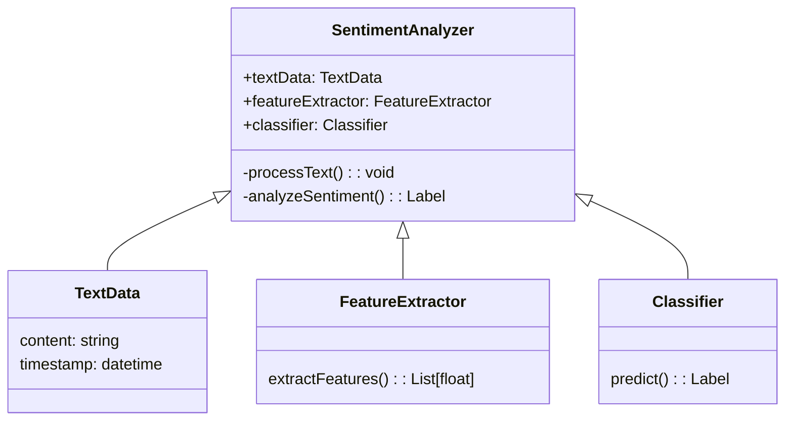
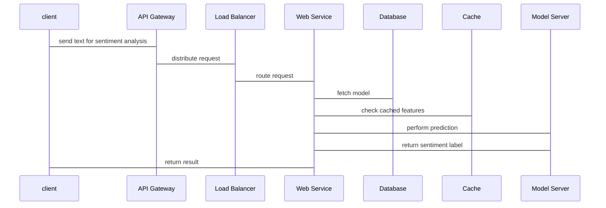

                 


# 开发AI Agent的情感分析引擎

> 关键词：AI Agent, 情感分析, 自然语言处理, 深度学习, 预训练模型

> 摘要：情感分析是自然语言处理领域的重要任务，旨在通过计算机技术对文本中的情感倾向进行自动识别和分类。本文将详细探讨开发AI Agent情感分析引擎的关键环节，包括情感分析的基本概念、算法原理、系统架构设计、项目实战以及最佳实践。通过本文的讲解，读者可以系统地掌握情感分析引擎的开发流程，并能够结合实际需求进行优化和扩展。

---

# 第1章: 情感分析引擎开发背景与核心概念

## 1.1 情感分析的定义与背景

### 1.1.1 情感分析的定义
情感分析（Sentiment Analysis），又称情感计算或情绪分析，是自然语言处理（NLP）领域的重要研究方向，旨在通过计算机技术对文本中包含的情感倾向进行识别和分类。情感分析的结果通常可以是二元分类（如正面/负面）或多分类（如非常正面、正面、中性、负面、非常负面）。

情感分析的核心目标是理解文本中蕴含的情感信息，从而帮助企业或个人更好地理解用户需求、优化产品体验、进行市场分析等。

### 1.1.2 情感分析的发展历程
情感分析技术的发展经历了以下几个阶段：
1. **传统规则-based方法**：基于关键词匹配和简单的统计分析，这种方法适用于特定领域的简单情感分析。
2. **机器学习方法**：利用传统的机器学习算法（如支持向量机SVM、随机森林等）进行特征提取和分类。
3. **深度学习方法**：基于神经网络（如RNN、CNN、Transformer等）的情感分析模型逐渐成为主流，尤其是在处理复杂语义和长文本时表现优异。
4. **预训练模型时代**：近年来，基于预训练语言模型（如BERT、GPT等）的情感分析方法取得了突破性进展，模型的通用性和迁移能力显著提升。

### 1.1.3 情感分析的应用场景
情感分析技术在多个领域都有广泛应用，包括：
- **社交媒体分析**：分析用户对品牌、产品或事件的情感倾向。
- **客户反馈分析**：帮助企业分析客户满意度，优化服务质量。
- **金融领域**：分析市场情绪，辅助投资决策。
- **医疗领域**：分析患者对医疗服务的满意度。
- **智能助手**：为AI Agent提供情感理解能力，使其能够更好地与用户交互。

---

## 1.2 情感分析的核心问题

### 1.2.1 文本数据的特征提取
情感分析的关键在于如何从文本中提取有用的特征信息。常见的特征提取方法包括：
- **词袋模型（Bag-of-Words, BoW）**：基于词语的出现频率或TF-IDF值提取特征。
- **词嵌入（Word Embedding）**：如Word2Vec、GloVe等，将词语映射为低维连续向量。
- **预训练语言模型**：如BERT、RoBERTa等，直接使用大规模预训练模型的特征表示。

### 1.2.2 情感极性分类的挑战
情感分析的主要挑战包括：
- **数据不平衡**：在某些场景下，正面和负面样本的数量可能严重不平衡，导致模型偏向于预测多数类。
- **语义理解**：复杂的情感表达（如讽刺、隐喻）可能难以被模型准确捕捉。
- **领域适应**：模型在特定领域的表现可能不如通用模型，需要进行领域迁移或微调。
- **实时性要求**：在某些应用场景下，情感分析需要实时处理，对模型的推理速度提出了更高的要求。

### 1.2.3 情感分析的边界与外延
情感分析的边界包括：
- **情感强度**：不仅判断情感极性（如正面/负面），还可以判断情感强度（如非常正面、稍微正面等）。
- **混合情感**：文本中可能同时包含多种情感倾向，如何准确分类混合情感是一个难点。
- **情感原因分析**：不仅识别情感倾向，还需要分析情感的原因（如“产品功能好”是正面情感的原因）。

---

## 1.3 情感分析引擎的组成部分

### 1.3.1 数据预处理模块
数据预处理是情感分析的关键步骤，主要包括：
- **文本清洗**：去除停用词、标点符号、数字等无用信息。
- **分词与词性标注**：对文本进行分词处理，并标注词性（如名词、动词、形容词等）。
- **数据归一化**：将文本转换为统一的格式（如小写、去除多余空格等）。

### 1.3.2 特征提取模块
特征提取模块负责将文本数据转换为可用于模型训练的特征向量，常见的特征提取方法包括：
- **基于词袋模型的特征提取**
- **基于词嵌入的特征提取**
- **基于预训练语言模型的特征提取**

### 1.3.3 模型训练与预测模块
模型训练与预测模块是情感分析引擎的核心部分，主要包括：
- **选择合适的算法**：如SVM、RNN、CNN、BERT等。
- **训练模型**：使用训练数据对模型进行训练，并通过验证集调整模型参数。
- **预测与评估**：使用测试数据对模型进行预测，并评估模型的性能（如准确率、召回率、F1值等）。

---

## 1.4 情感分析的技术路线对比

### 1.4.1 基于传统机器学习的情感分析
- **优点**：
  - 实现简单，易于部署。
  - 对于小规模数据表现良好。
- **缺点**：
  - 特征工程依赖人工经验，难以捕捉复杂语义。
  - 对于大规模数据计算效率较低。

### 1.4.2 基于深度学习的情感分析
- **优点**：
  - 能够自动学习文本的深层特征，捕捉复杂语义。
  - 对大规模数据表现优异。
- **缺点**：
  - 计算资源消耗较大。
  - 模型训练时间较长。

### 1.4.3 基于预训练语言模型的情感分析
- **优点**：
  - 利用大规模预训练参数，减少特征工程的工作量。
  - 具有良好的迁移学习能力，适用于不同领域的情感分析。
- **缺点**：
  - 计算资源消耗更大。
  - 需要进行模型微调，可能需要额外的标注数据。

---

## 1.5 本章小结
本章详细介绍了情感分析的基本概念、发展历程、应用场景、核心问题以及技术路线对比。通过对比不同技术路线的优缺点，可以帮助读者更好地理解情感分析引擎的开发背景和技术选型。

---

# 第2章: 情感分析引擎的核心算法与实现

## 2.1 基于SVM的情感分析算法

### 2.1.1 SVM算法的基本原理
支持向量机（Support Vector Machine, SVM）是一种监督学习算法，主要用于分类和回归问题。SVM的核心思想是通过寻找一个超平面，将数据点分成两类，使得两类数据之间的距离最大化。

### 2.1.2 SVM在情感分析中的应用
在情感分析中，SVM通常用于二分类任务（如正面/负面分类）。SVM的训练过程需要将文本特征向量映射到高维空间，并找到一个最优的超平面进行分类。

### 2.1.3 SVM算法的优缺点
- **优点**：
  - 对小规模数据表现良好。
  - 对噪声数据具有较强的鲁棒性。
- **缺点**：
  - 对大规模数据计算效率较低。
  - 对非线性数据的处理能力有限。

---

## 2.2 基于RNN的情感分析算法

### 2.2.1 RNN算法的基本原理
循环神经网络（Recurrent Neural Network, RNN）是一种处理序列数据的神经网络模型。RNN通过引入隐藏层，能够捕捉文本的序列信息和上下文关系。

### 2.2.2 RNN在情感分析中的应用
RNN常用于处理长文本数据，能够捕捉文本的上下文信息。然而，RNN存在梯度消失和梯度爆炸的问题，限制了其对长序列的处理能力。

### 2.2.3 RNN算法的优缺点
- **优点**：
  - 能够捕捉文本的序列信息和上下文关系。
- **缺点**：
  - 梯度消失和梯度爆炸问题限制了对长序列的处理能力。
  - 计算复杂度较高。

---

## 2.3 基于CNN的情感分析算法

### 2.3.1 CNN算法的基本原理
卷积神经网络（Convolutional Neural Network, CNN）是一种主要用于图像处理的深度学习模型。在自然语言处理领域，CNN常用于处理局部特征。

### 2.3.2 CNN在情感分析中的应用
CNN通过卷积操作可以提取文本的局部特征，适用于短文本的情感分析。然而，CNN难以捕捉文本的全局信息。

### 2.3.3 CNN算法的优缺点
- **优点**：
  - 对短文本的局部特征提取能力强。
- **缺点**：
  - 难以捕捉文本的全局信息。
  - 对长文本的处理能力有限。

---

## 2.4 基于BERT的情感分析算法

### 2.4.1 BERT算法的基本原理
BERT（Bidirectional Encoder Representations from Transformers）是一种基于Transformer的预训练语言模型。BERT通过双向编码器结构，能够捕捉文本的全局语义信息。

### 2.4.2 BERT在情感分析中的应用
BERT通过预训练参数可以快速适应不同的情感分析任务，尤其是在处理复杂语义和长文本时表现优异。

### 2.4.3 BERT算法的优缺点
- **优点**：
  - 预训练参数丰富，迁移学习能力强。
  - 能够捕捉文本的全局语义信息。
- **缺点**：
  - 计算资源消耗较大。
  - 需要进行模型微调，可能需要额外的标注数据。

---

## 2.5 本章小结
本章详细讲解了情感分析中常用的四种算法（SVM、RNN、CNN、BERT），并对它们的优缺点进行了对比分析。通过对比，读者可以更好地理解不同算法的适用场景和技术特点。

---

# 第3章: 情感分析引擎的系统架构设计

## 3.1 问题场景介绍
在开发AI Agent的情感分析引擎时，需要考虑以下问题：
- **数据来源**：文本数据可能来自社交媒体、客户评论、对话记录等。
- **实时性要求**：情感分析是否需要实时处理。
- **模型部署**：模型是部署在云端还是本地。

## 3.2 系统功能设计

### 3.2.1 领域模型设计
以下是情感分析引擎的领域模型：



### 3.2.2 系统架构设计


### 3.2.3 系统接口设计
以下是情感分析引擎的主要接口：

- **输入接口**：
  - `processText(text: str) -> bool`
- **输出接口**：
  - `analyzeSentiment() -> SentimentLabel`

### 3.2.4 系统交互设计



---

## 3.3 本章小结
本章详细讲解了情感分析引擎的系统架构设计，包括领域模型设计、系统架构设计、系统接口设计和系统交互设计。通过这些设计，可以确保情感分析引擎的高效性和可扩展性。

---

# 第4章: 情感分析引擎的项目实战

## 4.1 环境安装与配置
以下是开发环境的安装步骤：
1. 安装Python和必要的Python包（如TensorFlow、Keras、scikit-learn等）。
2. 安装自然语言处理工具包（如nltk、spaCy等）。
3. 安装预训练语言模型（如BERT、RoBERTa等）。

## 4.2 核心代码实现

### 4.2.1 基于SVM的情感分析代码

```python
from sklearn.svm import SVC
from sklearn.feature_extraction.text import TfidfVectorizer

# 数据预处理
vectorizer = TfidfVectorizer()
X = vectorizer.fit_transform(text_list)
y = label_list

# 训练模型
model = SVC()
model.fit(X, y)

# 预测
test_X = vectorizer.transform([test_text])
print(model.predict(test_X))
```

### 4.2.2 基于BERT的情感分析代码

```python
from transformers import BertTokenizer, BertModel
import torch

# 加载预训练模型
tokenizer = BertTokenizer.from_pretrained('bert-base-uncased')
model = BertModel.from_pretrained('bert-base-uncased')

# 编码文本
inputs = tokenizer(text, return_tensors='pt')
outputs = model(**inputs)

# 获取隐藏层输出
hidden_states = outputs.last_hidden_state
pooler_output = hidden_states[:, 0, :]
```

---

## 4.3 代码解读与分析
- **基于SVM的代码解读**：
  - 使用TF-IDF向量化文本数据。
  - 使用SVM进行分类。
  - 代码实现简单，适用于小规模数据。

- **基于BERT的代码解读**：
  - 使用预训练的BERT模型编码文本数据。
  - 模型输出包含丰富的语义信息。
  - 代码实现较为复杂，但性能优异。

---

## 4.4 案例分析与优化方向
- **案例分析**：
  - 使用训练好的模型对测试数据进行预测，并分析预测结果。
- **优化方向**：
  - 调整特征提取方法。
  - 调整模型超参数。
  - 使用集成学习提升模型性能。

---

## 4.5 本章小结
本章通过实际项目实战，详细讲解了情感分析引擎的开发流程，包括环境安装、核心代码实现、代码解读与分析以及案例分析与优化方向。

---

# 第5章: 情感分析引擎的最佳实践与注意事项

## 5.1 最佳实践
1. **数据预处理**：
   - 清洗文本数据，去除无用信息。
   - 进行分词和词性标注。
2. **特征提取**：
   - 根据任务需求选择合适的特征提取方法。
   - 对大规模数据使用预训练语言模型。
3. **模型选择**：
   - 根据数据规模和任务需求选择合适的算法。
   - 对复杂任务使用预训练语言模型。
4. **模型优化**：
   - 调整模型超参数。
   - 使用交叉验证评估模型性能。
   - 使用集成学习提升模型性能。

## 5.2 注意事项
1. **数据隐私**：
   - 确保文本数据的隐私合规性。
2. **计算资源**：
   - 预训练模型需要较高的计算资源。
3. **模型解释性**：
   - 情感分析结果需要可解释性，便于用户理解和优化。

---

## 5.3 本章小结
本章总结了情感分析引擎开发中的最佳实践和注意事项，帮助读者更好地进行实际项目开发。

---

# 第6章: 总结与展望

## 6.1 本章总结
本文详细讲解了情感分析引擎的开发背景、核心算法、系统架构设计、项目实战以及最佳实践。通过本文的讲解，读者可以系统地掌握情感分析引擎的开发流程，并能够结合实际需求进行优化和扩展。

## 6.2 未来展望
随着自然语言处理技术的不断发展，情感分析引擎的开发将朝着以下几个方向发展：
1. **多模态情感分析**：结合图像、语音等多种模态信息，提升情感分析的准确性和全面性。
2. **小样本学习**：在数据量有限的情况下，如何利用迁移学习和小样本学习技术提升模型性能。
3. **实时性优化**：在实时性要求较高的场景下，如何优化模型推理速度和资源消耗。

---

# 作者：AI天才研究院/AI Genius Institute & 禅与计算机程序设计艺术/Zen And The Art of Computer Programming

