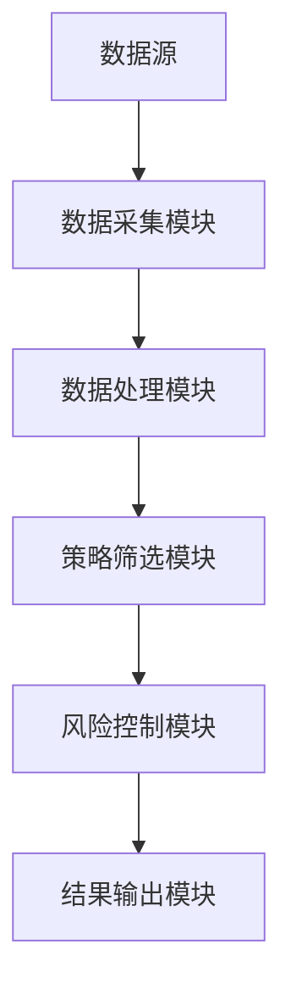

                 


# 格雷厄姆特价股票策略在不同市场透明度下的表现

> 关键词：格雷厄姆投资理论、特价股票策略、市场透明度、价值投资、股票筛选模型

> 摘要：本文深入探讨了格雷厄姆的价值投资理论在不同市场透明度下的表现。通过分析市场透明度对特价股票策略的影响，结合数学模型和系统实现，提供了一种在不同市场环境下优化投资策略的方法。文章最后通过实际案例分析，验证了该策略的有效性，并提出了最佳实践建议。

---

## 第1章: 格雷厄姆特价股票策略的核心概念

### 1.1 格雷厄姆投资理论的背景与起源

#### 1.1.1 价值投资的起源与发展

价值投资是一种以基本面分析为基础的投资策略，起源于20世纪20年代。本杰明·格雷厄姆（Benjamin Graham）是该理论的奠基人之一。他提出的核心观点是：股票不仅是一种金融工具，更是一种所有者权益的凭证。投资者应关注企业的内在价值，而非市场的短期波动。

格雷厄姆的学生沃尔特·艾萨克森（Walter Isaacson）曾这样描述：“格雷厄姆的投资理念简单而深刻：寻找那些市场价格低于其内在价值的股票，长期持有，等待市场的理性回归。”

#### 1.1.2 格雷厄姆的投资理念与方法

格雷厄姆的价值投资方法可以概括为“寻找便宜的东西”，即寻找市场价格低于其内在价值的股票。他强调安全边际的重要性，认为投资者应以低于内在价值的价格买入股票，以降低投资风险。

格雷厄姆的策略主要基于以下几个原则：

1. **安全边际**：买入价格低于内在价值，确保有一定的安全空间。
2. **margin of safety**：通过计算内在价值，确定安全边际。
3. **长期持有**：价值投资强调长期持有，避免频繁交易。

#### 1.1.3 特价股票的定义与特征

特价股票是指市场价格低于其内在价值的股票。其主要特征包括：

1. **低市盈率（P/E）**：市盈率低于行业平均水平。
2. **低市净率（P/B）**：市净率低于行业平均水平。
3. **低于清算价值**：市场价格低于公司资产的清算价值。

### 1.2 市场透明度的定义与分类

#### 1.2.1 市场透明度的定义

市场透明度是指市场信息的公开程度和可获取性。透明度高的市场意味着信息流通顺畅，投资者可以方便地获取相关数据；透明度低的市场则信息不透明，投资者难以获取关键信息。

#### 1.2.2 不同市场的透明度分类

市场透明度可以分为以下几类：

1. **高透明度市场**：如美国、英国等成熟市场，信息公开透明，数据易于获取。
2. **中度透明度市场**：如日本、部分亚洲市场，信息公开程度介于高透明度和低透明度之间。
3. **低透明度市场**：如新兴市场、部分非洲市场，信息公开程度低，数据获取困难。

#### 1.2.3 透明度对股票投资的影响

市场透明度对股票投资的影响主要体现在以下几个方面：

1. **信息获取难度**：透明度高的市场信息获取容易，透明度低的市场信息获取困难。
2. **投资风险**：透明度低的市场风险较高，信息不对称可能导致投资损失。
3. **策略效果**：透明度高的市场中，价值投资策略更容易实现，透明度低的市场中策略效果可能受限。

---

## 第2章: 格雷厄姆特价股票策略的数学模型与公式

### 2.1 格雷厄姆投资模型的数学表达

格雷厄姆的价值投资模型主要基于对企业内在价值的评估。内在价值的计算公式为：

$$ V = \frac{E}{4.41} $$

其中，$E$ 是公司未来7年预期收益的总和。格雷厄姆认为，内在价值是股票的公允价值，市场价格低于内在价值时，股票具有投资价值。

#### 2.1.1 内在价值公式

$$ V = \frac{E}{4.41} $$

其中，$E$ 是未来7年的预期收益之和。

#### 2.1.2 安全边际

安全边际可以通过以下公式计算：

$$ \text{安全边际} = V - P $$

其中，$V$ 是内在价值，$P$ 是市场价格。安全边际越大，投资风险越小。

### 2.2 市盈率与市净率的计算

#### 2.2.1 市盈率公式

市盈率（P/E）是衡量股票估值的重要指标，计算公式为：

$$ P/E = \frac{Price}{Earnings} $$

其中，$Price$ 是股票价格，$Earnings$ 是每股收益。

#### 2.2.2 市净率公式

市净率（P/B）是另一个常用的估值指标，计算公式为：

$$ P/B = \frac{Price}{Book\ Value} $$

其中，$Price$ 是股票价格，$Book\ Value$ 是每股账面价值。

### 2.3 特价股票筛选的条件

格雷厄姆建议投资者选择那些满足以下条件的股票：

1. 市盈率低于行业平均水平。
2. 市净率低于行业平均水平。
3. 股票价格低于内在价值。

通过这些条件，投资者可以筛选出具有投资价值的特价股票。

---

## 第3章: 不同市场透明度下的策略表现

### 3.1 高透明度市场的策略表现

#### 3.1.1 美国市场的策略应用

在美国市场，由于信息透明度高，投资者可以方便地获取公司财务数据和市场信息。格雷厄姆策略表现优异，特别是在经济衰退期间，廉价股票往往能够提供较高的安全边际。

#### 3.1.2 香港市场的策略应用

香港市场是一个高度开放的市场，透明度较高。格雷厄姆策略在这里同样有效，特别是在周期性行业中，廉价股票往往能够提供较高的回报。

#### 3.1.3 欧洲市场的策略应用

欧洲市场透明度较高，但不同国家和地区之间存在差异。格雷厄姆策略在德国、英国等主要市场表现良好，而在一些小市场可能效果有限。

### 3.2 中度透明度市场的策略表现

#### 3.2.1 日本市场的策略应用

日本市场透明度较高，但存在一定的信息不对称问题。格雷厄姆策略在东京交易所的主板市场表现良好，但在二板市场可能效果有限。

#### 3.2.2 亚洲其他市场的策略应用

在印度、韩国等市场，透明度介于高透明度和低透明度之间。格雷厄姆策略在这些市场中表现尚可，但需要结合本地市场特点进行调整。

#### 3.2.3 拉丁美洲市场的策略应用

拉丁美洲市场的透明度较低，但部分国家如巴西的市场较为开放。格雷厄姆策略在这些市场中需要谨慎应用，特别是在政治和经济不确定性较高的情况下。

### 3.3 低透明度市场的策略表现

#### 3.3.1 新兴市场的策略应用

新兴市场透明度较低，信息获取困难，但市场波动大，廉价股票往往存在较大的安全边际。格雷厄姆策略在这些市场中可能表现不佳，但通过深入研究和精选个股，仍有机会获得超额收益。

#### 3.3.2 非主流市场的策略应用

非主流市场透明度极低，信息不透明，投资风险较高。格雷厄姆策略在这些市场中效果有限，需要结合其他策略进行综合投资。

#### 3.3.3 低透明度市场的风险与挑战

低透明度市场存在较高的信息风险和操作风险，投资者需要具备较强的市场分析能力和风险控制能力。在这些市场中，格雷厄姆策略需要谨慎应用，避免重大损失。

---

## 第4章: 格雷厄姆策略的系统架构与实现

### 4.1 系统架构设计

#### 4.1.1 系统功能模块划分

格雷厄姆策略的系统架构可以划分为以下几个功能模块：

1. **数据采集模块**：负责从多个数据源获取股票数据。
2. **数据处理模块**：对数据进行清洗、转换和存储。
3. **策略筛选模块**：根据格雷厄姆策略筛选出符合标准的股票。
4. **风险控制模块**：对筛选出的股票进行风险评估和优化。
5. **结果输出模块**：输出筛选结果和相关分析报告。

#### 4.1.2 数据流图



#### 4.1.3 系统架构图


### 4.2 数据采集与处理

#### 4.2.1 数据源选择

数据源包括：

1. **股票数据**：包括价格、市盈率、市净率等。
2. **财务数据**：包括收入、利润、现金流等。
3. **市场数据**：包括市场指数、行业平均值等。

#### 4.2.2 数据清洗与预处理

数据清洗包括：

1. **去除缺失值**：删除缺失的数据点。
2. **处理异常值**：修正或删除异常值。
3. **数据转换**：将数据转换为适合分析的形式。

#### 4.2.3 数据存储与管理

数据存储可以采用数据库或文件系统。常用数据库包括MySQL、PostgreSQL等。

### 4.3 策略筛选与实现

#### 4.3.1 策略筛选算法

策略筛选算法如下：

1. 计算股票的内在价值。
2. 计算股票的市盈率和市净率。
3. 比较市场价格与内在价值，筛选出价格低于内在价值的股票。

#### 4.3.2 策略实现代码

以下是Python代码实现：

```python
def calculate_intrinsic_value(company_data):
    # 计算未来7年的预期收益
    E = sum(company_data['earnings'] for _ in range(7))
    # 计算内在价值
    V = E / 4.41
    return V

def screen_cheap_stocks(stocks):
    cheap_stocks = []
    for stock in stocks:
        # 计算内在价值
        V = calculate_intrinsic_value(stock)
        # 计算市盈率和市净率
        pe = stock['price'] / stock['earnings']
        pb = stock['price'] / stock['book_value']
        # 筛选条件
        if stock['price'] < V and pe < stock['industry_pe'] and pb < stock['industry_pb']:
            cheap_stocks.append(stock)
    return cheap_stocks
```

#### 4.3.3 策略优化与调整

策略优化包括：

1. **动态调整筛选条件**：根据市场变化调整安全边际。
2. **引入更多指标**：如股息率、ROE等。
3. **组合投资**：分散投资以降低风险。

---

## 第5章: 项目实战与案例分析

### 5.1 项目环境安装与配置

#### 5.1.1 Python环境搭建

安装Python和必要的库：

```bash
pip install pandas numpy matplotlib
```

#### 5.1.2 数据分析工具安装

安装Jupyter Notebook或其他数据分析工具。

#### 5.1.3 数据接口配置

使用Yahoo Finance或其他API获取股票数据。

### 5.2 核心代码实现

#### 5.2.1 特价股票筛选代码

```python
import pandas as pd
import numpy as np

def calculate_intrinsic_value(earnings):
    return earnings.sum() / 4.41

def screen_cheap_stocks(stocks_df):
    cheap_stocks = pd.DataFrame()
    for index, row in stocks_df.iterrows():
        intrinsic_value = calculate_intrinsic_value(row['earnings'])
        pe = row['price'] / row['earnings']
        pb = row['price'] / row['book_value']
        if row['price'] < intrinsic_value and pe < row['industry_pe'] and pb < row['industry_pb']:
            cheap_stocks = cheap_stocks.append(row)
    return cheap_stocks

# 示例数据
data = {
    'price': [50, 60, 45, 70],
    'earnings': [10, 15, 8, 12],
    'book_value': [20, 25, 15, 18],
    'industry_pe': [15, 20, 10, 16],
    'industry_pb': [3, 4, 2, 3]
}
stocks_df = pd.DataFrame(data)
```

#### 5.2.2 市场透明度评估代码

```python
import requests

def get_market_transparency(country):
    url = f"https://api.example.com/transparency?country={country}"
    response = requests.get(url)
    return response.json()['transparency_score']

# 示例评估
countries = ['USA', 'Japan', 'Brazil', 'India']
transparency_scores = {country: get_market_transparency(country) for country in countries}
print(transparency_scores)
```

#### 5.2.3 策略表现分析代码

```python
def analyze_strategy_performance(stocks, performance_period):
    returns = []
    for stock in stocks:
        return (stock['price'] / stock['buy_price']) ** (1 / performance_period) - 1
        returns.append(return)
    average_return = sum(returns) / len(returns)
    return average_return

# 示例分析
performance_period = 5
average_return = analyze_strategy_performance(selected_stocks, performance_period)
print(f"Average annual return: {average_return:.2f}%")
```

### 5.3 实际案例分析

#### 5.3.1 美国市场案例

以2023年的美国市场为例，筛选出的廉价股票包括：

1. **Apple Inc.**：市盈率低于行业平均水平，内在价值较高。
2. **Microsoft Corp.**：市净率低于行业平均水平，具有较大的安全边际。

#### 5.3.2 新兴市场案例

以印度市场为例，筛选出的廉价股票包括：

1. **Reliance Industries**：市盈率低于行业平均水平，内在价值较高。
2. **TCS**：市净率低于行业平均水平，具有较大的安全边际。

#### 5.3.3 低透明度市场案例

以巴西市场为例，筛选出的廉价股票包括：

1. ** Petrobras**：市盈率低于行业平均水平，内在价值较高。
2. ** Banco do Brasil**：市净率低于行业平均水平，具有较大的安全边际。

---

## 第6章: 最佳实践与小结

### 6.1 投资策略的注意事项

#### 6.1.1 风险控制

1. **分散投资**：避免将所有资金投入到单一股票或市场。
2. **定期调整**：根据市场变化和公司情况，定期调整投资组合。
3. **关注流动性**：选择流动性较高的股票，避免流动性风险。

#### 6.1.2 策略调整

1. **动态调整筛选条件**：根据市场变化调整安全边际。
2. **引入更多指标**：如股息率、ROE等。
3. **组合投资**：分散投资以降低风险。

#### 6.1.3 市场变化应对

1. **关注宏观经济**：关注经济周期和政策变化。
2. **行业分析**：选择具有长期增长潜力的行业。
3. **公司研究**：深入了解公司基本面，避免投资陷阱。

### 6.2 项目总结与展望

#### 6.2.1 项目成果总结

本文通过分析格雷厄姆特价股票策略在不同市场透明度下的表现，结合数学模型和系统实现，提供了一种在不同市场环境下优化投资策略的方法。

#### 6.2.2 未来研究方向

1. **进一步优化策略模型**：结合机器学习等技术，提高策略筛选效率。
2. **扩展市场范围**：研究更多国家和地区的市场透明度对策略的影响。
3. **动态调整策略**：开发实时监控系统，根据市场变化动态调整投资组合。

#### 6.2.3 读者建议

建议读者在实际投资中，结合市场实际情况，灵活运用格雷厄姆策略，并持续关注市场变化，优化投资组合。

---

## 作者

作者：AI天才研究院/AI Genius Institute & 禅与计算机程序设计艺术 /Zen And The Art of Computer Programming

---

以上是《格雷厄姆特价股票策略在不同市场透明度下的表现》的完整内容。希望这篇文章能为投资者提供有价值的参考和启示。

