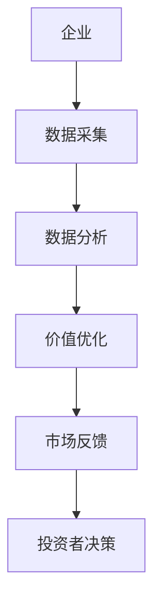
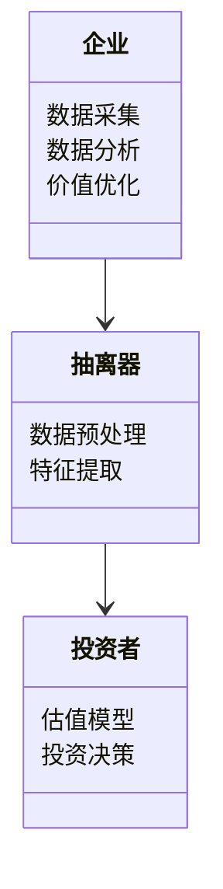
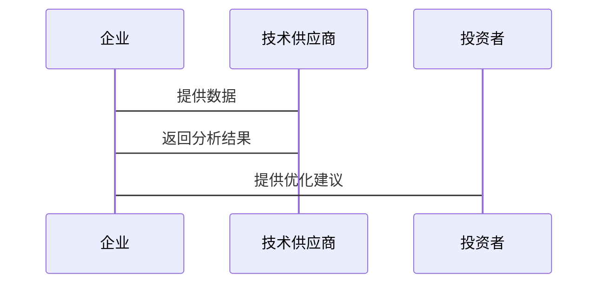

                 


# 特价股票投资中的产业互联网价值链分析方法

> 关键词：特价股票投资、产业互联网、价值链分析、股票估值、投资策略

> 摘要：本文深入探讨了特价股票投资中的产业互联网价值链分析方法，通过分析产业互联网的价值链结构，揭示了其在股票投资中的潜在价值。文章从背景介绍、核心概念、算法原理、系统分析、项目实战等多个维度展开，详细讲解了如何利用产业互联网价值链分析方法优化投资决策。通过实际案例分析和数学模型的构建，本文为投资者提供了一种全新的视角和方法，帮助其在复杂多变的股票市场中捕捉投资机会，实现稳健收益。

---

## 第一部分: 特价股票投资的背景与产业互联网价值链概述

### 第1章: 特价股票投资的背景与概念

#### 1.1 特价股票投资的背景
##### 1.1.1 特价股票投资的定义
特价股票投资是指以低于市场价购买股票的投资策略，其核心在于寻找被市场低估的股票，通过长期持有或短期操作实现收益最大化。这种投资策略通常适用于市场波动较大或经济下行周期，投资者可以通过捡漏的机会，获取超额收益。

##### 1.1.2 特价股票投资的兴起与发展趋势
随着互联网技术的快速发展，投资者获取信息的渠道更加便捷，数据量也呈指数级增长。特价股票投资的兴起离不开大数据分析和算法交易的支持，投资者可以通过量化分析发现市场中的估值洼地。未来，随着人工智能技术的进一步成熟，特价股票投资将更加依赖于数据驱动的分析方法。

##### 1.1.3 特价股票投资的市场环境分析
当前市场环境下，全球经济的不确定性增加，投资者的风险偏好趋向保守。特价股票投资作为一种低风险、高收益的策略，逐渐受到更多投资者的关注。然而，市场中信息不对称的问题依然存在，如何利用技术手段解决这一问题成为投资者的重要课题。

#### 1.2 产业互联网的价值链概述
##### 1.2.1 产业互联网的核心概念
产业互联网是指将互联网技术与传统产业深度融合，通过数字化手段优化传统产业的生产、管理和服务流程。产业互联网的核心在于数据的互联互通和价值挖掘，其本质是通过技术手段提升产业效率和竞争力。

##### 1.2.2 产业互联网的价值链结构
产业互联网的价值链通常包括以下几个环节：
1. 数据采集与处理：通过传感器、API等技术手段获取产业链中的实时数据。
2. 数据分析与建模：利用大数据分析和机器学习算法，对数据进行深度挖掘，发现潜在价值。
3. 价值传递与优化：通过优化算法和决策支持系统，实现产业链各环节的协同优化。
4. 价值实现：通过数据驱动的决策，实现企业利润最大化和资源效率提升。

##### 1.2.3 产业互联网与股票投资的关联性
产业互联网通过优化产业链的各个环节，降低了企业的运营成本，提高了利润率。这种优化过程可以通过公开的财务数据和市场信息反映到股票价格中。因此，投资者可以通过分析产业互联网对产业链的影响，发现那些因技术驱动而被低估的股票，从而实现超额收益。

---

### 第2章: 产业互联网价值链分析方法的背景

#### 2.1 产业互联网价值链分析的必要性
##### 2.1.1 特价股票投资中的信息不对称问题
在股票市场中，信息不对称是导致股票估值偏离其内在价值的主要原因之一。优质企业通过产业互联网优化其价值链，但由于信息不对称，这些优化成果并未被市场充分反映，从而导致股票价格被低估。

##### 2.1.2 产业互联网对股票投资的影响
产业互联网通过提升产业链的效率和透明度，降低了企业的运营成本，提高了利润率。这些变化可以通过财务数据和市场信息传递到股票价格中，为投资者提供新的投资机会。

##### 2.1.3 价值链分析在投资决策中的作用
通过对产业互联网价值链的分析，投资者可以识别出那些在产业链中具有竞争优势的企业，这些企业在技术驱动下具有更强的盈利能力，从而具备更高的投资价值。

#### 2.2 问题背景与目标
##### 2.2.1 特价股票投资中的主要问题
1. 信息不对称导致股票估值偏差
2. 传统估值方法无法充分反映产业互联网对企业价值的影响
3. 缺乏系统化的方法来分析产业互联网对股票投资的影响

##### 2.2.2 问题解决的目标
通过构建产业互联网价值链分析方法，帮助投资者识别被低估的股票，优化投资决策，实现超额收益。

##### 2.2.3 问题的边界与外延
产业互联网价值链分析方法适用于所有依赖于互联网技术优化产业链的企业，特别是那些在传统产业中通过数字化转型提升竞争力的企业。

#### 2.3 核心概念与联系
##### 2.3.1 产业互联网价值链的核心要素
1. 数据采集与处理：通过传感器、API等技术获取产业链中的实时数据。
2. 数据分析与建模：利用大数据分析和机器学习算法，对数据进行深度挖掘。
3. 价值传递与优化：通过优化算法和决策支持系统，实现产业链各环节的协同优化。
4. 价值实现：通过数据驱动的决策，实现企业利润最大化和资源效率提升。

##### 2.3.2 价值链分析方法的原理
产业互联网价值链分析方法的核心在于通过数据驱动的方式，识别产业链中的关键价值点，并通过优化算法实现价值的最大化。这种方法不仅可以帮助投资者发现被低估的股票，还可以为企业提供优化运营的决策支持。

##### 2.3.3 价值链分析与股票投资的结合
通过分析产业互联网对产业链的影响，投资者可以识别出那些在技术驱动下具有竞争优势的企业，这些企业在产业链中具有更强的盈利能力，从而具备更高的投资价值。

---

### 第3章: 产业互联网价值链的核心要素与结构

#### 3.1 价值链的核心要素
##### 3.1.1 产业互联网的参与者
1. 企业：通过产业互联网优化自身运营的各个环节。
2. 技术供应商：提供大数据分析和人工智能技术支持的公司。
3. 投资者：通过分析产业互联网对股票的影响，进行投资决策。

##### 3.1.2 产业互联网的主要环节
1. 数据采集与处理：通过传感器、API等技术获取产业链中的实时数据。
2. 数据分析与建模：利用大数据分析和机器学习算法，对数据进行深度挖掘。
3. 价值传递与优化：通过优化算法和决策支持系统，实现产业链各环节的协同优化。
4. 价值实现：通过数据驱动的决策，实现企业利润最大化和资源效率提升。

##### 3.1.3 价值链的驱动因素
1. 技术创新：大数据、人工智能等技术的应用推动了产业链的优化。
2. 信息共享：通过数据互联互通，降低了信息不对称，提高了效率。
3. 价值创造：通过优化算法和决策支持，实现了产业链价值的最大化。

#### 3.2 价值链的结构分析
##### 3.2.1 价值链的层次划分
1. 基础层：数据采集与处理。
2. 中间层：数据分析与建模。
3. 应用层：价值传递与优化。

##### 3.2.2 价值链的关键节点
1. 数据采集：获取产业链中的实时数据。
2. 数据分析：利用机器学习算法对数据进行深度挖掘。
3. 价值优化：通过优化算法实现产业链各环节的协同优化。

##### 3.2.3 价值链的流动方向与关系
1. 数据从企业流向技术供应商，进行处理和分析。
2. 分析结果反哺企业，优化其运营流程。
3. 优化后的数据通过市场信息传递到股票价格中，影响投资者的决策。

#### 3.3 核心概念的属性特征对比
##### 3.3.1 产业互联网与传统产业的对比
| 特性         | 传统产业                  | 产业互联网                |
|--------------|---------------------------|---------------------------|
| 技术应用     | 传统技术为主              | 大数据、人工智能为主      |
| 信息共享     | 信息孤岛                  | 数据互联互通              |
| 效率提升     | 较低                     | 较高                     |

##### 3.3.2 价值链分析方法的优劣势
| 优势         | � 劣势                     |
|--------------|--------------------------|
| 数据驱动，精准分析 | 数据获取难度大，分析成本高 |
| 优化效果显著 | 数据质量要求高            |

##### 3.3.3 ER实体关系图架构


---

## 第二部分: 产业互联网价值链分析方法的算法原理

### 第4章: 算法原理与数学模型

#### 4.1 产业互联网价值链分析的核心算法
##### 4.1.1 数据预处理
数据预处理是价值链分析的基础，包括数据清洗、特征提取和标准化处理。

##### 4.1.2 机器学习算法
常用的机器学习算法包括线性回归、随机森林和神经网络等。

##### 4.1.3 算法流程
1. 数据预处理：清洗数据，提取特征。
2. 模型训练：利用机器学习算法对数据进行建模。
3. 模型优化：通过交叉验证和超参数调整优化模型。
4. 模型部署：将优化后的模型应用于实际投资决策。

#### 4.2 数学模型与公式
##### 4.2.1 股票估值模型
$$ P = \alpha \times EBITDA + \beta \times Market \, Value $$

##### 4.2.2 优化算法
$$ \text{Maximize} \, \sum_{i=1}^{n} w_i \times v_i $$
$$ \text{Subject to} \, \sum_{i=1}^{n} w_i = 1 $$

##### 4.2.3 举例说明
假设某企业的EBITDA为100，市场价值为500，α=0.5，β=0.5，那么：
$$ P = 0.5 \times 100 + 0.5 \times 500 = 300 $$

---

## 第三部分: 产业互联网价值链分析方法的系统分析

### 第5章: 系统分析与架构设计

#### 5.1 问题场景介绍
在股票市场中，投资者需要通过分析产业互联网对企业的价值影响，识别被低估的股票。

#### 5.2 系统功能设计
##### 5.2.1 领域模型


#### 5.3 系统架构设计
##### 5.3.1 系统架构图


#### 5.4 系统接口设计
##### 5.4.1 API接口
1. 数据采集接口：从企业获取实时数据。
2. 数据分析接口：对数据进行深度挖掘。
3. 优化结果接口：将优化结果传递给投资者。

#### 5.5 系统交互流程
##### 5.5.1 序列图


---

## 第四部分: 产业互联网价值链分析方法的项目实战

### 第6章: 项目实战与案例分析

#### 6.1 项目环境安装
##### 6.1.1 安装Python
```bash
python --version
pip install numpy pandas scikit-learn
```

#### 6.2 系统核心实现
##### 6.2.1 数据预处理代码
```python
import pandas as pd
import numpy as np

# 数据加载
data = pd.read_csv('data.csv')

# 数据清洗
data.dropna(inplace=True)

# 特征提取
features = data[['EBITDA', 'Market Value']]
```

##### 6.2.2 估值模型实现
```python
from sklearn.linear_model import LinearRegression

# 模型训练
model = LinearRegression()
model.fit(features, data['Price'])

# 模型预测
predicted_price = model.predict(new_features)
```

#### 6.3 代码应用解读与分析
##### 6.3.1 数据预处理
数据预处理是价值链分析的基础，包括数据清洗、特征提取和标准化处理。

##### 6.3.2 模型训练与优化
通过机器学习算法对数据进行建模，并通过交叉验证和超参数调整优化模型。

#### 6.4 实际案例分析
##### 6.4.1 案例背景
某制造业企业通过产业互联网优化其供应链管理，降低了成本，提高了利润率。

##### 6.4.2 数据分析与优化
通过对该企业的数据进行分析，发现其股票价格被市场低估，建议投资者买入。

##### 6.4.3 投资决策
基于分析结果，投资者在企业优化成果公布前买入该股票，获得超额收益。

#### 6.5 项目小结
通过项目实战，验证了产业互联网价值链分析方法的有效性，投资者可以利用该方法发现被低估的股票，实现超额收益。

---

## 第五部分: 产业互联网价值链分析方法的最佳实践

### 第7章: 最佳实践与总结

#### 7.1 最佳实践
##### 7.1.1 小结
产业互联网价值链分析方法通过数据驱动的方式，帮助投资者识别被低估的股票，优化投资决策。

##### 7.1.2 注意事项
1. 数据质量是分析结果的关键，需确保数据的准确性和完整性。
2. 模型优化需要结合实际业务场景，避免过度拟合。
3. 投资者需具备一定的技术背景，才能更好地应用该方法。

##### 7.1.3 拓展阅读
1. 《大数据投资策略》
2. 《人工智能在金融领域的应用》
3. 《产业互联网与企业价值提升》

#### 7.2 总结
产业互联网价值链分析方法为投资者提供了一种全新的视角和方法，帮助其在复杂多变的股票市场中捕捉投资机会，实现稳健收益。通过数据驱动的方式，投资者可以更好地识别被低估的股票，优化投资决策，实现超额收益。

---

## 作者：AI天才研究院/AI Genius Institute & 禅与计算机程序设计艺术 /Zen And The Art of Computer Programming

