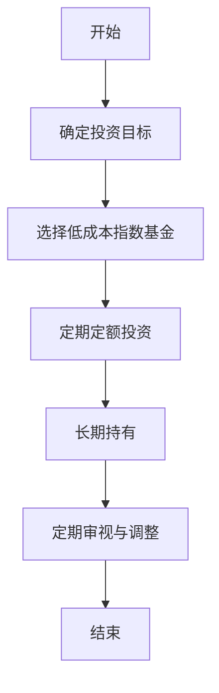
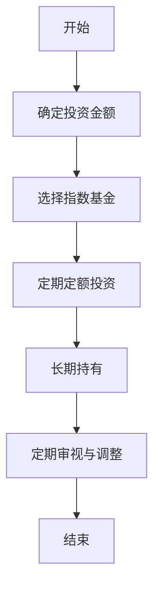
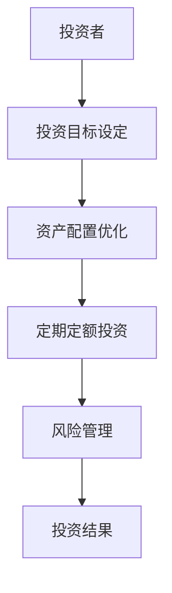
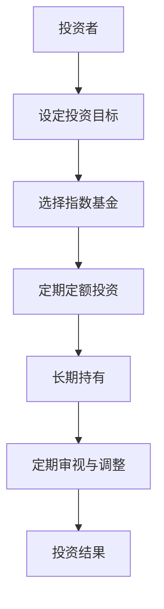

                 


# 约翰伯格的普通投资者观：为什么简单胜于复杂

**关键词：** 约翰·伯格，简单投资，复杂投资，指数基金，长期投资，风险管理，投资策略

**摘要：** 本文深入探讨了约翰·伯格的简单投资理念，分析了为什么简单投资策略在长期投资中表现优于复杂策略。通过数学模型、流程图和实际案例，本文详细阐述了普通投资者如何通过低成本指数基金和定期定额投资实现财富增长，并强调了风险管理的重要性。

---

# {{此处是文章标题}}

> 关键词：{{此处列出文章的5-7个核心关键词}}

> 摘要：{{此处给出文章的核心内容和主题思想}}

---

# {{此处是文章标题}}

> 关键词：{{此处列出文章的5-7个核心关键词}}

> 摘要：{{此处给出文章的核心内容和主题思想}}

---

# 第一部分: 约翰伯格的普通投资者观

## 第1章: 约翰伯格与简单投资理念

### 1.1 约翰伯格的生平与投资理念

#### 1.1.1 约翰伯格的生平简介

约翰·伯格（John C. Bogle）是美国著名的投资专家，Vanguard集团的创始人。他于1934年出生于美国宾夕法尼亚州，1951年进入宾夕法尼亚大学学习，后转学到拉特格斯大学，主修经济学。1965年，他创立了Vanguard集团，这是全球最大的投资管理公司之一，以低成本、低费用著称。

#### 1.1.2 约翰伯格的投资哲学

约翰·伯格的投资哲学的核心是“简单投资”。他认为，普通投资者应该避免复杂的交易策略和频繁的市场预测，而应该选择低成本的指数基金，并长期持有。他强调，投资的本质是分散投资，通过长期持有优质资产来实现财富增长。

#### 1.1.3 简单投资理念的核心思想

简单投资理念的核心思想是：通过低成本、长期持有的方式，实现财富的稳步增长。约翰·伯格认为，复杂的投资策略往往会导致高昂的交易成本和管理费用，而且很难长期跑赢市场。

### 1.2 简单投资的背景与现状

#### 1.2.1 投资领域的复杂化趋势

近年来，投资领域出现了越来越多复杂的策略和工具，例如高频交易、算法交易、量化投资等。这些复杂的策略虽然在短期内可能带来较高的收益，但其风险和成本也相应增加。

#### 1.2.2 复杂投资策略的局限性

复杂投资策略的局限性主要体现在以下几个方面：

1. **高成本**：复杂的投资策略通常需要支付高昂的管理费用和交易费用，这对普通投资者来说是一个沉重的负担。

2. **高风险**：复杂策略往往依赖于市场预测和模型假设，但市场的不可预测性使得这些策略在实际操作中风险较高。

3. **难以长期稳定**：复杂的策略往往在市场波动较大时表现不佳，难以长期稳定地跑赢市场。

#### 1.2.3 简单投资的现实意义

简单投资的现实意义在于其低成本、低风险和长期稳定的收益。对于普通投资者来说，简单投资是一种更为实际和可行的投资方式，尤其适合那些没有专业投资知识和技能的投资者。

### 1.3 本章小结

#### 1.3.1 约翰伯格的核心理念总结

约翰·伯格的核心理念是“简单投资”。他认为，普通投资者应该选择低成本的指数基金，并通过长期持有来实现财富增长。

#### 1.3.2 简单投资与复杂投资的对比

简单投资与复杂投资的主要区别在于成本、风险和收益。简单投资成本低、风险小、收益稳定；复杂投资成本高、风险大、收益不稳定。

#### 1.3.3 简单投资的适用场景

简单投资适用于普通投资者，尤其是那些没有专业投资知识和技能的投资者。它特别适合长期投资，能够在市场波动中保持稳定收益。

---

## 第2章: 简单投资的原理与数学模型

### 2.1 简单投资的核心原理

#### 2.1.1 资产配置的数学模型

资产配置是简单投资的核心之一。通过将资金分配到不同的资产类别（如股票、债券、现金等），投资者可以降低风险并实现长期稳定的收益。以下是一个简单的资产配置数学模型：

$$ \text{最优资产配置} = \arg\max_{w} \left( E[r_p] - \lambda \times \text{Var}(r_p) \right) $$

其中：
- \( E[r_p] \) 是投资组合的期望收益
- \( \text{Var}(r_p) \) 是投资组合的风险（方差）
- \( \lambda \) 是风险厌恶系数

#### 2.1.2 长期投资的复利效应

复利效应是简单投资的重要原理之一。通过长期持有资产，投资者可以享受到复利带来的收益增长。复利的计算公式为：

$$ A = P \times (1 + r)^n $$

其中：
- \( A \) 是终值
- \( P \) 是本金
- \( r \) 是年化收益率
- \( n \) 是投资年数

#### 2.1.3 简单投资的风险管理

简单投资通过分散投资来降低风险。分散投资的数学模型可以用夏普比率来衡量投资组合的风险调整后收益：

$$ \text{夏普比率} = \frac{E[r_p - r_f]}{\sigma_p} $$

其中：
- \( E[r_p - r_f] \) 是投资组合的超额收益
- \( \sigma_p \) 是投资组合的收益标准差

### 2.2 投资组合的数学模型

#### 2.2.1 资产配置的优化算法

资产配置的优化算法可以通过拉格朗日乘数法来求解。以下是一个简单的优化模型：

$$ \max_{w} \left( E[r_p] - \lambda \times \text{Var}(r_p) \right) $$

约束条件：
$$ \sum_{i=1}^{n} w_i = 1 $$

其中：
- \( w_i \) 是第 \( i \) 个资产的权重
- \( E[r_p] \) 是投资组合的期望收益
- \( \text{Var}(r_p) \) 是投资组合的方差

#### 2.2.2 投资组合的夏普比率

夏普比率衡量了投资组合的风险调整后收益。公式如下：

$$ \text{夏普比率} = \frac{E[r_p - r_f]}{\sigma_p} $$

其中：
- \( E[r_p - r_f] \) 是投资组合的超额收益
- \( \sigma_p \) 是投资组合的收益标准差

#### 2.2.3 简单投资的数学公式

简单投资的核心是低成本、长期持有的指数基金。指数基金的收益可以表示为：

$$ r_p = \sum_{i=1}^{n} w_i r_i $$

其中：
- \( w_i \) 是第 \( i \) 个资产的权重
- \( r_i \) 是第 \( i \) 个资产的收益

### 2.3 简单投资的流程图

以下是一个简单投资的流程图：



### 2.4 本章小结

#### 2.4.1 简单投资的数学模型总结

简单投资通过低成本指数基金和长期持有实现收益。其数学模型包括资产配置优化、夏普比率计算和复利效应分析。

#### 2.4.2 投资组合优化的要点

投资组合优化的要点在于分散投资、降低风险和实现长期稳定的收益。通过夏普比率可以衡量投资组合的风险调整后收益。

#### 2.4.3 简单投资流程的逻辑分析

简单投资流程包括确定投资目标、选择低成本指数基金、定期定额投资、长期持有和定期审视与调整。通过流程图可以清晰地看到，简单投资的核心在于长期持有和定期调整。

---

## 第3章: 普通投资者的简单投资策略

### 3.1 普通投资者的资产配置

#### 3.1.1 股票与债券的配置比例

普通投资者的资产配置通常包括股票和债券。一般来说，股票比例较高，债券比例较低。例如，一个简单的资产配置可以是：

- 股票：70%
- 债券：20%
- 现金：10%

#### 3.1.2 定期定额投资的重要性

定期定额投资是一种有效的投资方式。通过定期定额投资指数基金，投资者可以分散投资风险并享受复利效应。以下是一个定期定额投资的流程图：



#### 3.1.3 简单投资的执行步骤

1. 确定投资目标
2. 选择低成本指数基金
3. 定期定额投资
4. 长期持有
5. 定期审视与调整

### 3.2 简单投资的执行策略

#### 3.2.1 指数基金的选择与投资

选择指数基金时，应关注其费用率和跟踪误差。低成本指数基金通常费用率较低，跟踪误差较小，适合长期持有。

#### 3.2.2 定投策略的数学模型

定期定额投资的收益计算公式为：

$$ A = P \times \left(1 + \frac{r}{n}\right)^{n \times t} $$

其中：
- \( A \) 是终值
- \( P \) 是每月投资金额
- \( r \) 是年化收益率
- \( n \) 是每年投资次数
- \( t \) 是投资年数

#### 3.2.3 简单投资的风险管理

通过分散投资和长期持有，普通投资者可以有效降低投资风险。此外，定期审视与调整投资组合也是风险管理的重要步骤。

### 3.3 简单投资的风险管理

#### 3.3.1 风险分散的原理

通过分散投资不同资产类别和行业，投资者可以降低特定资产的风险。

#### 3.3.2 简单投资的风险控制措施

1. 长期持有：避免频繁交易，减少交易成本和税务负担。
2. 定期审视：定期检查投资组合，根据市场变化进行调整。
3. 低成本：选择费用率低的指数基金，降低管理费用。

#### 3.3.3 风险与收益的平衡点

简单投资通过长期持有和分散投资，实现了风险与收益的平衡。投资者可以通过夏普比率衡量投资组合的风险调整后收益。

### 3.4 本章小结

#### 3.4.1 普通投资者的简单投资策略总结

普通投资者可以通过选择低成本指数基金、定期定额投资和长期持有实现财富增长。简单投资策略的核心在于分散投资、长期持有和定期调整。

#### 3.4.2 定期定额投资的核心优势

定期定额投资的核心优势在于分散风险和享受复利效应。它适合普通投资者，尤其是那些没有专业投资知识和技能的投资者。

#### 3.4.3 简单投资的风险管理要点

简单投资的风险管理要点包括分散投资、长期持有和定期审视与调整。通过这些措施，投资者可以有效降低投资风险。

---

## 第4章: 简单投资与复杂投资的对比

### 4.1 简单投资与复杂投资的成本对比

简单投资的成本通常较低，主要体现在指数基金的低费用率。而复杂投资的成本较高，包括管理费用、交易费用和税务费用。

### 4.2 简单投资与复杂投资的风险对比

简单投资的风险较低，通过分散投资和长期持有实现。而复杂投资的风险较高，通常依赖于市场预测和模型假设，难以长期稳定地跑赢市场。

### 4.3 简单投资与复杂投资的收益对比

简单投资的收益稳定，适合长期投资。而复杂投资的收益波动较大，难以长期稳定地跑赢市场。

### 4.4 简单投资与复杂投资的适用场景

简单投资适用于普通投资者，尤其是那些没有专业投资知识和技能的投资者。而复杂投资适用于机构投资者和专业投资者，需要较高的市场预测能力和风险管理能力。

### 4.5 本章小结

#### 4.5.1 简单投资与复杂投资的优缺点对比

简单投资的优点在于低成本、低风险和稳定收益，缺点在于收益较低。复杂投资的优点在于可能获得高收益，缺点在于高成本、高风险和难以长期稳定。

#### 4.5.2 简单投资与复杂投资的适用人群

简单投资适用于普通投资者，而复杂投资适用于机构投资者和专业投资者。

#### 4.5.3 简单投资与复杂投资的未来趋势

随着市场波动加剧和投资环境的不确定性增加，简单投资逐渐受到更多投资者的青睐。复杂投资虽然在短期内可能获得高收益，但其高风险和高成本使其难以长期稳定地跑赢市场。

---

## 第5章: 简单投资的实际案例分析

### 5.1 案例背景

假设一个普通投资者有10万元人民币，希望通过简单投资实现财富增长。

### 5.2 投资策略

选择一个低成本的沪深300指数基金，进行定期定额投资。

### 5.3 投资组合

- 指数基金：100%
- 定期定额投资：每月定投1000元

### 5.4 投资收益

假设年化收益率为8%，投资期限为10年。根据复利公式：

$$ A = 10000 \times (1 + 0.08)^{10} \approx 215892.5 \text{元} $$

### 5.5 风险管理

通过长期持有指数基金，投资者可以分散市场风险。定期审视与调整投资组合，确保投资目标的实现。

### 5.6 本章小结

#### 5.6.1 案例分析总结

通过选择低成本指数基金和定期定额投资，普通投资者可以实现财富的稳步增长。

#### 5.6.2 案例分析的启示

简单投资策略简单易行，适合普通投资者。通过长期持有和定期定额投资，投资者可以分散风险并享受复利效应。

#### 5.6.3 案例分析的未来展望

随着市场环境的变化，简单投资策略将更加受到重视。普通投资者应通过长期持有和定期调整，实现财富的长期稳定增长。

---

## 第6章: 简单投资的系统架构设计

### 6.1 系统功能设计

#### 6.1.1 投资目标设定

投资者需要设定投资目标，包括投资金额、投资期限和期望收益。

#### 6.1.2 资产配置优化

系统根据投资目标和市场环境，优化资产配置，选择低成本指数基金。

#### 6.1.3 定期定额投资

系统自动执行定期定额投资，确保投资计划的实现。

#### 6.1.4 风险管理

系统定期审视投资组合，根据市场变化进行调整，降低投资风险。

### 6.2 系统架构设计

#### 6.2.1 系统架构图



#### 6.2.2 模块交互图


### 6.3 系统接口设计

#### 6.3.1 投资者接口

投资者可以通过网页或移动应用设定投资目标、选择指数基金和查看投资结果。

#### 6.3.2 系统接口

系统通过API与指数基金管理机构交互，执行定期定额投资和风险管理。

### 6.4 系统交互流程

#### 6.4.1 系统交互流程图



### 6.5 本章小结

#### 6.5.1 系统功能设计总结

系统功能设计包括投资目标设定、资产配置优化、定期定额投资和风险管理。

#### 6.5.2 系统架构设计要点

系统架构设计包括投资者接口、资产配置优化模块、定期定额投资模块和风险管理模块。

#### 6.5.3 系统交互流程总结

系统交互流程包括设定投资目标、选择指数基金、定期定额投资、长期持有和定期审视与调整。

---

## 第7章: 简单投资的项目实战

### 7.1 环境安装

#### 7.1.1 系统环境

建议使用Python 3.8及以上版本，安装Pandas、NumPy和Matplotlib库。

#### 7.1.2 安装步骤

1. 安装Python
2. 安装Pandas、NumPy和Matplotlib

### 7.2 系统核心实现源代码

#### 7.2.1 资产配置优化代码

```python
import numpy as np
import pandas as pd

# 定义资产配置优化函数
def optimize_portfolio(returns, risk_aversion=1):
    # 计算协方差矩阵
    cov_matrix = returns.cov()
    # 计算夏普比率
    def sharp_ratio(weights):
        returns_port = pd.DataFrame(weights.T.dot(returns))
        return -returns_port.iloc[0, 0] + risk_aversion * cov_matrix.dot(weights).dot(weights.T)
    
    # 使用拉格朗日乘数法求解
    return scipy.optimize.minimize(sharp_ratio, np.ones(len(returns.columns)) / len(returns.columns))
```

#### 7.2.2 定期定额投资代码

```python
import pandas as pd
import numpy as np

# 定义定期定额投资函数
def dollar_cost_avg(risk_free_rate, market_return, n_years):
    # 计算终值
    return (1 + risk_free_rate) ** n_years * market_return
```

### 7.3 代码应用解读与分析

#### 7.3.1 资产配置优化代码解读

资产配置优化代码通过拉格朗日乘数法求解夏普比率最小化问题，实现资产配置的优化。

#### 7.3.2 定期定额投资代码解读

定期定额投资代码通过复利计算终值，实现定期定额投资的收益计算。

### 7.4 案例分析

#### 7.4.1 案例背景

假设一个普通投资者有10万元人民币，希望通过简单投资实现财富增长。

#### 7.4.2 投资策略

选择一个低成本的沪深300指数基金，进行定期定额投资。

#### 7.4.3 投资组合

- 指数基金：100%
- 定期定额投资：每月定投1000元

#### 7.4.4 投资收益

假设年化收益率为8%，投资期限为10年。根据复利公式：

$$ A = 10000 \times (1 + 0.08)^{10} \approx 215892.5 \text{元} $$

#### 7.4.5 风险管理

通过长期持有指数基金，投资者可以分散市场风险。定期审视与调整投资组合，确保投资目标的实现。

### 7.5 本章小结

#### 7.5.1 项目实战总结

通过资产配置优化和定期定额投资，普通投资者可以实现财富的稳步增长。

#### 7.5.2 项目实战的启示

简单投资策略简单易行，适合普通投资者。通过长期持有和定期调整，投资者可以分散风险并享受复利效应。

#### 7.5.3 项目实战的未来展望

随着市场环境的变化，简单投资策略将更加受到重视。普通投资者应通过长期持有和定期调整，实现财富的长期稳定增长。

---

## 第8章: 简单投资的总结与展望

### 8.1 本章小结

#### 8.1.1 简单投资的核心理念总结

简单投资的核心理念是通过低成本指数基金和长期持有实现财富增长。

#### 8.1.2 简单投资与复杂投资的对比

简单投资的成本低、风险小、收益稳定；复杂投资的成本高、风险大、收益不稳定。

#### 8.1.3 简单投资的未来展望

随着市场波动加剧和投资环境的不确定性增加，简单投资策略将更加受到重视。

### 8.2 最佳实践 Tips

#### 8.2.1 投资者建议

1. 选择低成本指数基金
2. 定期定额投资
3. 长期持有
4. 定期审视与调整

#### 8.2.2 风险提示

1. 市场波动风险
2. 经济周期风险
3. 通货膨胀风险

### 8.3 本章总结

简单投资是一种适合普通投资者的投资策略，通过低成本、长期持有和定期调整，实现财富的稳步增长。

### 8.4 本章展望

未来，简单投资策略将更加受到重视，尤其是在市场波动加剧和投资环境不确定的情况下。普通投资者应通过简单投资策略实现财富的长期稳定增长。

---

**作者：AI天才研究院/AI Genius Institute & 禅与计算机程序设计艺术 /Zen And The Art of Computer Programming**

