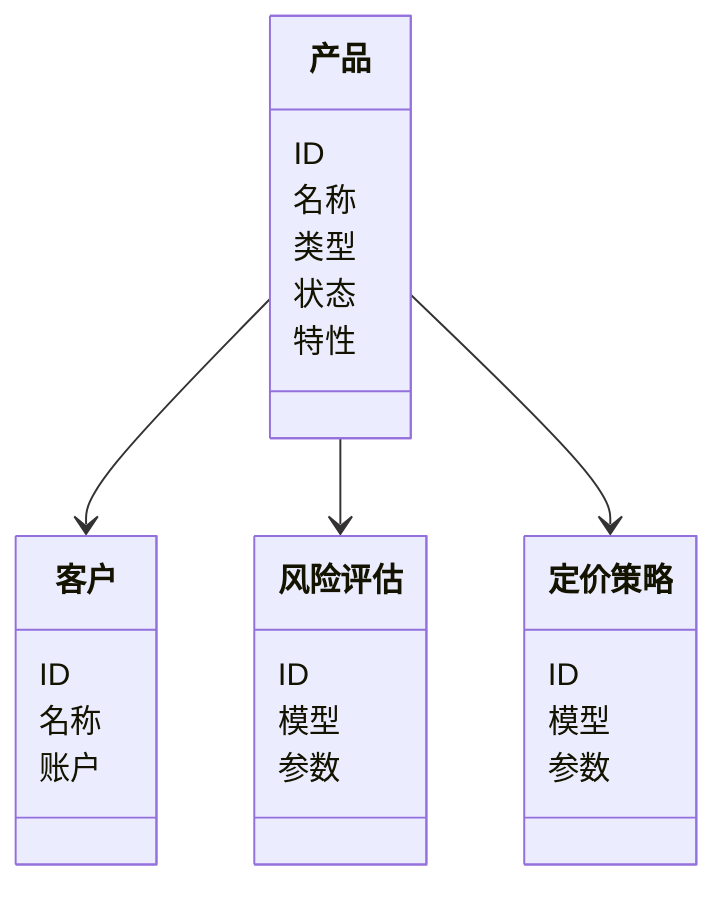
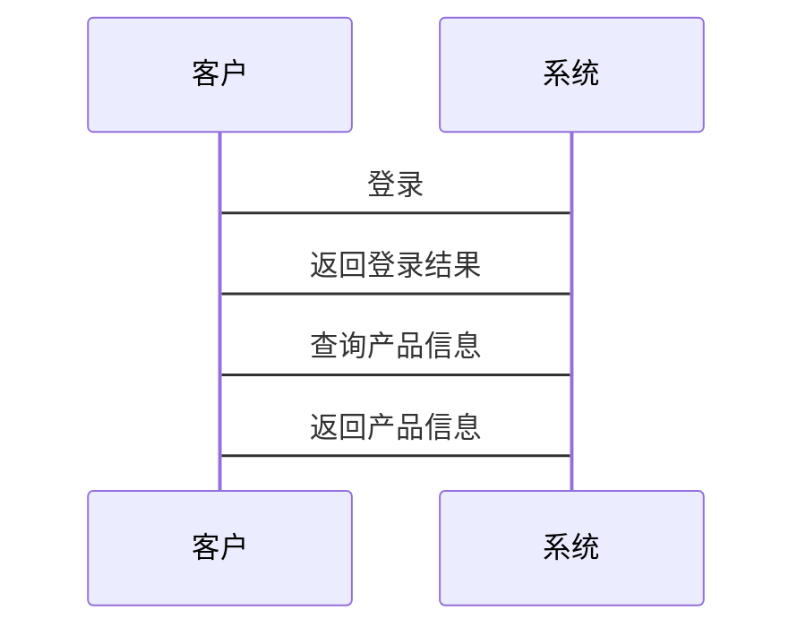

                 


# 金融产品生命周期价值最大化策略

> 关键词：金融产品生命周期、价值最大化、风险管理、定价策略、产品设计、数据分析

> 摘要：本文从金融产品的生命周期出发，详细探讨了在每个阶段如何通过科学的设计、优化的定价策略、有效的风险管理以及数据驱动的运营手段，实现金融产品价值的最大化。文章结合理论与实践，提出了系统的价值最大化策略，并通过具体案例分析和系统架构设计，为金融机构提供了可操作的指导。

---

# 第一部分: 金融产品生命周期与价值最大化概述

## 第1章: 金融产品生命周期与价值最大化概述

### 1.1 金融产品生命周期的概念

#### 1.1.1 金融产品的定义与分类

金融产品是指金融机构向客户提供的各种金融服务或金融工具，包括但不限于存款、贷款、保险、基金、股票、债券、衍生品等。根据功能和风险特征，金融产品可以分为以下几类：

- **存款类产品**：如活期存款、定期存款，具有低风险、低收益的特点。
- **贷款类产品**：如个人贷款、企业贷款，具有较高的信用风险。
- **投资类产品**：如基金、股票、债券，具有较高的收益潜力和风险。
- **保险类产品**：如寿险、财险，具有风险分散的功能。
- **衍生类产品**：如期货、期权，具有高风险、高杠杆的特点。

#### 1.1.2 金融产品生命周期的阶段划分

金融产品的生命周期通常分为以下几个阶段：

1. **设计阶段**：从客户需求出发，设计产品结构，确定产品功能和风险特征。
2. **发行阶段**：通过合适的渠道将产品推向市场，完成销售。
3. **运营阶段**：对产品进行持续监控、管理，确保产品正常运作。
4. **终止阶段**：根据市场反馈或合同约定，终止产品运作。

#### 1.1.3 金融产品生命周期管理的重要性

金融产品生命周期管理是金融机构实现产品价值最大化的重要手段。通过科学的生命周期管理，金融机构可以更好地满足客户需求，优化资源配置，控制风险，提升整体竞争力。

### 1.2 价值最大化的目标与意义

#### 1.2.1 价值最大化的核心目标

金融产品价值最大化的目标是通过优化产品设计、定价、营销和风险管理等环节，实现产品收益的最大化，同时控制风险，确保产品的可持续发展。

#### 1.2.2 价值最大化对金融机构的意义

- 提升产品竞争力：通过价值最大化策略，金融机构可以设计出更具吸引力的产品，吸引更多客户。
- 优化资源配置：通过科学的生命周期管理，提高资源利用效率，降低成本。
- 控制风险：通过风险评估和管理，降低产品生命周期中的潜在风险，确保产品安全运作。

#### 1.2.3 价值最大化对客户的价值

- 提供更高收益：通过优化产品设计和定价策略，客户可以获得更高的收益。
- 风险可控：通过科学的风险管理，客户可以享受更低的金融风险。

### 1.3 本书的核心内容与结构

#### 1.3.1 本书的主要内容

- 金融产品生命周期的各个阶段及其管理策略。
- 产品设计、发行、运营和终止阶段的具体策略。
- 数据分析与风险管理在金融产品生命周期中的应用。
- 系统架构设计与项目实战。

#### 1.3.2 本书的结构安排

1. 引言：介绍金融产品生命周期的重要性及价值最大化的目标。
2. 产品设计阶段：探讨产品设计的核心要素、数学模型构建及优化策略。
3. 产品发行阶段：分析发行渠道选择、定价策略及风险控制。
4. 产品运营阶段：讨论运营指标、数据分析与优化策略。
5. 系统架构设计：提供完整的金融产品生命周期管理系统设计。
6. 项目实战：通过实际案例分析，展示如何在实践中应用价值最大化策略。
7. 总结：回顾核心内容，总结关键点并提出进一步的建议。

#### 1.3.3 本书的适用读者

- 金融机构的管理者、产品经理和风险管理人员。
- 对金融产品生命周期管理感兴趣的研究者和从业者。
- 对数据分析和系统设计感兴趣的金融科技从业者。

### 1.4 本章小结

本章通过对金融产品生命周期的概述，明确了其重要性及价值最大化的目标。接下来的章节将详细探讨各个阶段的具体策略和实现方法，帮助读者全面理解金融产品生命周期管理的核心内容。

---

# 第二部分: 金融产品生命周期各阶段的价值最大化策略

## 第2章: 产品设计阶段的价值最大化策略

### 2.1 产品设计的核心要素

#### 2.1.1 产品目标与客户需求分析

产品设计的首要任务是明确产品目标，了解客户的真实需求。例如，设计一款理财产品时，需要分析客户的风险承受能力、收益预期和投资期限。

#### 2.1.2 产品设计的创新性与可行性

创新性是指产品的独特性和差异化，而可行性则是指产品在技术和市场上的实现可能性。例如，设计一款创新型结构性理财产品，需要结合市场需求和金融机构的风控能力。

#### 2.1.3 产品设计的风险评估

在产品设计阶段，必须进行全面的风险评估，包括市场风险、信用风险和操作风险。例如，设计一款股票挂钩的期权产品，需要评估股市波动对产品收益的影响。

### 2.2 数学模型与价值评估

#### 2.2.1 产品价值的数学模型构建

以股票期权为例，可以使用Black-Scholes模型来定价。模型公式为：

$$ C = S_0 \Phi(d_1) - K e^{-rT} \Phi(d_2) $$

其中，\( d_1 = \frac{\ln(S_0/K) + (r + \sigma^2/2)T}{\sigma \sqrt{T}} \)，\( d_2 = d_1 - \sigma \sqrt{T} \)，\( \Phi \) 是标准正态分布的累积分布函数。

#### 2.2.2 产品定价的博弈论模型

博弈论模型可以用来分析市场竞争中的定价策略。例如，考虑两个竞争者在定价时的策略选择，可以通过纳什均衡来确定最优定价。

#### 2.2.3 产品收益与风险的平衡分析

通过收益-风险权衡模型，可以找到产品设计的最佳平衡点。例如，使用夏普比率（Sharpe Ratio）来衡量投资组合的超额收益与风险之比。

$$ \text{夏普比率} = \frac{E[r_p - r_f]}{\sigma_p} $$

其中，\( E[r_p - r_f] \) 是投资组合的超额收益期望值，\( \sigma_p \) 是投资组合的收益标准差。

### 2.3 产品设计阶段的优化策略

#### 2.3.1 客户价值与产品收益的匹配

通过客户细分和需求分析，设计出能够精准满足不同客户群体的产品。例如，针对高净值客户设计定制化的产品。

#### 2.3.2 产品设计的差异化策略

差异化策略包括产品结构的创新、服务的差异化以及品牌定位的差异化。例如，设计一款具有浮动收益和保本特性的理财产品。

#### 2.3.3 产品设计的持续优化

通过市场反馈和数据分析，不断优化产品设计。例如，根据客户投诉和满意度调查结果，调整产品条款和条件。

### 2.4 本章小结

产品设计阶段是金融产品生命周期的起点，也是价值最大化的重要环节。通过科学的设计和优化，可以为后续的发行和运营打下坚实的基础。

---

## 第3章: 产品发行阶段的价值最大化策略

### 3.1 产品发行渠道的选择与优化

#### 3.1.1 渠道成本与效率分析

不同渠道的发行成本和效率存在差异。例如，线上渠道成本低，效率高；线下渠道成本高，但信任度高。

#### 3.1.2 渠道覆盖的广度与深度

渠道覆盖的广度决定了产品的市场覆盖面，而深度则影响客户体验。例如，选择线上+线下的多渠道组合，可以实现广覆盖和深服务。

#### 3.1.3 渠道合作的共赢模式

与第三方平台合作，可以借助其客户资源和渠道优势，快速扩大产品销售。例如，与电商平台合作推出联名理财产品。

### 3.2 产品定价策略的优化

#### 3.2.1 市场定价与成本定价的对比

市场定价基于市场需求和竞争状况，成本定价基于产品成本和目标利润率。例如，当市场需求旺盛时，采用市场定价策略；当市场竞争激烈时，采用成本定价策略。

#### 3.2.2 价格弹性与需求预测

通过分析价格弹性，可以预测价格变化对销售量的影响。例如，使用需求价格弹性公式：

$$ \text{价格弹性} = \frac{\% \Delta Q}{\% \Delta P} $$

#### 3.2.3 价格调整的动态策略

根据市场变化和客户需求，动态调整产品价格。例如，根据市场利率变化，实时调整理财产品收益率。

### 3.3 产品发行风险的控制

#### 3.3.1 市场风险的识别与评估

市场风险是指市场价格波动对产品收益的影响。例如，股票价格波动对股指期货的影响。

#### 3.3.2 信用风险的防范措施

信用风险是指交易对手违约的风险。例如，通过选择高信用评级的交易对手，降低信用风险。

#### 3.3.3 操作风险的管理策略

操作风险是指操作失误或欺诈行为导致的损失。例如，通过建立严格的内控制度和风险管理系统，降低操作风险。

### 3.4 本章小结

产品发行阶段是金融产品价值实现的关键环节。通过优化发行渠道、制定科学的定价策略以及有效控制风险，可以最大化产品的市场价值。

---

## 第4章: 产品运营阶段的价值最大化策略

### 4.1 产品运营的核心指标

#### 4.1.1 产品收益与成本的动态平衡

通过实时监控产品收益和成本的变化，确保产品处于盈利状态。例如，定期计算产品净收益，调整运营成本。

#### 4.1.2 产品市场表现的监控与分析

通过分析市场反馈和客户行为，优化产品运营策略。例如，通过客户满意度调查，调整产品服务流程。

#### 4.1.3 产品客户满意度的提升

通过客户反馈和数据分析，不断优化产品服务，提高客户满意度。例如，建立客户反馈机制，及时处理客户投诉。

### 4.2 数据驱动的运营优化

#### 4.2.1 大数据分析在产品运营中的应用

通过大数据分析，可以预测市场需求、识别客户行为模式，优化产品运营策略。例如，使用机器学习算法预测客户流失率，调整产品营销策略。

#### 4.2.2 数据挖掘与客户画像构建

通过数据挖掘技术，构建客户画像，精准定位目标客户。例如，通过聚类分析，将客户分为不同群体，制定差异化的营销策略。

#### 4.2.3 数据可视化与监控平台

通过数据可视化技术，实时监控产品运营状况，及时发现并解决问题。例如，使用Tableau构建产品运营监控 dashboard，实时显示产品收益、客户活跃度等指标。

### 4.3 产品运营的持续优化

#### 4.3.1 定期评估与调整

定期对产品运营状况进行评估，根据评估结果调整运营策略。例如，每季度进行产品运营评估，优化产品服务流程。

#### 4.3.2 技术创新与产品优化

通过技术创新，不断优化产品功能和用户体验。例如，引入人工智能技术，实现产品自动化的风险监控和预警。

#### 4.3.3 客户关系管理

通过建立客户关系管理系统，维护客户关系，提高客户忠诚度。例如，通过CRM系统管理客户信息，提供个性化服务。

### 4.4 本章小结

产品运营阶段是金融产品生命周期的持续价值创造阶段。通过数据驱动的运营优化和持续改进，可以不断提升产品价值，实现价值最大化。

---

# 第三部分: 金融产品生命周期管理系统设计

## 第5章: 系统架构设计与实现

### 5.1 问题场景介绍

金融产品生命周期管理系统需要实现对产品设计、发行、运营和终止的全流程管理。系统需要支持产品信息管理、风险评估、定价策略优化、渠道管理等功能。

### 5.2 系统功能设计

#### 5.2.1 领域模型设计

领域模型图（Domain Model）展示了系统的核心实体及其关系。例如：



#### 5.2.2 系统架构设计

系统架构采用分层架构，包括数据层、业务逻辑层和表现层。例如：


#### 5.2.3 系统接口设计

系统接口设计包括API接口和数据接口。例如，使用RESTful API实现产品信息的查询和修改。

#### 5.2.4 系统交互设计

系统交互设计包括用户与系统之间的交互流程。例如，客户登录、产品查询、风险评估等。



### 5.3 系统实现与优化

#### 5.3.1 环境安装

需要安装以下环境：

- 操作系统：Linux/Windows/MacOS
- 数据库：MySQL/PostgreSQL
- 开发工具：IntelliJ IDEA/PyCharm
- 依赖库：Pandas、NumPy、Scikit-learn、Flask等

#### 5.3.2 核心代码实现

以下是系统核心代码示例：

```python
# 数据库连接
import pymysql

def connect_db():
    conn = pymysql.connect(host='localhost', user='root', password='password', database='financial_product')
    return conn

# 风险评估模型
from sklearn.ensemble import RandomForestClassifier

def risk_assessment(features):
    model = RandomForestClassifier()
    model.fit(X_train, y_train)
    return model.predict(features)

# 定价策略优化
from scipy.optimize import minimize

def optimize_price(prices, demand):
    def objective(x):
        return sum((x[i] - prices[i])**2 for i in range(len(x))) 
    result = minimize(objective, x0=prices, bounds=((0, None),)*len(prices))
    return result.x
```

### 5.4 本章小结

通过系统架构设计与实现，可以为金融产品生命周期管理提供技术支持，实现产品信息的高效管理、风险评估和定价优化。

---

# 第四部分: 项目实战与案例分析

## 第6章: 项目实战与案例分析

### 6.1 环境安装与配置

安装以下环境：

- Python 3.8+
- Jupyter Notebook
- Pandas、NumPy、Scikit-learn、Flask等库

### 6.2 核心代码实现

以下是项目核心代码示例：

```python
# 数据分析
import pandas as pd
import numpy as np

data = pd.read_csv('product_data.csv')
data['收益'] = data['收益'].apply(lambda x: x * 1.05)  # 收益率提升5%

# 风险评估
from sklearn.ensemble import RandomForestClassifier

X = data[['收益', '风险', '流动性']]
y = data['是否违约']
model = RandomForestClassifier()
model.fit(X, y)
predictions = model.predict(X)

# 定价优化
from scipy.optimize import minimize

def objective(x):
    return sum((x[i] - data['价格'][i])**2 for i in range(len(x)))

result = minimize(objective, x0=data['价格'], bounds=((0, None),)*len(data))
optimized_prices = result.x
```

### 6.3 案例分析与解读

#### 6.3.1 案例背景

假设某银行推出一款创新型理财产品，设计目标是实现高收益、低风险。

#### 6.3.2 数据分析与建模

通过数据分析和建模，确定产品的风险特征和定价策略。

#### 6.3.3 实施效果

通过优化定价策略和风险控制，产品在市场中取得了良好的销售业绩，客户满意度显著提高。

### 6.4 本章小结

通过项目实战，读者可以掌握金融产品生命周期管理系统的实际应用，提升数据分析和系统实现能力。

---

# 第五部分: 总结与展望

## 第7章: 总结与展望

### 7.1 核心内容回顾

本文从金融产品的生命周期出发，详细探讨了设计、发行、运营和终止阶段的价值最大化策略，结合系统设计和项目实战，为读者提供了全面的指导。

### 7.2 价值最大化策略的关键点

- **科学的设计策略**：通过数学模型和博弈论优化产品设计。
- **精准的定价策略**：结合市场分析和数据驱动定价。
- **有效的风险管理**：通过风险评估和控制手段，降低产品风险。
- **持续的优化策略**：通过数据分析和技术创新，实现产品的持续优化。

### 7.3 注意事项与建议

- **风险管理**：在产品设计和运营中，始终将风险管理放在首位。
- **客户为中心**：深入了解客户需求，设计出真正满足客户需求的产品。
- **技术创新**：通过技术创新，提升产品竞争力和运营效率。
- **合规性**：严格遵守相关法律法规，确保产品合法合规。

### 7.4 未来研究方向

- **人工智能在金融产品中的应用**：利用AI技术优化产品设计、定价和风险控制。
- **区块链技术的应用**：探索区块链技术在金融产品生命周期管理中的应用潜力。
- **绿色金融**：研究绿色金融产品的设计与管理策略。

### 7.5 本章小结

金融产品生命周期价值最大化是一个复杂而系统的工程，需要金融机构和从业者不断学习和创新。通过本文的探讨，读者可以更好地理解和掌握金融产品生命周期管理的核心内容。

---

# 作者

作者：AI天才研究院/AI Genius Institute & 禅与计算机程序设计艺术/Zen And The Art of Computer Programming

