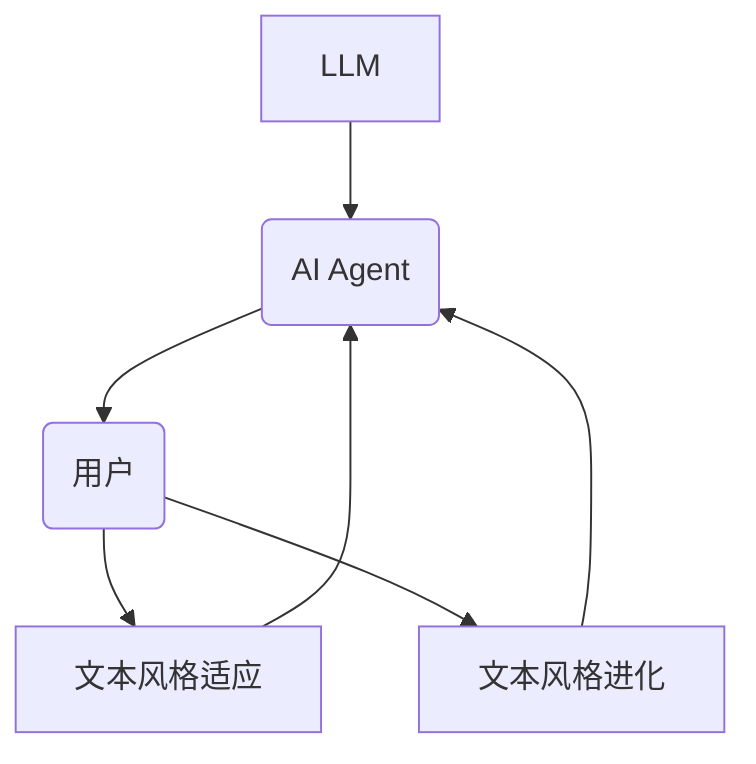
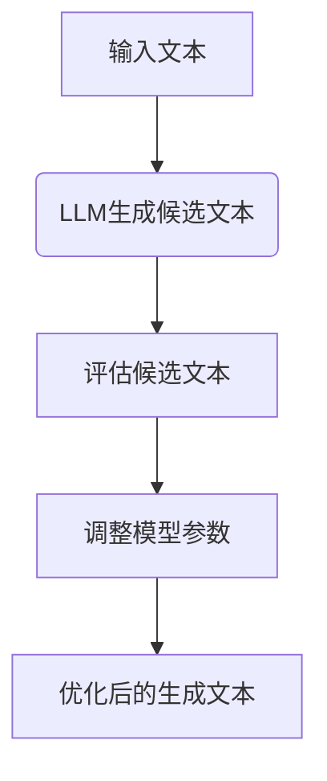
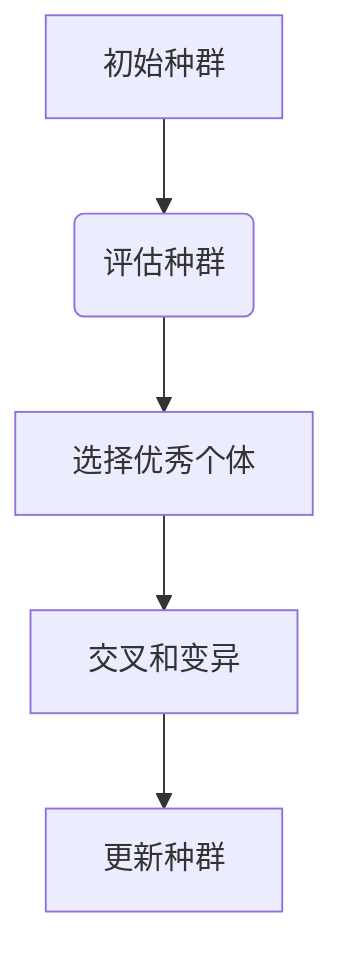
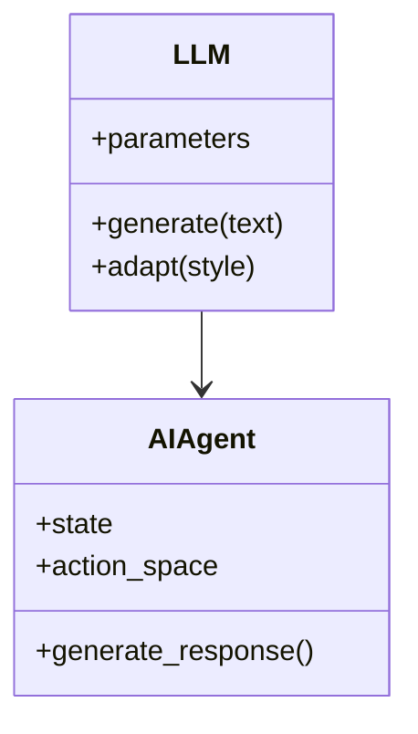
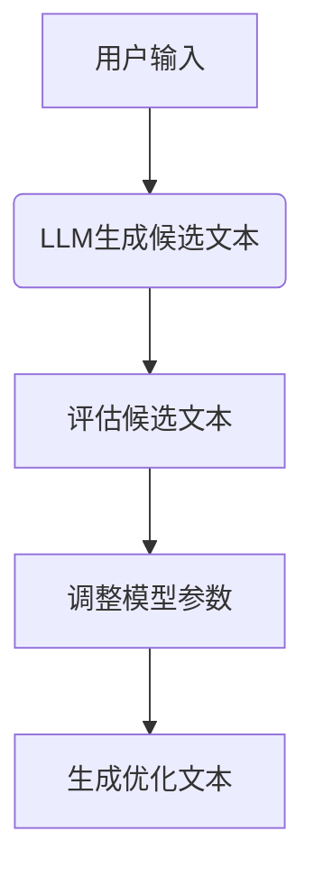
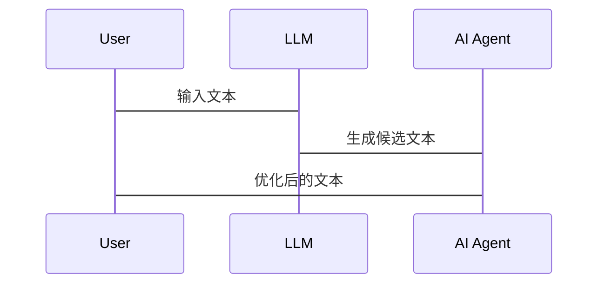

                 


# LLM在AI Agent中的文本风格适应与进化

## 关键词
- 大语言模型（LLM）
- AI Agent
- 文本风格适应
- 文本风格进化
- 适应算法
- 进化策略
- 系统架构

## 摘要
本文探讨了大语言模型（LLM）在AI Agent中的文本风格适应与进化问题。首先，我们介绍了LLM和AI Agent的基本概念，分析了文本风格适应与进化的必要性。接着，我们详细讲解了LLM与AI Agent的核心原理，包括其数学模型和算法流程。然后，我们分析了适应与进化算法的原理，并通过系统架构设计展示了如何将这些算法应用于实际场景中。最后，我们通过项目实战详细介绍了适应与进化算法的实现过程，并总结了最佳实践和未来研究方向。

---

# 第一部分: LLM与AI Agent的核心概念与联系

# 第1章: LLM与AI Agent概述

## 1.1 LLM的基本概念
### 1.1.1 大语言模型的定义
大语言模型（Large Language Model，LLM）是指基于深度学习的自然语言处理模型，能够理解和生成人类语言。LLM的核心是基于Transformer架构，通过自注意力机制捕捉文本中的上下文关系。

### 1.1.2 LLM的核心特点
- **大规模训练数据**：LLM通常使用海量的文本数据进行训练，能够捕捉语言的多样性和复杂性。
- **自注意力机制**：通过自注意力机制，模型可以理解文本中词语之间的关系。
- **生成能力**：LLM可以生成连贯且有意义的文本，适用于多种任务，如对话生成、文本摘要等。

### 1.1.3 LLM与传统NLP模型的区别
与传统NLP模型相比，LLM具有以下优势：
- **上下文理解能力更强**：传统NLP模型通常依赖于固定的特征工程，而LLM通过自注意力机制能够自动捕捉上下文信息。
- **通用性更强**：LLM可以在多种任务上进行微调，而传统NLP模型通常需要针对特定任务进行专门设计。

## 1.2 AI Agent的基本概念
### 1.2.1 AI Agent的定义
AI Agent（人工智能代理）是指一种能够感知环境、自主决策并执行任务的智能系统。AI Agent可以是软件程序，也可以是机器人或其他物理设备。

### 1.2.2 AI Agent的核心功能
- **感知**：通过传感器或其他输入方式感知环境。
- **决策**：基于感知的信息，通过算法做出决策。
- **执行**：根据决策结果执行操作。

### 1.2.3 LLM与AI Agent的关系
LLM作为AI Agent的核心模块，负责理解和生成自然语言文本。AI Agent通过LLM进行人机交互，理解用户需求并生成相应的响应。

## 1.3 文本风格适应与进化的必要性
### 1.3.1 文本风格适应的背景
在实际应用中，AI Agent需要与不同背景和语言习惯的用户进行交互，因此需要能够适应多种文本风格。

### 1.3.2 文本风格进化的意义
随着用户与AI Agent的交互不断深入，AI Agent需要不断优化其生成文本的风格，以更好地满足用户需求。

### 1.3.3 LLM在AI Agent中的适应与进化
LLM通过适应算法和进化策略，不断优化其生成文本的风格，以满足不同场景下的需求。

## 1.4 本章小结
本章介绍了LLM和AI Agent的基本概念，分析了文本风格适应与进化的必要性，并探讨了LLM在AI Agent中的作用。

---

# 第二部分: LLM与AI Agent的核心原理

# 第2章: LLM与AI Agent的核心原理

## 2.1 LLM的原理
### 2.1.1 变压器模型的基本原理
变压器模型由编码器和解码器组成，编码器负责将输入文本转换为向量表示，解码器负责根据编码器的输出生成目标文本。

### 2.1.2 注意力机制的作用
注意力机制通过计算输入文本中每个词的重要性，聚焦于关键信息，从而提高模型的生成能力。

### 2.1.3 梯度下降与训练方法
通过梯度下降算法优化模型参数，使生成文本的损失最小化。

## 2.2 AI Agent的原理
### 2.2.1 代理的感知与决策机制
AI Agent通过感知环境信息，利用算法进行决策，并根据决策结果执行操作。

### 2.2.2 状态空间与动作空间
状态空间表示环境中的所有可能状态，动作空间表示代理可以执行的所有动作。

### 2.2.3 目标函数与奖励机制
目标函数定义代理需要优化的目标，奖励机制通过奖励值指导代理的行为。

## 2.3 LLM与AI Agent的联系
### 2.3.1 LLM作为AI Agent的核心模块
LLM负责理解和生成自然语言文本，是AI Agent与用户交互的核心模块。

### 2.3.2 LLM在代理决策中的作用
LLM通过生成文本帮助代理理解用户需求，并生成相应的响应。

### 2.3.3 LLM与代理交互的双向性
LLM与代理之间是双向交互，代理通过LLM生成文本，LLM通过代理的反馈不断优化生成效果。

## 2.4 核心概念对比表
### 2.4.1 LLM与AI Agent的属性对比
| 属性 | LLM | AI Agent |
|------|------|---------|
| 核心功能 | 生成和理解文本 | 感知、决策和执行 |
| 输入 | 文本数据 | 环境信息 |
| 输出 | 文本生成 | 动作执行 |

### 2.4.2 LLM与AI Agent的优缺点对比
| 特性 | LLM | AI Agent |
|------|------|---------|
| 优点 | 高度通用，能够生成多种文本 | 能够自主决策并执行任务 |
| 缺点 | 生成文本的质量依赖于训练数据 | 决策能力依赖于算法设计 |

### 2.4.3 LLM与AI Agent的适用场景对比
| 场景 | LLM | AI Agent |
|------|------|---------|
| 自然语言生成 | 适用于文本生成任务 | 适用于需要生成文本的交互任务 |
| 人机交互 | 适用于对话系统 | 适用于需要与用户交互的任务 |

## 2.5 ER实体关系图


## 2.6 本章小结
本章详细讲解了LLM和AI Agent的核心原理，并通过对比分析和实体关系图展示了它们之间的联系。

---

# 第三部分: LLM在AI Agent中的适应

## 3.1 适应算法的原理
### 3.1.1 适应算法的定义
适应算法是指通过调整模型参数或生成策略，使模型能够更好地适应不同文本风格。

### 3.1.2 适应算法的流程
1. **输入文本**：用户输入需要适应的文本。
2. **生成候选文本**：模型生成多个候选文本。
3. **评估候选文本**：根据评估指标选择最佳候选文本。
4. **调整模型参数**：根据评估结果调整模型参数。

## 3.2 适应算法的实现
### 3.2.1 候选文本生成
通过LLM生成多个候选文本，每个候选文本对应不同的风格。

### 3.2.2 候选文本评估
使用BLEU、ROUGE等指标评估候选文本的质量。

### 3.2.3 参数调整
根据评估结果，调整LLM的生成参数，优化生成文本的风格。

## 3.3 适应算法的数学模型
$$ \text{Loss} = \lambda_1 \times \text{CE} + \lambda_2 \times \text{KL} $$

其中，CE表示交叉熵损失，KL表示KL散度，$\lambda_1$和$\lambda_2$是权重系数。

## 3.4 适应算法的流程图


## 3.5 适应算法的代码实现
```python
def adapt_algorithm(input_text, num_candidates=5, lambda1=0.8, lambda2=0.2):
    # 生成候选文本
    candidates = []
    for _ in range(num_candidates):
        candidate = generate_text(input_text)
        candidates.append(candidate)
    
    # 评估候选文本
    scores = [evaluate(candidate) for candidate in candidates]
    
    # 调整模型参数
    best_candidate = candidates[scores.index(max(scores))]
    adjust_model(best_candidate, lambda1, lambda2)
    
    return best_candidate
```

## 3.6 适应算法的案例分析
假设用户希望生成更正式的文本，我们可以通过调整$\lambda_1$和$\lambda_2$的权重，优化生成文本的风格。

---

# 第四部分: LLM在AI Agent中的进化

## 4.1 进化策略的定义
进化策略是指通过不断优化模型的生成策略，使生成文本的风格逐步进化，更好地满足用户需求。

## 4.2 进化策略的实现
### 4.2.1 进化算法的步骤
1. **初始种群**：生成多个初始候选文本。
2. **评估种群**：评估每个候选文本的质量。
3. **选择优秀个体**：根据评估结果选择优秀个体。
4. **交叉和变异**：对选择的个体进行交叉和变异，生成新的候选文本。
5. **更新种群**：将新的候选文本加入种群，重复上述步骤。

## 4.3 进化策略的数学模型
$$ \text{Fitness} = \sum_{i=1}^{n} \text{Score}(C_i) $$

其中，$C_i$表示第$i$个候选文本，$\text{Score}(C_i)$表示候选文本的得分。

## 4.4 进化策略的流程图


## 4.5 进化策略的代码实现
```python
def evolutionary_strategy(initial_population, population_size=10, num_generations=5):
    for generation in range(num_generations):
        # 评估种群
        scores = [evaluate(population[i]) for i in range(population_size)]
        
        # 选择优秀个体
        selected = [population[i] for i in range(population_size) if scores[i] > threshold]
        
        # 交叉和变异
        new_population = []
        for _ in range(population_size - len(selected)):
            parent1 = selected[np.random.randint(len(selected))]
            parent2 = selected[np.random.randint(len(selected))]
            child = crossover(parent1, parent2)
            mutate(child)
            new_population.append(child)
        
        # 更新种群
        population = selected + new_population
    
    return population
```

## 4.6 进化策略的案例分析
通过不断优化进化策略，AI Agent可以生成更符合用户需求的文本风格。

---

# 第五部分: 系统分析与架构设计

## 5.1 问题场景介绍
AI Agent需要在不同的场景下生成适应不同文本风格的文本，例如在客服系统中生成正式的回复，在社交媒体上生成轻松的回复。

## 5.2 系统功能设计
### 5.2.1 领域模型


### 5.2.2 系统架构设计


## 5.3 系统接口设计
### 5.3.1 输入接口
用户输入文本和目标风格。

### 5.3.2 输出接口
生成优化后的文本。

## 5.4 系统交互设计


---

# 第六部分: 项目实战

## 6.1 适应实战

### 6.1.1 环境安装
安装必要的库，如Transformers、Numpy等。

### 6.1.2 源代码实现
```python
from transformers import AutoTokenizer, AutoModelForCausalLM
import numpy as np

def adapt_algorithm(input_text, num_candidates=5, lambda1=0.8, lambda2=0.2):
    tokenizer = AutoTokenizer.from_pretrained("gpt2")
    model = AutoModelForCausalLM.from_pretrained("gpt2")
    
    # 生成候选文本
    candidates = []
    for _ in range(num_candidates):
        inputs = tokenizer(input_text, return_tensors="np")
        outputs = model.generate(inputs.input_ids, max_length=100)
        candidate = tokenizer.decode(outputs[0])
        candidates.append(candidate)
    
    # 评估候选文本
    scores = []
    for candidate in candidates:
        score = evaluate(candidate)
        scores.append(score)
    
    # 调整模型参数
    best_candidate = candidates[scores.index(max(scores))]
    adjust_model(best_candidate, lambda1, lambda2)
    
    return best_candidate
```

### 6.1.3 案例分析
通过调整$\lambda_1$和$\lambda_2$的权重，优化生成文本的风格。

## 6.2 进化实战

### 6.2.1 环境安装
安装必要的库，如Numpy、Scipy等。

### 6.2.2 源代码实现
```python
import numpy as np

def evolutionary_strategy(initial_population, population_size=10, num_generations=5):
    for generation in range(num_generations):
        # 评估种群
        scores = [evaluate(population[i]) for i in range(population_size)]
        
        # 选择优秀个体
        selected = [population[i] for i in range(population_size) if scores[i] > threshold]
        
        # 交叉和变异
        new_population = []
        for _ in range(population_size - len(selected)):
            parent1 = selected[np.random.randint(len(selected))]
            parent2 = selected[np.random.randint(len(selected))]
            child = crossover(parent1, parent2)
            mutate(child)
            new_population.append(child)
        
        # 更新种群
        population = selected + new_population
    
    return population
```

### 6.2.3 案例分析
通过不断优化进化策略，生成更符合用户需求的文本风格。

---

# 第七部分: 最佳实践与总结

## 7.1 最佳实践
### 7.1.1 环境配置
确保硬件和软件环境满足要求，例如使用高性能GPU加速模型训练。

### 7.1.2 数据处理
对数据进行清洗和预处理，确保数据质量。

### 7.1.3 模型调优
通过超参数调优，进一步优化模型性能。

## 7.2 小结
本文详细探讨了LLM在AI Agent中的文本风格适应与进化问题，通过理论分析和实战案例，展示了如何通过适应算法和进化策略优化生成文本的风格。

## 7.3 注意事项
- **数据隐私**：在处理用户数据时，需要注意数据隐私和安全。
- **模型鲁棒性**：需要确保模型的鲁棒性，避免生成错误或有害的内容。
- **性能优化**：在实际应用中，需要对模型进行性能优化，提高生成速度。

## 7.4 拓展阅读
- 大语言模型的最新研究进展。
- AI Agent在不同领域的应用案例。

---

# 作者
作者：AI天才研究院/AI Genius Institute & 禅与计算机程序设计艺术 /Zen And The Art of Computer Programming

