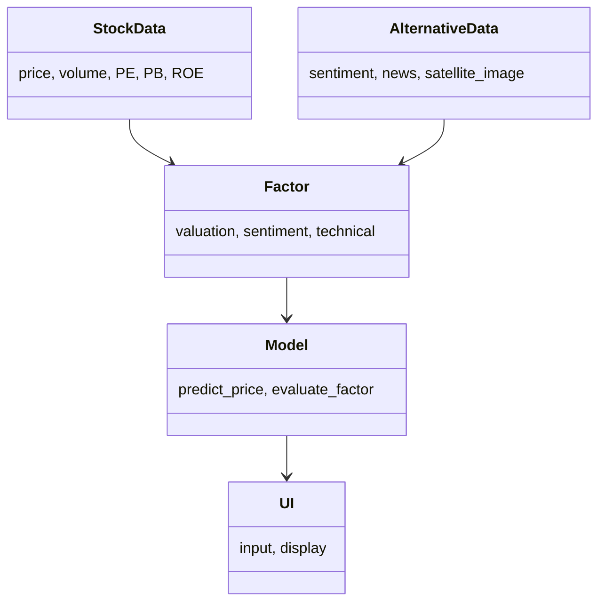
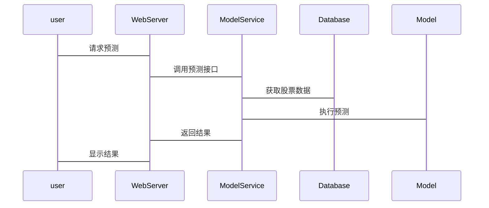

                 


# 如何将特价股票策略与另类数据因子挖掘策略相结合

> 关键词：特价股票策略，另类数据因子，数据挖掘，股票筛选，投资策略

> 摘要：本文深入探讨了如何将特价股票策略与另类数据因子挖掘策略相结合，通过系统化的分析和实战案例，展示了如何利用另类数据优化股票筛选和预测，从而提升投资决策的科学性和精准性。

---

## 第1章：特价股票策略与另类数据因子挖掘的背景介绍

### 1.1 特价股票策略的背景

#### 1.1.1 特价股票的定义与特点
特价股票通常指市场价格显著低于其内在价值的股票。这类股票往往被市场忽视或低估，具有较大的增值潜力。其特点包括低估值、高分红率、稳定的财务状况等。

#### 1.1.2 特价股票策略的核心要素
- **低估值**：市盈率、市净率等估值指标低于行业平均水平。
- **财务健康**：盈利能力强，资产负债率低。
- **行业地位**：龙头企业或具有竞争优势的公司。

#### 1.1.3 特价股票策略的市场应用
投资者通过寻找特价股票，利用市场低估的机会，实现超额收益。然而，传统的基于财务指标的筛选方法存在局限性，如信息滞后、数据单一等问题。

### 1.2 另类数据因子挖掘的背景

#### 1.2.1 另类数据的定义与特点
另类数据指传统金融数据之外的非结构化数据，如社交媒体情绪、新闻标题、卫星图像等。这类数据具有实时性、丰富性和多样性等特点。

#### 1.2.2 另类数据在金融领域的应用
- **情绪分析**：通过社交媒体和新闻数据，分析市场情绪对股价的影响。
- **市场预测**：利用卫星图像分析零售业的销售情况，预测公司业绩。
- **风险预警**：通过网络数据发现潜在风险，提前规避。

#### 1.2.3 另类数据因子挖掘的优势
- **数据丰富性**：提供更多维度的信息，帮助发现潜在的投资机会。
- **实时性**：数据更新速度快，捕捉市场变化更及时。
- **差异化竞争**：通过另类数据获得独特见解，提升投资策略的差异化。

---

## 第2章：特价股票策略与另类数据因子挖掘的核心概念

### 2.1 特价股票策略的核心概念

#### 2.1.1 特价股票的筛选标准
- **估值指标**：市盈率（PE）、市净率（PB）等。
- **财务指标**：ROE（净资产收益率）、净利润增长率等。
- **行业地位**：市场份额、行业排名等。

#### 2.1.2 特价股票策略的实施步骤
1. **数据收集**：获取股票的历史价格、财务报表等数据。
2. **筛选候选股**：根据估值指标筛选出潜在的特价股票。
3. **深入分析**：结合行业趋势、公司基本面等进一步筛选。
4. **投资决策**：根据分析结果制定投资策略。

#### 2.1.3 特价股票策略的优缺点
- **优点**：收益潜力大，风险相对可控。
- **缺点**：筛选标准主观性强，数据滞后性问题。

### 2.2 另类数据因子挖掘的核心概念

#### 2.2.1 另类数据的分类与来源
- **社交媒体数据**：Twitter、Reddit等平台的情绪分析。
- **新闻数据**：新闻标题的情感倾向。
- **卫星图像数据**：零售店停车场车辆数量，反映销售情况。
- **专利数据**：公司技术创新能力的体现。

#### 2.2.2 另类数据因子的定义与特征
- **定义**：从另类数据中提取的能够影响股票价格的因子。
- **特征**：实时性强、非线性关系、数据丰富性。

#### 2.2.3 另类数据因子挖掘的流程
1. **数据采集**：从API或爬虫获取另类数据。
2. **数据清洗**：去除噪声，标准化数据。
3. **特征提取**：通过NLP等技术提取有效特征。
4. **因子构建**：将特征组合成因子。
5. **因子评估**：评估因子对股价的影响。

---

## 第3章：特价股票策略与另类数据因子挖掘的结合原理

### 3.1 特价股票策略与另类数据的关联性

#### 3.1.1 特价股票与另类数据的内在联系
- 另类数据提供了公司基本面之外的信息，帮助更全面地评估股票价值。
- 例如，社交媒体情绪可以预测市场对公司的看法，影响股价走势。

#### 3.1.2 另类数据如何影响特价股票的评估
- 通过另类数据发现市场未反映的信息，优化股票筛选标准。
- 结合另类数据因子，增强选股模型的预测能力。

### 3.2 另类数据在特价股票策略中的应用

#### 3.2.1 利用另类数据优化股票筛选
- 将另类数据因子与传统估值指标结合，筛选出更具潜力的股票。
- 例如，利用社交媒体情绪因子，筛选出市场情绪正面但估值低的股票。

#### 3.2.2 另类数据因子对股价预测的影响
- 另类数据因子可以捕捉市场情绪变化，帮助预测股价短期波动。
- 结合长期基本面分析，提升选股模型的准确性。

#### 3.2.3 另类数据在风险控制中的作用
- 通过另类数据发现潜在风险，如负面新闻、社交媒体上的负面情绪，提前规避风险。

---

## 第4章：特价股票策略与另类数据因子挖掘的算法原理

### 4.1 数据预处理与特征提取

#### 4.1.1 数据清洗与标准化
- 清洗缺失值、异常值，标准化处理数据。
- 示例：使用Python的pandas库进行数据清洗。

```python
import pandas as pd

# 假设data是原始数据
data = pd.read_csv('data.csv')
data.dropna(inplace=True)  # 删除缺失值
data = data[(data['PE'] < 30) & (data['Price'] > 10)]  # 过滤数据
```

#### 4.1.2 特征选择与降维
- 使用主成分分析（PCA）进行降维。
- 示例：使用scikit-learn库进行PCA处理。

```python
from sklearn.decomposition import PCA

 pca = PCA(n_components=5)
 pca_features = pca.fit_transform(data_features)
```

### 4.2 模型选择与训练

#### 4.2.1 机器学习模型的选择
- 线性回归、随机森林、支持向量机（SVM）等。
- 示例：使用随机森林进行分类。

```python
from sklearn.ensemble import RandomForestClassifier

 model = RandomForestClassifier(n_estimators=100, random_state=42)
 model.fit(X_train, y_train)
```

#### 4.2.2 模型训练与优化
- 使用交叉验证优化模型参数。
- 示例：网格搜索优化随机森林参数。

```python
from sklearn.model_selection import GridSearchCV

 params = {'n_estimators': [100, 200], 'max_depth': [None, 10]}
 grid_search = GridSearchCV(RandomForestClassifier(), params, cv=5)
 grid_search.fit(X_train, y_train)
 best_model = grid_search.best_estimator_
```

### 4.3 模型评估与部署

#### 4.3.1 模型性能评估
- 使用准确率、召回率、F1分数等指标评估模型性能。
- 示例：计算随机森林模型的F1分数。

```python
from sklearn.metrics import f1_score

 y_pred = best_model.predict(X_test)
 f1 = f1_score(y_test, y_pred)
 print(f"模型F1分数：{f1}")
```

#### 4.3.2 模型的实时部署与监控
- 使用Flask构建API接口，实时接收数据并返回预测结果。
- 示例：简单的Flask API。

```python
from flask import Flask, request, jsonify

 app = Flask(__name__)

 @app.route('/predict', methods=['POST'])
 def predict():
     data = request.json
     prediction = best_model.predict([[data['feature1'], data['feature2']]])
     return jsonify({'result': int(prediction[0])})

 if __name__ == '__main__':
     app.run(debug=True)
```

---

## 第5章：系统架构与设计方案

### 5.1 问题场景介绍

#### 5.1.1 系统目标
构建一个结合特价股票筛选和另类数据因子挖掘的系统，帮助投资者发现潜在投资机会。

#### 5.1.2 项目范围
- 数据采集与处理
- 模型训练与部署
- 用户界面设计

### 5.2 项目介绍

#### 5.2.1 项目背景
随着大数据技术的发展，另类数据在投资中的应用越来越广泛，如何有效结合特价股票策略与另类数据因子，成为投资者关注的焦点。

#### 5.2.2 项目目标
开发一个基于另类数据的特价股票筛选系统，提供实时数据监控和预测功能。

### 5.3 系统功能设计

#### 5.3.1 领域模型（Mermaid 类图）


### 5.4 系统架构设计

#### 5.4.1 系统架构图（Mermaid 架构图）
```mermaid
  browser --HTTP--> WebServer
  WebServer --API--> ModelService
  ModelService --DB--> Database
```

### 5.5 接口设计

#### 5.5.1 接口设计
- 数据接口：从数据库获取股票数据和另类数据。
- 模型接口：接收用户输入的股票信息，返回预测结果。
- 用户界面：展示预测结果和筛选条件。

#### 5.5.2 接口交互流程（Mermaid 序列图）


### 5.6 交互设计

#### 5.6.1 用户界面设计
- 输入股票代码或名称。
- 显示预测结果和相关数据可视化。

#### 5.6.2 数据可视化
- 使用Matplotlib或Plotly进行数据可视化，展示股价走势、预测结果等。

---

## 第6章：项目实战

### 6.1 环境安装与配置

#### 6.1.1 安装Python环境
- 安装Python 3.8以上版本。
- 安装必要的库：pandas、numpy、scikit-learn、Flask等。

#### 6.1.2 数据源配置
- 数据来源：Yahoo Finance API、Twitter API等。

### 6.2 核心实现

#### 6.2.1 数据预处理
```python
import pandas as pd
import requests

 # 获取股票数据
 def get_stock_data(ticker):
     url = f"https://query1.finance.yahoo.com/v8/finance/chart/{ticker}"
     response = requests.get(url)
     data = response.json()
     df = pd.DataFrame(data['chart']['result'][0]['prices'])
     df.columns = ['Open', 'High', 'Low', 'Close', 'Volume']
     return df
```

#### 6.2.2 模型训练
```python
from sklearn.ensemble import RandomForestRegressor
from sklearn.metrics import mean_squared_error

 # 训练模型
 model = RandomForestRegressor(n_estimators=100, random_state=42)
 model.fit(X_train, y_train)
```

#### 6.2.3 模型部署
```python
from flask import Flask, request, jsonify

 app = Flask(__name__)

 @app.route('/predict', methods=['POST'])
 def predict():
     data = request.json
     prediction = model.predict([[data['feature1'], data['feature2']])
     return jsonify({'prediction': int(prediction[0])})

 if __name__ == '__main__':
     app.run(debug=True)
```

### 6.3 实际案例分析

#### 6.3.1 案例背景
假设我们关注一只零售业股票，利用社交媒体情绪因子和传统估值指标进行预测。

#### 6.3.2 数据分析与结果
- 社交媒体情绪因子显示市场情绪积极。
- 传统估值指标显示市盈率低于行业平均水平。
- 综合预测显示未来股价有上涨潜力。

#### 6.3.3 结果解读
通过结合另类数据因子和传统估值指标，模型预测该股票具有较高的投资价值。

### 6.4 项目小结

#### 6.4.1 项目总结
通过实战项目，验证了将特价股票策略与另类数据因子挖掘相结合的有效性。

#### 6.4.2 经验分享
- 数据预处理和特征工程是关键。
- 模型选择和调优至关重要。
- 系统设计要注重可扩展性和可维护性。

---

## 第7章：最佳实践与注意事项

### 7.1 最佳实践

#### 7.1.1 数据质量的重要性
确保数据来源可靠，数据清洗彻底。

#### 7.1.2 模型调优的必要性
通过交叉验证和网格搜索优化模型参数。

#### 7.1.3 系统设计的规范性
遵循模块化设计，确保系统的可扩展性和可维护性。

### 7.2 小结

#### 7.2.1 核心观点总结
- 另类数据为特价股票策略提供了新的视角。
- 结合两者可以提升选股模型的准确性和科学性。

### 7.3 注意事项

#### 7.3.1 数据隐私与合规性
确保数据收集和使用符合相关法律法规。

#### 7.3.2 模型解释性
尽量选择解释性较强的模型，便于分析和优化。

#### 7.3.3 风险控制
定期监控模型表现，及时调整和优化。

### 7.4 未来的研究方向

#### 7.4.1 更多另类数据的挖掘
探索更多类型的另类数据，如语音数据、视频数据等。

#### 7.4.2 深度学习的应用
尝试使用深度学习模型，提升模型的预测能力。

#### 7.4.3 多因子模型的优化
结合更多因子，构建更复杂的多因子选股模型。

---

## 作者：AI天才研究院 & 禅与计算机程序设计艺术

---

通过以上目录结构和内容安排，我们可以看到，文章从背景介绍到系统设计，再到项目实战，全面详细地探讨了如何将特价股票策略与另类数据因子挖掘策略相结合。通过具体的代码示例和系统架构设计，帮助读者理解并掌握这一结合的实现方法。

