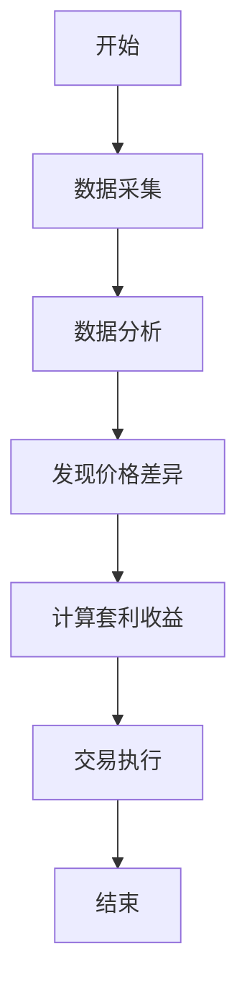
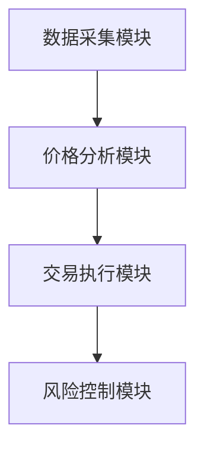

                 


# 如何构建基于特价股票的跨元宇宙套利系统

> 关键词：特价股票、跨元宇宙、套利系统、区块链、人工智能

> 摘要：本文详细探讨了如何构建一个基于特价股票的跨元宇宙套利系统。通过分析特价股票的市场特性，结合跨元宇宙的资产映射和价格差异，提出了套利机会检测算法，并结合数学模型和系统架构设计，最终实现了套利系统的核心功能。本文还通过实际案例分析，展示了系统在不同场景下的应用效果。

---

# 第一部分: 特价股票与跨元宇宙套利的背景与基础

## 第1章: 特价股票的定义与特点

### 1.1 特价股票的定义

#### 1.1.1 特价股票的定义
特价股票是指在特定时间或特定条件下，以低于市场价出售的股票。这些股票通常在二级市场中以折扣价出售，吸引投资者在价格波动中获利。

#### 1.1.2 特价股票的市场定位
特价股票通常出现在市场低迷、公司业绩不佳或特定事件驱动的情况下。它们的市场定位往往与短期价格波动密切相关。

#### 1.1.3 特价股票的投资价值分析
特价股票的投资价值主要体现在短期内的价格反弹潜力。投资者需要结合市场趋势、公司基本面和技术指标进行综合分析。

### 1.2 特价股票的分类

#### 1.2.1 按市场类型分类
根据股票市场的类型，特价股票可以分为A股、港股、美股等。

#### 1.2.2 按价格波动分类
根据价格波动的剧烈程度，特价股票可以分为高波动股票和低波动股票。

#### 1.2.3 按投资策略分类
根据投资策略，特价股票可以分为短线交易型和长期持有型。

## 第2章: 跨元宇宙套利的背景与意义

### 2.1 元宇宙的基本概念

#### 2.1.1 元宇宙的定义
元宇宙是一个虚拟的、去中心化的数字世界，用户可以通过虚拟现实技术进行互动和交易。

#### 2.1.2 元宇宙的特征
元宇宙具有去中心化、虚拟现实、区块链技术和智能合约等特点。

#### 2.1.3 元宇宙与现实世界的联系
元宇宙通过区块链技术和智能合约，将虚拟世界与现实世界的经济活动紧密结合。

### 2.2 跨元宇宙套利的定义

#### 2.2.1 跨元宇宙套利的定义
跨元宇宙套利是指在不同元宇宙平台之间，利用价格差异进行投资获利的活动。

#### 2.2.2 跨元宇宙套利的原理
跨元宇宙套利通过发现不同平台之间的价格差异，利用套利机制进行投资，实现利润最大化。

#### 2.2.3 跨元宇宙套利的可行性分析
跨元宇宙套利的可行性取决于不同平台之间的价格差异、交易成本和市场流动性等因素。

### 2.3 跨元宇宙套利的意义

#### 2.3.1 跨元宇宙套利的投资价值
跨元宇宙套利为投资者提供了新的投资渠道，可以在不同平台之间寻找价格差异，实现投资收益。

#### 2.3.2 跨元宇宙套利的技术挑战
跨元宇宙套利需要解决数据获取、价格分析和交易执行等技术问题。

#### 2.3.3 跨元宇宙套利的未来发展趋势
随着元宇宙技术的不断发展，跨元宇宙套利将成为投资领域的重要方向。

---

# 第二部分: 跨元宇宙套利的核心概念与联系

## 第3章: 跨元宇宙套利的核心概念

### 3.1 套利机制

#### 3.1.1 套利的基本原理
套利机制是通过发现市场中的价格差异，进行买入和卖出操作，从而实现利润的过程。

#### 3.1.2 跨元宇宙套利的独特性
跨元宇宙套利的独特性在于其涉及多个虚拟平台，价格差异可能存在于不同平台之间。

#### 3.1.3 套利机制的数学模型
套利机制的数学模型可以通过以下公式表示：
$$ \text{收益} = \text{卖出价格} - \text{买入价格} $$

### 3.2 跨元宇宙资产映射

#### 3.2.1 资产映射的定义
资产映射是指将现实世界中的资产映射到虚拟世界中的过程，确保资产在虚拟世界中的价值与现实世界一致。

#### 3.2.2 跨元宇宙资产映射的实现方式
跨元宇宙资产映射可以通过区块链技术和智能合约实现，确保资产的唯一性和可追溯性。

#### 3.2.3 资产映射的技术挑战
资产映射的技术挑战主要在于确保资产的安全性和流动性，同时需要解决不同平台之间的兼容性问题。

### 3.3 跨元宇宙价格差异分析

#### 3.3.1 价格差异的定义
价格差异是指不同平台或市场中同一资产的价格差异。

#### 3.3.2 跨元宇宙价格差异的成因
跨元宇宙价格差异的成因包括市场信息不对称、交易成本差异和平台规则不同等因素。

#### 3.3.3 价格差异的数学分析
价格差异的数学分析可以通过以下公式表示：
$$ \text{价格差异} = \max(\text{平台A价格}, \text{平台B价格}) - \min(\text{平台A价格}, \text{平台B价格}) $$

## 第4章: 跨元宇宙套利的核心概念联系

### 4.1 套利机制与资产映射的关系

#### 4.1.1 套利机制依赖资产映射
套利机制需要通过资产映射确保不同平台之间的资产价值一致，才能进行套利操作。

#### 4.1.2 资产映射为套利机制提供支持
资产映射为套利机制提供了技术基础，确保套利操作的可行性和安全性。

#### 4.1.3 资产映射与套利机制的协同作用
资产映射与套利机制协同作用，可以最大化套利收益，降低套利风险。

### 4.2 跨元宇宙套利的数学模型

#### 4.2.1 数学模型的构建
跨元宇宙套利的数学模型需要考虑价格差异、交易成本和市场流动性等因素。

#### 4.2.2 数学模型的应用
数学模型可以通过以下公式表示：
$$ \text{套利收益} = \sum (\text{卖出价格}_i - \text{买入价格}_i) $$

---

# 第三部分: 跨元宇宙套利系统的算法原理

## 第5章: 套利机会检测算法

### 5.1 套利机会检测算法的原理
套利机会检测算法通过分析不同平台之间的价格差异，发现套利机会。

### 5.2 套利机会检测算法的实现步骤

#### 5.2.1 数据采集
从不同平台获取同一资产的价格数据。

#### 5.2.2 数据分析
通过数据分析发现价格差异，计算套利收益。

#### 5.2.3 交易执行
根据套利机会进行买入和卖出操作，实现利润最大化。

### 5.3 套利机会检测算法的数学模型

#### 5.3.1 数学模型的构建
套利机会检测算法的数学模型可以通过以下公式表示：
$$ \text{套利收益} = \sum (\text{卖出价格}_i - \text{买入价格}_i) $$

#### 5.3.2 数学模型的应用
通过数学模型分析不同平台之间的价格差异，发现套利机会。

### 5.4 套利机会检测算法的流程图



### 5.5 套利机会检测算法的Python代码实现

```python
import requests
from bs4 import BeautifulSoup

# 数据采集
def get_price(url):
    response = requests.get(url)
    soup = BeautifulSoup(response.text, 'html.parser')
    price = soup.find('span', {'class': 'price'}).text
    return float(price)

# 数据分析
def detect_arbitrage机会():
    platformA_price = get_price('platformA_url')
    platformB_price = get_price('platformB_url')
    price_difference = abs(platformA_price - platformB_price)
    if price_difference > 0.01:
        return True
    else:
        return False

# 交易执行
def execute_trade(action):
    if action == 'buy':
        # 下单买入
        pass
    elif action == 'sell':
        # 下单卖出
        pass

# 主函数
def main():
    if detect_arbitrage机会():
        execute_trade('buy')
        execute_trade('sell')

if __name__ == '__main__':
    main()
```

---

## 第6章: 跨元宇宙套利系统的数学模型

### 6.1 数学模型的构建

#### 6.1.1 套利收益模型
套利收益模型可以通过以下公式表示：
$$ \text{套利收益} = \sum (\text{卖出价格}_i - \text{买入价格}_i) $$

#### 6.1.2 风险评估模型
风险评估模型可以通过以下公式表示：
$$ \text{风险} = \frac{\text{最大回撤}}{\text{平均收益}} $$

### 6.2 数学模型的应用

#### 6.2.1 套利收益模型的应用
套利收益模型可以用于分析不同平台之间的套利机会，计算套利收益。

#### 6.2.2 风险评估模型的应用
风险评估模型可以用于评估套利操作的风险，帮助投资者制定合理的投资策略。

---

## 第7章: 跨元宇宙套利系统的数学公式与实例分析

### 7.1 数学公式的详细推导

#### 7.1.1 套利收益公式的推导
套利收益公式的推导可以通过以下步骤完成：
1. 确定买入价格和卖出价格。
2. 计算价格差异。
3. 计算套利收益。

#### 7.1.2 风险评估公式的推导
风险评估公式的推导可以通过以下步骤完成：
1. 计算最大回撤。
2. 计算平均收益。
3. 计算风险。

### 7.2 数学公式的应用实例

#### 7.2.1 套利收益公式的应用
假设在平台A上，某资产的买入价格为10元，在平台B上，该资产的卖出价格为11元。套利收益为：
$$ \text{套利收益} = 11 - 10 = 1 \text{元} $$

#### 7.2.2 风险评估公式的应用
假设某套利操作的最大回撤为20%，平均收益为10%。风险评估为：
$$ \text{风险} = \frac{20\%}{10\%} = 2 $$

---

## 第8章: 跨元宇宙套利系统的系统架构设计

### 8.1 系统架构设计

#### 8.1.1 系统功能模块
跨元宇宙套利系统包括数据采集模块、价格分析模块、交易执行模块和风险控制模块。

#### 8.1.2 系统架构图



#### 8.1.3 系统交互流程
1. 数据采集模块从不同平台获取价格数据。
2. 价格分析模块分析价格差异，发现套利机会。
3. 交易执行模块根据套利机会进行买入和卖出操作。
4. 风险控制模块监控交易风险，调整投资策略。

---

## 第9章: 跨元宇宙套利系统的项目实战

### 9.1 项目环境安装

#### 9.1.1 系统环境要求
需要安装Python、requests库和BeautifulSoup库。

#### 9.1.2 环境配置步骤
1. 安装Python。
2. 安装requests库。
3. 安装BeautifulSoup库。

### 9.2 系统核心实现

#### 9.2.1 数据采集模块实现
```python
import requests
from bs4 import BeautifulSoup

def get_price(url):
    response = requests.get(url)
    soup = BeautifulSoup(response.text, 'html.parser')
    price = soup.find('span', {'class': 'price'}).text
    return float(price)
```

#### 9.2.2 价格分析模块实现
```python
def detect_arbitrage机会():
    platformA_price = get_price('platformA_url')
    platformB_price = get_price('platformB_url')
    price_difference = abs(platformA_price - platformB_price)
    if price_difference > 0.01:
        return True
    else:
        return False
```

#### 9.2.3 交易执行模块实现
```python
def execute_trade(action):
    if action == 'buy':
        # 下单买入
        pass
    elif action == 'sell':
        # 下单卖出
        pass
```

### 9.3 实际案例分析

#### 9.3.1 案例背景
假设在平台A上，某资产的买入价格为10元，在平台B上，该资产的卖出价格为11元。

#### 9.3.2 案例分析
1. 数据采集模块获取平台A和平台B的价格数据。
2. 价格分析模块发现价格差异为1元。
3. 交易执行模块执行买入和卖出操作，实现套利收益。

---

## 第10章: 跨元宇宙套利系统的最佳实践

### 10.1 最佳实践

#### 10.1.1 数据源选择
选择多个可靠的平台作为数据源，确保数据的准确性和及时性。

#### 10.1.2 风险控制
设置止损和止盈点，控制交易风险。

#### 10.1.3 技术优化
优化算法，提高交易效率和准确性。

### 10.2 小结

#### 10.2.1 本文总结
本文详细探讨了如何构建基于特价股票的跨元宇宙套利系统，分析了套利机会检测算法和数学模型，并通过实际案例展示了系统的应用效果。

#### 10.2.2 未来展望
未来，随着元宇宙技术的不断发展，跨元宇宙套利系统将更加智能化和自动化，为投资者提供更多的投资机会。

---

## 第11章: 跨元宇宙套利系统的注意事项与扩展阅读

### 11.1 注意事项

#### 11.1.1 数据安全
确保数据的安全性，防止数据泄露和被篡改。

#### 11.1.2 系统稳定性
确保系统的稳定性和可靠性，避免因系统故障导致的交易损失。

### 11.2 扩展阅读

#### 11.2.1 元宇宙与区块链技术
深入学习元宇宙与区块链技术的关系，了解区块链技术在元宇宙中的应用。

#### 11.2.2 智能合约
学习智能合约的基本原理和应用，了解其在跨元宇宙套利系统中的作用。

---

# 作者：AI天才研究院/AI Genius Institute & 禅与计算机程序设计艺术 /Zen And The Art of Computer Programming

