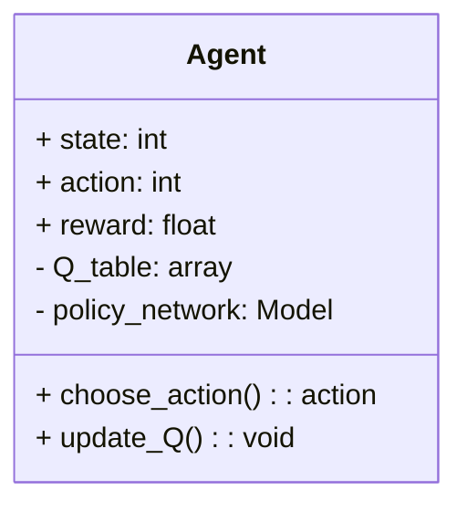
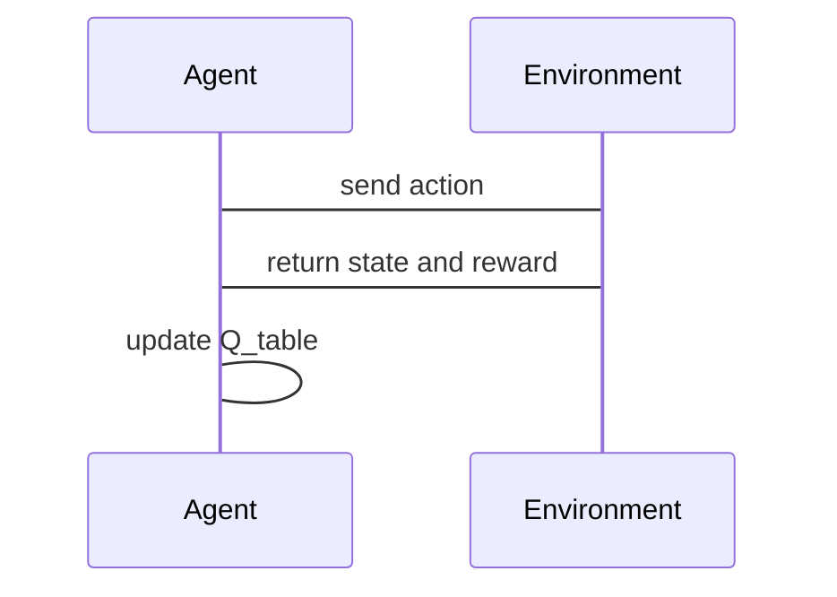

                 


# 强化学习在AI Agent交互策略优化中的运用

## 关键词：强化学习、AI Agent、策略优化、马尔可夫决策过程、Q-learning、策略梯度

## 摘要：本文深入探讨强化学习在AI Agent交互策略优化中的应用，从基本概念到核心算法，再到系统架构和项目实战，全面分析强化学习如何帮助AI Agent实现高效的交互策略优化。通过具体案例和代码实现，详细解读强化学习的数学模型和算法原理，为AI Agent的设计和优化提供理论和实践指导。

---

## 第一部分: 强化学习与AI Agent交互策略优化概述

---

### 第1章: 强化学习与AI Agent概述

#### 1.1 强化学习的基本概念

##### 1.1.1 强化学习的定义与特点
强化学习（Reinforcement Learning，RL）是一种机器学习范式，通过智能体与环境的交互，学习最优策略以最大化累积奖励。其特点包括：
- **试错性**：通过不断尝试动作，逐步逼近最优解。
- **延迟反馈**：奖励信号通常延迟出现，强化学习需具备长期记忆能力。
- **策略性**：目标是找到最优策略，而非直接预测结果。

##### 1.1.2 AI Agent的基本概念与分类
AI Agent（智能体）是指能够感知环境并采取行动以实现目标的实体。根据智能体的智能水平，可分为：
- **反应式智能体**：基于当前感知做出反应，不依赖历史信息。
- **认知式智能体**：具备复杂推理和规划能力，能够处理抽象任务。

##### 1.1.3 强化学习在AI Agent中的作用
强化学习为AI Agent提供了从环境中学习策略的能力，使其能够在动态和不确定的环境中自适应调整行为，实现目标优化。

#### 1.2 强化学习的核心概念

##### 1.2.1 状态、动作与奖励的定义
- **状态（State）**：环境在某一时刻的观测。
- **动作（Action）**：智能体基于当前状态做出的决策。
- **奖励（Reward）**：环境对智能体动作的反馈，用于指导策略优化。

##### 1.2.2 马尔可夫决策过程（MDP）的数学模型
马尔可夫决策过程是强化学习的核心模型，定义如下：
- **状态空间（S）**：所有可能的状态集合。
- **动作空间（A）**：所有可能的动作集合。
- **转移概率（P(s' | s, a)）**：从状态s执行动作a后转移到状态s'的概率。
- **奖励函数（R(s, a, s')）**：在状态s执行动作a后转移到状态s'时获得的奖励。

##### 1.2.3 价值函数与策略评估
- **价值函数（V(s)）**：在状态s下，遵循当前策略所能获得的期望累积奖励。
- **策略（π）**：从状态到动作的概率分布，最大化累积奖励。

#### 1.3 AI Agent交互策略优化的背景与应用

##### 1.3.1 AI Agent在智能交互中的应用领域
- **游戏AI**：在电子游戏中训练智能体进行策略决策。
- **推荐系统**：根据用户行为优化推荐策略。
- **机器人控制**：实现复杂环境中的自主决策。

##### 1.3.2 强化学习在策略优化中的优势
- **自适应性**：无需大量标注数据，通过交互学习最优策略。
- **实时性**：能够在动态环境中实时调整策略。

##### 1.3.3 当前研究的挑战与未来方向
- **计算资源需求**：强化学习需要大量计算资源。
- **算法复杂性**：复杂环境下的策略优化难度较大。
- **未来方向**：结合深度学习与强化学习，提升算法效率和泛化能力。

#### 1.4 本章小结
本章介绍了强化学习和AI Agent的基本概念，分析了强化学习在策略优化中的核心作用，并探讨了当前的研究挑战和未来发展方向。

---

## 第二部分: 强化学习的核心原理与算法

---

### 第2章: 强化学习的核心原理与算法

#### 2.1 强化学习的基本原理

##### 2.1.1 状态转移与奖励机制
通过定义状态、动作和奖励，构建强化学习的基本框架。

##### 2.1.2 动作选择与策略优化
基于当前策略选择动作，并通过奖励信号优化策略。

##### 2.1.3 价值函数与策略评估
通过价值函数评估策略的优劣，指导策略优化。

#### 2.2 策略评估与策略优化算法

##### 2.2.1 Q-learning算法的原理与实现
- **Q-learning算法**：通过Q表学习状态-动作对的最优值。
- **算法步骤**：
  1. 初始化Q表为零。
  2. 在每个时间步选择动作，更新Q表。
  3. 重复直到收敛。

##### 2.2.2 策略梯度方法的数学推导
- **策略梯度**：通过优化策略的参数，直接最大化累积奖励。
- **数学公式**：
  $$ J(\theta) = \mathbb{E}[R] $$
  其中，θ是策略参数，R是累积奖励。
  使用梯度上升法优化θ。

##### 2.2.3 深度强化学习的实现
- **深度Q网络（DQN）**：使用神经网络近似Q函数。
- **策略网络**：直接输出动作概率，优化策略。

#### 2.3 算法实现与代码示例

##### 2.3.1 Q-learning算法的Python实现
```python
import numpy as np

class QLearning:
    def __init__(self, state_space, action_space, alpha=0.1, gamma=0.99):
        self.Q = np.zeros((state_space, action_space))
        self.alpha = alpha
        self.gamma = gamma

    def choose_action(self, state, epsilon=0.1):
        if np.random.random() < epsilon:
            return np.random.randint(0, action_space)
        return np.argmax(self.Q[state])

    def update(self, state, action, reward, next_state):
        self.Q[state, action] += self.alpha * (reward + self.gamma * np.max(self.Q[next_state]) - self.Q[state, action])
```

##### 2.3.2 策略梯度方法的Python实现
```python
import torch
import torch.nn as nn

class PolicyGradient:
    def __init__(self, state_space, action_space, hidden_size=32, lr=0.01):
        self.policy = nn.Sequential(
            nn.Linear(state_space, hidden_size),
            nn.ReLU(),
            nn.Linear(hidden_size, action_space)
        )
        self.optimizer = torch.optim.Adam(self.policy.parameters(), lr=lr)

    def choose_action(self, state):
        state = torch.FloatTensor(state)
        logits = self.policy(state)
        action_probs = torch.softmax(logits, dim=-1)
        action = torch.multinomial(action_probs, 1).item()
        return action

    def update(self, rewards, states, actions):
        states = torch.FloatTensor(np.array(states))
        actions = torch.LongTensor(np.array(actions))
        optimizer.zero_grad()
        logits = self.policy(states)
        loss = torch.nn.NLLLoss()(torch.log_softmax(logits, dim=-1), actions)
        loss.backward()
        self.optimizer.step()
```

#### 2.4 算法优化与实际应用

##### 2.4.1 算法优化策略
- **经验回放**：减少策略偏差，提高样本利用率。
- **目标网络**：稳定Q函数更新，防止过拟合。

##### 2.4.2 实际应用案例
- **游戏AI**：训练智能体在复杂游戏环境中做出最优决策。
- **机器人控制**：实现动态环境下的自主导航和决策。

#### 2.5 本章小结
本章详细讲解了强化学习的核心原理与算法实现，通过Q-learning和策略梯度方法的代码示例，展示了强化学习在策略优化中的具体应用。

---

## 第三部分: 系统分析与架构设计

---

### 第3章: 系统分析与架构设计

#### 3.1 系统功能设计

##### 3.1.1 领域模型设计
- **领域模型**：通过Mermaid类图展示系统的功能模块。


##### 3.1.2 系统架构设计
- **系统架构**：通过Mermaid架构图展示系统的整体结构。
```mermaid
container AI-Agent {
    Agent
    Environment
    Reward_System
    Q-Learning_Algorithm
}

Environment --> Agent: provide state
Agent --> Environment: execute action
Reward_System --> Agent: return reward
Q-Learning_Algorithm --> Agent: update Q_table
```

##### 3.1.3 接口设计与交互流程
- **接口设计**：定义智能体与环境之间的交互接口。
- **交互流程**：通过Mermaid序列图展示交互过程。


#### 3.2 项目实战与代码实现

##### 3.2.1 环境安装与配置
- **Python环境**：安装必要的库，如numpy、torch。
- **虚拟环境**：建议使用虚拟环境管理依赖。

##### 3.2.2 核心实现代码
- **Q-Learning实现**：实现一个简单的强化学习算法，用于训练智能体在迷宫环境中找到最优路径。
```python
import numpy as np

class MazeEnvironment:
    def __init__(self, size=4):
        self.size = size
        self.state_space = size * size
        self.action_space = 4
        self.current_state = 0

    def get_state(self):
        return self.current_state

    def step(self, action):
        # 简单的迷宫环境模拟
        # action: 0: 上，1: 下，2: 左，3: 右
        # 假设迷宫是一个简单的网格，state表示当前位置
        next_state = self.current_state + action
        if next_state >= self.state_space or next_state < 0:
            reward = -1
            done = True
        else:
            reward = 1 if next_state == self.state_space - 1 else 0
            done = (next_state == self.state_space - 1)
        self.current_state = next_state
        return next_state, reward, done

# 初始化环境和Q-Learning算法
env = MazeEnvironment()
agent = QLearning(env.state_space, env.action_space)

# 训练过程
for episode in range(1000):
    state = env.get_state()
    action = agent.choose_action(state)
    next_state, reward, done = env.step(action)
    agent.update(state, action, reward, next_state)
    if done:
        break

print("训练完成！")
```

#### 3.3 案例分析与优化

##### 3.3.1 案例分析
- **训练结果**：智能体通过强化学习算法，在迷宫环境中找到最优路径。
- **算法优化**：引入经验回放和目标网络，进一步提升算法性能。

##### 3.3.2 性能分析
- **收敛速度**：Q-Learning算法在训练初期收敛较慢，通过经验回放可以加速收敛。
- **稳定性**：目标网络的引入提高了算法的稳定性，减少过拟合风险。

#### 3.4 本章小结
本章通过系统分析与架构设计，展示了强化学习在AI Agent交互策略优化中的具体实现，通过项目实战和案例分析，验证了算法的有效性和优化策略的可行性。

---

## 第四部分: 最佳实践与总结

---

### 第4章: 最佳实践与总结

#### 4.1 最佳实践

##### 4.1.1 算法选择与优化
- 根据具体问题选择合适的强化学习算法，如Q-Learning、DQN、策略梯度等。
- 通过经验回放、目标网络等技术优化算法性能。

##### 4.1.2 系统设计与实现
- 明确系统需求，合理设计系统架构。
- 使用高效的编程语言和框架，如Python和PyTorch，优化代码性能。

##### 4.1.3 环境与工具配置
- 确保环境配置正确，避免依赖冲突。
- 使用虚拟环境管理依赖，便于代码复现和协作开发。

#### 4.2 小结与注意事项

##### 4.2.1 小结
- 本文详细探讨了强化学习在AI Agent交互策略优化中的应用，从理论到实践，系统地分析了强化学习的核心原理与算法实现。
- 通过具体案例和代码实现，验证了强化学习在策略优化中的有效性。

##### 4.2.2 注意事项
- **计算资源需求**：强化学习算法通常需要大量计算资源，需合理配置硬件环境。
- **算法复杂性**：复杂环境下的策略优化难度较大，需结合具体问题进行调整。
- **数据质量**：环境中的奖励设计需合理，避免误导智能体行为。

#### 4.3 未来研究方向

##### 4.3.1 算法改进
- 结合深度学习与强化学习，探索更高效的算法。
- 研究多智能体协作与竞争的强化学习方法。

##### 4.3.2 应用拓展
- 将强化学习应用于更复杂的场景，如自动驾驶、智能对话系统等。
- 探索强化学习在动态环境中的适应性与鲁棒性。

#### 4.4 总结
强化学习为AI Agent的交互策略优化提供了强大的工具和方法，通过不断的算法改进和应用探索，强化学习将在更多领域发挥重要作用。

---

## 作者：AI天才研究院/AI Genius Institute & 禅与计算机程序设计艺术 /Zen And The Art of Computer Programming

---

以上是《强化学习在AI Agent交互策略优化中的运用》的技术博客文章的完整结构和内容，涵盖了从基础概念到算法实现，再到系统设计和项目实战的全过程。通过详细讲解和具体案例分析，深入剖析了强化学习在AI Agent策略优化中的应用及其数学模型和算法实现，为读者提供了理论与实践相结合的全面指导。

