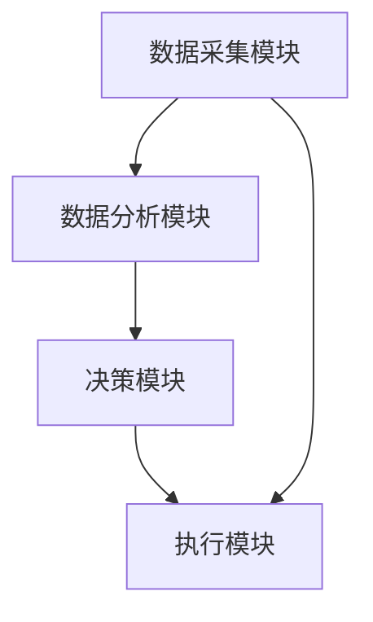

                 


# 智能化竞争对手分析：多智能体AI在价值投资中的角色

## 关键词：多智能体AI，价值投资，竞争对手分析，分布式协同，投资决策

## 摘要

本文深入探讨了多智能体AI在价值投资中的应用，特别是其在竞争对手分析中的角色。通过分析多智能体AI的核心原理、算法模型、系统架构以及实际案例，本文展示了多智能体AI如何帮助投资者进行更精准的竞争对手分析，从而优化投资决策。文章从背景介绍到算法实现，再到系统设计，层层递进，全面解析了多智能体AI在价值投资中的潜力和实际应用。

---

# 第一部分: 背景与概念

## 第1章: 智能化竞争对手分析的背景与意义

### 1.1 价值投资与竞争对手分析

#### 1.1.1 价值投资的基本概念

价值投资是一种以低于内在价值的价格购买优质股票的投资策略。其核心在于通过深入分析公司的基本面，寻找被市场低估的投资标的。然而，价值投资的决策过程往往受到市场竞争格局的影响，尤其是竞争对手的行为对目标公司价值的影响。

#### 1.1.2 竞争对手分析在价值投资中的重要性

竞争对手分析是价值投资中的关键环节，主要体现在以下几个方面：
- **市场定位**：通过分析竞争对手的市场策略，判断目标公司的市场地位。
- **竞争优势**：识别目标公司的核心竞争力，评估其在行业中的竞争优势。
- **风险预测**：预测竞争对手的潜在动作，提前规避投资风险。

#### 1.1.3 多智能体AI的引入与价值

传统竞争对手分析方法依赖人工经验，效率低下且容易受到主观因素的影响。多智能体AI通过分布式协同和数据挖掘，能够高效地处理多源异构数据，提供更精准的分析结果。

### 1.2 多智能体AI的基本概念

#### 1.2.1 多智能体系统的定义

多智能体系统（Multi-Agent System, MAS）是由多个具有自主决策能力的智能体组成的分布式系统，智能体之间通过交互和协作完成特定目标。

#### 1.2.2 多智能体AI的核心特征

- **自主性**：智能体能够独立决策。
- **反应性**：能够实时感知环境并做出响应。
- **协同性**：智能体之间通过通信和协作完成任务。
- **分布性**：系统由多个智能体组成，不存在集中控制。

#### 1.2.3 多智能体AI与传统AI的区别

| 特性             | 多智能体AI                     | 传统AI                       |
|------------------|-------------------------------|------------------------------|
| 结构             | 分布式结构                   | 集中式结构                 |
| 智能体数量       | 多个智能体                   | 单个或少数几个智能体         |
| 任务分配         | 分布式任务分配               | 集中任务分配                 |
| 信息处理         | 多源异构数据处理             | 单一数据源处理               |

### 1.3 多智能体AI在价值投资中的角色

#### 1.3.1 价值投资中的信息处理需求

价值投资需要处理大量非结构化数据，如新闻、财报、社交媒体等，这些数据的复杂性使得人工分析效率低下。

#### 1.3.2 竞争对手分析的挑战

竞争对手分析需要实时跟踪多个公司动态，识别潜在风险和机会，这对人工分析来说是一个巨大的挑战。

#### 1.3.3 多智能体AI的优势

- **高效性**：多智能体AI能够同时处理多源数据，提高分析效率。
- **准确性**：通过协同分析，减少单一智能体的决策偏差。
- **实时性**：能够实时跟踪市场动态，提供及时的分析结果。

---

## 第2章: 多智能体AI的核心概念与联系

### 2.1 多智能体AI的核心原理

#### 2.1.1 多智能体系统的组成

多智能体系统由以下几个部分组成：
- **智能体**：具有自主决策能力的个体。
- **环境**：智能体所处的外部环境。
- **通信协议**：智能体之间的通信规则。
- **协作机制**：智能体之间的协作方式。

#### 2.1.2 智能体之间的协同与竞争

智能体之间可以通过以下方式进行协作：
- **信息共享**：智能体之间共享数据和信息。
- **任务分配**：根据智能体的能力分配任务。
- **协同决策**：多个智能体共同决策。

#### 2.1.3 多智能体AI的决策机制

多智能体AI的决策机制通常包括以下几个步骤：
1. **感知环境**：智能体感知外部环境并获取数据。
2. **信息处理**：对获取的数据进行分析和处理。
3. **决策制定**：根据处理后的信息制定决策。
4. **执行决策**：将决策转化为具体行动。

### 2.2 多智能体AI与价值投资的关联

#### 2.2.1 多智能体AI在市场分析中的应用

- **市场趋势预测**：通过分析历史数据和市场动态，预测未来的市场趋势。
- **竞争对手行为预测**：通过分析竞争对手的历史行为，预测其未来的行动。

#### 2.2.2 多智能体AI在投资决策中的作用

- **投资组合优化**：通过分析不同投资标的的风险和收益，优化投资组合。
- **风险管理**：通过实时监控市场动态，识别潜在风险并制定应对策略。

#### 2.2.3 多智能体AI对投资风险的控制

- **实时监控**：多智能体AI能够实时监控市场动态，及时发现潜在风险。
- **协同分析**：多个智能体协同分析，减少单一智能体的决策偏差。

---

## 第3章: 多智能体AI在价值投资中的角色

### 3.1 多智能体AI的核心原理

#### 3.1.1 多智能体系统的组成

多智能体系统在价值投资中的应用通常包括以下几个部分：
- **数据采集智能体**：负责采集市场数据。
- **数据分析智能体**：负责对数据进行分析和处理。
- **决策智能体**：负责制定投资决策。

#### 3.1.2 智能体之间的协同与竞争

智能体之间的协同与竞争是多智能体系统的核心特征，通过合理的协作机制，可以提高系统的整体性能。

#### 3.1.3 多智能体AI的决策机制

多智能体AI的决策机制通常包括以下几个步骤：
1. **感知环境**：智能体感知外部环境并获取数据。
2. **信息处理**：对获取的数据进行分析和处理。
3. **决策制定**：根据处理后的信息制定决策。
4. **执行决策**：将决策转化为具体行动。

### 3.2 多智能体AI与价值投资的关联

#### 3.2.1 多智能体AI在市场分析中的应用

- **市场趋势预测**：通过分析历史数据和市场动态，预测未来的市场趋势。
- **竞争对手行为预测**：通过分析竞争对手的历史行为，预测其未来的行动。

#### 3.2.2 多智能体AI在投资决策中的作用

- **投资组合优化**：通过分析不同投资标的的风险和收益，优化投资组合。
- **风险管理**：通过实时监控市场动态，识别潜在风险并制定应对策略。

#### 3.2.3 多智能体AI对投资风险的控制

- **实时监控**：多智能体AI能够实时监控市场动态，及时发现潜在风险。
- **协同分析**：多个智能体协同分析，减少单一智能体的决策偏差。

---

## 第4章: 多智能体AI的算法原理

### 4.1 多智能体AI的核心算法

#### 4.1.1 分布式协同算法

分布式协同算法是多智能体系统的核心算法之一，其基本思想是通过智能体之间的协作完成特定任务。常见的分布式协同算法包括：

1. **分布式一致性算法**：用于确保多个智能体之间的数据一致性。
2. **分布式任务分配算法**：用于将任务分配给合适的智能体。
3. **分布式决策算法**：用于多个智能体共同决策。

#### 4.1.2 多智能体决策树

多智能体决策树是一种基于树结构的决策模型，适用于多智能体系统中的决策问题。其核心思想是通过构建一棵决策树，将多个智能体的决策过程整合到一个统一的框架中。

#### 4.1.3 联合推理算法

联合推理算法是一种基于逻辑推理的算法，适用于多智能体系统中的推理问题。其核心思想是通过多个智能体之间的推理协作，推导出系统的整体推理结果。

### 4.2 多智能体AI的数学模型

#### 4.2.1 多智能体协同模型

多智能体协同模型是一种描述多个智能体协同工作的数学模型，通常包括以下几个部分：

- **智能体状态**：描述智能体的当前状态。
- **智能体动作**：描述智能体的决策动作。
- **智能体目标**：描述智能体的目标函数。

#### 4.2.2 多智能体决策模型

多智能体决策模型是一种描述多个智能体共同决策的数学模型，通常包括以下几个部分：

- **决策空间**：描述智能体的决策空间。
- **决策规则**：描述智能体的决策规则。
- **决策结果**：描述智能体的决策结果。

### 4.3 多智能体AI的数学模型

#### 4.3.1 多智能体协同模型

多智能体协同模型可以用以下公式表示：

$$
\text{State}_i = \{ s_i^1, s_i^2, \ldots, s_i^n \}
$$

其中，$s_i^j$ 表示第 $i$ 个智能体的第 $j$ 个状态。

#### 4.3.2 多智能体决策模型

多智能体决策模型可以用以下公式表示：

$$
\text{Action}_i = \argmax_{a_i} \sum_{j=1}^m w_j \cdot f_j(s_i, a_i)
$$

其中，$w_j$ 表示第 $j$ 个目标的权重，$f_j(s_i, a_i)$ 表示第 $j$ 个目标的函数值。

---

## 第5章: 多智能体AI的系统架构与设计

### 5.1 系统架构设计

#### 5.1.1 系统功能模块

多智能体AI系统通常包括以下几个功能模块：
- **数据采集模块**：负责采集市场数据。
- **数据分析模块**：负责对数据进行分析和处理。
- **决策模块**：负责制定投资决策。
- **执行模块**：负责执行投资决策。

#### 5.1.2 系统架构图

以下是一个多智能体AI系统的架构图：



#### 5.1.3 系统接口设计

系统接口设计包括以下几个部分：
- **数据接口**：负责数据的输入和输出。
- **算法接口**：负责算法的调用和实现。
- **用户接口**：负责与用户的交互。

#### 5.1.4 系统交互流程

系统交互流程通常包括以下几个步骤：
1. **数据采集**：通过数据接口采集市场数据。
2. **数据分析**：通过数据分析模块对数据进行分析和处理。
3. **决策制定**：通过决策模块制定投资决策。
4. **执行决策**：通过执行模块执行投资决策。

---

## 第6章: 项目实战

### 6.1 环境安装

为了运行多智能体AI系统，需要安装以下环境：
- **Python**：推荐使用Python 3.8及以上版本。
- **库依赖**：需要安装以下库：
  - `numpy`
  - `pandas`
  - `scikit-learn`
  - `networkx`
  - `matplotlib`

### 6.2 系统核心实现源代码

以下是一个多智能体AI系统的Python实现示例：

```python
import numpy as np
import pandas as pd
from sklearn.tree import DecisionTreeClassifier
from sklearn.ensemble import RandomForestClassifier
from sklearn.metrics import accuracy_score

# 数据采集模块
def data_collection():
    # 从数据库中采集数据
    data = pd.read_csv('market_data.csv')
    return data

# 数据分析模块
def data_analysis(data):
    # 对数据进行预处理
    data = data.dropna()
    data = pd.get_dummies(data)
    return data

# 决策模块
def decision_making(data):
    # 使用决策树进行分类
    model = DecisionTreeClassifier()
    model.fit(data.drop('target', axis=1), data['target'])
    return model

# 执行模块
def execution(model, data):
    # 执行投资决策
    predictions = model.predict(data.drop('target', axis=1))
    return predictions

# 主函数
def main():
    data = data_collection()
    processed_data = data_analysis(data)
    model = decision_making(processed_data)
    predictions = execution(model, processed_data)
    print('预测结果:', predictions)

if __name__ == '__main__':
    main()
```

### 6.3 代码应用解读与分析

上述代码实现了一个简单的多智能体AI系统，主要包括数据采集、数据分析、决策制定和执行决策四个模块。通过使用决策树算法，系统能够根据市场数据制定投资决策。

### 6.4 实际案例分析

以下是一个实际案例的分析：

假设我们有一个包含股票市场数据的数据集，包括开盘价、收盘价、最高价、最低价、交易量等指标。我们可以通过上述代码实现一个多智能体AI系统，对股票市场的未来走势进行预测。

### 6.5 项目小结

通过上述项目的实现，我们可以看到多智能体AI系统在价值投资中的巨大潜力。通过合理设计和实现，多智能体AI系统能够帮助投资者进行更精准的竞争对手分析，从而优化投资决策。

---

## 第7章: 总结与展望

### 7.1 总结

本文深入探讨了多智能体AI在价值投资中的应用，特别是其在竞争对手分析中的角色。通过分析多智能体AI的核心原理、算法模型、系统架构以及实际案例，本文展示了多智能体AI如何帮助投资者进行更精准的竞争对手分析，从而优化投资决策。

### 7.2 展望

未来，随着人工智能技术的不断发展，多智能体AI在价值投资中的应用将更加广泛和深入。通过进一步研究和实践，我们可以期待多智能体AI在投资决策中的更加重要的角色。

---

## 作者：AI天才研究院/AI Genius Institute & 禅与计算机程序设计艺术/Zen And The Art of Computer Programming

