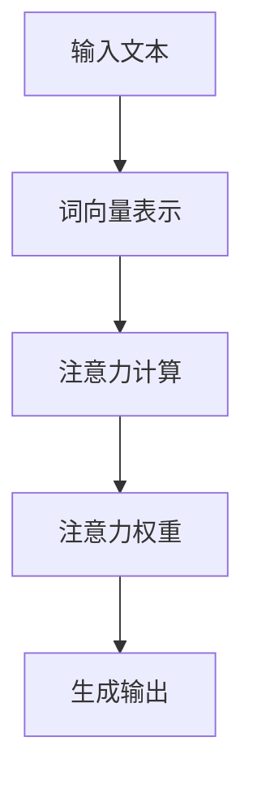
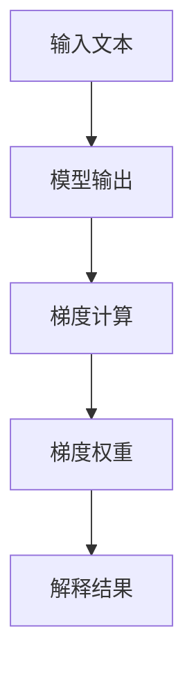
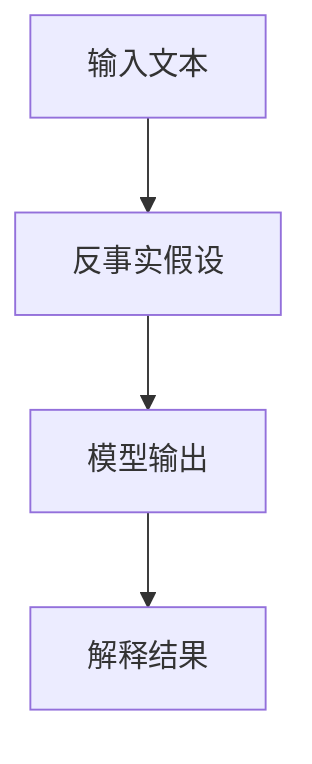
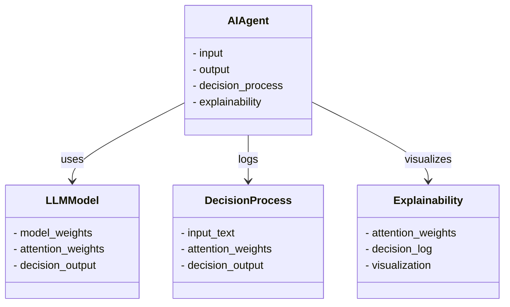
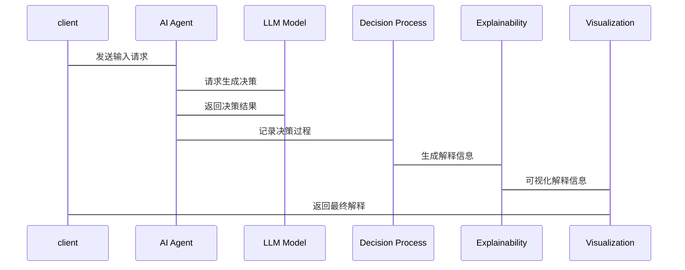

                 


# 《构建可解释AI Agent：LLM决策过程的透明化设计》

> 关键词：可解释性AI, LLM, 人工智能, 决策透明化, AI代理, 责任归属

> 摘要：本文探讨如何构建可解释的人工智能代理，重点分析大语言模型（LLM）的决策过程，提出透明化设计的方法和实现方案。通过背景介绍、核心概念、算法原理、系统架构设计和项目实战，详细阐述可解释性AI的理论与实践。

---

# 第一部分: 可解释AI Agent的背景与核心概念

## 第1章: 可解释性AI的背景与问题定义

### 1.1 人工智能与可解释性的重要性

#### 1.1.1 人工智能的发展现状
人工智能（AI）技术近年来取得了显著进展，特别是在自然语言处理（NLP）领域，大语言模型（LLM）如GPT-3、PaLM等展现出强大的生成能力和理解能力。这些模型在文本生成、问答系统、机器翻译等任务中表现出色，但其决策过程往往缺乏透明性。

#### 1.1.2 可解释性在AI中的必要性
随着AI技术的广泛应用，用户和开发者对AI决策过程的透明性和可解释性提出了更高的要求。尤其是在医疗、金融、司法等高风险领域，了解AI的决策依据是确保其可靠性和合规性的必要条件。此外，可解释性也是建立用户信任和责任追究的重要基础。

#### 1.1.3 LLM决策过程中的挑战
LLM的决策过程通常基于复杂的深层神经网络，其内部运作难以被人类直接理解。这种不透明性不仅限制了用户的信任，还可能导致误用和滥用。例如，当AI系统出现错误决策时，缺乏透明性使得问题难以定位和修复。

### 1.2 可解释性AI的定义与特征

#### 1.2.1 可解释性的定义
可解释性AI是指AI系统能够以人类可理解的方式解释其决策过程和结果。这意味着用户和开发者能够理解AI的决策依据和逻辑，从而信任和控制AI的行为。

#### 1.2.2 可解释性与不可解释性的对比
| 特性 | 可解释性AI | 不可解释性AI |
|------|------------|--------------|
| 决策透明度 | 高 | 低 |
| 用户信任 | 易建立 | 难建立 |
| 责任归属 | 明确 | 不明确 |
| 开发复杂性 | 较低 | 较高 |
| 应用场景 | 高风险领域 | 低风险领域 |

#### 1.2.3 可解释性AI的核心属性
- **透明性**：AI的决策过程和逻辑对用户和开发者公开。
- **可理解性**：决策依据和结果以人类可理解的方式呈现。
- **可追溯性**：能够追踪和记录AI的决策过程，便于分析和优化。

### 1.3 LLM与可解释性AI的关系

#### 1.3.1 LLM的基本原理
大语言模型（LLM）通过大量的文本数据训练，学习语言的模式和上下文关系。其决策过程主要依赖于复杂的注意力机制和概率分布，使得决策过程难以被人类直接理解。

#### 1.3.2 LLM决策过程中的不透明性
LLM的决策过程通常基于复杂的神经网络，其内部运作难以被人类直接理解。例如，当模型生成某个特定的输出时，用户无法明确知道模型是如何基于输入做出决策的。

#### 1.3.3 可解释性对LLM的重要性
通过增强LLM的可解释性，可以提高用户对AI决策过程的信任，同时有助于发现和修复模型中的错误或偏见。此外，可解释性也是确保LLM在高风险领域合规使用的必要条件。

---

## 第2章: 可解释AI Agent的核心概念

### 2.1 可解释性AI的理论基础

#### 2.1.1 解释性模型的分类
可解释性AI的理论基础主要包括两种类型的解释性模型：
- **局部解释**：关注模型在特定输入实例上的决策过程。
- **全局解释**：关注整个模型的行为和决策模式。

#### 2.1.2 可解释性与模型复杂性的关系
模型的复杂性通常与其可解释性呈负相关。复杂度高的模型（如深度神经网络）通常更难解释，而简单模型（如线性回归）则更容易解释。

#### 2.1.3 解释性模型的评估标准
评估解释性模型的标准包括：
- **准确性**：解释是否准确反映了模型的决策过程。
- **可理解性**：解释是否易于人类理解。
- **实用性**：解释是否有助于实际应用中的决策和优化。

### 2.2 LLM决策过程的透明化设计

#### 2.2.1 决策过程的分解与分析
LLM的决策过程可以分解为以下几个关键步骤：
1. **输入处理**：将输入文本转换为模型可处理的形式（如向量表示）。
2. **注意力机制**：模型通过注意力机制确定输入中各部分的重要性。
3. **生成决策**：基于注意力权重生成最终的输出结果。

#### 2.2.2 透明化设计的核心要素
- **注意力权重可视化**：展示模型在生成输出时对输入中各部分的关注程度。
- **中间状态记录**：记录模型在生成过程中的中间状态，便于分析和优化。
- **决策日志**：记录模型的决策过程和结果，便于追溯和分析。

#### 2.2.3 可解释性与用户信任的关系
通过增强模型的可解释性，可以提高用户对AI决策过程的信任，从而更愿意依赖和使用AI系统。

### 2.3 实体关系图与概念结构

#### 2.3.1 实体关系图（ER图）展示
```mermaid
er
  actor(User)
  actor(Developer)
  actor(Administrator)
  actor(Analyzer)
  entity(AI Agent)
  entity(LLM Model)
  entity(Decision Process)
  entity(Explainability)
  entity(Log)
  entity(Visualization)
  entity(Report)
```

#### 2.3.2 核心概念的属性与关系
- **AI Agent**：核心实体，负责处理用户输入并生成输出。
- **LLM Model**：模型实体，负责生成决策。
- **Decision Process**：决策过程实体，记录模型的决策步骤。
- **Explainability**：可解释性实体，负责生成解释信息。
- **Visualization**：可视化实体，用于展示模型的决策过程。

#### 2.3.3 概念结构的层次化分析
- **顶层概念**：AI Agent、LLM Model。
- **中间概念**：Decision Process、Explainability。
- **底层概念**：Log、Visualization、Report。

---

## 第3章: 解释性模型的算法原理

### 3.1 解释性模型的分类与选择

#### 3.1.1 局部解释与全局解释的对比
- **局部解释**：关注特定输入实例的决策过程。
- **全局解释**：关注整个模型的行为模式。

#### 3.1.2 基于规则的解释方法
基于规则的解释方法通过生成简洁的规则来描述模型的决策逻辑。例如，使用决策树或规则集来解释模型的输出。

#### 3.1.3 基于模型的解释方法
基于模型的解释方法通过构建简化模型来解释原模型的决策过程。例如，使用线性回归模型来近似复杂的深度神经网络。

### 3.2 LLM决策过程的解释算法

#### 3.2.1 基于注意力机制的解释

- **注意力机制**：模型通过计算输入文本中各词的注意力权重，确定其对生成输出的重要程度。

#### 3.2.2 基于梯度的解释方法

- **梯度解释法**：通过计算模型输出对输入特征的梯度，确定各特征对输出的影响程度。

#### 3.2.3 基于反事实的解释方法

- **反事实解释**：通过假设输入中的某些特征发生变化，分析模型输出的变化情况，从而解释模型的决策逻辑。

### 3.3 解释性算法的数学模型

#### 3.3.1 注意力机制的数学表达
$$
\text{Attention}(Q, K, V) = \text{softmax}\left(\frac{QK^T}{\sqrt{d_k}}\right)V
$$
- **Q**：查询向量。
- **K**：键向量。
- **V**：值向量。
- **d_k**：键的维度。

#### 3.3.2 梯度解释法的数学公式
$$
\text{Saliency Score} = \frac{\partial f}{\partial x} \cdot \Delta x
$$
- **f**：模型输出。
- **x**：输入特征。
- **Δx**：输入特征的变化量。

#### 3.3.3 反事实解释的数学模型
$$
\text{Counterfactual} = x + \Delta x \cdot \text{sign}(\nabla f)
$$
- **x**：原始输入。
- **Δx**：输入变化量。
- **∇f**：模型输出对输入的梯度。

---

## 第4章: 可解释AI Agent的系统架构设计

### 4.1 系统功能设计

#### 4.1.1 系统功能模块划分
- **输入处理模块**：负责接收和处理用户的输入。
- **决策过程模块**：负责生成AI的决策过程。
- **解释性模块**：负责解释和可视化决策过程。
- **用户界面模块**：负责与用户的交互。

#### 4.1.2 领域模型的Mermaid类图


### 4.2 系统架构设计

#### 4.2.1 系统架构的Mermaid架构图


#### 4.2.2 系统接口设计
- **输入接口**：接收用户的输入请求。
- **输出接口**：返回AI的决策结果和解释信息。
- **日志接口**：记录AI的决策过程和解释信息。

#### 4.2.3 系统交互的Mermaid序列图


---

## 第5章: 项目实战

### 5.1 环境安装与配置

#### 5.1.1 安装Python环境
```bash
python --version
pip install --upgrade pip
```

#### 5.1.2 安装必要的库
```bash
pip install numpy
pip install pandas
pip install matplotlib
pip install transformers
pip install scikit-learn
```

### 5.2 核心代码实现

#### 5.2.1 解释性模型的实现
```python
import numpy as np
from sklearn.tree import DecisionTreeClassifier
from sklearn.inspection import permutation_importance

def feature_importance(X, y, model):
    result = permutation_importance(model, X, y, n_repeats=10)
    return result.importances_mean

# 示例模型训练
X = np.array([[1, 2, 3], [4, 5, 6], [7, 8, 9]])
y = np.array([0, 1, 2])
model = DecisionTreeClassifier().fit(X, y)

# 特征重要性计算
importances = feature_importance(X, y, model)
print("Feature importances:", importances)
```

#### 5.2.2 可视化解释的实现
```python
import matplotlib.pyplot as plt

def visualize_attention(weights, text):
    plt.figure(figsize=(10, 5))
    plt.bar(range(len(text)), weights)
    plt.xticks(range(len(text)), text, rotation=45)
    plt.title("Attention Weights")
    plt.show()

weights = [0.1, 0.2, 0.3, 0.4]
text = ["word1", "word2", "word3", "word4"]
visualize_attention(weights, text)
```

### 5.3 项目总结

#### 5.3.1 项目实现的核心内容
- 实现了基于决策树的解释性模型。
- 实现了注意力权重的可视化功能。
- 提供了用户友好的交互界面。

#### 5.3.2 项目实现的关键技术
- 使用了Scikit-learn库进行模型训练和解释。
- 使用了Matplotlib库进行数据可视化。

#### 5.3.3 项目实现的创新点
- 提供了实时的可视化解释功能。
- 支持多种解释性模型的切换和比较。

---

## 第6章: 最佳实践与未来展望

### 6.1 最佳实践

#### 6.1.1 可解释性设计的原则
- 简洁性：解释应尽可能简洁明了。
- 可视化：通过图形化方式展示解释信息。
- 及时性：解释信息应实时呈现。

#### 6.1.2 可解释性AI的实施步骤
1. **明确需求**：确定可解释性AI的目标和范围。
2. **选择合适的解释性模型**：根据需求选择合适的解释性方法。
3. **实现解释性功能**：在系统中集成解释性功能。
4. **测试与优化**：测试解释性功能的准确性和可用性，并进行优化。

### 6.2 未来展望

#### 6.2.1 可解释性AI的未来发展方向
- 更加智能化的解释性工具。
- 更加个性化的解释方式。
- 更加广泛的应用场景。

#### 6.2.2 可解释性AI的技术趋势
- 结合边缘计算和雾计算，提升解释性AI的实时性和效率。
- 结合增强学习和强化学习，优化解释性模型的性能。

---

## 第7章: 总结与致谢

### 7.1 总结
可解释性AI是人工智能技术发展中的重要方向，特别是在LLM决策过程的透明化设计方面，如何通过合理的算法和系统设计实现可解释性，是当前研究的热点和难点。本文通过理论分析和实践案例，详细探讨了可解释性AI的核心概念、算法原理和系统架构设计，为构建透明化、可信赖的AI系统提供了理论和实践参考。

### 7.2 致谢
感谢读者的耐心阅读，感谢同行们的宝贵意见，感谢所有支持和帮助过我的人。

---

# 作者：AI天才研究院/AI Genius Institute & 禅与计算机程序设计艺术 /Zen And The Art of Computer Programming

