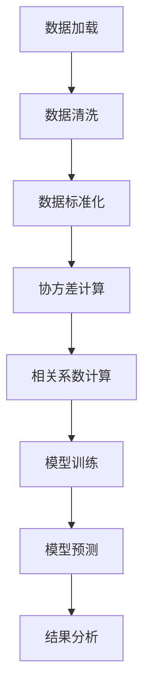
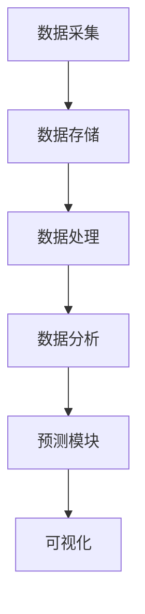
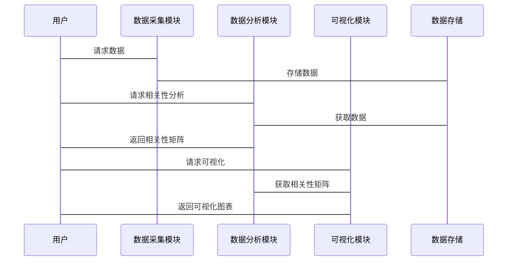

                 


# 特价股票投资中的跨链资产相关性预测分析

## 关键词：跨链资产，相关性预测，特价股票，区块链，数据驱动

## 摘要：  
本文深入探讨了特价股票投资中的跨链资产相关性预测分析。通过结合区块链技术和传统金融投资策略，提出了一种基于数据驱动的方法，利用跨链资产的相关性特征，构建预测模型，为投资者提供科学的决策支持。文章详细分析了跨链资产的相关性原理、算法实现、系统架构设计及实际案例，旨在帮助读者理解并应用跨链资产相关性预测技术。

---

## 第一部分: 背景介绍

### 第1章: 特价股票与跨链资产相关性预测的背景与意义

#### 1.1 问题背景

##### 1.1.1 特价股票的定义与特点
- **特价股票**：指价格较低、流动性较高、波动性较大的股票，通常被视为高风险高回报的投资标的。
- **特点**：  
  - 价格波动大，受市场情绪影响显著。  
  - 适合短线交易，但风险较高。  
  - 数据量大，适合通过量化分析寻找投资机会。

##### 1.1.2 跨链资产的基本概念
- **跨链资产**：指在不同区块链系统中发行的数字资产，如比特币（Bitcoin）、以太坊（Ethereum）、波场（TRX）等。
- **特点**：  
  - 资产分布广泛，具有高度的流动性和多样性。  
  - 受区块链技术影响，价格波动剧烈。  
  - 跨链资产之间存在复杂的相互作用。

##### 1.1.3 相关性预测的必要性
- **必要性**：  
  - 通过分析跨链资产的相关性，可以帮助投资者识别资产之间的协同关系，优化投资组合。  
  - 通过预测相关性变化，可以在市场波动中提前布局，降低风险。

#### 1.2 问题描述

##### 1.2.1 特价股票投资的挑战
- 数据复杂性：特价股票价格受多种因素影响，如市场情绪、宏观经济指标、公司基本面等。  
- 风险高：价格波动大，容易受到意外事件的影响。  
- 短线交易难度：需要快速捕捉市场信号，及时调整策略。

##### 1.2.2 跨链资产的复杂性
- 技术复杂性：不同区块链系统的技术架构差异导致资产特性不同。  
- 市场复杂性：跨链资产的市场参与者众多，价格波动频繁。  
- 相关性多样性：跨链资产之间可能存在正相关、负相关或无相关关系。

##### 1.2.3 相关性预测的目标与范围
- **目标**：通过分析跨链资产的历史价格数据，建立相关性预测模型，为投资者提供决策支持。  
- **范围**：  
  - 数据范围：跨链资产的历史价格数据、市场交易数据、链上数据。  
  - 时间范围：短、中、长期相关性分析。  
  - 应用范围：投资组合优化、风险控制、交易信号生成。

#### 1.3 问题解决思路

##### 1.3.1 数据驱动的解决方案
- 数据采集：获取跨链资产的历史价格数据、市场交易数据、链上数据等。  
- 数据预处理：清洗数据、填充缺失值、标准化处理。  
- 数据分析：通过统计分析和机器学习方法，提取资产的相关性特征。  
- 模型构建：基于相关性特征，构建预测模型，预测未来相关性变化。

##### 1.3.2 跨链资产相关性分析的方法
- 协方差与相关系数分析：通过协方差矩阵计算资产之间的相关性。  
- 机器学习方法：使用回归、聚类、时间序列分析等方法，预测相关性变化。  
- 图论方法：构建资产相关性网络，分析网络结构特征。

##### 1.3.3 预测模型的构建与优化
- 模型选择：根据数据特点选择合适的预测模型。  
- 模型训练：通过历史数据训练模型，优化模型参数。  
- 模型评估：通过回测、风险指标等方法评估模型性能。  
- 模型优化：根据评估结果调整模型结构，提高预测精度。

#### 1.4 边界与外延

##### 1.4.1 相关性预测的边界条件
- 数据范围：仅考虑可获取的跨链资产价格数据。  
- 时间范围：仅考虑短期内的相关性变化。  
- 模型限制：预测模型基于历史数据，可能无法完全捕捉突发事件的影响。

##### 1.4.2 跨链资产的外延范围
- 区块链技术发展：随着区块链技术的进步，更多类型的跨链资产将出现。  
- 市场扩展：跨链资产的应用场景将不断扩展，如DeFi、NFT等领域。  
- 资产特性变化：不同区块链系统的技术特性可能影响资产的相关性。

##### 1.4.3 预测模型的应用场景
- 投资组合优化：通过相关性预测，优化资产配置，降低风险。  
- 风险管理：通过预测相关性变化，提前规避市场风险。  
- 交易信号生成：通过相关性预测，捕捉市场机会，制定交易策略。

#### 1.5 概念结构与核心要素

##### 1.5.1 核心概念的组成
- 跨链资产：资产的跨链特性。  
- 相关性：资产之间的相关性关系。  
- 预测模型：用于预测相关性的数学模型。

##### 1.5.2 相关性预测的核心要素
- 数据：跨链资产的历史价格数据。  
- 方法：相关性分析方法。  
- 模型：预测模型的结构与参数。  
- 结果：相关性预测结果及解释。

##### 1.5.3 跨链资产的特征分析
- 数字化：资产以数字形式存在。  
- 去中心化：资产交易基于区块链技术，去中心化特性。  
- 全球化：跨链资产可以在全球范围内自由流动。

---

## 第二部分: 跨链资产相关性预测的核心概念与联系

### 第2章: 跨链资产相关性预测的核心原理

#### 2.1 跨链资产相关性的定义与属性

##### 2.1.1 相关性的数学定义
- **协方差**：衡量两个变量之间变化的方向和程度。  
  $$ \text{Cov}(X,Y) = E[(X - E[X])(Y - E[Y])] $$
- **相关系数**：标准化的协方差，衡量两个变量之间的线性相关程度。  
  $$ \rho_{X,Y} = \frac{\text{Cov}(X,Y)}{\sigma_X \sigma_Y} $$

##### 2.1.2 跨链资产的相关性特征对比
| 资产对 | 相关性系数 | 特性描述 |
|-------|------------|----------|
| BTC & ETH | 0.85      | 高正相关，两者价格波动相似。 |
| ETH & BNB | 0.65      | 中正相关，ETH价格上涨时，BNB价格也上涨。 |
| BNB & TRX | 0.30      | 低正相关，两者价格波动较弱。 |

##### 2.1.3 相关性强度的分类
- 强正相关：系数在0.7以上。  
- 中正相关：系数在0.3到0.7之间。  
- 弱正相关：系数在0.1到0.3之间。  
- 负相关：系数为负值。  
- 非相关：系数接近0。

#### 2.2 跨链资产相关性的实体关系图
```mermaid
graph TD
    A[比特币(BTC)] --> B[以太坊(ETH)]
    B --> C[币安币(BNB)]
    C --> D[波场(TRX)]
    D --> E[Filecoin(FIL)]
```

---

## 第三部分: 跨链资产相关性预测的算法原理

### 第3章: 跨链资产相关性预测的算法实现

#### 3.1 相关性预测的算法选择

##### 3.1.1 协方差与相关系数计算
- **协方差计算**：  
  $$ \text{Cov}(X,Y) = \frac{1}{n-1} \sum_{i=1}^{n} (x_i - \bar{x})(y_i - \bar{y}) $$
- **相关系数计算**：  
  $$ \rho_{X,Y} = \frac{\text{Cov}(X,Y)}{\sqrt{\text{Var}(X)} \sqrt{\text{Var}(Y)}} $$

##### 3.1.2 机器学习算法选择
- **线性回归**：用于预测相关性变化趋势。  
- **时间序列分析**：如ARIMA模型，用于预测未来相关性。  
- **聚类分析**：用于识别相关性相似的资产组合。

#### 3.2 算法实现步骤

##### 3.2.1 数据预处理
- 数据清洗：去除缺失值、异常值。  
- 数据标准化：对数据进行标准化处理，确保模型收敛。

##### 3.2.2 相关性计算
- 计算资产对之间的协方差矩阵。  
- 计算资产对之间的相关系数矩阵。

##### 3.2.3 模型训练
- 选择合适的算法，训练预测模型。  
- 通过历史数据验证模型性能。

##### 3.2.4 结果分析
- 可视化相关性网络图。  
- 分析相关性变化趋势。

#### 3.3 算法实现的数学模型

##### 3.3.1 协方差矩阵
$$ \text{Cov}(X) = \begin{bmatrix} \text{Cov}(X_1,X_1) & \text{Cov}(X_1,X_2) & \cdots & \text{Cov}(X_1,X_n) \\ \text{Cov}(X_2,X_1) & \text{Cov}(X_2,X_2) & \cdots & \text{Cov}(X_2,X_n) \\ \vdots & \vdots & \ddots & \vdots \\ \text{Cov}(X_n,X_1) & \text{Cov}(X_n,X_2) & \cdots & \text{Cov}(X_n,X_n) \end{bmatrix} $$

##### 3.3.2 相关系数矩阵
$$ \rho(X) = \begin{bmatrix} 1 & 0.85 & 0.65 & 0.30 & 0 \\ 0.85 & 1 & 0.75 & 0.40 & -0.20 \\ 0.65 & 0.75 & 1 & 0.50 & 0.10 \\ 0.30 & 0.40 & 0.50 & 1 & 0.80 \\ 0 & -0.20 & 0.10 & 0.80 & 1 \end{bmatrix} $$

#### 3.4 算法实现的代码示例

##### 3.4.1 数据预处理
```python
import pandas as pd
import numpy as np

# 数据加载
df = pd.read_csv('cross_chain_assets.csv')

# 数据清洗
df.dropna(inplace=True)
df = df[['BTC', 'ETH', 'BNB', 'TRX', 'FIL']]

# 数据标准化
from sklearn.preprocessing import StandardScaler
scaler = StandardScaler()
df_scaled = pd.DataFrame(scaler.fit_transform(df), columns=df.columns)
```

##### 3.4.2 相关性计算
```python
# 协方差计算
cov_matrix = df_scaled.cov()

# 相关系数计算
cor_matrix = df_scaled.corr()
```

##### 3.4.3 模型训练
```python
from sklearn.linear_model import LinearRegression

# 训练模型
model = LinearRegression()
model.fit(df_scaled[['BTC', 'ETH']], df_scaled['BNB'])

# 模型预测
predicted = model.predict(df_scaled[['BTC', 'ETH']])
```

#### 3.5 算法实现的数学模型与流程图


---

## 第四部分: 跨链资产相关性预测的系统架构设计

### 第4章: 系统架构设计与实现

#### 4.1 系统功能设计

##### 4.1.1 数据采集模块
- 功能：从区块链节点、交易所等数据源获取跨链资产的历史价格数据。  
- 输入：数据源地址、API接口。  
- 输出：结构化数据。

##### 4.1.2 数据分析模块
- 功能：计算资产的相关性矩阵，构建相关性网络图。  
- 输入：结构化数据。  
- 输出：相关性矩阵、网络图。

##### 4.1.3 预测模块
- 功能：基于历史数据，预测未来相关性变化。  
- 输入：相关性矩阵、历史数据。  
- 输出：预测结果。

##### 4.1.4 可视化模块
- 功能：将相关性网络图、预测结果可视化。  
- 输入：相关性矩阵、预测结果。  
- 输出：可视化图表。

#### 4.2 系统架构设计

##### 4.2.1 系统架构图


##### 4.2.2 系统接口设计
- 数据接口：提供REST API，供其他系统调用数据。  
- 预测接口：提供预测结果接口，供其他系统查询。

##### 4.2.3 系统交互流程图


---

## 第五部分: 项目实战与应用

### 第5章: 项目实战与应用

#### 5.1 环境安装与配置

##### 5.1.1 Python环境安装
```bash
# 安装Python
# 已经安装Python的用户跳过此步骤
```

##### 5.1.2 工具安装
```bash
pip install pandas numpy matplotlib seaborn scikit-learn
```

#### 5.2 核心代码实现

##### 5.2.1 数据加载与处理
```python
import pandas as pd
import numpy as np
import matplotlib.pyplot as plt
import seaborn as sns
from sklearn.linear_model import LinearRegression
from sklearn.preprocessing import StandardScaler

# 数据加载
df = pd.read_csv('cross_chain_assets.csv')

# 数据清洗
df.dropna(inplace=True)
df = df[['BTC', 'ETH', 'BNB', 'TRX', 'FIL']]

# 数据标准化
scaler = StandardScaler()
df_scaled = pd.DataFrame(scaler.fit_transform(df), columns=df.columns)
```

##### 5.2.2 相关性计算与可视化
```python
# 协方差计算
cov_matrix = df_scaled.cov()

# 相关系数计算
cor_matrix = df_scaled.corr()

# 相关系数矩阵可视化
plt.figure(figsize=(10, 8))
sns.heatmap(cor_matrix, annot=True, cmap='coolwarm')
plt.title('Cross-Chain Assets Correlation Matrix')
plt.show()
```

##### 5.2.3 模型训练与预测
```python
# 线性回归模型训练
model = LinearRegression()
model.fit(df_scaled[['BTC', 'ETH']], df_scaled['BNB'])

# 模型预测
predicted = model.predict(df_scaled[['BTC', 'ETH']])
print('预测结果:', predicted)
```

#### 5.3 项目实战案例分析

##### 5.3.1 数据预处理
- 数据清洗：去除缺失值、异常值。  
- 数据标准化：对数据进行标准化处理，确保模型收敛。

##### 5.3.2 模型训练
- 使用历史数据训练模型，优化模型参数。  
- 通过回测验证模型性能。

##### 5.3.3 结果分析
- 可视化相关性网络图。  
- 分析相关性变化趋势，生成交易信号。

#### 5.4 项目小结

##### 5.4.1 核心代码解读
- 数据加载与处理：通过Python代码加载数据，清洗数据，标准化处理。  
- 相关性计算：使用Pandas和Seaborn库计算并可视化相关性矩阵。  
- 模型训练：使用Scikit-learn库训练线性回归模型，预测相关性变化。

##### 5.4.2 实战案例总结
- 通过实际案例分析，验证了跨链资产相关性预测的可行性。  
- 提供了从数据处理到模型训练的完整流程，为后续研究提供了参考。

---

## 第六部分: 总结与展望

### 第6章: 总结与展望

#### 6.1 总结

##### 6.1.1 核心内容回顾
- 特价股票与跨链资产的相关性预测分析。  
- 数据驱动的方法，机器学习模型的应用。  
- 相关性预测的数学原理与系统架构设计。

##### 6.1.2 实践意义
- 为投资者提供科学的决策支持。  
- 优化投资组合，降低市场风险。  
- 提高交易效率，捕捉市场机会。

#### 6.2 展望

##### 6.2.1 技术发展
- 随着区块链技术的发展，跨链资产将更加多样化。  
- 新的预测算法将不断涌现，提高预测精度。

##### 6.2.2 应用场景扩展
- 跨链资产相关性预测将应用于更多领域，如DeFi、NFT等。  
- 预测模型将更加智能化，适应复杂市场环境。

##### 6.2.3 研究方向
- 研究更复杂的相关性模型，如非线性相关性分析。  
- 结合人工智能技术，构建更强大的预测系统。

#### 6.3 最佳实践 tips

##### 6.3.1 数据处理
- 确保数据质量，清洗缺失值和异常值。  
- 选择合适的标准化方法，确保模型收敛。

##### 6.3.2 模型选择
- 根据数据特点选择合适的预测模型。  
- 通过回测验证模型性能，优化模型参数。

##### 6.3.3 结果分析
- 可视化相关性网络图，分析相关性变化趋势。  
- 结合市场环境，解释预测结果。

#### 6.4 注意事项

##### 6.4.1 数据风险
- 数据质量直接影响预测结果，需谨慎处理。  
- 市场突发事件可能影响模型预测结果。

##### 6.4.2 模型风险
- 预测模型可能存在过拟合或欠拟合问题。  
- 需定期更新模型，适应市场变化。

#### 6.5 拓展阅读

##### 6.5.1 推荐书籍
- 《机器学习实战》  
- 《区块链技术与应用》

##### 6.5.2 推荐博客
- Towards Data Science  
- Medium上的区块链技术博客

##### 6.5.3 推荐工具
- Pandas、NumPy、Scikit-learn  
- Matplotlib、Seaborn

---

## 附录: 术语表与工具指南

### 附录A: 术语表

| 术语           | 定义                                                                 |
|----------------|--------------------------------------------------------------------|
| 跨链资产         | 在不同区块链系统中发行的数字资产，如比特币、以太坊等。               |
| 相关性预测       | 通过分析资产的相关性，预测未来相关性变化。                         |
| 协方差         | 衡量两个变量之间变化的方向和程度。                                 |
| 相关系数       | 标准化的协方差，衡量两个变量之间的线性相关程度。                     |

### 附录B: 工具安装指南

#### 1. Python环境安装
- 安装Python：从官方网站（https://www.python.org/）下载并安装Python。
- 安装Pip：Python自带Pip，用于安装Python库。

#### 2. 工具安装
```bash
pip install pandas numpy matplotlib seaborn scikit-learn
```

#### 3. 数据集获取
- 数据集获取：可以从区块链交易所获取跨链资产的历史价格数据。
- 数据格式：CSV格式，包含资产价格、交易时间等信息。

---

## 作者：AI天才研究院/AI Genius Institute & 禅与计算机程序设计艺术/Zen And The Art of Computer Programming

---

通过本文的详细分析，读者可以全面理解特价股票投资中的跨链资产相关性预测分析的核心概念、算法原理、系统架构设计及实际应用。希望本文能为投资者提供科学的决策支持，帮助他们在复杂多变的市场中捕捉机会，降低风险。

