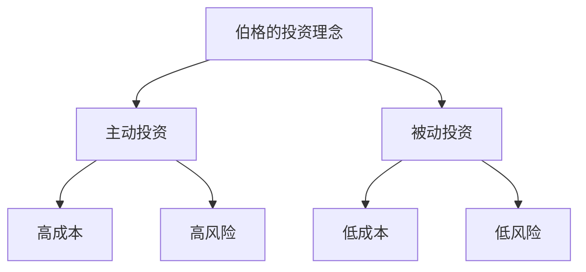
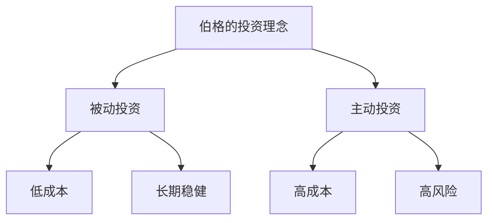
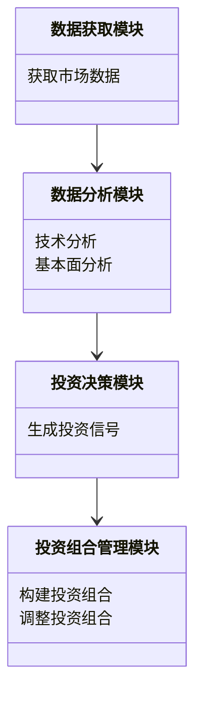
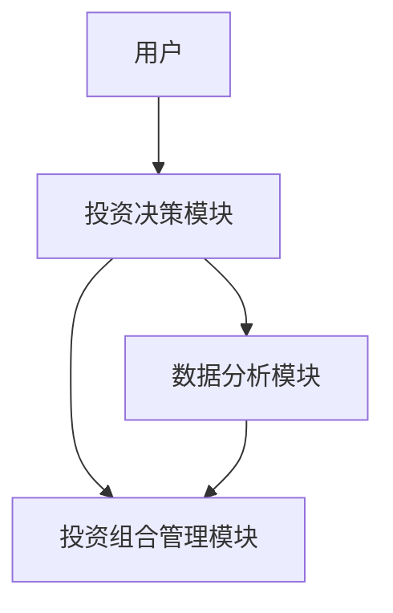
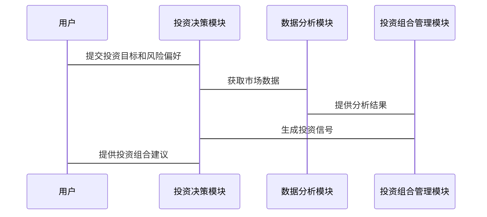

                 


# 《约翰伯格对主动投资的批评》

> 关键词：主动投资、约翰·伯格、被动投资、投资策略、投资组合、投资成本

> 摘要：本文详细分析了约翰·伯格对主动投资的批评，探讨了主动投资的核心概念、算法原理及其在现代金融中的应用。通过对比主动投资与被动投资，本文揭示了主动投资的优缺点，及其在实际投资中的局限性。通过具体的算法模型、系统架构和项目实战，本文深入剖析了约翰·伯格对主动投资的批判性观点，并提出了相应的优化建议。

---

## 第一部分: 主动投资的背景与核心概念

### 第1章: 主动投资的定义与特点

#### 1.1 主动投资的定义
主动投资是一种积极管理投资组合的投资策略，旨在通过精选个股或主动调整投资组合，以实现超越市场基准的超额收益。其核心在于通过研究和判断，选择具有较高增长潜力或被市场低估的资产。

- **主动投资的核心特征**：
  - 积极主动的管理：投资者通过分析市场趋势、公司基本面等因素，主动调整投资组合。
  - 追求超额收益：通过精选个股或时机选择，追求超越市场指数的收益。
  - 高风险与高成本：需要投入大量时间和资源，且投资成本较高。

- **主动投资与被动投资的区别**：
  | 对比维度 | 主动投资 | 被动投资 |
  |----------|----------|----------|
  | 管理方式 | 积极管理 | 被动跟踪 |
  | 成本     | 高       | 低       |
  | 风险     | 高       | 中等     |
  | 收益目标 | 超额收益 | 市场平均收益 |

#### 1.2 约翰·伯格的背景与投资理念
约翰·伯格是美国著名投资专家， Vanguard 集团的创始人之一，他以倡导低成本、被动投资策略而闻名。

- **伯格的投资哲学**：
  - 倡导低成本指数投资，认为长期来看，市场很难被预测和击败。
  - 认为大多数主动管理的投资组合难以跑赢市场指数，且成本过高。

- **伯格对主动投资的批评**：
  - 主动投资的高成本降低了净收益。
  - 主动管理的投资经理很难持续跑赢市场。
  - 过度依赖市场时机选择，增加了投资风险。

#### 1.3 主动投资的核心要素
- **投资策略**：包括技术分析（如K线图、成交量分析）和基本面分析（如财务报表分析）。
- **投资组合管理**：包括资产配置、个股选择和风险控制。
- **风险与收益的平衡**：主动投资追求高收益的同时，也承担更高的市场风险和操作风险。

### 第2章: 主动投资的背景与问题背景

#### 2.1 主动投资的历史发展
主动投资起源于20世纪初，随着金融市场的成熟和投资理论的发展，逐渐成为一种重要的投资方式。

- **主动投资的起源与发展**：
  - 20世纪初：主动投资开始兴起，投资者尝试通过分析市场趋势和公司基本面进行投资。
  - 20世纪70年代：量化投资和被动投资开始崛起，但主动投资依然占据重要地位。
  - 21世纪：随着技术进步，主动投资策略更加多样化，但也面临更多挑战。

- **主动投资在现代金融中的地位**：
  - 主动投资在机构投资中占据重要地位，尤其在追求超额收益的情况下。
  - 但在个人投资领域，被动投资逐渐受到更多关注。

- **主动投资与金融市场的关系**：
  - 主动投资推动了金融市场的流动性，但也可能导致市场波动。

#### 2.2 主动投资的主要问题
- **主动投资的成本问题**：
  - 管理费和交易成本较高，降低了净收益。
  - 长期来看，高成本可能导致投资收益不及市场指数。

- **主动投资的业绩不稳定**：
  - 主动管理的投资组合难以持续跑赢市场，业绩波动较大。
  - 投资经理的能力和市场环境的变化会影响投资业绩。

- **主动投资的过度交易风险**：
  - 过度交易增加了交易成本和税务负担。
  - 频繁调整投资组合可能导致投资收益的降低。

#### 2.3 约翰·伯格对主动投资的批评
- **伯格对主动投资的系统性批评**：
  - 主动投资的高成本和低效率：伯格认为，主动投资的高成本和复杂策略难以带来超额收益。
  - 主动投资的短期导向：许多主动管理的投资组合过于关注短期收益，忽视了长期投资价值。
  - 主动投资的不可持续性：伯格认为，长期来看，主动投资难以跑赢市场指数，尤其是在扣除高昂的管理费用后。

- **伯格的被动投资理念**：
  - 倡导投资低成本的指数基金，追求市场平均收益。
  - 认为被动投资更符合长期投资目标，且成本更低。

- **伯格对主动投资的长期性质疑**：
  - 主动投资依赖于市场预测和时机选择，但市场是不确定的。
  - 长期来看，被动投资更稳定，风险更低。

---

## 第二部分: 主动投资的核心概念与联系

### 第3章: 主动投资的核心概念原理

#### 3.1 主动投资的原理
- **主动投资的理论基础**：
  - 基于市场有效性的假设，认为市场存在可以被利用的定价错误。
  - 通过分析市场趋势和公司基本面，寻找投资机会。

- **主动投资的核心假设**：
  - 市场存在短期定价错误，可以通过研究发现并获利。
  - 投资经理有能力通过分析和判断，选择优质资产。

- **主动投资的逻辑框架**：
  1. 确定投资目标和风险偏好。
  2. 通过技术分析或基本面分析，选择投资标的。
  3. 构建投资组合，并定期调整。
  4. 监控市场变化，及时优化投资组合。

#### 3.2 主动投资与被动投资的对比
- **主动投资与被动投资的优缺点对比**：

| 对比维度 | 主动投资                 | 被动投资                 |
|----------|--------------------------|--------------------------|
| 管理方式 | 积极主动，频繁调整         | 被动跟踪，无需频繁调整     |
| 成本     | 管理费和交易成本较高       | 管理费低，交易成本低       |
| 风险     | 高，依赖投资经理能力       | 中等，风险可控             |
| 收益目标 | 追求超额收益              | 追求市场平均收益           |
| 适用场景 | 适合有专业知识和时间的投资者 | 适合缺乏时间和精力的投资者 |

- **主动投资与被动投资的适用场景**：
  - 主动投资适合有专业知识和时间的投资者，被动投资适合普通投资者。
  - 主动投资适合机构投资者追求超额收益，被动投资适合长期稳健投资。

- **主动投资与被动投资的未来趋势**：
  - 主动投资与被动投资的市场份额正在发生变化，被动投资逐渐占据更大比例。
  - 技术进步推动主动投资策略的多样化，但被动投资的低成本优势依然显著。

#### 3.3 约翰·伯格的投资理念图解
- **使用 Mermaid 绘制的 ER 实体关系图**：

- **使用 Mermaid 绘制的流程图**：


---

## 第三部分: 主动投资的算法原理讲解

### 第4章: 主动投资的算法原理

#### 4.1 主动投资的算法概述
- **主动投资的常见算法类型**：
  - 技术分析算法：基于价格和成交量数据，预测市场趋势。
  - 基本面分析算法：基于公司财务数据，评估公司价值。
  - 组合优化算法：通过数学模型优化投资组合。

- **主动投资算法的核心特征**：
  - 数据驱动：基于市场数据进行分析和决策。
  - 预测性：试图预测市场走势或资产价格。
  - 动态调整：根据市场变化，实时调整投资组合。

- **主动投资算法的优缺点**：
  | 优缺点 | 优点             | 缺点             |
  |--------|------------------|------------------|
  | 数据驱动 | 精准性高         | 数据依赖性强     |
  | 预测性  | 提前把握市场趋势 | 预测准确性低     |
  | 动态调整 | 灵活性高         | 成本和风险增加   |

#### 4.2 具体算法的详细讲解
- **动量策略**：
  - **动量策略的核心思想**：价格走势会延续，近期价格上涨的资产未来会继续上涨。
  - **动量策略的实现步骤**：
    1. 计算资产的过去一段时间的收益率。
    2. 根据收益率排序，选择表现最好的资产。
    3. 投资于表现最好的资产，定期再平衡。

  - **使用 Mermaid 绘制的算法流程图**：
  ```mermaid
  graph TD
      A[开始] --> B[计算收益率]
      B --> C[排序]
      C --> D[选择表现最好的资产]
      D --> E[投资]
      E --> F[定期再平衡]
      F --> G[结束]
  ```

  - **使用 Python 实现的算法代码示例**：
    ```python
    import pandas as pd
    import numpy as np

    # 计算动量策略
    def momentum_strategy(prices, window=20):
        # 计算过去20天的收益率
        returns = prices.pct_change().dropna()
        # 排序并选择表现最好的资产
        ranked = returns.iloc[-window].sort_values(ascending=False)
        return ranked.index[0]  # 返回表现最好的资产

    # 示例数据
    prices = pd.DataFrame({
        'Asset1': [100, 105, 110, 115, 120],
        'Asset2': [90, 95, 100, 105, 110]
    })
    # 执行策略
    result = momentum_strategy(prices)
    print(result)
    ```

  - **算法的数学模型与公式**：
    动量策略的核心是计算资产的收益率，公式为：
    $$ \text{收益率} = \frac{\text{当前价格} - \text{过去价格}}{\text{过去价格}} $$

  - **通俗易懂的举例说明**：
    假设资产A在过去20天内价格从100上涨到120，平均每天上涨1%，而资产B价格从90上涨到110，平均每天上涨1.11%。根据动量策略，资产B的动量更强，应选择投资资产B。

- **均值回归策略**：
  - **均值回归策略的核心思想**：价格会回归到历史平均值。
  - **均值回归策略的实现步骤**：
    1. 计算资产的历史平均价格。
    2. 当资产价格偏离平均价格一定范围时，进行买入或卖出。

  - **使用 Mermaid 绘制的算法流程图**：
  ```mermaid
  graph TD
      A[开始] --> B[计算平均价格]
      B --> C[判断价格偏离度]
      C --> D[超出范围则交易]
      D --> E[结束]
  ```

  - **使用 Python 实现的算法代码示例**：
    ```python
    import pandas as pd
    import numpy as np

    # 均值回归策略
    def mean_reversion_strategy(prices, window=20, threshold=1):
        # 计算过去20天的平均价格
        avg_prices = prices.rolling(window).mean()
        # 判断当前价格是否偏离平均价格超过阈值
        deviation = abs(prices.iloc[-1] - avg_prices.iloc[-1])
        if deviation > threshold:
            return '买入'
        else:
            return '观望'

    # 示例数据
    prices = pd.DataFrame({
        'Asset': [100, 105, 110, 100, 95]
    })
    # 执行策略
    result = mean_reversion_strategy(prices)
    print(result)
    ```

  - **算法的数学模型与公式**：
    均值回归策略的核心是计算资产的历史平均价格，并与当前价格进行比较：
    $$ \text{平均价格} = \frac{\sum \text{价格}}{\text{天数}} $$
    $$ \text{偏离度} = |\text{当前价格} - \text{平均价格}| $$

  - **通俗易懂的举例说明**：
    假设资产A的历史平均价格为100，当前价格为110，偏离度为10%，超过阈值10%，则触发卖出信号。

#### 4.3 算法的数学模型与公式
- **动量策略的数学公式**：
  $$ \text{收益率} = \frac{\text{当前价格} - \text{过去价格}}{\text{过去价格}} $$
  
- **均值回归策略的数学公式**：
  $$ \text{平均价格} = \frac{\sum \text{价格}}{\text{天数}} $$
  $$ \text{偏离度} = |\text{当前价格} - \text{平均价格}| $$

---

## 第四部分: 主动投资的系统架构设计

### 第5章: 主动投资的系统架构设计

#### 5.1 系统功能设计
- **系统功能模块**：
  - 数据获取模块：获取市场数据。
  - 数据分析模块：进行技术分析或基本面分析。
  - 投资决策模块：根据分析结果生成投资信号。
  - 投资组合管理模块：构建和调整投资组合。

- **领域模型 mermaid 类图**：


#### 5.2 系统架构设计
- **系统架构 mermaid 架构图**：


#### 5.3 系统接口设计
- **接口描述**：
  - 用户输入投资目标和风险偏好。
  - 系统输出投资组合建议和投资信号。

#### 5.4 系统交互 mermaid 序列图


---

## 第五部分: 主动投资的项目实战

### 第6章: 项目实战

#### 6.1 环境安装
- **安装必要的 Python 库**：
  ```bash
  pip install pandas numpy matplotlib
  ```

#### 6.2 系统核心实现源代码
- **动量策略的实现代码**：
  ```python
  import pandas as pd
  import numpy as np

  def momentum_strategy(prices, window=20):
      returns = prices.pct_change().dropna()
      ranked = returns.iloc[-window].sort_values(ascending=False)
      return ranked.index[0]

  # 示例数据
  prices = pd.DataFrame({
      'Asset1': [100, 105, 110, 115, 120],
      'Asset2': [90, 95, 100, 105, 110]
  })
  result = momentum_strategy(prices)
  print(f"动量策略选择的资产: {result}")
  ```

- **均值回归策略的实现代码**：
  ```python
  import pandas as pd
  import numpy as np

  def mean_reversion_strategy(prices, window=20, threshold=1):
      avg_prices = prices.rolling(window).mean()
      deviation = abs(prices.iloc[-1] - avg_prices.iloc[-1])
      if deviation > threshold:
          return '买入'
      else:
          return '观望'

  # 示例数据
  prices = pd.DataFrame({
      'Asset': [100, 105, 110, 100, 95]
  })
  result = mean_reversion_strategy(prices)
  print(f"均值回归策略信号: {result}")
  ```

#### 6.3 代码应用解读与分析
- **动量策略的代码解读**：
  - 计算过去20天的收益率，并选择表现最好的资产。
  - 适用于短期趋势预测，适合动量策略投资者。

- **均值回归策略的代码解读**：
  - 计算过去20天的平均价格，并判断当前价格是否偏离平均价格超过阈值。
  - 适用于价格回归的交易策略。

#### 6.4 实际案例分析和详细讲解剖析
- **案例分析**：
  - 假设当前市场中，资产A的价格在过去20天内呈上升趋势，且收益率较高。
  - 动量策略选择投资资产A，均值回归策略判断资产B价格偏离平均价格，选择投资资产B。

- **详细讲解剖析**：
  - 动量策略适用于趋势性市场，而均值回归策略适用于反转性市场。
  - 选择适合的策略需要根据市场环境和投资目标进行调整。

#### 6.5 项目小结
- **项目总结**：
  - 通过动量策略和均值回归策略的实现，展示了主动投资算法的核心思想。
  - 算法选择和参数设置对投资结果有重要影响。

---

## 第六部分: 总结与扩展

### 第7章: 总结与扩展

#### 7.1 总结
- **约翰·伯格对主动投资的批评**：
  - 主动投资的高成本和低效率。
  - 主动投资的短期导向和不可持续性。

- **被动投资的优势**：
  - 成本低。
  - 风险低。
  - 长期稳健。

- **主动投资的未来展望**：
  - 技术进步推动主动投资策略的多样化。
  - 主动投资与被动投资的结合。

#### 7.2 最佳实践 tips
- **投资策略选择**：
  - 根据自身风险偏好和投资目标选择合适的投资策略。
  - 长期投资更倾向于被动投资，短期投资可以选择主动投资。

- **投资成本控制**：
  - 选择低成本的投资工具。
  - 避免频繁交易，降低交易成本。

#### 7.3 小结
- 主动投资与被动投资各有优缺点。
- 约翰·伯格的批评提醒投资者关注投资成本和长期投资目标。
- 投资者应根据自身情况选择合适的投资策略。

#### 7.4 注意事项
- **风险提示**：
  - 主动投资存在高风险和高成本。
  - 投资者需具备专业知识和风险承受能力。

- **投资纪律**：
  - 遵循投资计划，避免情绪化投资。
  - 定期审视和调整投资组合。

#### 7.5 拓展阅读
- **推荐阅读书籍**：
  - 《投资最重要的简单真理》——约翰·伯格
  - 《证券分析》——本杰明·格雷厄姆

- **推荐阅读文章**：
  - 主动投资与被动投资的优劣对比。
  - 现代投资组合理论。

---

## 作者：AI天才研究院/AI Genius Institute & 禅与计算机程序设计艺术 /Zen And The Art of Computer Programming

