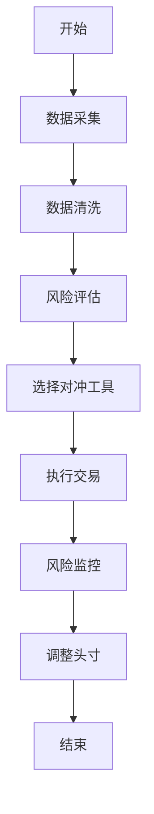
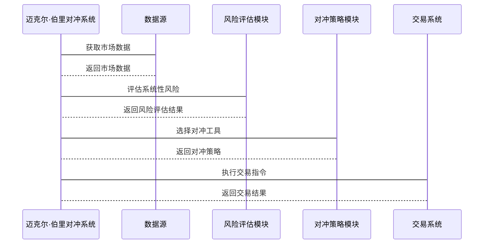

                 


# 迈克尔·伯里的系统性风险对冲方法

**关键词：** 系统性风险、对冲方法、迈克尔·伯里、投资策略、风险管理

**摘要：**  
本文深入探讨了迈克尔·伯里（Michael Burry）的系统性风险对冲方法，分析其核心思想、数学模型、算法原理及实际应用案例。文章从系统性风险的基本概念出发，结合伯里的投资哲学，详细阐述了其对冲方法的理论基础、实现步骤及实际效果。通过案例分析和实战演示，帮助读者理解如何在实际投资中应用这些方法，以应对系统性风险带来的挑战。

---

# 第一部分: 系统性风险对冲的背景与基础

## 第1章: 系统性风险的基本概念

### 1.1 系统性风险的定义与特征

#### 1.1.1 系统性风险的定义
系统性风险是指由于市场整体或经济体系中某些共同因素的变化，导致多个资产或投资组合同时出现损失的风险。它不同于非系统性风险（特定于某个资产或公司的风险），具有广泛性和不可分散性的特点。

#### 1.1.2 系统性风险的核心特征
- **广泛性**：影响整个市场或经济体系。
- **不可分散性**：通过多元化投资无法完全规避。
- **连锁反应性**：一个领域的风险可能引发连锁反应，波及整个市场。

#### 1.1.3 系统性风险与非系统性风险的区别
| 特性               | 系统性风险                     | 非系统性风险                 |
|--------------------|-------------------------------|-----------------------------|
| 影响范围           | 整个市场或经济体系             | 单个资产或公司               |
| 是否可分散         | 不可分散                      | 可分散                      |
| 来源               | 宏观经济因素（如利率、通货膨胀）| 公司特定因素（如管理、竞争）|

---

### 1.2 迈克尔·伯里投资哲学概述

#### 1.2.1 迈克尔·伯里的投资理念
迈克尔·伯里是一位成功的对冲基金经理，以在2008年金融危机前成功预测并获利而闻名。他的投资哲学的核心是：
- **逆向思维**：在市场恐慌时寻找机会。
- **风险对冲**：通过识别和对冲系统性风险来实现稳健收益。

#### 1.2.2 迈克尔·伯里的主要投资策略
伯里主要关注以下几类资产：
- **信用违约互换（CDS）**：通过做空CDS来对冲债券违约风险。
- **股指期货**：利用股指期货对冲市场整体下跌风险。
- **统计套利**：通过统计模型寻找市场中的定价偏差。

#### 1.2.3 迈克尔·伯里对冲方法的核心思想
伯里认为，系统性风险是可以通过数学模型和量化方法进行预测和对冲的。他强调：
- **数据驱动**：依赖大量数据和统计分析来识别风险。
- **逆向操作**：在市场下跌时建立空头头寸，在市场上涨时建立多头头寸。

---

### 1.3 系统性风险对冲方法的基本框架

#### 1.3.1 对冲的基本原理
对冲的核心思想是通过建立相反的头寸来抵消部分或全部的系统性风险。例如，如果一个投资组合可能因市场下跌而亏损，可以通过买入股指期货来对冲这一风险。

#### 1.3.2 系统性风险对冲的主要工具
- **股指期货**：用于对冲市场整体风险。
- **信用违约互换（CDS）**：用于对冲债券违约风险。
- **期权**：通过买入或卖出期权来对冲特定风险。

#### 1.3.3 系统性风险对冲的策略分类
| 策略类型         | 描述                           | 适用场景                     |
|------------------|-------------------------------|-----------------------------|
| 统计套利         | 利用资产价格的短期波动进行套利   | 市场短期波动较大时           |
| 事件驱动对冲     | 在特定事件（如并购、重组）中对冲 | 预期市场因事件波动时         |
| 风险敞口对冲     | 通过调整投资组合来减少系统性风险 | 预期市场将出现大幅波动时     |

---

### 1.4 迈克尔·伯里对冲方法的经典案例

#### 1.4.1 2008年金融危机案例
在2008年金融危机期间，伯里通过做空CDS（信用违约互换）成功对冲了系统性风险。他通过分析次贷市场的风险，认为许多CDS合约的价值被高估，因此建立大量空头头寸，最终在危机中获利丰厚。

#### 1.4.2 其他经典对冲案例分析
- **案例1**：2011年欧洲债务危机期间，伯里通过做空意大利国债CDS对冲风险。
- **案例2**：2020年新冠疫情导致市场崩盘，伯里通过买入股指期货对冲市场下跌风险。

#### 1.4.3 案例总结与启示
通过这些案例可以看出，伯里对冲方法的核心在于：
- **精准识别系统性风险**：通过数据分析和模型构建，提前发现市场中的系统性风险。
- **灵活运用对冲工具**：根据市场变化选择合适的对冲工具和策略。

---

## 第2章: 系统性风险的原理与模型

### 2.1 系统性风险的原理分析

#### 2.1.1 系统性风险的传播机制
系统性风险通常通过以下机制传播：
1. **传染效应**：一个领域的风险通过金融关联传导到其他领域。
2. **杠杆效应**：高杠杆率放大了市场的波动。
3. **反馈循环**：投资者的恐慌情绪进一步加剧市场的下跌。

#### 2.1.2 系统性风险的触发条件
- **市场流动性枯竭**：市场缺乏流动性导致资产价格大幅波动。
- **金融机构的杠杆过高**：金融机构的高杠杆率使其在市场下跌时被迫抛售资产。
- **宏观经济恶化**：经济衰退或通货膨胀加剧市场风险。

#### 2.1.3 系统性风险的量化方法
系统性风险可以通过以下指标进行量化：
- **VaR（在险价值）**：衡量投资组合在特定置信水平下的潜在损失。
- **CVaR（条件在险价值）**：衡量在VaR水平下的平均损失。

---

### 2.2 迈克尔·伯里对冲方法的核心模型

#### 2.2.1 风险-收益模型
伯里使用风险-收益模型来评估不同对冲策略的收益和风险。模型的基本公式为：
$$
\text{收益} = \text{预期收益} - \text{风险调整后的收益}
$$

#### 2.2.2 对冲策略的数学模型
伯里对冲策略的数学模型可以表示为：
$$
\text{对冲收益} = \sum_{i=1}^{n} w_i \times (\text{资产收益} - \text{对冲收益})
$$
其中，\( w_i \) 是第 \( i \) 个资产的权重。

#### 2.2.3 系统性风险的预警模型
伯里使用统计模型来预测系统性风险的发生。常用的模型包括：
- **ARIMA模型**：用于时间序列预测。
- **Copula模型**：用于分析资产之间的相关性。

---

### 2.3 系统性风险对冲的核心概念对比表

| 概念             | 系统性风险                 | 非系统性风险               |
|------------------|---------------------------|---------------------------|
| 影响范围         | 整个市场或经济体系         | 单个资产或公司             |
| 是否可分散       | 不可分散                  | 可分散                    |
| 来源             | 宏观经济因素（如利率、通货膨胀）| 公司特定因素（如管理、竞争）|

---

### 2.4 系统性风险对冲的ER实体关系图

```mermaid
er
actor 迈克尔·伯里对冲系统
    name 迈克尔·伯里对冲系统
    --> 连接器1
连接器1 --> 实体1: 系统性风险
连接器1 --> 实体2: 非系统性风险
连接器1 --> 实体3: 对冲工具
连接器1 --> 实体4: 对冲策略
```

---

## 第3章: 系统性风险对冲的算法原理

### 3.1 算法原理概述
伯里对冲方法的核心是通过统计套利和事件驱动策略来对冲系统性风险。以下是其实现步骤：

#### 3.1.1 数据采集与处理
- 采集市场数据（如股指、CDS价格）。
- 清洗和预处理数据（如去除异常值）。

#### 3.1.2 风险评估与建模
- 使用统计模型（如ARIMA）预测系统性风险。
- 通过Copula模型分析资产相关性。

#### 3.1.3 对冲策略执行
- 根据风险评估结果选择合适的对冲工具（如股指期货、CDS）。
- 执行交易指令。

#### 3.1.4 风险监控与调整
- 实时监控市场变化。
- 根据市场变化动态调整对冲头寸。

---

### 3.2 算法流程图



---

### 3.3 对冲策略的Python实现

```python
import numpy as np
import pandas as pd
from statsmodels.tsa.arima_model import ARIMA

# 数据采集与处理
data = pd.read_csv('market_data.csv')
data = data['close'].values

# 风险评估与建模
model = ARIMA(data, order=(5, 1, 0))
model_fit = model.fit()

# 预测系统性风险
forecast = model_fit.forecast(steps=10)
```

---

## 第4章: 系统性风险对冲的数学模型

### 4.1 风险评估的数学模型

#### 4.1.1 VaR模型
$$
\text{VaR}(\alpha) = \text{损失的第}\alpha\text{分位数}
$$

#### 4.1.2 CVaR模型
$$
\text{CVaR}(\alpha) = \frac{1}{1-\alpha} \int_{\alpha}^{1} \text{损失分布函数} \, dF
$$

---

### 4.2 对冲策略的数学模型

#### 4.2.1 统计套利模型
$$
\text{收益} = \sum_{i=1}^{n} w_i \times (\text{资产收益} - \text{对冲收益})
$$

#### 4.2.2 事件驱动模型
$$
\text{事件概率} = \frac{\text{历史事件发生次数}}{\text{总样本数}}
$$

---

## 第5章: 系统性风险对冲的系统架构设计

### 5.1 系统分析与设计

#### 5.1.1 系统功能设计
- 数据采集模块：采集市场数据。
- 风险评估模块：评估系统性风险。
- 对冲策略模块：选择对冲工具和策略。
- 交易执行模块：执行交易指令。

#### 5.1.2 系统架构图


---

### 5.2 系统接口设计

- 数据接口：与数据源对接，获取市场数据。
- 交易接口：与交易系统对接，执行交易指令。

---

### 5.3 系统交互流程图



---

## 第6章: 系统性风险对冲的项目实战

### 6.1 环境配置

#### 6.1.1 安装必要的Python库
```bash
pip install numpy pandas statsmodels matplotlib
```

---

### 6.2 核心实现

#### 6.2.1 数据采集与预处理
```python
import pandas as pd
import numpy as np

data = pd.read_csv('market_data.csv')
data = data['close'].values
data = pd.Series(data)
```

#### 6.2.2 风险评估与建模
```python
from statsmodels.tsa.arima_model import ARIMA

model = ARIMA(data, order=(5, 1, 0))
model_fit = model.fit()
forecast = model_fit.forecast(steps=10)
```

#### 6.2.3 对冲策略实现
```python
def hedge_strategy(forecast, threshold=0.05):
    if forecast > threshold:
        return '做空'
    else:
        return '做多'
```

---

### 6.3 案例分析

#### 6.3.1 环境配置案例
```bash
conda create -n hedge python=3.8
conda activate hedge
pip install numpy pandas statsmodels
```

#### 6.3.2 数据处理案例
```python
data = pd.read_csv('market_data.csv')
data['date'] = pd.to_datetime(data['date'])
data.set_index('date', inplace=True)
```

#### 6.3.3 对冲策略实现案例
```python
from statsmodels.tsa.arima_model import ARIMA

model = ARIMA(data['close'], order=(5, 1, 0))
model_fit = model.fit()
forecast = model_fit.forecast(steps=10)
```

---

## 第7章: 系统性风险对冲的最佳实践

### 7.1 小结
迈克尔·伯里通过其独特的对冲方法，成功应对了系统性风险的挑战。他的方法结合了统计套利、事件驱动策略和风险对冲工具，为投资者提供了有效的风险管理手段。

### 7.2 注意事项
- **数据质量**：确保数据的准确性和完整性。
- **模型选择**：根据市场环境选择合适的模型。
- **风险监控**：实时监控市场变化，及时调整对冲策略。

### 7.3 拓展阅读
- 《The Case for Quantitative Equity Portfolio Management》
- 《Algorithmic and High-Frequency Trading》

---

# 作者：AI天才研究院/AI Genius Institute & 禅与计算机程序设计艺术 /Zen And The Art of Computer Programming

