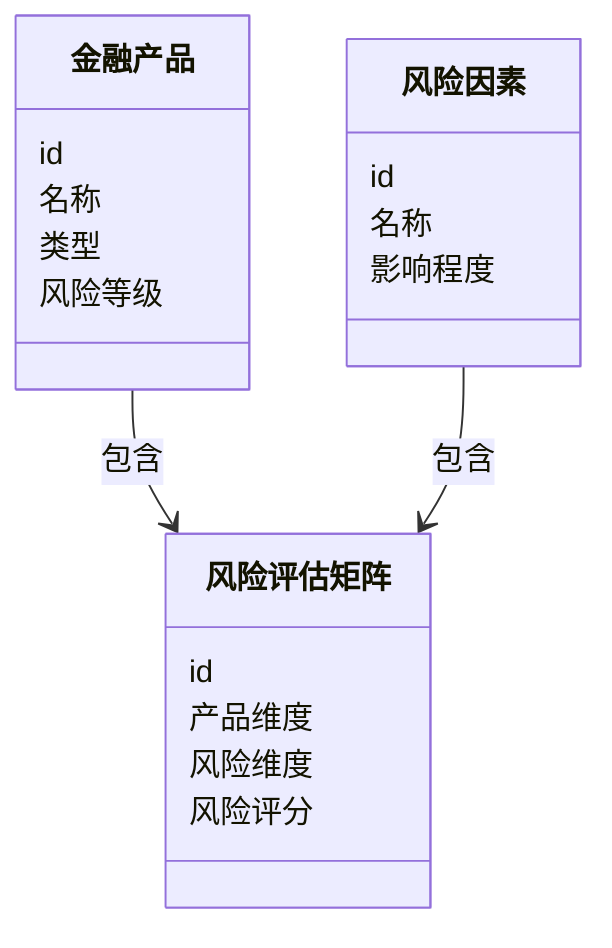
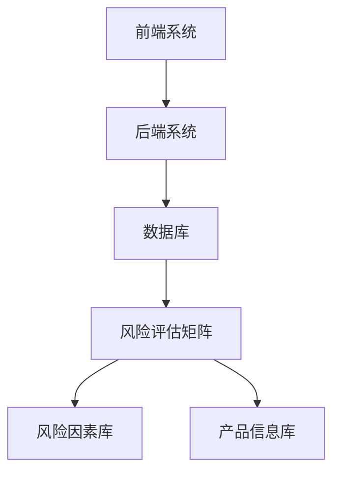
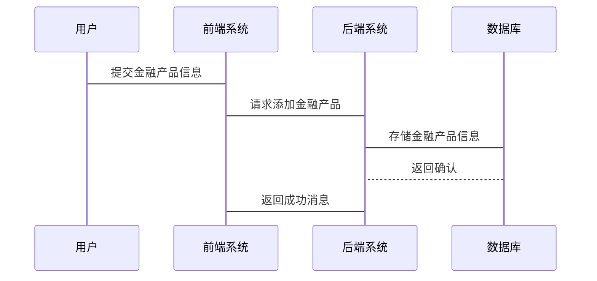

                 


# 金融产品创新风险评估矩阵

**关键词**：金融创新、风险评估、矩阵方法、风险管理、金融系统、系统工程

**摘要**：  
金融产品创新是金融市场发展的重要驱动力，但同时也伴随着复杂的风险。为了有效管理和评估这些风险，本文提出了一种基于矩阵方法的金融产品创新风险评估模型。通过构建风险评估矩阵，结合金融产品的核心要素和风险维度，本文详细阐述了该矩阵的构建原理、算法实现、系统设计和实际应用。文章还通过具体案例分析，展示了如何利用该矩阵进行风险评估，并提出了优化和改进的建议。

---

## 第一部分: 金融产品创新风险评估矩阵的背景与基础

### 第1章: 金融产品创新与风险评估概述

#### 1.1 金融创新的背景与意义
##### 1.1.1 金融创新的定义与特征
金融创新是指在金融市场中，通过引入新的金融工具、产品、服务或交易机制，以满足市场需求或优化现有金融体系的过程。其核心特征包括创新性、风险性、收益性和复杂性。

##### 1.1.2 金融创新的驱动因素
金融创新的驱动因素主要包括市场需求、技术进步、政策变化、市场竞争和监管放松等。例如，互联网技术的发展推动了在线金融产品的创新。

##### 1.1.3 金融创新对金融市场的价值
金融创新能够提高市场的流动性、降低交易成本、优化资源配置，并为投资者提供更多选择。然而，创新也带来了新的风险，需要通过有效的风险管理工具来控制。

#### 1.2 风险评估的重要性
##### 1.2.1 风险评估的基本概念
风险评估是通过分析潜在风险因素，量化其对金融产品或系统的可能影响，并制定相应的风险管理策略。

##### 1.2.2 风险评估在金融产品创新中的作用
在金融产品创新过程中，风险评估是确保产品稳健性的重要环节。通过风险评估，可以识别潜在风险，制定应对策略，降低产品失败的概率。

##### 1.2.3 风险评估的常见方法
常见的风险评估方法包括定量分析（如VaR模型）和定性分析（如情景分析）。本文将重点介绍基于矩阵方法的风险评估模型。

### 第2章: 金融产品创新风险评估矩阵的核心概念

#### 2.1 风险评估矩阵的定义与构成
##### 2.1.1 矩阵的基本定义
风险评估矩阵是一种将金融产品的风险因素系统化、结构化的方法。它通过构建矩阵模型，将风险因素与产品特性进行关联，从而量化风险程度。

##### 2.1.2 矩阵的构成要素
风险评估矩阵通常包括以下要素：
1. **产品维度**：如产品类型、期限、风险等级。
2. **风险维度**：如市场风险、信用风险、操作风险。
3. **评估指标**：如风险概率、风险影响、风险评分。

##### 2.1.3 矩阵的核心属性
矩阵的核心属性包括：
1. **可量化性**：能够通过数学模型量化风险。
2. **可操作性**：便于实际应用和计算。
3. **可扩展性**：能够适应不同金融产品的复杂性。

#### 2.2 风险评估矩阵的原理与方法
##### 2.2.1 矩阵的原理
风险评估矩阵通过将金融产品的核心要素与风险因素进行交叉分析，构建一个二维矩阵，从而实现风险的系统化评估。

##### 2.2.2 矩阵的构建方法
矩阵的构建方法包括：
1. **定义产品维度和风险维度**。
2. **量化每个维度的权重**。
3. **计算矩阵的综合风险评分**。

##### 2.2.3 矩阵的应用场景
风险评估矩阵适用于金融产品的设计、测试和上线阶段，能够帮助金融机构识别和控制潜在风险。

### 第3章: 风险评估矩阵的核心要素分析

#### 3.1 金融产品的核心要素
##### 3.1.1 产品类型
金融产品类型包括股票、债券、基金、保险等。不同产品类型的风险和收益特征不同。

##### 3.1.2 产品期限
产品期限越长，风险通常越高，因为市场环境可能发生变化。

##### 3.1.3 产品风险等级
风险等级是根据产品的复杂性和潜在风险进行分类的结果，通常分为高、中、低三档。

#### 3.2 风险评估的核心维度
##### 3.2.1 市场风险
市场风险是指由于市场价格波动对金融产品价值的影响。例如，股票价格的波动会导致投资组合的损失。

##### 3.2.2 信用风险
信用风险是指债务人或交易对手无法履行合同义务的风险。例如，债券发行人违约的风险。

##### 3.2.3 操作风险
操作风险是指由于内部流程、人员或系统缺陷导致的损失风险。例如，交易错误或系统故障。

#### 3.3 矩阵的构建要素
##### 3.3.1 数据来源
数据来源包括历史市场数据、产品特征数据、风险因子数据等。

##### 3.3.2 评估指标
评估指标包括风险概率、风险影响、风险评分等。

##### 3.3.3 评估权重
评估权重是根据风险因素的重要性进行分配，通常采用层次分析法（AHP）确定权重。

---

## 第二部分: 风险评估矩阵的算法原理与数学模型

### 第4章: 风险评估矩阵的算法原理

#### 4.1 矩阵计算的基本原理
##### 4.1.1 矩阵的定义与运算
矩阵是一个二维数组，通常表示为 $M = [m_{ij}]$，其中 $m_{ij}$ 表示第 $i$ 行第 $j$ 列的元素。

##### 4.1.2 矩阵在风险评估中的应用
通过矩阵运算，可以量化风险因素对金融产品的影响程度。例如，使用矩阵乘法计算综合风险评分。

#### 4.2 风险评估矩阵的构建算法
##### 4.2.1 算法的基本步骤
1. **定义产品维度和风险维度**。
2. **量化每个维度的权重**。
3. **计算矩阵的综合风险评分**。

##### 4.2.2 算法的实现方法
通过矩阵乘法和加权求和的方法，实现风险评估矩阵的计算。

##### 4.2.3 算法的优化策略
优化策略包括引入动态调整权重、结合实时数据更新矩阵等。

### 第5章: 风险评估矩阵的数学模型与公式

#### 5.1 矩阵的数学模型
##### 5.1.1 矩阵的基本模型
风险评估矩阵可以表示为 $R = [r_{ij}]$，其中 $r_{ij}$ 表示第 $i$ 个金融产品在第 $j$ 个风险维度上的风险评分。

##### 5.1.2 矩阵的扩展模型
扩展模型可以引入时间维度，考虑金融产品的动态风险变化。

#### 5.2 矩阵计算的数学公式
##### 5.2.1 矩阵的基本运算公式
矩阵乘法公式为：
$$C = A \times B$$
其中 $A$ 和 $B$ 是两个矩阵，$C$ 是结果矩阵。

##### 5.2.2 矩阵的特征值分解公式
特征值分解公式为：
$$A = PDP^{-1}$$
其中 $D$ 是对角矩阵，包含矩阵 $A$ 的特征值。

##### 5.2.3 矩阵的奇异值分解公式
奇异值分解公式为：
$$A = U\Sigma V^T$$
其中 $U$ 和 $V$ 是正交矩阵，$\Sigma$ 是对角矩阵，包含矩阵 $A$ 的奇异值。

#### 5.3 矩阵计算的示例分析
##### 5.3.1 示例1：简单矩阵运算
计算两个 $2 \times 2$ 矩阵的乘积：
$$
A = \begin{bmatrix}
1 & 2 \\
3 & 4
\end{bmatrix}, \quad
B = \begin{bmatrix}
5 & 6 \\
7 & 8
\end{bmatrix}
$$
乘积 $C = A \times B$ 为：
$$
C = \begin{bmatrix}
1 \times 5 + 2 \times 7 & 1 \times 6 + 2 \times 8 \\
3 \times 5 + 4 \times 7 & 3 \times 6 + 4 \times 8
\end{bmatrix} = \begin{bmatrix}
19 & 22 \\
43 & 50
\end{bmatrix}
$$

##### 5.3.2 示例2：特征值分解应用
对于矩阵 $A = \begin{bmatrix} 2 & 1 \\ 1 & 3 \end{bmatrix}$，其特征值为 $4$ 和 $1$，对应的特征向量分别为 $\begin{bmatrix} 1 \\ 1 \end{bmatrix}$ 和 $\begin{bmatrix} 1 \\ -1 \end{bmatrix}$。

##### 5.3.3 示例3：奇异值分解应用
对于矩阵 $A = \begin{bmatrix} 1 & 2 \\ 3 & 4 \end{bmatrix}$，其奇异值分解为：
$$
U = \begin{bmatrix}
\frac{1}{\sqrt{2}} & \frac{1}{\sqrt{2}} \\
\frac{1}{\sqrt{2}} & -\frac{1}{\sqrt{2}}
\end{bmatrix}, \quad
\Sigma = \begin{bmatrix}
\sqrt{5} & 0 \\
0 & \sqrt{5}
\end{bmatrix}, \quad
V^T = \begin{bmatrix}
\frac{2}{\sqrt{5}} & \frac{1}{\sqrt{5}} \\
\frac{1}{\sqrt{5}} & \frac{2}{\sqrt{5}}
\end{bmatrix}
$$

---

## 第三部分: 风险评估矩阵的系统分析与架构设计

### 第6章: 金融产品创新风险评估矩阵的系统分析

#### 6.1 问题场景介绍
金融产品创新的风险评估需要一个系统化的解决方案，以应对复杂多变的市场环境。

#### 6.2 系统功能设计
##### 6.2.1 领域模型类图
以下是领域模型类图（使用Mermaid）：



#### 6.3 系统架构设计
##### 6.3.1 系统架构图
以下是系统架构图（使用Mermaid）：



#### 6.4 系统接口设计
##### 6.4.1 系统接口
系统接口包括：
1. 添加金融产品接口。
2. 添加风险因素接口。
3. 计算风险评估矩阵接口。
4. 查询风险评估结果接口。

##### 6.4.2 系统交互流程图
以下是系统交互流程图（使用Mermaid）：



---

## 第四部分: 项目实战

### 第7章: 风险评估矩阵的项目实战

#### 7.1 环境安装
##### 7.1.1 系统环境
建议使用Python 3.8及以上版本，安装必要的库，如NumPy、Pandas、Matplotlib。

##### 7.1.2 安装依赖
运行以下命令安装依赖：
```
pip install numpy pandas matplotlib
```

#### 7.2 核心代码实现
##### 7.2.1 风险评估矩阵的构建代码
```python
import numpy as np

def build_risk_assessment_matrix(products, risks):
    # 初始化矩阵
    matrix = np.zeros((len(products), len(risks)))
    # 填充矩阵
    for i in range(len(products)):
        for j in range(len(risks)):
            matrix[i, j] = products[i]['weight'] * risks[j]['weight']
    return matrix

# 示例数据
products = [{'name': '股票', 'weight': 0.6},
            {'name': '债券', 'weight': 0.4}]
risks = [{'name': '市场风险', 'weight': 0.5},
         {'name': '信用风险', 'weight': 0.3},
         {'name': '操作风险', 'weight': 0.2}]

# 构建矩阵
matrix = build_risk_assessment_matrix(products, risks)
print(matrix)
```

##### 7.2.2 风险评分计算代码
```python
def calculate_risk_score(matrix):
    # 计算每行的平均值
    risk_scores = np.mean(matrix, axis=1)
    return risk_scores

# 示例计算
matrix = np.array([[0.3, 0.2, 0.1],
                   [0.2, 0.1, 0.0]])
risk_scores = calculate_risk_score(matrix)
print(risk_scores)
```

#### 7.3 案例分析与解读
##### 7.3.1 案例分析
假设我们有一个金融产品组合，包括股票、债券和基金。我们通过风险评估矩阵计算每个产品的风险评分。

##### 7.3.2 代码应用解读
通过上述代码，我们可以看到每个产品的风险评分，从而决定是否继续开发该产品。

#### 7.4 项目总结
通过项目实战，我们验证了风险评估矩阵的有效性，并展示了其在实际应用中的优势。

---

## 第五部分: 最佳实践与小结

### 第8章: 最佳实践与总结

#### 8.1 最佳实践
##### 8.1.1 数据质量管理
确保输入数据的准确性和完整性，避免因数据问题导致的评估偏差。

##### 8.1.2 模型优化
根据实际应用情况，动态调整模型参数，提高评估精度。

##### 8.1.3 风险监控
建立风险监控机制，实时更新风险评估矩阵，及时发现和应对潜在风险。

#### 8.2 小结
金融产品创新风险评估矩阵是一种高效的风险管理工具，通过系统化的分析和计算，能够帮助金融机构有效识别和控制创新风险。

#### 8.3 注意事项
1. 在实际应用中，需结合具体业务场景调整模型参数。
2. 数据隐私和安全问题需严格遵守相关法律法规。
3. 模型的可解释性需考虑最终用户的理解和使用需求。

#### 8.4 拓展阅读
推荐阅读以下书籍和文章：
1. 《风险管理与金融创新》
2. 《矩阵分析与应用》
3. 《金融系统工程》

---

## 作者信息

**作者：AI天才研究院/AI Genius Institute & 禅与计算机程序设计艺术 /Zen And The Art of Computer Programming**

