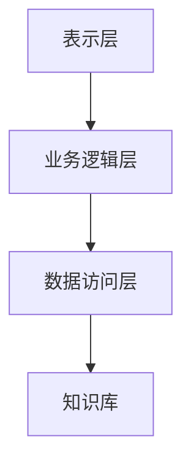
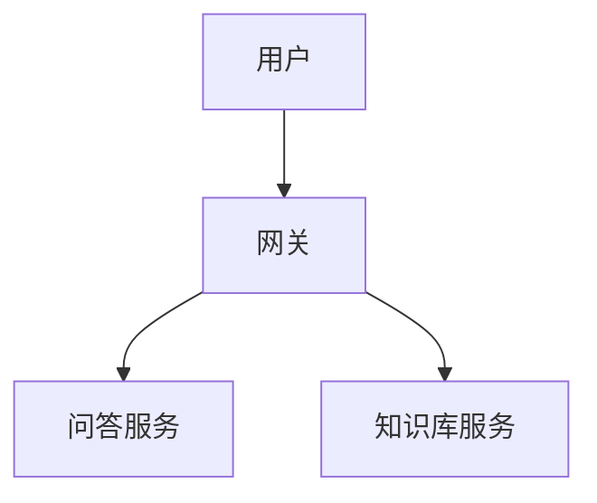
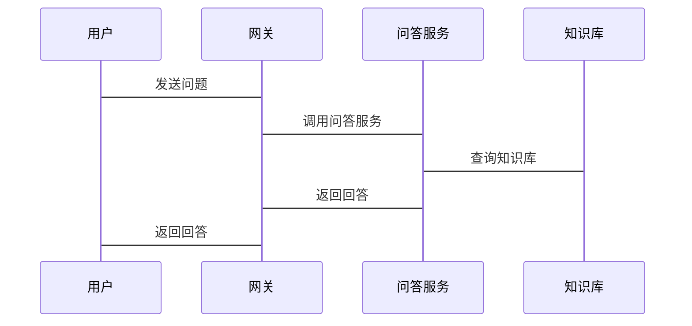

                 


# AI Agent 的知识问答：构建基于 LLM 的智能问答系统

> 关键词：AI Agent, LLM, 智能问答系统, 大语言模型, 自然语言处理, 问答系统, 人工智能

> 摘要：本文详细探讨了如何利用大语言模型（LLM）构建智能问答系统。文章从AI Agent的基本概念出发，深入分析了LLM的核心原理，详细讲解了问答系统的算法实现，结合实际项目案例，展示了系统的架构设计和优化方法。最后，总结了最佳实践和未来发展趋势。

---

# 第1章: AI Agent 智能问答系统概述

## 1.1 AI Agent 的概念与背景

### 1.1.1 什么是AI Agent

AI Agent（人工智能代理）是一种能够感知环境、理解用户需求并执行相应操作的智能实体。它通过自然语言处理（NLP）技术，能够理解和生成人类语言，从而实现与用户的交互。AI Agent 的核心目标是通过自动化的方式解决问题、提供信息或完成任务。

AI Agent 的发展依赖于以下几个关键因素：

1. **计算能力的提升**：强大的计算能力使得复杂的模型训练成为可能。
2. **数据的爆炸式增长**：海量的数据为模型训练提供了丰富的素材。
3. **算法的突破**：如大语言模型（LLM）的出现，显著提升了AI Agent的智能水平。

### 1.1.2 AI Agent 的发展背景

随着人工智能技术的飞速发展，AI Agent 已经从理论研究走向实际应用。尤其是在智能问答系统领域，AI Agent 的应用极大地提升了用户体验。以下是 AI Agent 发展的几个关键阶段：

1. **规则驱动阶段**：基于简单的规则进行问答，适用于特定领域的问题。
2. **模式匹配阶段**：通过关键词匹配实现问答，但灵活性有限。
3. **机器学习阶段**：引入了基于特征的分类算法，提升了问答的准确率。
4. **深度学习阶段**：大语言模型的出现，使得问答系统能够理解和生成复杂的语言表达。

### 1.1.3 智能问答系统的定义与特点

智能问答系统是一种基于自然语言处理技术的系统，能够通过理解和生成人类语言，回答用户的问题。其特点包括：

- **智能化**：能够理解上下文和隐含信息。
- **自适应性**：能够根据用户反馈不断优化回答。
- **多领域支持**：适用于多种领域的问题。
- **实时性**：能够快速响应用户请求。

---

## 1.2 LLM 在智能问答中的应用

### 1.2.1 大语言模型的概述

大语言模型（Large Language Model, LLM）是一种基于深度学习的自然语言处理模型，具有亿级别参数。LLM 的核心优势在于其强大的上下文理解和生成能力，能够处理复杂的语言任务。

### 1.2.2 LLM 在问答系统中的优势

LLM 在智能问答系统中的应用具有以下优势：

1. **强大的上下文理解能力**：能够理解问题的背景和上下文。
2. **丰富的知识库**：通过训练大量的数据，模型能够回答广泛领域的问题。
3. **动态调整能力**：能够根据对话历史调整回答策略。

### 1.2.3 智能问答系统的应用场景

智能问答系统广泛应用于多个领域，包括：

1. **客户服务**：为用户提供产品咨询、售后支持等服务。
2. **教育**：为学生提供学习指导和答疑。
3. **医疗**：为患者提供疾病咨询和建议。
4. **金融**：为投资者提供股票、基金等信息的解答。

---

## 1.3 本章小结

本章介绍了 AI Agent 的基本概念和发展背景，并重点探讨了 LLM 在智能问答系统中的应用。通过对比不同阶段的问答系统，突出了 LLM 的优势和广泛的应用场景。

---

# 第2章: 大语言模型的核心原理

## 2.1 大语言模型的训练过程

### 2.1.1 数据预处理

数据预处理是模型训练的基础，主要包括以下几个步骤：

1. **清洗数据**：去除噪音数据，如特殊字符、停用词等。
2. **分词处理**：将文本分割成词语或短语。
3. **数据增强**：通过替换、同义词替换等方式增加数据的多样性。

### 2.1.2 模型训练

模型训练是通过优化目标函数，调整模型参数，使得模型能够生成符合预期的输出。以下是常见的训练步骤：

1. **输入处理**：将输入文本转换为模型能够理解的格式。
2. **损失计算**：计算预测值与真实值之间的差异。
3. **参数更新**：通过反向传播算法更新模型参数。

### 2.1.3 微调与优化

微调是通过在特定领域数据上进一步训练模型，以提升其在该领域的性能。优化步骤包括：

1. **超参数调优**：调整学习率、批次大小等参数。
2. **模型剪枝**：去除冗余的参数，减少计算量。
3. **模型融合**：将多个模型的输出进行融合，提升性能。

---

## 2.2 模型的推理机制

### 2.2.1 解码过程

解码过程是模型生成输出的关键步骤，主要包括：

1. **输入编码**：将输入文本转换为模型能够理解的向量表示。
2. **生成解码**：通过解码器生成序列，逐步生成输出。
3. **概率计算**：计算每个可能的输出的概率，选择概率最高的输出。

### 2.2.2 注意力机制

注意力机制是模型理解上下文的重要工具，通过计算输入序列中每个位置的重要性，生成注意力权重矩阵。公式如下：

$$
\text{Attention}(Q, K, V) = \text{softmax}\left(\frac{QK^T}{\sqrt{d_k}}\right)V
$$

其中，$Q$ 是查询向量，$K$ 是键向量，$V$ 是值向量，$d_k$ 是向量的维度。

### 2.2.3 概率生成模型

概率生成模型通过最大化条件概率来生成输出，公式如下：

$$
P(y|x) = \prod_{i=1}^{n} P(y_i | y_{<i}, x)
$$

其中，$y$ 是生成的序列，$x$ 是输入序列。

---

## 2.3 模型评估与优化

### 2.3.1 评估指标

常用的模型评估指标包括：

- **准确率**：预测正确的比例。
- **BLEU**：基于 n-gram 的对齐度量。
- **ROUGE**：基于召回率的度量。

### 2.3.2 超参数调优

超参数调优是提升模型性能的重要手段，常见的调优方法包括：

1. **网格搜索**：遍历所有可能的参数组合，选择最优参数。
2. **随机搜索**：随机选择参数组合，减少计算量。
3. **贝叶斯优化**：通过概率模型优化参数。

### 2.3.3 模型压缩与部署

模型压缩是减少模型体积、提升推理速度的重要手段，常见的压缩方法包括：

1. **剪枝**：去除冗余的参数。
2. **量化**：将模型参数的精度降低。
3. **知识蒸馏**：将大模型的知识迁移到小模型。

---

## 2.4 本章小结

本章详细介绍了大语言模型的核心原理，包括训练过程、推理机制和模型优化方法。通过理解这些原理，我们可以更好地设计和优化智能问答系统。

---

# 第3章: 智能问答系统的算法原理

## 3.1 基于LLM 的问答系统流程

### 3.1.1 输入处理

输入处理是问答系统的第一步，主要包括：

1. **文本预处理**：去除噪音、分词等。
2. **意图识别**：识别用户的意图和需求。

### 3.1.2 模型调用

模型调用是通过 API 或 SDK 调用大语言模型，生成回答。具体步骤包括：

1. **请求构建**：将输入文本转换为模型能够理解的格式。
2. **模型推理**：调用模型生成回答。
3. **结果解析**：将模型的输出解析为结构化的数据。

### 3.1.3 结果解析与反馈

结果解析是将模型的输出转换为用户能够理解的形式，并提供反馈机制，如：

1. **回答评分**：根据模型输出的置信度评分。
2. **用户反馈**：收集用户的满意度反馈，优化回答质量。

---

## 3.2 常见算法与优化

### 3.2.1 解码策略

解码策略是影响回答质量的重要因素，常见的解码策略包括：

1. **贪心解码**：每次选择概率最高的词。
2. **随机采样**：随机选择可能的输出。
3. **束搜索**：限制解码的宽度，选择最优的序列。

### 3.2.2 多轮对话管理

多轮对话管理是通过记忆对话历史，提升回答的连贯性。常见的实现方法包括：

1. **记忆网络**：通过记忆模块记录对话历史。
2. **状态管理**：通过状态机管理对话流程。

### 3.2.3 知识库的融合

知识库的融合是通过结合外部知识库，提升回答的准确率。常见的知识库包括：

1. **结构化知识库**：如数据库、知识图谱。
2. **非结构化知识库**：如文档、网页。

---

## 3.3 算法实现的代码示例

### 3.3.1 环境安装

安装所需的依赖库，例如：

```
pip install transformers torch
```

### 3.3.2 核心代码

以下是一个简单的问答系统实现代码：

```python
from transformers import AutoTokenizer, AutoModelForQuestionAnswering

tokenizer = AutoTokenizer.from_pretrained("bert-base-uncased")
model = AutoModelForQuestionAnswering.from_pretrained("bert-base-uncased")

def answer_question(question, context):
    inputs = tokenizer.encode_plus(question, context, return_tensors="pt")
    outputs = model(**inputs)
    start = torch.argmax(outputs.start_logits).item()
    end = torch.argmax(outputs.end_logits).item()
    return tokenizer.decode(inputs['input_ids'][0][start:end+1])
```

### 3.3.3 代码解读

上述代码使用了BERT模型进行问答系统实现：

1. **tokenizer**：将输入文本转换为模型能够理解的格式。
2. **model**：预训练好的问答模型。
3. **answer_question**：输入问题和上下文，生成回答。

---

## 3.4 本章小结

本章详细介绍了基于LLM的问答系统算法原理，包括流程设计、算法优化和代码实现。通过理解这些内容，我们可以更好地设计和实现智能问答系统。

---

# 第4章: 智能问答系统的架构设计

## 4.1 系统功能模块划分

智能问答系统的功能模块包括：

1. **用户交互模块**：负责接收用户输入和输出回答。
2. **模型调用模块**：负责调用大语言模型生成回答。
3. **知识库管理模块**：负责管理和更新知识库。

---

## 4.2 系统架构设计

### 4.2.1 分层架构

分层架构将系统分为表示层、业务逻辑层和数据访问层，如下图所示：



### 4.2.2 微服务架构

微服务架构将系统划分为多个独立的服务，如下图所示：



### 4.2.3 可扩展性设计

可扩展性设计通过模块化和异构部署，提升系统的扩展能力。

---

## 4.3 接口设计与交互流程

### 4.3.1 API 接口定义

常用的API接口包括：

1. **GET /question**：接收问题并返回回答。
2. **POST /context**：上传知识库内容。

### 4.3.2 交互流程图

以下是一个简单的交互流程图：



---

## 4.4 本章小结

本章详细介绍了智能问答系统的架构设计，包括功能模块划分、架构设计和接口设计。通过合理的架构设计，可以提升系统的可扩展性和可维护性。

---

# 第5章: 智能问答系统项目实战

## 5.1 项目环境搭建

### 5.1.1 开发环境选择

推荐使用以下开发环境：

1. **操作系统**：Linux 或 macOS。
2. **编程语言**：Python 3.8+。
3. **IDE**：PyCharm 或 VS Code。

### 5.1.2 依赖库安装

安装以下依赖库：

```
pip install transformers torch huggingface-hub
```

---

## 5.2 核心功能实现

### 5.2.1 用户输入处理

用户输入处理包括：

1. **文本预处理**：去除噪音、分词等。
2. **意图识别**：识别用户的意图和需求。

### 5.2.2 模型调用实现

模型调用实现包括：

1. **API 调用**：通过 API 调用大语言模型。
2. **结果解析**：将模型输出解析为结构化的数据。

### 5.2.3 结果解析与反馈

结果解析与反馈包括：

1. **回答评分**：根据模型输出的置信度评分。
2. **用户反馈**：收集用户的满意度反馈，优化回答质量。

---

## 5.3 项目优化与调优

### 5.3.1 性能优化

性能优化包括：

1. **模型压缩**：减少模型体积。
2. **并行计算**：利用多线程或分布式计算提升性能。

### 5.3.2 模型调优

模型调优包括：

1. **超参数调优**：调整学习率、批次大小等参数。
2. **知识蒸馏**：将大模型的知识迁移到小模型。

### 5.3.3 系统扩展

系统扩展包括：

1. **模块化设计**：通过模块化设计提升系统的可扩展性。
2. **异构部署**：通过多平台部署提升系统的可用性。

---

## 5.4 项目案例分析

### 5.4.1 案例背景

以客户服务领域为例，设计一个智能问答系统，帮助客户解答产品咨询和售后问题。

### 5.4.2 实施过程

1. **需求分析**：明确用户需求和系统功能。
2. **数据收集**：收集相关领域的问答数据。
3. **模型训练**：基于收集的数据进行模型训练。
4. **系统部署**：将系统部署到生产环境。

### 5.4.3 优化经验总结

1. **数据质量**：数据的质量直接影响模型的性能。
2. **模型选择**：选择适合的模型可以显著提升系统性能。
3. **系统监控**：实时监控系统性能，及时发现和解决问题。

---

## 5.5 本章小结

本章通过实际案例分析，展示了智能问答系统的项目实施过程。通过优化和调优，可以显著提升系统的性能和用户体验。

---

# 第6章: 智能问答系统的最佳实践

## 6.1 开发中的注意事项

### 6.1.1 模型选择与优化

选择适合的模型，并通过调优提升模型性能。

### 6.1.2 知识库构建与管理

构建高质量的知识库，并通过模块化设计提升知识库的可维护性。

### 6.1.3 系统安全与隐私保护

确保系统的安全性，保护用户的隐私数据。

---

## 6.2 项目部署与维护

### 6.2.1 环境部署

将系统部署到生产环境，确保系统的稳定性和可用性。

### 6.2.2 系统监控

通过监控工具实时监控系统性能，及时发现和解决问题。

### 6.2.3 错误排查与处理

建立完善的错误日志和处理机制，快速定位和解决问题。

---

## 6.3 未来发展趋势

### 6.3.1 多模态问答

未来的问答系统将更加注重多模态的处理能力，支持图片、视频等多种形式的输入。

### 6.3.2 知识图谱的深度应用

知识图谱的深度应用将提升问答系统的准确率和响应速度。

### 6.3.3 自适应学习

自适应学习将使得问答系统能够根据用户的反馈不断优化自身的性能。

---

## 6.4 本章小结

本章总结了智能问答系统开发中的注意事项，并展望了未来的发展趋势。通过不断优化和创新，智能问答系统将为用户提供更加智能化的服务。

---

# 作者：AI天才研究院/AI Genius Institute & 禅与计算机程序设计艺术 /Zen And The Art of Computer Programming

---

感谢您的阅读！希望本文对您理解基于LLM的智能问答系统有所帮助。如果需要进一步探讨或技术支持，欢迎随时联系！

