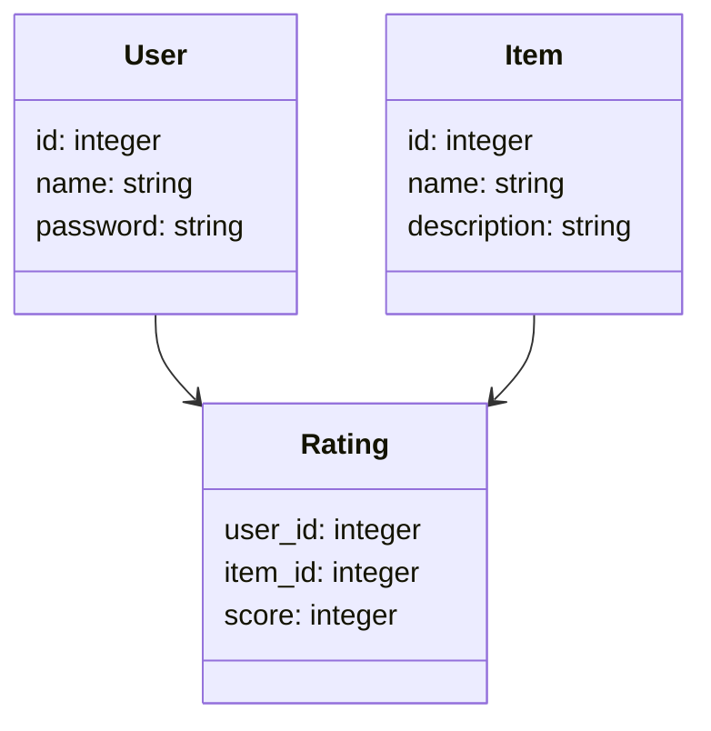
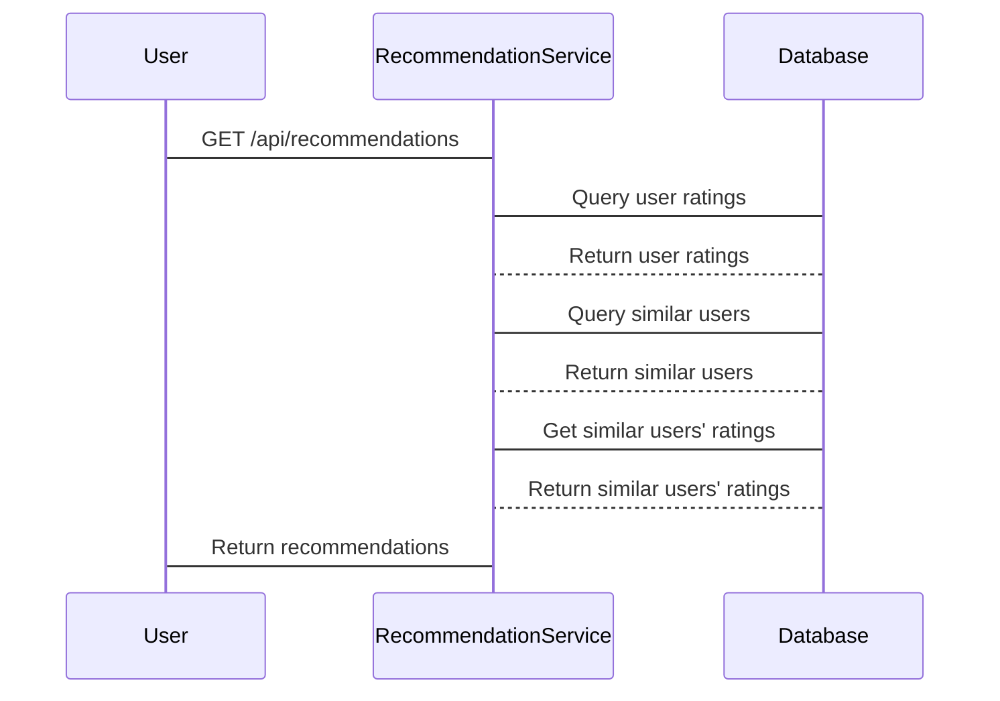

                 


# AI Agent的个性化推荐系统优化

> 关键词：AI Agent，个性化推荐，协同过滤，推荐算法，系统优化

> 摘要：本文深入探讨了AI Agent在个性化推荐系统中的应用与优化，从基本原理到高级算法，从系统架构到项目实战，全面解析了如何构建高效、精准的推荐系统。文章通过实际案例和数学模型，结合代码实现，为读者提供了一套完整的优化方案。

---

# 第一部分: AI Agent与个性化推荐系统概述

# 第1章: AI Agent与个性化推荐系统概述

## 1.1 AI Agent的基本概念
### 1.1.1 AI Agent的定义与特点
AI Agent（智能代理）是指能够感知环境、自主决策并执行任务的智能实体。它具备以下特点：
- **自主性**：能够在没有外部干预的情况下运行。
- **反应性**：能够根据环境变化调整行为。
- **目标导向**：通过实现目标来提供服务。

### 1.1.2 AI Agent的核心功能与应用场景
AI Agent的核心功能包括信息收集、数据处理、决策制定和任务执行。它广泛应用于推荐系统、智能助手、自动化交易等领域。

### 1.1.3 个性化推荐系统的定义与目标
个性化推荐系统通过分析用户行为和偏好，提供符合用户需求的内容或产品。其目标是提高用户体验、增加用户粘性和提升业务转化率。

## 1.2 个性化推荐系统的背景与挑战
### 1.2.1 当前推荐系统的痛点
- 数据量庞大，计算复杂度高。
- 用户偏好变化快，模型需要动态更新。
- 隐私与数据安全问题日益突出。

### 1.2.2 个性化推荐的核心问题与边界
核心问题包括如何高效计算用户偏好、如何处理数据稀疏性、如何避免过拟合等。边界则涉及用户隐私保护、计算资源限制等。

### 1.2.3 AI Agent在推荐系统中的作用
AI Agent通过实时数据处理和自主决策，提升了推荐系统的响应速度和准确性。

## 1.3 本章小结
本章介绍了AI Agent的基本概念和个性化推荐系统的目标与挑战，为后续内容奠定了基础。

---

# 第二部分: AI Agent推荐系统的核心概念与联系

# 第2章: AI Agent推荐系统的原理与架构

## 2.1 AI Agent推荐系统的原理
### 2.1.1 用户行为分析与建模
用户行为分析是推荐系统的核心，包括点击、浏览、购买等行为的记录与分析。

### 2.1.2 物品特征提取与表示
通过自然语言处理和特征工程，将物品（如电影、文章）转化为可计算的向量表示。

### 2.1.3 推荐结果生成与优化
基于用户行为和物品特征，生成推荐列表，并通过反馈机制不断优化推荐效果。

## 2.2 AI Agent推荐系统的架构
### 2.2.1 分层架构设计
推荐系统通常分为数据层、算法层和应用层，各层之间通过接口交互。

### 2.2.2 模块化设计与交互流程
模块化设计包括数据采集模块、特征提取模块、推荐算法模块和结果展示模块。

### 2.2.3 系统扩展性与可维护性
通过模块化设计，提升系统的扩展性和可维护性，方便功能的扩展和优化。

## 2.3 核心概念对比与ER图
### 2.3.1 用户、物品、推荐的关系模型
用户、物品和推荐之间形成一个三元关系，用户对物品的评分影响推荐结果。

### 2.3.2 ER图展示
```mermaid
er
  actor User {
    id: integer
    name: string
  }
  actor Item {
    id: integer
    name: string
  }
  relation User_Item {
    user_id: integer
    item_id: integer
    score: integer
  }
  User --> User_Item
  Item --> User_Item
```

## 2.4 本章小结
本章详细介绍了AI Agent推荐系统的原理和架构，并通过ER图展示了核心概念之间的关系。

---

# 第三部分: AI Agent推荐系统的算法原理

# 第3章: 基于协同过滤的推荐算法

## 3.1 协同过滤算法的基本原理
### 3.1.1 基于用户的协同过滤
通过寻找与目标用户相似的用户，推荐这些用户喜欢的物品。

### 3.1.2 基于物品的协同过滤
通过分析物品之间的相似性，推荐与目标用户已感兴趣物品相似的其他物品。

## 3.2 协同过滤算法的实现步骤
### 3.2.1 数据预处理
- 去除无效数据
- 处理缺失值

### 3.2.2 特征提取与相似度计算
- 使用余弦相似度或欧氏距离计算用户或物品之间的相似度。

### 3.2.3 推荐结果生成
基于相似度计算，生成推荐列表并排序。

## 3.3 协同过滤算法的优化
### 3.3.1 邻域大小的选择
选择合适的邻域大小，平衡准确性和计算效率。

### 3.3.2 处理数据稀疏性
使用混合推荐算法（如基于模型的协同过滤）来缓解数据稀疏性问题。

## 3.4 协同过滤算法的数学模型
### 3.4.1 用户-物品评分矩阵
$$
R = (r_{u,i})_{U \times I}
$$
其中，$R$ 是评分矩阵，$r_{u,i}$ 表示用户 $u$ 对物品 $i$ 的评分。

### 3.4.2 用户相似度计算
$$
similarity(u, u') = \frac{\sum_{i} (r_{u,i} - \bar{r}_u)(r_{u',i} - \bar{r}_u)}}{\sqrt{\sum_{i} (r_{u,i} - \bar{r}_u)^2} \cdot \sqrt{\sum_{i} (r_{u',i} - \bar{r}_u)^2}}
$$
其中，$\bar{r}_u$ 是用户 $u$ 的平均评分。

## 3.5 协同过滤算法的代码实现
### 3.5.1 数据加载与预处理
```python
import pandas as pd
from sklearn.metrics.pairwise import cosine_similarity

# 加载数据
data = pd.read_csv('ratings.csv')

# 数据预处理
data.dropna(inplace=True)
```

### 3.5.2 特征提取与相似度计算
```python
# 计算用户-物品评分矩阵
user_item_matrix = data.pivot_table('rating', index='user_id', columns='item_id', fill_value=0)

# 计算相似度矩阵
similarity_matrix = cosine_similarity(user_item_matrix.T)
```

### 3.5.3 推荐结果生成
```python
def get_recommendations(user_id, similarity_matrix, num_recommendations=5):
    # 找到目标用户的索引
    user_index = user_item_matrix.index.get_loc(user_id)
    # 计算相似度排名
    similarity_rank = similarity_matrix[user_index]
    # 排序并获取推荐结果
    recommended_items = similarity_rank.argsort()[::-1][:num_recommendations]
    return recommended_items
```

## 3.6 本章小结
本章详细讲解了协同过滤算法的原理和实现步骤，并通过代码示例展示了如何在实际项目中应用。

---

# 第四部分: AI Agent推荐系统的系统架构设计

# 第4章: 推荐系统的架构与实现

## 4.1 系统功能设计
### 4.1.1 需求分析
- 用户注册与登录
- 个性化推荐展示
- 推荐结果反馈

### 4.1.2 领域模型设计


### 4.1.3 功能模块划分
- 数据采集模块
- 特征提取模块
- 推荐算法模块
- 推荐结果展示模块

## 4.2 系统架构设计
### 4.2.1 分层架构
- 数据层：存储用户、物品和评分数据。
- 服务层：提供数据处理和推荐算法服务。
- 表现层：展示推荐结果。

### 4.2.2 微服务架构
- 用户服务
- 物品服务
- 推荐服务

## 4.3 系统接口设计
### 4.3.1 RESTful API设计
- `/api/users`：用户管理接口
- `/api/items`：物品管理接口
- `/api/recommendations`：推荐接口

### 4.3.2 接口交互流程


## 4.4 本章小结
本章通过领域模型和架构图展示了推荐系统的整体设计，并详细描述了系统接口的交互流程。

---

# 第五部分: AI Agent推荐系统的项目实战

# 第5章: 个性化推荐系统的实战

## 5.1 项目环境安装与配置
### 5.1.1 安装依赖
```bash
pip install pandas numpy scikit-learn matplotlib
```

### 5.1.2 数据集准备
- 使用公开数据集（如MovieLens）
- 数据清洗与预处理

## 5.2 系统核心实现
### 5.2.1 数据加载与预处理
```python
import pandas as pd
from sklearn.model_selection import train_test_split

# 加载数据
data = pd.read_csv('ratings.csv')

# 数据分割
train_data, test_data = train_test_split(data, test_size=0.2)
```

### 5.2.2 特征提取与模型训练
```python
from sklearn.decomposition import TruncatedSVD

# 训练模型
model = TruncatedSVD(n_components=50)
model.fit(train_data)
```

### 5.2.3 推荐结果展示
```python
def show_recommendations(user_id, model, test_data):
    # 预测评分
    predicted_ratings = model.transform(test_data)
    # 获取推荐列表
    recommendations = predicted_ratings[user_id]
    # 返回前5个推荐
    return recommendations[:5]
```

## 5.3 项目案例分析
### 5.3.1 案例背景
以电影推荐为例，分析如何通过协同过滤算法为用户推荐电影。

### 5.3.2 案例实现
```python
import numpy as np

# 示例数据
users = ['user1', 'user2', 'user3']
items = ['movie1', 'movie2', 'movie3']
ratings = {
    'user1': {'movie1': 5, 'movie2': 4},
    'user2': {'movie2': 4, 'movie3': 5},
    'user3': {'movie1': 3, 'movie3': 4}
}

# 计算相似度
similarity = np.array([[1.0, 0.8, 0.5],
                       [0.8, 1.0, 0.7],
                       [0.5, 0.7, 1.0]])

# 推荐结果
def recommend(user, similarity, ratings):
    user_index = users.index(user)
    similarities = similarity[user_index]
    recommended_movies = []
    for i in range(len(similarities)):
        if ratings[users[i]][items[0]] == 0:
            recommended_movies.append((similarities[i], items[0]))
    recommended_movies.sort(reverse=True)
    return recommended_movies

# 示例调用
print(recommend('user1', similarity, ratings))
```

## 5.4 项目小结
本章通过实际项目展示了推荐系统的实现过程，包括数据准备、模型训练和结果展示。

---

# 第六部分: AI Agent推荐系统的优化策略

# 第6章: 推荐系统的优化策略

## 6.1 系统性能优化
### 6.1.1 算法优化
- 使用矩阵分解技术（如SVD）提升推荐准确度
- 引入隐式反馈数据

### 6.1.2 系统优化
- 分布式计算
- 异常处理与容错机制

## 6.2 优化策略的实际案例
### 6.2.1 案例背景
某电商平台的推荐系统优化案例。

### 6.2.2 优化方案
- 引入协同过滤与深度学习模型结合
- 实时处理用户行为数据

## 6.3 优化效果评估
### 6.3.1 指标评估
- 准确率
- 召回率
- F1分数

### 6.3.2 用户反馈
- 用户满意度提升
- 转化率提高

## 6.4 本章小结
本章通过实际案例展示了如何优化推荐系统，并评估了优化效果。

---

# 第七部分: 总结与展望

# 第7章: 总结与展望

## 7.1 本文章总结
本文系统地介绍了AI Agent在个性化推荐系统中的应用与优化，从基本原理到系统架构，再到项目实战，全面解析了推荐系统的实现过程。

## 7.2 未来展望
随着AI技术的发展，推荐系统将更加智能化和个性化。未来的研究方向包括：
- 更加精准的用户画像
- 实时推荐与动态更新
- 多模态推荐（结合文本、图像等信息）

---

# 作者信息

作者：AI天才研究院/AI Genius Institute & 禅与计算机程序设计艺术 /Zen And The Art of Computer Programming

