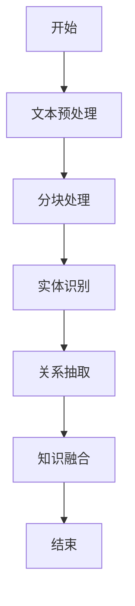
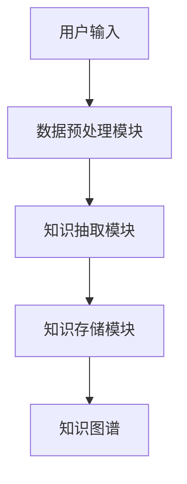

                 


# AI Agent的知识图谱构建：从LLM输出中提取结构化知识

> 关键词：AI Agent, 知识图谱, 大语言模型, 结构化知识, 知识抽取

> 摘要：本文详细探讨了AI Agent的知识图谱构建过程，重点从大语言模型（LLM）的输出中提取结构化知识。文章首先介绍了知识图谱和AI Agent的基本概念，分析了LLM输出的特点与挑战。接着，深入讲解了知识图谱构建的核心概念与算法原理，包括文本到结构化数据的转换方法和知识融合技术。然后，从系统架构设计的角度，阐述了知识图谱构建的整体框架与实现方案。最后，通过一个电商知识图谱的实战案例，详细展示了项目的实施过程，并总结了知识图谱构建的关键点与未来发展方向。

---

# 第1章：知识图谱与AI Agent概述

## 1.1 知识图谱的基本概念

### 1.1.1 知识图谱的定义与特点

知识图谱是一种以结构化形式表示知识的网络，由实体和关系组成，能够描述真实世界中的概念及其联系。与传统数据库相比，知识图谱具有语义丰富、可扩展性强的特点。

**知识图谱的特点：**
- **语义丰富性**：通过实体和关系描述复杂的语义信息。
- **可扩展性**：支持动态扩展和新增知识。
- **结构化**：采用图结构，便于计算机理解和推理。

### 1.1.2 知识图谱的构建目标

知识图谱的构建目标是将分散的、非结构化的数据转化为结构化的知识网络，以便于机器理解和推理。

**构建目标：**
- **数据整合**：将多源数据整合到统一的知识图谱中。
- **知识表示**：用统一的符号系统表示知识。
- **语义推理**：支持基于知识图谱的语义推理。

### 1.1.3 知识图谱与传统数据库的区别

| 特性 | 知识图谱 | 传统数据库 |
|------|----------|-------------|
| 数据结构 | 图结构，包含实体和关系 | 行列结构，基于事务 |
| 数据表示 | 使用符号和关系描述 | 基于属性值描述 |
| 查询能力 | 支持语义查询和推理 | 支持简单查询 |

---

## 1.2 AI Agent的基本概念

### 1.2.1 AI Agent的定义与分类

AI Agent（智能体）是指在环境中能够感知并自主行动以实现目标的实体。AI Agent可以分为简单反射Agent和基于模型的Agent两类。

**AI Agent的分类：**
- **简单反射Agent**：基于当前感知做出反应，不依赖内部模型。
- **基于模型的Agent**：利用内部模型进行推理和规划。

### 1.2.2 AI Agent的核心功能与能力

AI Agent的核心功能包括感知、决策、执行和学习。它需要具备以下能力：
- **感知能力**：通过传感器或数据接口获取环境信息。
- **决策能力**：基于知识库和推理引擎做出决策。
- **执行能力**：通过执行器或API与环境交互。
- **学习能力**：通过机器学习算法不断优化自身行为。

### 1.2.3 AI Agent在智能系统中的作用

AI Agent在智能系统中充当连接数据与行动的桥梁，能够根据知识图谱中的知识做出智能决策。

**AI Agent的作用：**
- **知识表示**：利用知识图谱表示任务相关的知识。
- **推理与决策**：基于知识图谱进行推理，做出最优决策。
- **人机交互**：通过自然语言理解与用户交互。

---

## 1.3 知识图谱在AI Agent中的应用

### 1.3.1 知识图谱作为AI Agent的知识库

知识图谱为AI Agent提供了丰富的知识表示，使其能够理解复杂语义。

**知识图谱的作用：**
- **知识存储**：存储结构化的知识。
- **语义理解**：帮助AI Agent理解输入的语义。
- **推理支持**：支持基于知识图谱的推理。

### 1.3.2 知识图谱对AI Agent决策的支持

知识图谱通过提供语义信息，帮助AI Agent做出更智能的决策。

**决策支持：**
- **上下文理解**：基于知识图谱理解上下文。
- **多步推理**：通过知识图谱进行多步推理。
- **知识融合**：结合多源知识进行决策。

### 1.3.3 知识图谱在AI Agent中的典型应用场景

知识图谱在AI Agent中的应用场景包括智能问答、推荐系统、语义搜索等。

**应用场景：**
- **智能问答**：基于知识图谱提供准确答案。
- **推荐系统**：利用知识图谱进行个性化推荐。
- **语义搜索**：基于语义理解提升搜索结果的相关性。

---

## 1.4 本章小结

本章介绍了知识图谱和AI Agent的基本概念，分析了知识图谱在AI Agent中的作用和应用场景。知识图谱作为AI Agent的知识库，能够支持智能决策和语义理解，是实现智能系统的核心技术之一。

---

# 第2章：大语言模型（LLM）的输出特点与挑战

## 2.1 大语言模型的基本原理

### 2.1.1 大语言模型的训练机制

大语言模型通过监督学习和无监督学习结合的方式进行训练，能够捕捉数据中的语义信息。

**训练机制：**
- **监督学习**：使用带标签的数据进行有监督训练。
- **无监督学习**：利用大量未标注数据进行自监督学习。

### 2.1.2 大语言模型的输出特点

大语言模型的输出具有以下特点：
- **文本丰富性**：生成的文本内容丰富，但可能存在错误。
- **上下文理解**：能够理解上下文，生成连贯的文本。
- **可解释性差**：输出的决策过程难以解释。

### 2.1.3 大语言模型的局限性

尽管大语言模型性能强大，但也存在一些局限性：
- **知识更新**：知识可能过时。
- **推理能力有限**：难以处理复杂逻辑推理。
- **输出可控性**：输出结果的可控性较差。

---

## 2.2 LLM输出中的结构化知识提取挑战

### 2.2.1 LLM输出的文本特点

大语言模型的输出文本具有以下特点：
- **自然流畅**：生成的文本自然流畅，但缺乏结构化。
- **多义性**：可能存在歧义，需要上下文理解。
- **不准确性**：输出结果可能存在错误。

### 2.2.2 结构化知识提取的难点

从LLM输出中提取结构化知识的难点包括：
- **文本歧义**：文本可能存在多种解释。
- **知识完整性**：提取的知识可能不完整。
- **语义理解**：需要理解复杂的语义关系。

### 2.2.3 知识图谱构建中的常见问题

知识图谱构建中常见的问题包括：
- **数据质量**：数据可能存在噪声。
- **知识覆盖**：知识覆盖范围有限。
- **推理能力**：推理能力不足，难以处理复杂问题。

---

## 2.3 知识图谱构建的目标与意义

### 2.3.1 知识图谱构建的目标

知识图谱的构建目标是将分散的、非结构化的数据转化为结构化的知识网络。

**构建目标：**
- **数据整合**：整合多源数据。
- **知识表示**：用统一的符号系统表示知识。
- **语义推理**：支持语义推理。

### 2.3.2 知识图谱构建的意义

知识图谱的构建具有重要意义：
- **提升智能性**：提升AI Agent的智能性。
- **增强决策能力**：增强决策的准确性和可靠性。
- **促进知识共享**：促进知识的共享和复用。

### 2.3.3 知识图谱构建的技术路线

知识图谱的构建技术路线包括：
1. **数据收集与预处理**：收集数据并进行清洗。
2. **知识抽取**：从文本中提取结构化知识。
3. **知识融合**：将多个知识源的数据进行融合。
4. **知识存储与管理**：存储知识图谱并进行管理。

---

## 2.4 本章小结

本章分析了大语言模型的输出特点与挑战，探讨了知识图谱构建的目标与意义。从LLM输出中提取结构化知识是构建知识图谱的关键步骤，具有重要的技术挑战和应用价值。

---

# 第3章：知识图谱构建的核心概念与联系

## 3.1 知识图谱的核心概念

### 3.1.1 实体与属性

**实体**是知识图谱中的基本元素，表示现实世界中的具体事物或概念。**属性**描述实体的特征或性质。

**示例：**
- 实体：张三
- 属性：年龄、职业

### 3.1.2 关系与事实

**关系**描述实体之间的关联，**事实**是关系的实例。

**示例：**
- 关系：出生在
- 事实：张三出生在中国。

### 3.1.3 知识图谱的层次结构

知识图谱的层次结构包括实例层和概念层。

**层次结构：**
- **实例层**：描述具体实例。
- **概念层**：描述概念和关系。

---

## 3.2 大语言模型与知识图谱的关系

### 3.2.1 LLM作为知识抽取工具

大语言模型可以作为知识抽取工具，从文本中提取结构化知识。

**作用：**
- **实体识别**：识别文本中的实体。
- **关系抽取**：抽取实体之间的关系。

### 3.2.2 知识图谱作为LLM的知识增强

知识图谱可以作为大语言模型的知识增强，提升其理解能力。

**优势：**
- **知识丰富性**：提供丰富的知识表示。
- **语义理解**：提升语义理解能力。

### 3.2.3 LLM与知识图谱的协同工作

大语言模型和知识图谱可以协同工作，共同提升智能系统的性能。

**协同工作：**
- **知识抽取**：利用LLM进行知识抽取。
- **知识推理**：基于知识图谱进行推理。

---

## 3.3 知识图谱构建的流程与方法

### 3.3.1 数据收集与预处理

数据收集与预处理是知识图谱构建的基础。

**步骤：**
1. **数据收集**：收集多源数据。
2. **数据清洗**：清洗数据，去除噪声。
3. **数据分块**：将数据分成多个块。

### 3.3.2 知识抽取与融合

知识抽取与融合是构建知识图谱的核心步骤。

**步骤：**
1. **知识抽取**：从文本中提取结构化知识。
2. **知识融合**：将多个知识源的数据进行融合。

### 3.3.3 知识存储与管理

知识存储与管理是知识图谱构建的重要环节。

**步骤：**
1. **知识存储**：将知识存储在数据库中。
2. **知识管理**：对知识进行管理和维护。

---

## 3.4 本章小结

本章介绍了知识图谱的核心概念，分析了大语言模型与知识图谱的关系，探讨了知识图谱构建的流程与方法。知识图谱的核心概念包括实体、属性、关系和事实，这些概念共同构成了知识图谱的结构。

---

# 第4章：从LLM输出中提取结构化知识的算法原理

## 4.1 文本到结构化数据的转换方法

### 4.1.1 基于规则的文本解析

**基于规则的文本解析**是一种常用的文本解析方法。

**步骤：**
1. **规则定义**：定义文本解析规则。
2. **文本匹配**：根据规则匹配文本。
3. **结构化提取**：提取结构化数据。

### 4.1.2 基于模式匹配的知识抽取

**基于模式匹配的知识抽取**是一种常用的知识抽取方法。

**步骤：**
1. **模式定义**：定义知识抽取模式。
2. **文本匹配**：根据模式匹配文本。
3. **知识提取**：提取知识。

### 4.1.3 基于上下文理解的实体识别

**基于上下文理解的实体识别**是一种更先进的实体识别方法。

**步骤：**
1. **上下文理解**：理解文本的上下文。
2. **实体识别**：根据上下文识别实体。

---

## 4.2 知识抽取的算法实现

### 4.2.1 分块处理与实体识别

**分块处理**是一种常用的文本处理方法。

**步骤：**
1. **文本分块**：将文本分成多个块。
2. **实体识别**：在每个块中识别实体。

### 4.2.2 关系抽取与事实构建

**关系抽取**是知识抽取的重要步骤。

**步骤：**
1. **关系识别**：识别实体之间的关系。
2. **事实构建**：构建事实。

### 4.2.3 知识融合与冲突处理

**知识融合**是将多个知识源的数据进行融合的过程。

**步骤：**
1. **知识融合**：将多个知识源的数据进行融合。
2. **冲突处理**：处理知识融合中的冲突。

---

## 4.3 算法流程图



---

## 4.4 本章小结

本章详细讲解了从LLM输出中提取结构化知识的算法原理，包括文本到结构化数据的转换方法和知识抽取的实现步骤。算法流程图展示了从文本预处理到知识融合的完整流程。

---

# 第5章：知识图谱构建的系统架构与设计方案

## 5.1 系统整体架构

### 5.1.1 系统功能模块划分

知识图谱构建系统主要包括以下功能模块：
1. **数据预处理模块**：负责数据的清洗和分块。
2. **知识抽取模块**：负责知识的抽取和融合。
3. **知识存储模块**：负责知识的存储和管理。

### 5.1.2 系统架构设计

知识图谱构建系统的架构设计如下：



### 5.1.3 系统性能优化

系统性能优化的关键点包括：
1. **并行处理**：利用多线程或分布式计算提高处理速度。
2. **缓存优化**：优化缓存策略，减少重复计算。

---

## 5.2 数据预处理模块

### 5.2.1 数据清洗与格式转换

数据清洗是数据预处理的重要步骤。

**步骤：**
1. **数据清洗**：去除噪声数据。
2. **格式转换**：将数据转换为统一的格式。

### 5.2.2 数据分块与并行处理

数据分块与并行处理可以提高处理效率。

**步骤：**
1. **数据分块**：将数据分成多个块。
2. **并行处理**：对每个块进行并行处理。

### 5.2.3 数据质量评估

数据质量评估是确保数据质量的重要步骤。

**步骤：**
1. **数据评估**：评估数据的质量。
2. **数据清洗**：根据评估结果清洗数据。

---

## 5.3 知识抽取模块

### 5.3.1 实体识别算法实现

**实体识别算法实现**是知识抽取的核心步骤。

**步骤：**
1. **文本分块**：将文本分成多个块。
2. **实体识别**：在每个块中识别实体。

### 5.3.2 关系抽取算法实现

**关系抽取算法实现**是知识抽取的重要步骤。

**步骤：**
1. **关系识别**：识别实体之间的关系。
2. **关系抽取**：抽取关系。

### 5.3.3 知识融合与冲突处理

**知识融合与冲突处理**是将多个知识源的数据进行融合的过程。

**步骤：**
1. **知识融合**：将多个知识源的数据进行融合。
2. **冲突处理**：处理知识融合中的冲突。

---

## 5.4 本章小结

本章详细讲解了知识图谱构建的系统架构与设计方案，包括数据预处理模块和知识抽取模块的设计。系统架构设计展示了从数据输入到知识图谱构建的完整流程。

---

# 第6章：项目实战——电商知识图谱构建

## 6.1 项目背景与目标

### 6.1.1 项目背景

电商知识图谱构建的背景包括：
- **数据爆炸**：电商数据快速增长。
- **知识需求**：电商系统需要结构化的知识支持。

### 6.1.2 项目目标

电商知识图谱构建的目标包括：
1. **整合电商数据**：整合电商领域的多源数据。
2. **构建知识图谱**：构建电商领域的知识图谱。
3. **支持智能应用**：支持电商系统的智能应用。

---

## 6.2 项目环境与工具

### 6.2.1 环境配置

电商知识图谱构建的环境配置包括：
1. **操作系统**：Linux/Windows/MacOS。
2. **编程语言**：Python。
3. **开发工具**：PyCharm/VS Code。
4. **依赖库**：numpy, pandas, networkx。

### 6.2.2 工具安装

电商知识图谱构建需要安装以下工具：
1. **Python**：编程语言。
2. **pandas**：数据处理库。
3. **networkx**：图数据结构库。

---

## 6.3 系统核心实现

### 6.3.1 数据预处理代码

数据预处理代码如下：

```python
import pandas as pd

# 读取数据
data = pd.read_csv('input.csv')

# 数据清洗
data.dropna(inplace=True)

# 数据分块
data_blocks = np.array_split(data, 4)
```

### 6.3.2 知识抽取代码

知识抽取代码如下：

```python
import networkx as nx

# 实体识别
entities = extract_entities(data_blocks)

# 关系抽取
relations = extract_relations(data_blocks)

# 知识图谱构建
graph = nx.Graph()
for entity in entities:
    graph.add_node(entity)
for relation in relations:
    graph.add_edge(relation[0], relation[1])
```

### 6.3.3 知识图谱存储代码

知识图谱存储代码如下：

```python
# 数据存储
nx.write_graphml(graph, 'knowledge_graph.graphml')
```

---

## 6.4 项目小结

本章通过一个电商知识图谱构建的实战案例，详细展示了项目的实施过程。从数据预处理到知识抽取，再到知识图谱的存储，每个步骤都进行了详细的代码实现和分析。

---

# 第7章：总结与展望

## 7.1 本章总结

本文详细探讨了AI Agent的知识图谱构建过程，重点从大语言模型的输出中提取结构化知识。文章首先介绍了知识图谱和AI Agent的基本概念，分析了LLM输出的特点与挑战。接着，深入讲解了知识图谱构建的核心概念与算法原理，包括文本到结构化数据的转换方法和知识融合技术。然后，从系统架构设计的角度，阐述了知识图谱构建的整体框架与实现方案。最后，通过一个电商知识图谱的实战案例，详细展示了项目的实施过程，并总结了知识图谱构建的关键点与未来发展方向。

---

## 7.2 未来展望

知识图谱在AI Agent中的应用前景广阔，未来的研究方向包括：
- **知识图谱的动态更新**：如何动态更新知识图谱以应对数据变化。
- **知识图谱的可解释性**：如何提高知识图谱的可解释性。
- **知识图谱的跨领域应用**：如何将知识图谱应用于更多领域。

---

# 作者：AI天才研究院/AI Genius Institute & 禅与计算机程序设计艺术 /Zen And The Art of Computer Programming

