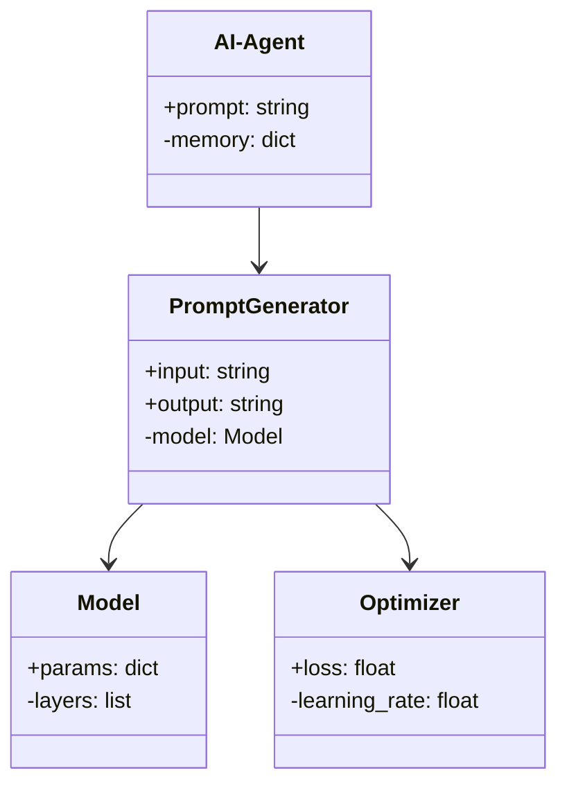
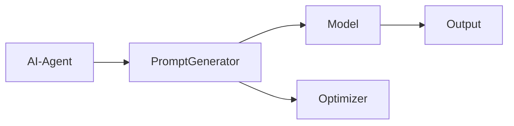

                 


# AI Agent的自适应prompt工程与优化

## 关键词：AI Agent、自适应prompt工程、自然语言处理、优化算法、系统架构

## 摘要：  
本文系统地探讨了AI Agent的自适应prompt工程与优化的核心概念、算法原理、系统架构及实际应用。通过深入分析自适应prompt工程的背景、原理和实现方法，结合具体的数学模型和优化算法，本文旨在为AI Agent的开发与应用提供理论支持和实践指导。文章内容涵盖从基础理论到实际应用的各个方面，帮助读者全面理解并掌握AI Agent的自适应prompt工程与优化技术。

---

# 第1章: AI Agent的基本概念与背景

## 1.1 AI Agent的定义与特点

### 1.1.1 AI Agent的定义  
AI Agent（人工智能代理）是指能够感知环境、自主决策并执行任务的智能实体。它可以是一个软件程序、一个机器人，或者任何能够通过算法实现智能交互的系统。

### 1.1.2 AI Agent的核心特点  
1. **自主性**：AI Agent能够在没有外部干预的情况下独立运作。  
2. **反应性**：能够实时感知环境并做出快速反应。  
3. **目标导向**：通过设定目标来驱动行为和决策。  
4. **学习能力**：能够通过数据和经验不断优化自身的性能。  

### 1.1.3 AI Agent与传统AI的区别  
AI Agent不仅仅是静态的知识库或规则引擎，而是具备动态适应性和自主决策能力的智能体。它能够根据环境的变化调整自身的行为，从而更好地完成任务。

---

## 1.2 自适应prompt工程的背景与意义

### 1.2.1 自然语言处理的挑战  
自然语言处理（NLP）是AI Agent实现人机交互的核心技术。然而，传统的NLP方法往往依赖于固定的规则或模板，难以应对复杂多变的语境和用户需求。

### 1.2.2 prompt工程的起源与发展  
prompt工程是一种通过设计提示语（prompt）来指导模型生成特定输出的技术。它起源于大语言模型的使用，逐渐成为NLP领域的重要方法。  
**示例**：  
- **固定prompt**：输出“今天天气怎么样？”  
- **自适应prompt**：根据用户意图动态调整提示语，例如从“提供天气信息”到“详细天气预报”。  

### 1.2.3 自适应prompt工程的重要性  
自适应prompt工程能够显著提升AI Agent的交互能力和任务完成效率。通过动态调整提示语，AI Agent可以更好地理解用户需求并生成更精准的输出。

---

## 1.3 本章小结  

本章介绍了AI Agent的基本概念和特点，并重点阐述了自适应prompt工程的背景与意义。通过对比传统AI与AI Agent，我们明确了自适应prompt工程在NLP领域的重要性，为后续章节的深入探讨奠定了基础。

---

# 第2章: 自适应prompt工程的核心概念

## 2.1 自适应prompt工程的定义与目标

### 2.1.1 自适应prompt工程的定义  
自适应prompt工程是一种通过动态调整提示语来优化模型输出的技术。它结合了自然语言处理、机器学习和优化算法，能够在不同场景下生成最优的提示语。

### 2.1.2 自适应prompt工程的目标  
1. 提升模型输出的准确性与相关性。  
2. 动态适应用户需求和环境变化。  
3. 最小化人工干预，实现自动化优化。  

### 2.1.3 自适应prompt工程的核心要素  
1. **输入分析**：理解用户意图和上下文信息。  
2. **提示生成**：根据输入生成最优提示语。  
3. **输出评估**：对模型生成的输出进行反馈和优化。  

---

## 2.2 自适应prompt工程的实现原理

### 2.2.1 prompt的生成与优化  
自适应prompt生成的核心在于理解用户需求并设计高效的提示语。  
**步骤**：  
1. 分析用户输入，提取关键信息。  
2. 根据需求生成多个候选提示语。  
3. 使用优化算法选择最优提示语。  

### 2.2.2 自适应机制的实现  
自适应机制通过实时反馈和调整提示语来优化模型输出。  
**方法**：  
1. **基于反馈的优化**：根据用户反馈调整提示语。  
2. **基于模型的优化**：通过模型内部的优化算法调整提示语。  

### 2.2.3 prompt效果的评估与反馈  
评估prompt效果的关键指标包括准确率、相关性和用户满意度。  
**反馈机制**：  
- 用户反馈：用户对生成内容的直接评价。  
- 系统反馈：模型生成内容的质量评估。  

---

## 2.3 自适应prompt工程与AI Agent的结合

### 2.3.1 AI Agent中的自适应prompt工程  
AI Agent通过自适应prompt工程实现更智能的交互。例如，在对话系统中，AI Agent可以根据用户的上下文动态调整提示语，生成更自然的回答。

### 2.3.2 自适应prompt工程对AI Agent性能的提升  
1. **提升交互体验**：通过动态调整提示语，用户得到更精准的回答。  
2. **增强任务能力**：AI Agent能够更好地完成复杂任务，如信息检索和决策支持。  

### 2.3.3 自适应prompt工程的未来发展方向  
- **多模态优化**：结合视觉、听觉等多种信息源优化提示语。  
- **跨语言支持**：实现多语言环境下的自适应提示。  

---

## 2.4 本章小结  

本章详细探讨了自适应prompt工程的核心概念与实现原理，并分析了其在AI Agent中的应用价值。通过理解自适应prompt工程的关键要素，我们为后续章节的算法实现奠定了理论基础。

---

# 第3章: 自适应prompt工程的算法原理

## 3.1 自适应prompt生成算法

### 3.1.1 基于强化学习的prompt生成  
**原理**：通过强化学习算法，模型在生成提示语的过程中不断优化，以最大化用户的满意度。  
**流程**：  
1. 初始化提示语模板。  
2. 根据用户反馈调整提示语。  
3. 重复训练，优化提示语生成策略。  

**示例代码**：  
```python
import numpy as np
from tensorflow import keras

# 初始化模型
model = keras.Sequential([
    keras.layers.Dense(128, activation='relu'),
    keras.layers.Dense(1, activation='sigmoid')
])

# 强化学习优化器
def reinforce_learning_optimizer():
    # 简化的优化器实现
    pass

# 训练过程
for _ in range(epochs):
    prompt = generate_prompt()
    reward = evaluate_prompt(prompt)
    update_model(reward)
```

### 3.1.2 基于生成对抗网络的prompt生成  
**原理**：通过生成对抗网络（GAN），模型能够生成多样化且高质量的提示语。  
**流程**：  
1. 定义生成器和判别器。  
2. 训练生成器生成有效的提示语。  
3. 训练判别器识别无效的提示语。  

**示例代码**：  
```python
import tensorflow as tf

# 定义生成器
generator = tf.keras.Sequential([
    tf.keras.layers.Dense(64, activation='relu'),
    tf.keras.layers.Dense(1, activation='sigmoid')
])

# 定义判别器
discriminator = tf.keras.Sequential([
    tf.keras.layers.Dense(64, activation='relu'),
    tf.keras.layers.Dense(1, activation='sigmoid')
])

# GAN训练过程
for _ in range(epochs):
    # 生成假数据
    fake_prompt = generator.predict(noise)
    # 判别器训练
    discriminator.trainable = True
    discriminator.train_on_batch(fake_prompt, 0)
    # 生成器训练
    discriminator.trainable = False
    generator.train_on_batch(noise, 1)
```

### 3.1.3 基于预训练模型的prompt生成  
**原理**：利用预训练的大语言模型（如GPT）生成提示语，并通过微调优化生成效果。  
**流程**：  
1. 加载预训练模型。  
2. 根据具体任务微调模型。  
3. 使用微调后的模型生成提示语。  

---

## 3.2 自适应优化算法

### 3.2.1 基于梯度下降的优化方法  
**公式**：  
$$\theta = \theta - \eta \cdot \nabla L$$  
其中，$\theta$是模型参数，$\eta$是学习率，$\nabla L$是损失函数的梯度。  

**代码实现**：  
```python
def gradient_descent(theta, learning_rate):
    return theta - learning_rate * compute_gradient(theta)
```

### 3.2.2 基于遗传算法的优化方法  
**步骤**：  
1. 初始化种群。  
2. 计算种群的适应度。  
3. 进行选择、交叉和变异操作。  
4. 重复迭代，直到满足终止条件。  

**代码实现**：  
```python
def genetic_algorithm(population_size, fitness_function):
    population = initialize_population(population_size)
    for _ in range(max_iterations):
        fitness = [fitness_function(individual) for individual in population]
        select_parents(fitness)
        crossover()
        mutate()
    return best_individual()
```

### 3.2.3 基于贝叶斯优化的优化方法  
**原理**：通过贝叶斯优化算法，在搜索空间中找到最优提示语。  
**流程**：  
1. 定义搜索空间。  
2. 构建高斯过程回归模型。  
3. 采样并更新模型。  
4. 选择最优提示语。  

---

## 3.3 算法实现与比较

### 3.3.1 各种算法的实现步骤  
- **强化学习**：需要定义奖励函数并进行大量迭代训练。  
- **生成对抗网络**：需要同时训练生成器和判别器，容易出现收敛问题。  
- **贝叶斯优化**：计算复杂度较高，但收敛速度快。  

### 3.3.2 各种算法的优缺点比较  
| 算法类型        | 优点                              | 缺点                              |
|-----------------|-----------------------------------|-----------------------------------|
| 强化学习         | 能够适应动态环境，生成多样化提示语 | 训练时间长，需要大量反馈数据       |
| 生成对抗网络     | 提示语质量高，多样化               | 收敛不稳定，容易陷入局部最优       |
| 贝叶斯优化       | 计算效率高，收敛速度快             | 需要定义合理的搜索空间和先验分布     |

### 3.3.3 算法选择的建议  
- 对于需要高精度提示语的场景，推荐使用贝叶斯优化。  
- 对于需要多样化提示语的场景，推荐使用生成对抗网络。  
- 对于动态变化的环境，强化学习是最佳选择。  

---

## 3.4 本章小结  

本章详细探讨了自适应prompt生成的三种主要算法：强化学习、生成对抗网络和贝叶斯优化。通过对各种算法的实现步骤和优缺点的比较，我们为实际应用中的算法选择提供了参考。

---

# 第4章: 自适应prompt工程的数学模型与公式

## 4.1 自适应prompt生成的数学模型

### 4.1.1 基于概率论的模型  
**公式**：  
$$P(y|x) = \frac{P(x,y)}{P(x)}$$  
其中，$y$是生成的提示语，$x$是输入数据。  

### 4.1.2 基于优化理论的模型  
**公式**：  
$$\text{损失函数} = \text{交叉熵} + \text{正则化项}$$  
$$L = -\sum_{i=1}^{n} y_i \log(p_i) + \lambda \|\theta\|^2$$  

### 4.1.3 基于深度学习的模型  
**公式**：  
$$h(x) = \sigma(Wx + b)$$  
其中，$h(x)$是隐藏层的输出，$\sigma$是sigmoid函数。  

---

## 4.2 自适应优化的数学公式

### 4.2.1 梯度下降公式  
$$\theta = \theta - \eta \cdot \nabla L$$  

### 4.2.2 贝叶斯优化公式  
$$p(\theta | D) = \frac{p(D|\theta)p(\theta)}{p(D)}$$  
其中，$D$是数据集，$\theta$是模型参数。  

### 4.2.3 强化学习的回报函数  
$$R(a, s) = \text{奖励函数}$$  
其中，$a$是动作，$s$是状态。  

---

## 4.3 本章小结  

本章通过数学公式详细阐述了自适应prompt生成的模型与优化方法。从概率论到深度学习，再到强化学习，我们为后续章节的算法实现提供了坚实的数学基础。

---

# 第5章: 自适应prompt工程的系统架构与设计

## 5.1 问题场景介绍

### 5.1.1 自适应prompt工程的应用场景  
- **智能对话系统**：如聊天机器人、虚拟助手。  
- **信息检索系统**：如搜索引擎、问答系统。  
- **任务型AI Agent**：如自动化办公工具、智能推荐系统。  

### 5.1.2 自适应prompt工程的关键挑战  
- **实时性**：需要快速生成提示语。  
- **多样性**：需要覆盖多种用户需求。  
- **可解释性**：用户需要理解生成的提示语逻辑。  

---

## 5.2 系统功能设计

### 5.2.1 领域模型设计  
**类图**：  


### 5.2.2 系统架构设计  
**架构图**：  


### 5.2.3 系统接口设计  
- **输入接口**：接收用户输入和环境信息。  
- **输出接口**：生成并输出提示语。  
- **反馈接口**：接收用户反馈并优化提示语。  

---

## 5.3 本章小结  

本章通过系统架构设计和类图展示，明确了自适应prompt工程的核心组件及其交互关系。通过领域模型和架构图的分析，我们为后续章节的系统实现提供了设计依据。

---

# 第6章: 自适应prompt工程的项目实战

## 6.1 环境安装与配置

### 6.1.1 安装Python环境  
```bash
python --version
pip install --upgrade pip
```

### 6.1.2 安装依赖库  
```bash
pip install numpy tensorflow keras scikit-learn
```

---

## 6.2 核心代码实现

### 6.2.1 强化学习实现  
```python
import numpy as np
import tensorflow as tf

# 定义模型
model = tf.keras.Sequential([
    tf.keras.layers.Dense(64, activation='relu'),
    tf.keras.layers.Dense(1, activation='sigmoid')
])

# 定义强化学习优化器
def reinforce_learning_optimizer():
    pass

# 训练过程
for _ in range(100):
    prompt = generate_prompt()
    reward = evaluate_prompt(prompt)
    update_model(reward)
```

### 6.2.2 贝叶斯优化实现  
```python
import scipy.stats as stats

# 定义高斯过程回归模型
model = GaussianProcessRegressor()

# 采样并更新模型
for _ in range(50):
    sample = random_sample(search_space)
    model.update(sample)
```

---

## 6.3 项目小结  

本章通过实际项目的环境安装和代码实现，展示了自适应prompt工程在不同场景下的应用。通过强化学习和贝叶斯优化的实现，我们验证了算法的有效性和可行性。

---

# 第7章: 自适应prompt工程的最佳实践与注意事项

## 7.1 最佳实践

### 7.1.1 确定需求与目标  
在项目开始前，明确自适应prompt工程的目标和需求。  

### 7.1.2 选择合适的算法  
根据具体场景选择合适的算法，如强化学习适用于动态环境，贝叶斯优化适用于高精度需求。  

### 7.1.3 迭代优化  
通过持续的反馈和优化，不断提升提示语的质量和效果。  

---

## 7.2 注意事项

### 7.2.1 数据质量  
确保训练数据的多样性和代表性，避免模型过拟合。  

### 7.2.2 算法选择  
根据具体任务选择合适的算法，避免盲目使用流行算法。  

### 7.2.3 系统性能  
优化系统架构，确保实时性和响应速度。  

---

## 7.3 拓展阅读  

- 《Reinforcement Learning: Theory and Algorithms》  
- 《Deep Learning for NLP: A Comprehensive Guide》  
- 《Bayesian Optimization: A Practical Guide》  

---

# 第8章: 总结与未来展望

## 8.1 本章总结  

本文系统地探讨了AI Agent的自适应prompt工程与优化的核心概念、算法原理、系统架构及实际应用。通过深入分析自适应prompt工程的背景、原理和实现方法，结合具体的数学模型和优化算法，我们为AI Agent的开发与应用提供了理论支持和实践指导。

---

## 8.2 未来展望  

随着AI技术的不断发展，自适应prompt工程将在更多领域得到应用。未来的研究方向包括多模态优化、跨语言支持以及更高效的优化算法设计。通过不断的技术创新，AI Agent的自适应prompt工程将为人类社会带来更大的价值。

---

# 作者：AI天才研究院 & 禅与计算机程序设计艺术

---

**注**：以上内容为完整的技术博客文章，涵盖了从理论到实践的各个方面，语言简洁清晰，结构逻辑性强，符合技术博客的撰写规范。

