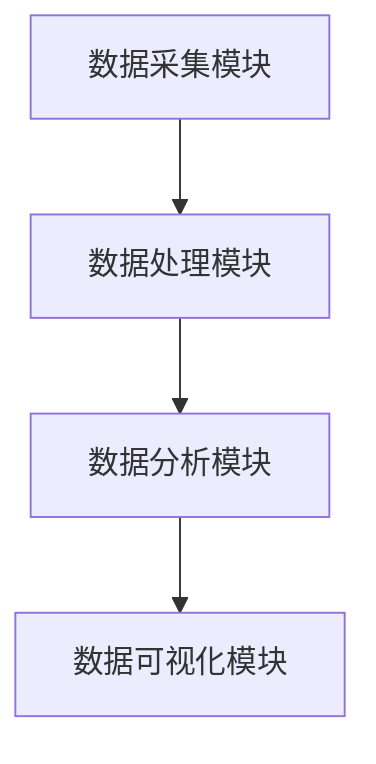
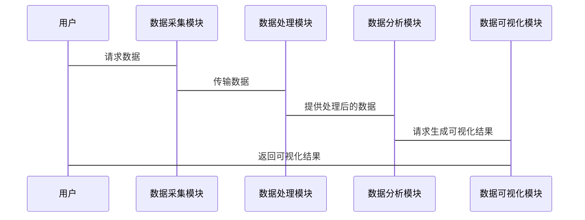

                 


# 价值投资者的数字化转型：大数据分析的应用

## 关键词：价值投资，数字化转型，大数据分析，数据分析算法，金融系统架构

## 摘要：  
随着金融市场的日益复杂化和数据量的爆炸式增长，传统价值投资方法正面临前所未有的挑战。本文从价值投资者的视角出发，系统阐述了大数据分析在数字化转型中的应用，深入探讨了如何利用大数据技术提升投资决策的效率和准确性。文章首先介绍了价值投资的核心理念和数字化转型的背景，接着详细分析了大数据分析的核心概念、常见算法及其在金融领域的应用。随后，构建了一个完整的价值投资大数据分析系统架构，并通过实际案例展示了如何将这些技术应用于投资实战。最后，总结了大数据分析对价值投资的深远影响，并展望了未来的发展趋势。

---

# 第一部分: 价值投资者的数字化转型背景与概述

## 第1章: 价值投资与数字化转型概述

### 1.1 价值投资的核心理念

#### 1.1.1 价值投资的基本定义  
价值投资是一种以基本面分析为核心的长期投资策略，旨在通过研究企业的财务状况、行业地位和管理团队等因素，发现其内在价值。其核心理念是“买入低于内在价值的资产”，并通过长期持有实现收益。

#### 1.1.2 价值投资的核心原则  
- **安全边际**：买入价格低于内在价值，确保投资的安全性。  
- **长期视角**：关注企业的长期增长潜力，而非短期市场波动。  
- **独立思考**：基于深度研究做出独立判断，避免盲目跟风。  

#### 1.1.3 价值投资的适用场景  
- **稳定行业**：如公用事业、消费品等行业适合价值投资。  
- **经济周期波动**：在经济下行周期中，价值投资策略往往表现更优。  

### 1.2 数字化转型的背景与趋势

#### 1.2.1 数字化转型的定义  
数字化转型是指通过利用数字技术（如大数据、人工智能、云计算等）改造传统业务模式、流程和决策方式，以实现业务创新和效率提升的过程。  

#### 1.2.2 企业数字化转型的驱动力  
- **技术进步**：云计算、人工智能等技术的快速发展为数字化转型提供了基础。  
- **市场竞争**：数字化转型已成为企业在现代市场竞争中保持竞争力的关键因素。  
- **客户需求**：客户对个性化、高效服务的需求推动企业加速数字化转型。  

#### 1.2.3 数字化转型对价值投资的影响  
- **数据驱动决策**：通过大数据分析，价值投资者可以更精准地评估企业价值。  
- **效率提升**：自动化数据处理和分析工具显著提高了投资决策的效率。  
- **风险控制**：大数据分析能够帮助投资者更好地识别和管理投资风险。  

### 1.3 大数据分析在价值投资中的应用前景

#### 1.3.1 大数据分析的定义  
大数据分析是指对海量、多样化、高速变化的数据进行采集、处理、分析和可视化的过程，旨在从数据中提取有价值的信息和洞察。  

#### 1.3.2 大数据分析在金融领域的应用  
- **股票预测**：通过分析历史股价和市场数据，预测未来股价走势。  
- **风险评估**：利用大数据技术评估投资组合的风险敞口。  
- **市场情绪分析**：通过社交媒体和新闻数据，捕捉市场情绪变化。  

#### 1.3.3 大数据分析对价值投资的潜在价值  
- **数据驱动的深度分析**：通过大数据分析，投资者可以更全面地评估企业的基本面。  
- **实时监控与预警**：实时跟踪市场动态，及时发现潜在风险。  
- **个性化投资策略**：根据投资者的风险偏好和市场环境，制定个性化的投资策略。  

---

## 第2章: 大数据分析的核心概念

### 2.1 数据采集与处理

#### 2.1.1 数据来源的多样性  
价值投资者需要的数据来源包括：  
- **财务数据**：如收入、利润、资产负债表等。  
- **市场数据**：如股价、成交量、指数等。  
- **新闻数据**：如公司公告、行业新闻等。  
- **社交媒体数据**：如投资者评论、情绪分析等。  

#### 2.1.2 数据清洗与预处理  
- **数据清洗**：去除重复数据、处理缺失值、纠正异常值。  
- **数据标准化**：将不同来源的数据统一格式，便于后续分析。  

#### 2.1.3 数据存储与管理  
- **数据库选择**：根据数据类型选择关系型数据库（如MySQL）或非关系型数据库（如MongoDB）。  
- **数据仓库**：构建数据仓库，集中存储和管理海量数据。  

### 2.2 数据分析与建模

#### 2.2.1 数据分析的基本方法  
- **描述性分析**：总结数据的基本特征，如均值、中位数等。  
- **诊断性分析**：分析数据的分布特征，发现异常点。  
- **预测性分析**：基于历史数据预测未来趋势。  
- **解释性分析**：揭示数据背后的原因和驱动因素。  

#### 2.2.2 数据建模的原理  
数据建模是通过数学模型描述数据之间的关系，常见的建模方法包括回归分析、聚类分析和时间序列分析等。  

#### 2.2.3 数据分析的挑战与解决方案  
- **数据量大**：采用分布式计算框架（如Hadoop、Spark）。  
- **数据多样性**：使用多种分析方法，如文本挖掘、图像识别等。  
- **计算效率**：优化算法复杂度，减少计算时间。  

### 2.3 数据可视化与决策支持

#### 2.3.1 数据可视化的定义  
数据可视化是将数据以图形、图表等形式呈现，帮助用户更好地理解和分析数据。  

#### 2.3.2 数据可视化工具的选择  
- **Tableau**：适合企业级数据可视化。  
- **Power BI**：微软的商业智能工具。  
- **Matplotlib**：Python的可视化库。  

#### 2.3.3 数据可视化在价值投资中的应用  
- **股价趋势图**：通过折线图展示股价走势。  
- **财务指标对比图**：如收入、利润等指标的对比分析。  
- **市场情绪仪表盘**：实时显示市场情绪的变化。  

### 2.4 本章小结  
本章介绍了大数据分析的核心概念，包括数据采集、处理、分析和可视化的全过程，并重点分析了这些技术在价值投资中的应用。

---

## 第3章: 常见数据分析算法概述

### 3.1 回归分析

#### 3.1.1 线性回归的原理  
线性回归是一种通过拟合一条直线来预测目标变量的算法。其数学公式为：  
$$ y = \beta_0 + \beta_1x + \epsilon $$  
其中，$y$ 是目标变量，$x$ 是自变量，$\beta_0$ 和 $\beta_1$ 是回归系数，$\epsilon$ 是误差项。  

#### 3.1.2 逻辑回归的应用  
逻辑回归用于分类问题，其输出结果为概率值。其数学公式为：  
$$ P(y=1|x) = \frac{1}{1 + e^{-(\beta_0 + \beta_1x)}} $$  

#### 3.1.3 回归分析的优缺点  
- **优点**：简单易懂，计算效率高。  
- **缺点**：只能处理线性关系，对非线性关系表现不佳。  

### 3.2 聚类分析

#### 3.2.1 聚类分析的定义  
聚类分析是将数据点根据相似性自动分组的过程。  

#### 3.2.2 K-means算法的实现  
K-means算法是一种常见的聚类算法，其步骤如下：  
1. 随机选择K个初始质心。  
2. 计算每个数据点到质心的距离，将其归类到最近的质心。  
3. 重新计算每个质心的位置。  
4. 重复步骤2和3，直到质心位置不再变化。  

#### 3.2.3 聚类分析在金融中的应用  
- **客户分群**：将客户按投资行为或风险偏好分组。  
- **股票分组**：根据股票的相似性将其分为若干组。  

### 3.3 时间序列分析

#### 3.3.1 时间序列分析的基本概念  
时间序列分析是研究随时间变化的数据序列，旨在发现其中的模式和趋势。  

#### 3.3.2 ARIMA模型的原理  
ARIMA（自回归积分滑动平均模型）是一种常用的时间序列分析模型，其数学公式为：  
$$ y_t = c + \phi_1y_{t-1} + \dots + \phi_p y_{t-p} + \theta_1\epsilon_{t-1} + \dots + \theta_q \epsilon_{t-q} + \epsilon_t $$  

#### 3.3.3 时间序列分析在股票预测中的应用  
通过分析历史股价数据，预测未来股价走势，帮助投资者做出买卖决策。  

### 3.4 本章小结  
本章介绍了几种常见的数据分析算法，包括回归分析、聚类分析和时间序列分析，并详细讲解了它们的原理和应用。

---

## 第4章: 价值投资大数据分析系统设计

### 4.1 系统功能模块设计

#### 4.1.1 数据采集模块  
负责从多种数据源（如数据库、API接口、社交媒体等）采集数据。  

#### 4.1.2 数据处理模块  
对采集到的数据进行清洗、预处理和标准化。  

#### 4.1.3 数据分析模块  
根据具体需求，选择合适的算法进行数据分析和建模。  

#### 4.1.4 数据可视化模块  
将分析结果以图形化的方式呈现，帮助用户直观理解数据。  

### 4.2 系统架构设计  

#### 4.2.1 系统架构图  


#### 4.2.2 系统接口设计  
- **数据接口**：与数据源对接，获取实时数据。  
- **用户接口**：提供友好的用户界面，方便用户操作。  
- **API接口**：与其他系统进行数据交互。  

#### 4.2.3 系统交互设计  


### 4.3 本章小结  
本章详细设计了一个价值投资大数据分析系统的架构，包括功能模块、系统架构和交互流程。

---

## 第5章: 项目实战与案例分析

### 5.1 项目实战

#### 5.1.1 环境配置  
- **工具安装**：安装Python、Jupyter Notebook、Pandas、Scikit-learn等工具。  
- **数据源获取**：从公开数据源（如Yahoo Finance）获取股票数据。  

#### 5.1.2 核心代码实现  

##### 数据采集与处理
```python
import pandas as pd
import requests

# 从Yahoo Finance获取股票数据
def get_stock_data(ticker, start_date, end_date):
    url = f"https://query1.finance.yahoo.com/ws/fetch/v1/finance/chart/{ticker}"
    params = {
        "range": f"{start_date}-{end_date}",
        "lang": "en-US",
        "region": "US"
    }
    response = requests.get(url, params=params)
    data = response.json()
    df = pd.DataFrame(data['chart']['result'][0]['prices'])
    df['date'] = pd.to_datetime(df['timestamp'])
    df.set_index('date', inplace=True)
    df = df[['open', 'high', 'low', 'close', 'volume']]
    return df
```

##### 数据分析与建模
```python
from sklearn.linear_model import LinearRegression
import numpy as np

# 线性回归模型
def stock_price_prediction(X, y):
    model = LinearRegression()
    model.fit(X, y)
    return model

# 数据准备
X = np.array(df.index.values).reshape(-1, 1)
y = df['close']
model = stock_price_prediction(X, y)
predicted_prices = model.predict(X)
```

##### 数据可视化
```python
import matplotlib.pyplot as plt

plt.figure(figsize=(10, 6))
plt.plot(df.index, df['close'], label='Actual Price')
plt.plot(df.index, predicted_prices, label='Predicted Price')
plt.title('Stock Price Prediction')
plt.xlabel('Date')
plt.ylabel('Price')
plt.legend()
plt.show()
```

#### 5.1.3 实际案例分析  
以某公司股票为例，通过上述代码实现股票价格预测，并分析预测结果与实际价格的差异，总结模型的优缺点。  

### 5.2 本章小结  
本章通过实际项目展示了大数据分析技术在价值投资中的应用，从数据采集、处理、分析到可视化的全过程进行了详细讲解。

---

## 第6章: 总结与展望

### 6.1 总结  
本文从价值投资者的数字化转型出发，系统阐述了大数据分析在价值投资中的应用。通过介绍大数据分析的核心概念、常见算法和系统架构，展示了如何利用这些技术提升投资决策的效率和准确性。  

### 6.2 未来展望  
随着人工智能和大数据技术的不断发展，价值投资的数字化转型将更加深入。未来的研究方向可能包括：  
- 更智能的数据分析算法，如深度学习模型的应用。  
- 更高效的系统架构，如边缘计算在实时数据分析中的应用。  
- 更广泛的数据来源，如物联网数据在投资决策中的应用。  

### 6.3 最佳实践 tips  
- **数据质量**：确保数据的准确性和完整性。  
- **算法选择**：根据具体问题选择合适的算法。  
- **模型评估**：通过回测和验证确保模型的有效性。  

---

## 作者：AI天才研究院/AI Genius Institute & 禅与计算机程序设计艺术 /Zen And The Art of Computer Programming

