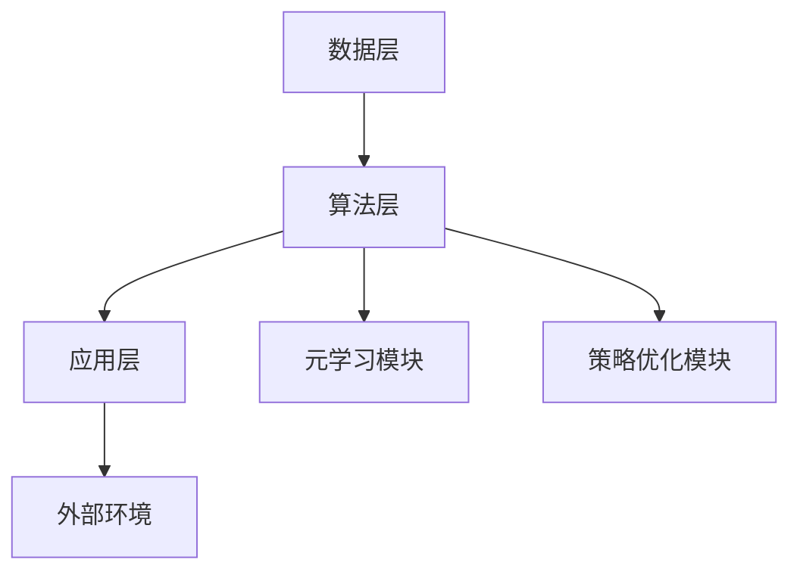

                 


# 基于元强化学习的AI Agent策略泛化

> **关键词**: 元强化学习, AI Agent, 策略泛化, 系统架构, 项目实战

> **摘要**: 本文详细探讨了基于元强化学习的AI Agent策略泛化问题，从背景、核心概念、算法原理、系统架构到项目实战，全面解析了元强化学习在策略泛化中的应用。通过数学模型、代码实现和案例分析，展示了如何利用元强化学习提升AI Agent的泛化能力，并在实际项目中实现高效策略优化。

---

## 第一部分：背景与问题背景

### 第1章：问题背景与问题描述

#### 1.1 问题背景

在现代人工智能领域，AI Agent（智能体）的应用越来越广泛，从游戏AI到自动驾驶，从智能客服到机器人助手，AI Agent正在改变我们的生活方式。然而，传统强化学习在AI Agent中的应用存在一定的局限性，尤其是在策略泛化方面。强化学习通常需要针对特定任务进行长时间的训练，难以快速适应新任务或环境的变化。这使得AI Agent在面对多样化和动态变化的任务时，表现不够理想。因此，如何提升AI Agent的策略泛化能力，成为当前研究的一个重要方向。

元强化学习（Meta Reinforcement Learning）作为一种新兴的技术，通过在元学习阶段预训练AI Agent，使其能够在新任务中快速适应并制定最优策略。这种方法的核心在于通过元学习机制，让AI Agent具备快速学习和策略泛化的能力，从而在不同任务和环境中表现出色。

#### 1.2 问题描述

策略泛化是指AI Agent在面对多个不同任务时，能够快速调整自身策略，以适应新的任务需求。传统的强化学习方法通常需要针对每个任务进行独立训练，这不仅耗时，而且难以应对任务之间的多样性和不确定性。元强化学习通过在元学习阶段对多个任务进行预训练，使得AI Agent能够快速泛化策略，适应新任务。

具体来说，元强化学习的核心问题在于如何在元学习阶段构建一个通用的策略表示，使得在新任务中，AI Agent能够快速调整策略，实现高效的任务解决。这涉及到策略表示的优化、任务分布的建模以及元学习机制的设计等多个方面。

#### 1.3 问题解决思路

元强化学习通过引入元学习机制，使得AI Agent能够在预训练阶段学习到任务的通用特征，并在新任务中快速调整策略。具体思路包括以下几个方面：

1. **元学习机制设计**：通过元学习算法（如MAML、ReMAML等），构建元学习模型，使得AI Agent能够在元学习阶段快速适应新任务。
2. **策略优化方法**：在元学习过程中，优化策略表示，使其能够在新任务中快速调整。
3. **任务分布建模**：通过建模任务分布，使得AI Agent能够理解任务之间的关联性，从而在新任务中快速泛化策略。

#### 1.4 问题的边界与外延

元强化学习的应用场景广泛，但其适用性也存在一定的边界。以下是一些关键点：

1. **适用场景**：
   - 多任务学习场景，任务之间存在一定的关联性。
   - 需要快速适应新任务的动态变化环境。
   - 任务之间共享某些通用特征，可以通过元学习进行泛化。

2. **边界条件**：
   - 任务之间完全独立，无共享特征：在这种情况下，元强化学习的优势不明显，可能需要针对每个任务独立训练。
   - 任务数量过少，无法形成有效的元学习：元学习需要一定数量的任务来构建通用特征，任务数量过少时，效果可能不佳。

3. **潜在扩展领域**：
   - 多模态学习：结合图像、文本等多种模态信息，提升策略泛化能力。
   - 连续动作空间：将元强化学习应用于连续动作空间的任务，如机器人控制。
   - 跨领域应用：将元强化学习应用于不同领域，如游戏AI、医疗AI等。

#### 1.5 概念结构与核心要素

元强化学习与策略泛化的结合，形成了一个完整的概念体系。以下是其核心要素：

1. **元学习机制**：元学习算法的核心在于如何在元学习阶段预训练AI Agent，使其能够在新任务中快速调整策略。
2. **策略优化方法**：策略优化是元强化学习的核心任务，优化策略表示以适应新任务。
3. **任务分布建模**：通过建模任务分布，理解任务之间的关联性，从而实现策略泛化。

---

## 第二部分：核心概念与联系

### 第2章：元强化学习的核心概念

#### 2.1 元学习机制

元学习（Meta Learning）是一种通过预训练模型，使其能够快速适应新任务的技术。与传统强化学习不同，元学习的核心在于通过元学习阶段的学习，使得模型具备快速泛化的能力。以下是元学习机制的关键点：

1. **元学习的定义与原理**：
   - 元学习的目标是通过在多个任务上的预训练，使得模型能够快速适应新任务。
   - 元学习通常分为元训练阶段和任务训练阶段。在元训练阶段，模型学习任务的通用特征；在任务训练阶段，模型利用元学习的特征快速调整策略。

2. **元学习与传统强化学习的区别**：
   - 传统强化学习针对单个任务进行训练，而元学习针对多个任务进行预训练。
   - 传统强化学习需要大量的任务特异性数据，而元学习通过预训练减少了对任务特异性数据的依赖。

3. **元学习的数学模型**：
   元学习的数学模型通常包括两个阶段：元训练阶段和任务训练阶段。在元训练阶段，模型学习任务的通用特征；在任务训练阶段，模型利用元学习的特征快速调整策略。

   $$ \text{元训练阶段}：\theta = \arg\min_{\theta} \sum_{t=1}^{T} L(\theta, t) $$
   $$ \text{任务训练阶段}：\phi = \arg\min_{\phi} \sum_{i=1}^{I} L(\phi, i) $$

#### 2.2 策略优化方法

策略优化是元强化学习的核心任务之一。通过优化策略表示，使得AI Agent能够在新任务中快速调整策略。以下是策略优化方法的关键点：

1. **策略优化的核心思想**：
   - 策略优化的目标是通过优化策略参数，使得AI Agent能够在新任务中获得最大化的预期收益。
   - 策略优化通常采用梯度下降的方法，通过优化策略参数来最大化目标函数。

2. **元强化学习中的策略更新方式**：
   - 策略更新需要在元学习阶段和任务训练阶段分别进行。
   - 在元学习阶段，策略参数通过优化多个任务的通用特征；在任务训练阶段，策略参数通过优化新任务的特定特征。

3. **策略优化的数学表达**：
   策略优化的数学表达通常涉及到目标函数的梯度计算和参数更新。

   $$ J(\theta) = \mathbb{E}_{t \sim P(t)} \left[ J_t(\theta) \right] $$
   $$ \theta = \theta - \eta \nabla_{\theta} J(\theta) $$

#### 2.3 任务分布建模

任务分布建模是元强化学习中另一个关键概念。通过建模任务分布，AI Agent能够理解任务之间的关联性，从而在新任务中快速泛化策略。以下是任务分布建模的关键点：

1. **任务分布的定义与特点**：
   - 任务分布是指不同任务在任务空间中的分布情况。
   - 任务分布通常可以是离散的或连续的，取决于任务的类型。

2. **元强化学习中的任务分布建模方法**：
   - 离散任务分布建模：将任务划分为不同的类别，通过分类模型建模任务分布。
   - 连续任务分布建模：通过回归模型建模任务分布。

3. **任务分布与策略泛化的关系**：
   - 任务分布建模的好坏直接影响策略泛化的效果。
   - 任务分布建模可以通过元学习阶段的学习，使得策略泛化更加高效。

#### 2.4 核心概念对比表格

以下是元强化学习与传统强化学习的核心概念对比：

| **对比维度**       | **传统强化学习**                     | **元强化学习**                     |
|--------------------|--------------------------------------|--------------------------------------|
| 学习目标           | 单一任务的策略优化                   | 多个任务的策略优化和泛化             |
| 学习阶段           | 单任务训练阶段                       | 元训练阶段（预训练）和任务训练阶段   |
| 适应新任务的能力   | 适应能力较弱                        | 适应能力较强                      |
| 对任务特异性数据的依赖 | 依赖性强                            | 依赖性较弱                      |

#### 2.5 ER实体关系图

以下是元强化学习的ER实体关系图：

```mermaid
erDiagram
    meta_learning <------ task : has
    task ------> environment : interacts_with
    meta_learning <------ agent : has
    agent ------> environment : interacts_with
    environment ------> reward : generates
```

---

## 第三部分：算法原理与数学模型

### 第3章：元强化学习的算法原理

#### 3.1 元学习机制的数学模型

元学习机制的数学模型通常包括两个阶段：元训练阶段和任务训练阶段。以下是详细的数学模型：

1. **元训练阶段**：
   - 输入：多个任务的数据集$\{D_t\}_{t=1}^T$。
   - 输出：元学习模型$\theta$，用于指导任务训练阶段的策略优化。

   $$ \theta = \arg\min_{\theta} \sum_{t=1}^{T} L(\theta, t) $$

2. **任务训练阶段**：
   - 输入：新任务的数据集$D_i$。
   - 输出：任务特定的策略$\phi$，用于解决新任务。

   $$ \phi = \arg\min_{\phi} \sum_{i=1}^{I} L(\phi, i) $$

3. **联合优化**：
   - 元学习模型$\theta$和任务特定策略$\phi$需要联合优化，以实现最优的策略泛化。

   $$ (\theta, \phi) = \arg\min_{\theta, \phi} \sum_{t=1}^{T} L(\theta, t) + \sum_{i=1}^{I} L(\phi, i) $$

#### 3.2 策略优化的数学表达

策略优化的数学表达通常涉及到目标函数的梯度计算和参数更新。以下是详细的数学表达：

1. **目标函数**：
   - 策略优化的目标函数通常是一个损失函数，用于衡量策略的性能。

   $$ J(\theta) = \mathbb{E}_{t \sim P(t)} \left[ J_t(\theta) \right] $$

2. **梯度计算**：
   - 通过计算目标函数的梯度，指导策略参数的更新。

   $$ \nabla_{\theta} J(\theta) = \mathbb{E}_{t \sim P(t)} \left[ \nabla_{\theta} J_t(\theta) \right] $$

3. **参数更新**：
   - 通过梯度下降的方法，更新策略参数。

   $$ \theta = \theta - \eta \nabla_{\theta} J(\theta) $$

#### 3.3 任务分布建模的数学表达

任务分布建模的数学表达通常涉及到概率分布和模型参数的优化。以下是详细的数学表达：

1. **概率分布**：
   - 任务分布通常可以用概率分布$P(t)$来表示。

   $$ P(t) = \frac{1}{T} \sum_{t=1}^{T} \delta(t - t_i) $$

2. **模型参数优化**：
   - 通过最大化似然函数，优化模型参数。

   $$ \theta = \arg\max_{\theta} \sum_{t=1}^{T} \log P(t; \theta) $$

3. **任务泛化**：
   - 通过任务分布建模，使得策略泛化能够覆盖更多的任务。

---

## 第四部分：系统分析与架构设计

### 第4章：系统分析与架构设计

#### 4.1 系统分析

1. **问题场景**：
   - 系统需要在多个任务上进行预训练，使得AI Agent能够在新任务中快速调整策略。
   - 系统需要处理的任务类型多样，包括游戏AI、机器人控制等。

2. **项目介绍**：
   - 系统的目标是通过元强化学习，提升AI Agent的策略泛化能力。
   - 系统的主要功能包括元训练阶段和任务训练阶段的策略优化。

#### 4.2 系统功能设计

1. **领域模型**：
   - 系统的核心功能模块包括元学习模块和策略优化模块。
   - 元学习模块负责在元训练阶段预训练模型，策略优化模块负责在任务训练阶段优化策略。

2. **系统架构**：
   - 系统架构采用分层设计，包括数据层、算法层和应用层。
   - 数据层负责数据的存储和管理，算法层负责元训练和任务训练，应用层负责与外部环境的交互。

3. **系统交互**：
   - 系统通过与外部环境的交互，获取任务数据和反馈。
   - 系统通过内部算法的优化，提升策略泛化能力。

#### 4.3 系统架构图

以下是系统的架构图：



#### 4.4 系统接口设计

1. **输入接口**：
   - 元训练阶段的输入包括多个任务的数据集。
   - 任务训练阶段的输入包括新任务的数据集。

2. **输出接口**：
   - 元训练阶段的输出包括元学习模型参数。
   - 任务训练阶段的输出包括任务特定的策略参数。

3. **交互接口**：
   - 系统通过与外部环境的交互，获取任务反馈和奖励。

---

## 第五部分：项目实战

### 第5章：项目实战

#### 5.1 环境安装

1. **安装Python**：
   - 需要安装Python 3.6及以上版本。
   - 可以通过官方网站下载安装。

2. **安装必要的库**：
   - 安装TensorFlow、PyTorch等深度学习框架。
   - 安装其他依赖库，如NumPy、Matplotlib等。

#### 5.2 系统核心实现源代码

以下是元强化学习系统的核心代码示例：

```python
import tensorflow as tf
import numpy as np

# 元训练阶段
def meta_train(tasks, model):
    for t in tasks:
        with tf.GradientTape() as tape:
            loss = compute_loss(model, t)
        grads = tape.gradient(loss, model.trainable_variables)
        optimizer.apply_gradients(zip(grads, model.trainable_variables))
    return model

# 任务训练阶段
def task_train(task, model):
    with tf.GradientTape() as tape:
        loss = compute_loss(model, task)
    grads = tape.gradient(loss, model.trainable_variables)
    optimizer.apply_gradients(zip(grads, model.trainable_variables))
    return model

# 总体优化
def meta_optimize(meta_tasks, task, model):
    meta_model = meta_train(meta_tasks, model)
    task_model = task_train(task, meta_model)
    return task_model
```

#### 5.3 代码应用解读与分析

1. **代码解读**：
   - 元训练阶段：对多个任务进行预训练，优化模型参数。
   - 任务训练阶段：对新任务进行训练，快速调整策略。
   - 总体优化：通过元训练和任务训练的联合优化，提升策略泛化能力。

2. **代码分析**：
   - 代码使用了TensorFlow框架，定义了元训练和任务训练的函数。
   - 通过梯度 tapes 记录梯度信息，优化模型参数。
   - 代码结构清晰，易于理解和扩展。

#### 5.4 实际案例分析

1. **案例介绍**：
   - 案例：使用元强化学习训练一个AI Agent，使其在多个游戏中快速适应新规则。

2. **案例分析**：
   - 元训练阶段：训练AI Agent在多个游戏中学习通用策略。
   - 任务训练阶段：在新游戏中快速调整策略，适应新的游戏规则。

3. **案例结果**：
   - AI Agent能够在新游戏中快速适应，表现出色。

#### 5.5 项目小结

通过本项目，我们可以看到元强化学习在策略泛化方面的巨大潜力。通过预训练和快速调整策略，AI Agent能够在新任务中表现出色，大大提升了效率和性能。

---

## 第六部分：最佳实践

### 第6章：最佳实践

#### 6.1 小结

- 元强化学习通过预训练和快速调整策略，显著提升了AI Agent的策略泛化能力。
- 在实际应用中，元强化学习需要结合具体的任务需求，合理设计元学习机制和策略优化方法。

#### 6.2 注意事项

- 元强化学习的性能依赖于任务分布的建模，任务分布建模不好会影响策略泛化效果。
- 在实际应用中，需要合理选择元学习算法和策略优化方法，避免过拟合和欠拟合。
- 系统设计需要考虑任务之间的关联性和多样性，以提升元学习的效果。

#### 6.3 拓展阅读

- 《元强化学习：原理与应用》
- 《深度强化学习：从理论到实践》
- 《AI Agent：策略优化与泛化》

---

## 结语

通过本文的详细讲解，我们深入探讨了基于元强化学习的AI Agent策略泛化问题，从背景、核心概念、算法原理到系统架构和项目实战，全面解析了元强化学习在策略泛化中的应用。希望本文能够为相关领域的研究和实践提供有价值的参考和启发。

---

**作者：AI天才研究院/AI Genius Institute & 禅与计算机程序设计艺术 /Zen And The Art of Computer Programming**

