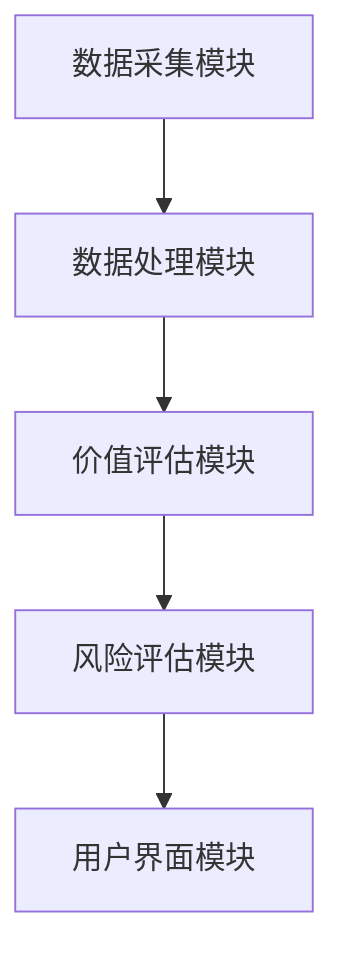

                 


# 如何将特价股票策略应用于非同质化代币(NFT)投资

## 关键词：特价股票策略、NFT投资、价值评估、量化分析、机器学习

## 摘要：本文详细探讨如何将特价股票策略应用于NFT投资，分析NFT市场的特点和挑战，提出量化评估模型，并通过实际案例展示策略的应用。文章从背景介绍、核心概念、算法原理、系统架构、项目实战到总结展望，全面阐述策略的实施路径。

---

# 第1章: 特价股票策略与NFT投资的背景介绍

## 1.1 特价股票策略的定义与核心理念

### 1.1.1 特价股票策略的定义

特价股票策略是一种投资策略，旨在识别市场价格低于其内在价值的股票。其核心在于寻找市场低估的机会，通过基本面分析和市场趋势预测来指导投资决策。

### 1.1.2 特价股票策略的核心理念

- **价值发现**：寻找市场价格与内在价值不匹配的股票。
- **长期投资**：基于公司基本面，长期持有优质资产。
- **风险管理**：分散投资，控制风险，避免重大损失。

### 1.1.3 特价股票策略在传统投资中的应用

- **股票筛选**：通过市盈率、市净率等指标筛选低估股票。
- **市场周期分析**：在市场低迷期寻找低估股票。
- **组合管理**：构建投资组合，分散风险。

## 1.2 NFT市场的现状与挑战

### 1.2.1 NFT的定义与特点

- **非同质化代币**：每个NFT都是唯一的，不可分割。
- **区块链技术**：记录所有权和交易历史，确保真实性。
- **多样性**：涵盖数字艺术、收藏品、虚拟资产等多个领域。

### 1.2.2 NFT市场的现状分析

- **市场规模增长迅速**：2021年市场规模超过200亿美元。
- **市场波动性大**：价格受市场情绪影响显著。
- **市场流动性差异**：部分NFT流动性差，变现困难。

### 1.2.3 NFT投资中的主要挑战

- **市场波动性**：价格波动剧烈，风险较高。
- **流动性问题**：部分NFT难以快速变现。
- **缺乏标准化**：评估标准不统一，难以比较。

## 1.3 特价股票策略应用于NFT投资的背景

### 1.3.1 特价股票策略与NFT投资的契合点

- **价值发现**：寻找被市场低估的NFT资产。
- **长期投资**：基于项目基本面，长期持有优质NFT。
- **风险管理**：通过分散投资降低市场波动风险。

### 1.3.2 NFT市场中的价值发现机会

- **市场不成熟**：部分NFT价格被低估，存在价值发现机会。
- **市场参与者多样性**：不同背景的投资者提供多元化的机会。
- **新兴市场**：NFT市场仍处于发展阶段，存在结构性机会。

### 1.3.3 特价股票策略在NFT投资中的潜力

- **策略移植**：将股票筛选方法应用于NFT评估。
- **数据驱动**：利用大数据和机器学习优化投资决策。
- **风险管理**：借鉴股票投资的风险控制方法，降低投资风险。

## 1.4 本章小结

本章介绍了特价股票策略的定义和核心理念，分析了NFT市场的现状和挑战，并探讨了将特价股票策略应用于NFT投资的背景和潜力。通过价值发现和风险管理的结合，为后续章节的策略实施奠定了基础。

---

# 第2章: NFT市场的核心概念与价值评估

## 2.1 NFT市场的核心概念

### 2.1.1 NFT的基本属性

- **唯一性**：每个NFT都是独一无二的，不可复制。
- **不可分割性**：NFT不可分割，每个单位都是完整的。
- **可验证性**：区块链技术确保所有权和交易历史可验证。

### 2.1.2 NFT的交易机制

- **去中心化交易所**：如OpenSea，允许用户直接交易NFT。
- **拍卖机制**：通过拍卖确定NFT的价格。
- **市场流动性**：不同平台的流动性差异影响交易活跃度。

### 2.1.3 NFT的流动性问题

- **交易频率**：NFT的交易活跃度影响流动性。
- **市场深度**：交易量大的NFT流动性好。
- **平台依赖**：大部分NFT交易集中在少数几个平台，增加集中风险。

## 2.2 特价股票策略的核心原理

### 2.2.1 价值发现的基本原理

- **内在价值**：资产的真实价值，与市场价格可能偏离。
- **市场价值**：资产的市场交易价格，受供需关系影响。
- **价格与价值的偏离**：市场价格围绕内在价值波动，寻找偏离较大的资产。

### 2.2.2 市场分析的关键指标

- **市盈率（P/E）**：股价与每股收益的比率。
- **市净率（P/B）**：股价与每股净资产的比率。
- **股息率**：股息与股价的比率，反映分红能力。

### 2.2.3 投资决策的逻辑框架

1. **识别低估资产**：寻找市场价格低于内在价值的NFT。
2. **分析项目基本面**：评估NFT的项目背景、团队实力和市场前景。
3. **制定投资策略**：基于分析结果，制定买入、持有和卖出策略。

## 2.3 NFT市场中的价值评估模型

### 2.3.1 基于市场流动性的评估方法

- **流动性指数**：反映NFT的交易活跃程度。
- **交易量分析**：通过交易量判断市场热度和资产流动性。

### 2.3.2 基于项目基本面的评估方法

- **项目背景**：评估NFT所属项目的知名度和市场影响力。
- **团队实力**：分析项目团队的经验和能力。
- **市场前景**：预测NFT的未来市场需求和增长潜力。

### 2.3.3 综合评估模型的构建

- **多因素分析**：结合流动性、项目基本面和市场前景等多个因素，构建综合评估模型。
- **权重分配**：根据各因素的重要性，分配不同权重，进行加权评分。

## 2.4 本章小结

本章详细探讨了NFT市场的核心概念和价值评估方法，分析了流动性、项目基本面和市场前景等多个因素，并提出了综合评估模型。为后续章节的策略实施提供了理论基础和方法论支持。

---

# 第3章: 特价股票策略在NFT投资中的算法原理

## 3.1 NFT市场数据的特征分析

### 3.1.1 数据来源

- **公开数据**：NFT交易平台提供的交易数据，包括价格、交易量、持有者数量等。
- **链上数据**：通过区块链技术获取NFT的交易记录和所有权信息。
- **社交媒体数据**：分析社交媒体上的讨论热度，评估市场关注度。

### 3.1.2 数据特征

- **时间序列性**：NFT的交易数据具有时间序列特性，适合时间序列分析。
- **非线性关系**：NFT价格受多种因素影响，可能存在非线性关系。
- **高维度性**：涉及多个特征变量，如交易量、持有者数量、项目背景等。

## 3.2 基于机器学习的NFT价格预测模型

### 3.2.1 算法选择

- **线性回归**：适用于线性关系，但可能无法捕捉复杂特征。
- **随机森林**：适合处理高维度数据，具有较强的特征重要性分析能力。
- **LSTM网络**：适合时间序列数据，能够捕捉价格波动的模式。

### 3.2.2 数据预处理

1. **数据清洗**：处理缺失值、异常值，确保数据质量。
2. **特征工程**：提取关键特征，如交易量、持有者数量、项目热度等。
3. **数据标准化**：对特征进行标准化处理，确保模型训练效果。

### 3.2.3 模型训练

1. **训练集划分**：将数据划分为训练集和测试集，通常采用时间序列划分方法。
2. **模型训练**：使用训练数据训练模型，调整模型参数，优化预测精度。
3. **模型评估**：通过测试数据评估模型性能，计算均方误差（MSE）、平均绝对误差（MAE）等指标。

### 3.2.4 模型预测

1. **输入新数据**：将新的NFT数据输入模型，进行价格预测。
2. **预测结果分析**：分析预测结果，判断是否低于内在价值，识别低估资产。

## 3.3 基于机器学习的NFT价值评估模型实现

### 3.3.1 环境安装

```python
# 安装必要的库
import numpy as np
import pandas as pd
from sklearn.ensemble import RandomForestRegressor
from sklearn.metrics import mean_squared_error
from sklearn.model_selection import train_test_split
import matplotlib.pyplot as plt
import seaborn as sns
```

### 3.3.2 数据加载与预处理

```python
# 加载数据
nft_data = pd.read_csv('nft_market_data.csv')

# 数据清洗
nft_data.dropna(inplace=True)
nft_data = nft_data[~nft_data['price'].isnull()]

# 特征工程
features = ['交易量', '持有者数量', '项目热度']
target = '价格'

# 数据标准化
from sklearn.preprocessing import StandardScaler
scaler = StandardScaler()
nft_data[features] = scaler.fit_transform(nft_data[features])
```

### 3.3.3 模型训练与评估

```python
# 划分训练集和测试集
X = nft_data[features]
y = nft_data[target]
X_train, X_test, y_train, y_test = train_test_split(X, y, test_size=0.2, random_state=42)

# 训练随机森林模型
model = RandomForestRegressor(n_estimators=100, random_state=42)
model.fit(X_train, y_train)

# 预测测试集
y_pred = model.predict(X_test)

# 评估模型
mse = mean_squared_error(y_test, y_pred)
mae = np.mean(np.abs(y_pred - y_test))
print(f'Mean Squared Error: {mse}')
print(f'Mean Absolute Error: {mae}')
```

### 3.3.4 模型解释与应用

- **特征重要性分析**：通过随机森林模型，分析各特征对价格预测的重要性，识别关键影响因素。
- **价格预测**：利用模型预测NFT的未来价格，识别市场价格低于预测价格的资产，作为潜在投资机会。

## 3.4 本章小结

本章介绍了基于机器学习的NFT价格预测模型，详细讲解了数据预处理、模型训练和评估的全过程，并通过代码实现展示了模型的应用。通过分析模型预测结果，投资者可以识别市场价格低于内在价值的NFT，实现价值发现。

---

# 第4章: 系统分析与架构设计方案

## 4.1 NFT价值评估系统的总体架构

### 4.1.1 系统功能模块

- **数据采集模块**：实时采集NFT市场数据，包括价格、交易量等。
- **数据处理模块**：对采集的数据进行清洗、标准化和特征提取。
- **价值评估模块**：基于机器学习模型，评估NFT的价值。
- **风险评估模块**：评估投资风险，提供风险控制建议。
- **用户界面模块**：提供直观的用户界面，展示评估结果和投资建议。

### 4.1.2 系统架构设计



### 4.1.3 数据流分析

- **数据输入**：NFT市场数据，包括价格、交易量、持有者数量等。
- **数据处理**：数据清洗、标准化、特征提取。
- **模型评估**：利用机器学习模型进行价值评估和风险评估。
- **结果输出**：生成评估报告和投资建议，展示在用户界面上。

## 4.2 系统功能设计

### 4.2.1 数据采集模块

- **数据源**：NFT交易平台的API接口，社交媒体数据等。
- **数据格式**：结构化数据，便于处理和分析。
- **数据频率**：实时或定期采集，确保数据的及时性。

### 4.2.2 数据处理模块

- **数据清洗**：处理缺失值、异常值。
- **特征提取**：提取关键特征，如交易量、持有者数量、项目热度等。
- **数据标准化**：对特征进行标准化处理，确保模型训练效果。

### 4.2.3 价值评估模块

- **模型选择**：随机森林、LSTM等机器学习模型。
- **模型训练**：基于历史数据训练模型，优化模型参数。
- **模型预测**：预测NFT的价值，识别低估资产。

### 4.2.4 风险评估模块

- **风险指标**：波动率、流动性风险、市场风险等。
- **风险评估**：基于模型预测结果，评估投资风险。
- **风险控制**：提供风险分散建议，如分散投资、设置止损等。

### 4.2.5 用户界面模块

- **数据可视化**：通过图表展示NFT的价格走势、交易量等信息。
- **评估报告**：生成价值评估报告，展示NFT的评估结果。
- **投资建议**：提供基于评估结果的投资建议，如买入、持有或卖出。

## 4.3 系统架构设计

### 4.3.1 系统架构图


### 4.3.2 接口设计

- **数据接口**：与NFT交易平台的API接口对接，获取市场数据。
- **模型接口**：与其他系统模块交互，提供评估结果和投资建议。

## 4.4 本章小结

本章详细设计了NFT价值评估系统的总体架构，包括数据采集、数据处理、价值评估、风险评估和用户界面五大功能模块，并通过架构图展示了系统的整体结构。通过系统的模块化设计，确保各功能模块协同工作，实现高效的NFT价值评估和投资决策。

---

# 第5章: 项目实战——基于特价股票策略的NFT投资案例分析

## 5.1 环境安装与数据准备

### 5.1.1 环境安装

```bash
# 安装必要的Python库
pip install pandas numpy scikit-learn matplotlib seaborn
```

### 5.1.2 数据准备

- **数据来源**：NFT交易平台提供的交易数据，包括价格、交易量、持有者数量等。
- **数据格式**：CSV格式，字段包括NFT名称、价格、交易量、持有者数量、项目热度等。

## 5.2 系统核心实现

### 5.2.1 数据预处理

```python
# 加载数据
nft_data = pd.read_csv('nft_market_data.csv')

# 数据清洗
nft_data.dropna(inplace=True)
nft_data = nft_data[~nft_data['price'].isnull()]

# 特征工程
features = ['交易量', '持有者数量', '项目热度']
target = '价格'

# 数据标准化
from sklearn.preprocessing import StandardScaler
scaler = StandardScaler()
nft_data[features] = scaler.fit_transform(nft_data[features])
```

### 5.2.2 模型训练与预测

```python
# 划分训练集和测试集
X = nft_data[features]
y = nft_data[target]
X_train, X_test, y_train, y_test = train_test_split(X, y, test_size=0.2, random_state=42)

# 训练随机森林模型
from sklearn.ensemble import RandomForestRegressor
model = RandomForestRegressor(n_estimators=100, random_state=42)
model.fit(X_train, y_train)

# 预测测试集
y_pred = model.predict(X_test)

# 评估模型
mse = mean_squared_error(y_test, y_pred)
mae = np.mean(np.abs(y_pred - y_test))
print(f'Mean Squared Error: {mse}')
print(f'Mean Absolute Error: {mae}')
```

### 5.2.3 投资决策

- **识别低估资产**：通过模型预测价格，识别市场价格低于预测价格的NFT。
- **制定投资策略**：根据评估结果，制定买入、持有和卖出策略。
- **风险管理**：根据风险评估结果，制定风险控制措施，如分散投资、设置止损等。

## 5.3 实际案例分析

### 5.3.1 案例背景

假设我们有一个NFT项目，数据如下：

| NFT名称 | 价格 | 交易量 | 持有者数量 | 项目热度 |
|--------|------|--------|------------|----------|
| NFT A  | 10   | 100    | 50         | 0.8      |
| NFT B  | 15   | 200    | 30         | 0.6      |
| NFT C  | 20   | 300    | 20         | 0.4      |

### 5.3.2 数据处理与模型预测

```python
# 数据预处理
nft_data = pd.DataFrame({
    'NFT名称': ['NFT A', 'NFT B', 'NFT C'],
    '价格': [10, 15, 20],
    '交易量': [100, 200, 300],
    '持有者数量': [50, 30, 20],
    '项目热度': [0.8, 0.6, 0.4]
})

features = ['交易量', '持有者数量', '项目热度']
target = '价格'

# 数据标准化
scaler = StandardScaler()
nft_data[features] = scaler.fit_transform(nft_data[features])

# 划分训练集和测试集
X = nft_data[features]
y = nft_data[target]
X_train, X_test, y_train, y_test = train_test_split(X, y, test_size=0.2, random_state=42)

# 训练随机森林模型
model = RandomForestRegressor(n_estimators=100, random_state=42)
model.fit(X_train, y_train)

# 预测测试集
y_pred = model.predict(X_test)

# 评估模型
mse = mean_squared_error(y_test, y_pred)
mae = np.mean(np.abs(y_pred - y_test))
print(f'Mean Squared Error: {mse}')
print(f'Mean Absolute Error: {mae}')
```

### 5.3.3 投资决策

假设模型预测NFT C的价格为25，市场价格为20，存在低估机会。根据特价股票策略，建议买入NFT C，长期持有，等待价格回归内在价值。

## 5.4 项目小结

本章通过实际案例分析，展示了如何将特价股票策略应用于NFT投资。通过数据预处理、模型训练和预测，识别出市场价格低于预测价格的NFT，制定相应的投资策略，实现价值发现和风险控制。

---

# 第6章: 最佳实践、小结、注意事项和拓展阅读

## 6.1 最佳实践

### 6.1.1 数据质量

- **数据来源的可靠性**：确保数据准确可靠，选择信誉良好的数据源。
- **数据清洗**：仔细清洗数据，处理缺失值和异常值。

### 6.1.2 模型选择

- **模型适用性**：选择适合数据特征的模型，如时间序列数据适合LSTM网络。
- **模型调优**：通过参数调整和交叉验证，优化模型性能。

### 6.1.3 风险管理

- **分散投资**：避免过度集中，分散投资不同类型的NFT。
- **风险控制**：设置止损点，控制最大损失比例。

## 6.2 小结

本文详细探讨了如何将特价股票策略应用于NFT投资，从背景介绍、核心概念、算法原理、系统架构到项目实战，全面阐述了策略的实施路径。通过价值发现和风险管理的结合，为投资者提供了有效的投资方法。

## 6.3 注意事项

- **市场波动风险**：NFT市场价格波动较大，需谨慎操作。
- **数据依赖性**：模型预测依赖于数据质量，需确保数据准确可靠。
- **技术局限性**：当前模型可能存在局限性，需不断优化和改进。

## 6.4 拓展阅读

- **NFT市场分析**：深入研究NFT市场的特点和趋势，了解不同NFT类型的投资价值。
- **机器学习在金融中的应用**：学习更多机器学习算法在金融投资中的应用，提升模型预测精度。
- **风险管理策略**：研究更多风险管理方法，制定有效的风险控制方案。

---

# 第7章: 总结与展望

## 7.1 总结

本文详细探讨了如何将特价股票策略应用于NFT投资，分析了NFT市场的特点和挑战，提出了基于机器学习的价值评估模型，并通过实际案例展示了策略的应用。通过系统的模块化设计，确保各功能模块协同工作，实现高效的NFT价值评估和投资决策。

## 7.2 展望

未来，随着NFT市场的进一步成熟和技术的进步，特价股票策略在NFT投资中的应用将更加广泛和深入。可能的研究方向包括：

- **更复杂的模型**：开发更复杂的机器学习模型，提高预测精度。
- **多模态数据融合**：结合文本、图像等多种数据源，提升评估准确性。
- **实时交易系统**：开发实时交易系统，捕捉市场机会。

---

作者：AI天才研究院/AI Genius Institute & 禅与计算机程序设计艺术 /Zen And The Art of Computer Programming

