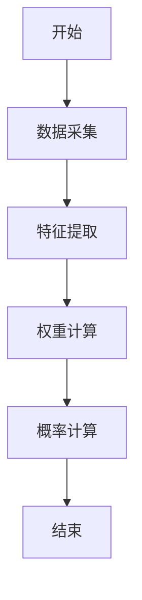
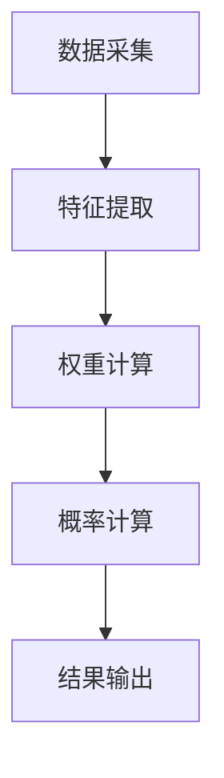
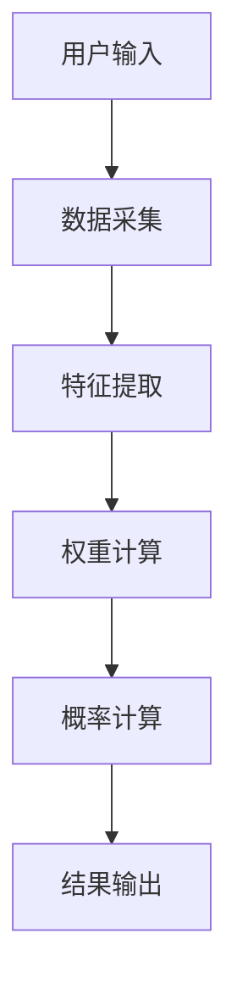

                 


# 智能体协作评估公司创新管线：科技公司价值投资利器

> 关键词：智能体协作、公司创新管线、科技投资、价值评估、人工智能、协作机制

> 摘要：本文详细探讨了智能体协作在评估公司创新管线中的应用，分析了其在科技公司价值投资中的重要性。通过系统性的分析和案例研究，展示了如何利用智能体协作技术优化创新管线评估过程，为投资者提供科学依据。文章从背景、原理、算法、系统设计到实战案例，层层深入，最终总结出智能体协作评估的未来发展方向和投资策略建议。

---

## 第一部分: 智能体协作与公司创新管线概述

### 第1章: 智能体协作的基本概念

#### 1.1 问题背景与描述
科技公司的创新管线是其核心竞争力的体现，但传统的创新评估方法往往依赖主观判断，缺乏数据支持和系统性分析。随着人工智能技术的发展，智能体协作成为一种新兴的评估工具，能够通过数据驱动的方式优化评估过程。

#### 1.1.1 创新管线评估的重要性
创新管线是科技公司技术创新的核心路径，其评估决定了公司的未来发展方向和投资价值。传统评估方法依赖专家经验，存在主观性强、效率低、成本高等问题。

#### 1.1.2 智能体协作在创新评估中的作用
智能体协作能够通过多智能体协同工作，整合多源数据，提供客观、高效的评估结果。它能够模拟真实市场环境，预测创新项目的成功率和市场潜力。

#### 1.1.3 传统评估方法的局限性
传统评估方法依赖人工分析，难以处理大规模数据，且缺乏动态调整能力。智能体协作能够弥补这些不足，提供更精准的评估结果。

#### 1.2 智能体协作的定义与特点
智能体协作是指多个智能体通过协同工作，共同完成特定任务的过程。其特点包括自主性、反应性、协作性和学习能力。

#### 1.2.1 智能体协作的定义
智能体协作是指多个智能体通过协同工作，共同完成特定任务的过程。每个智能体都有自己的目标和任务，能够通过通信和协调实现整体目标。

#### 1.2.2 智能体协作的核心特点
- **自主性**：智能体能够独立决策。
- **反应性**：能够实时感知环境变化并调整行为。
- **协作性**：通过通信和协调完成共同目标。
- **学习能力**：能够通过经验优化协作策略。

#### 1.2.3 智能体协作与传统协作方式的对比
| 特性                | 智能体协作                | 传统协作方式            |
|---------------------|--------------------------|-------------------------|
| 独立性               | 高                       | 低                     |
| 反应性               | 高                       | 低                     |
| 协作效率             | 高                       | 低                     |
| 适应性               | 高                       | 低                     |

#### 1.3 公司创新管线的结构与组成
创新管线包括从创意生成、技术研发、产品开发到市场推广的全过程。

#### 1.3.1 创新管线的定义
创新管线是指从创意产生到产品商业化的一系列阶段和流程。

#### 1.3.2 创新管线的组成部分
- **创意生成**：发现市场机会，提出创新概念。
- **技术研发**：进行技术研发和实验验证。
- **产品开发**：设计、开发和测试产品原型。
- **市场推广**：进入市场，获取用户反馈。

#### 1.3.3 创新管线评估的核心要素
- **技术创新性**：技术的原创性和先进性。
- **市场潜力**：产品的市场前景和用户需求。
- **团队能力**：团队的技术能力和执行能力。

---

## 第2章: 智能体协作与创新管线的联系

### 2.1 智能体协作在创新管线评估中的应用
智能体协作能够通过多智能体协同工作，模拟真实市场环境，评估创新项目的可行性。

#### 2.1.1 智能体协作如何优化创新评估
- **数据整合**：整合多源数据，提供全面的评估依据。
- **动态调整**：根据市场变化实时调整评估策略。
- **精准预测**：利用机器学习模型预测项目成功率。

#### 2.1.2 智能体协作在创新管线中的具体表现
- **创意生成**：智能体协作可以辅助创意生成，提供多个创新方向的评估。
- **技术研发**：评估技术的可行性和潜在风险。
- **产品开发**：模拟用户反馈，优化产品设计。
- **市场推广**：预测市场反应，制定推广策略。

#### 2.2 创新管线评估的核心要素
创新管线评估的核心要素包括技术创新性、市场潜力和团队能力。

#### 2.2.1 技术创新性评估
评估技术的原创性和先进性，判断其是否具有竞争优势。

#### 2.2.2 市场潜力评估
分析市场需求和竞争环境，预测产品的市场表现。

#### 2.2.3 团队能力评估
评估团队的技术能力和执行能力，判断其是否能够成功实现创新目标。

#### 2.3 智能体协作与创新管线评估的边界
智能体协作的应用范围和局限性需要明确，以确保评估结果的准确性和可靠性。

#### 2.3.1 智能体协作的应用范围
- 创意生成阶段：辅助创意评估和筛选。
- 技术研发阶段：评估技术可行性和风险。
- 产品开发阶段：模拟用户反馈，优化产品设计。
- 市场推广阶段：预测市场反应，制定推广策略。

#### 2.3.2 创新管线评估的局限性
- 数据不足：缺乏足够的数据支持评估结果。
- 模型准确性：模型的预测能力受限于数据质量和算法精度。

#### 2.3.3 智能体协作与创新评估的结合点
智能体协作能够通过多智能体协同工作，整合多源数据，提供客观、高效的评估结果。

---

## 第3章: 智能体协作与创新管线评估的核心概念

### 3.1 智能体协作的原理
智能体协作的核心原理包括自主性、反应性、协作性和学习能力。

#### 3.1.1 智能体协作的基本原理
智能体协作是指多个智能体通过协同工作，共同完成特定任务的过程。每个智能体都有自己的目标和任务，能够通过通信和协调实现整体目标。

#### 3.1.2 智能体协作的核心特点
- **自主性**：智能体能够独立决策。
- **反应性**：能够实时感知环境变化并调整行为。
- **协作性**：通过通信和协调完成共同目标。
- **学习能力**：能够通过经验优化协作策略。

#### 3.1.3 智能体协作的关键技术
- **通信协议**：智能体之间的通信方式。
- **协作算法**：任务分配、协调和优化算法。
- **学习机制**：基于经验优化协作策略。

### 3.2 智能体协作的核心概念与联系
智能体协作的核心概念包括自主性、反应性、协作性和学习能力。

#### 3.2.1 智能体协作的核心概念
- **自主性**：智能体能够独立决策。
- **反应性**：能够实时感知环境变化并调整行为。
- **协作性**：通过通信和协调完成共同目标。
- **学习能力**：能够通过经验优化协作策略。

#### 3.2.2 智能体协作的核心概念与联系
智能体协作的核心概念相互关联，共同构成了协作机制。自主性是基础，反应性是关键，协作性是核心，学习能力是提升。

---

## 第4章: 智能体协作与创新管线评估的算法原理

### 4.1 智能体协作评估模型的数学模型
智能体协作评估模型的数学模型包括概率模型和统计模型。

#### 4.1.1 智能体协作评估模型的数学模型
智能体协作评估模型的数学模型包括概率模型和统计模型。

#### 4.1.2 智能体协作评估模型的公式
创新项目成功率的概率可以通过以下公式计算：
$$P(\text{成功}) = \frac{\sum_{i=1}^{n} w_i \cdot x_i}{\sum_{i=1}^{n} w_i}$$
其中，$w_i$是权重，$x_i$是指标值。

#### 4.1.3 智能体协作评估模型的实现步骤
1. **数据采集**：收集创新项目的多源数据。
2. **特征提取**：提取关键特征，如技术创新性、市场潜力和团队能力。
3. **权重计算**：根据经验或数据驱动的方式计算特征权重。
4. **概率计算**：根据公式计算创新项目成功的概率。

### 4.2 智能体协作评估模型的算法流程
智能体协作评估模型的算法流程包括数据采集、特征提取、权重计算和概率计算。

#### 4.2.1 智能体协作评估模型的算法流程
1. **数据采集**：收集创新项目的多源数据。
2. **特征提取**：提取关键特征，如技术创新性、市场潜力和团队能力。
3. **权重计算**：根据经验或数据驱动的方式计算特征权重。
4. **概率计算**：根据公式计算创新项目成功的概率。

#### 4.2.2 智能体协作评估模型的实现代码
```python
def calculate_success_probability(features, weights):
    weighted_sum = sum(w * f for w, f in zip(weights, features))
    total_weight = sum(weights)
    return weighted_sum / total_weight

features = [0.8, 0.6, 0.7]
weights = [0.3, 0.4, 0.3]
probability = calculate_success_probability(features, weights)
print(f"Success probability: {probability}")
```

### 4.3 智能体协作评估模型的流程图
以下是智能体协作评估模型的流程图：



---

## 第5章: 智能体协作与创新管线评估的系统设计

### 5.1 系统功能设计
智能体协作评估系统的功能设计包括数据采集、特征提取、权重计算和概率计算。

#### 5.1.1 数据采集模块
数据采集模块负责收集创新项目的多源数据，包括技术创新性、市场潜力和团队能力等。

#### 5.1.2 特征提取模块
特征提取模块负责提取关键特征，如技术创新性、市场潜力和团队能力。

#### 5.1.3 权重计算模块
权重计算模块根据经验或数据驱动的方式计算特征权重。

#### 5.1.4 概率计算模块
概率计算模块根据公式计算创新项目成功的概率。

### 5.2 系统架构设计
智能体协作评估系统的架构设计包括数据采集、特征提取、权重计算和概率计算模块。

#### 5.2.1 系统架构图
以下是智能体协作评估系统的架构图：



#### 5.2.2 接口设计
智能体协作评估系统需要与外部系统进行交互，包括数据源、用户界面和结果输出模块。

#### 5.2.3 交互流程图
以下是智能体协作评估系统的交互流程图：



---

## 第6章: 智能体协作与创新管线评估的项目实战

### 6.1 项目背景与目标
项目背景是利用智能体协作技术优化创新管线评估过程，目标是开发一个智能体协作评估系统。

#### 6.1.1 项目背景
随着人工智能技术的发展，智能体协作技术在科技公司创新评估中的应用越来越广泛。

#### 6.1.2 项目目标
开发一个智能体协作评估系统，能够高效、准确地评估创新项目的成功率。

### 6.2 项目实施步骤
项目实施步骤包括环境搭建、数据采集、特征提取、权重计算和概率计算。

#### 6.2.1 环境搭建
需要安装Python、机器学习库（如scikit-learn）和Mermaid工具。

#### 6.2.2 数据采集
收集创新项目的多源数据，包括技术创新性、市场潜力和团队能力。

#### 6.2.3 特征提取
提取关键特征，如技术创新性、市场潜力和团队能力。

#### 6.2.4 权重计算
根据经验或数据驱动的方式计算特征权重。

#### 6.2.5 概率计算
根据公式计算创新项目成功的概率。

### 6.3 项目实现代码
以下是智能体协作评估系统的实现代码：

```python
def calculate_success_probability(features, weights):
    weighted_sum = sum(w * f for w, f in zip(weights, features))
    total_weight = sum(weights)
    return weighted_sum / total_weight

features = [0.8, 0.6, 0.7]
weights = [0.3, 0.4, 0.3]
probability = calculate_success_probability(features, weights)
print(f"Success probability: {probability}")
```

### 6.4 项目案例分析
以下是智能体协作评估系统的案例分析：


---

## 第7章: 总结与展望

### 7.1 总结
智能体协作在科技公司创新管线评估中的应用具有重要意义，能够提供科学、客观的评估结果，为投资者提供有力支持。

#### 7.1.1 核心内容总结
智能体协作通过多智能体协同工作，整合多源数据，提供精准的创新项目评估结果。

#### 7.1.2 未来发展方向
未来，智能体协作技术将更加智能化和自动化，能够处理更复杂的评估任务。

### 7.2 未来展望
智能体协作技术将在科技公司创新评估中发挥更重要的作用，成为科技投资的重要工具。

#### 7.2.1 智能体协作技术的未来发展
智能体协作技术将更加智能化和自动化，能够处理更复杂的评估任务。

#### 7.2.2 科技公司创新评估的未来趋势
创新评估将更加数据化和智能化，能够提供更精准的评估结果。

### 7.3 投资策略建议
投资者应密切关注智能体协作技术的发展，充分利用其优势，优化投资决策。

#### 7.3.1 投资者如何利用智能体协作技术
投资者可以通过智能体协作技术，更精准地评估创新项目，降低投资风险。

#### 7.3.2 投资者如何选择科技公司
投资者应选择具有强大技术创新能力和市场潜力的科技公司进行投资。

---

## 作者：AI天才研究院/AI Genius Institute & 禅与计算机程序设计艺术 /Zen And The Art of Computer Programming

---

这篇文章详细探讨了智能体协作在科技公司创新管线评估中的应用，从背景介绍、核心概念、算法原理到系统设计和项目实战，为读者提供了全面的指导和深入的分析。通过本文，读者可以更好地理解智能体协作技术在科技投资中的重要作用，并能够实际应用这些技术优化创新评估过程。

