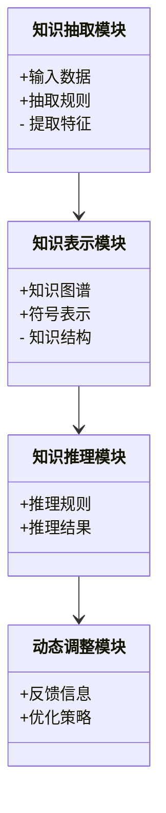
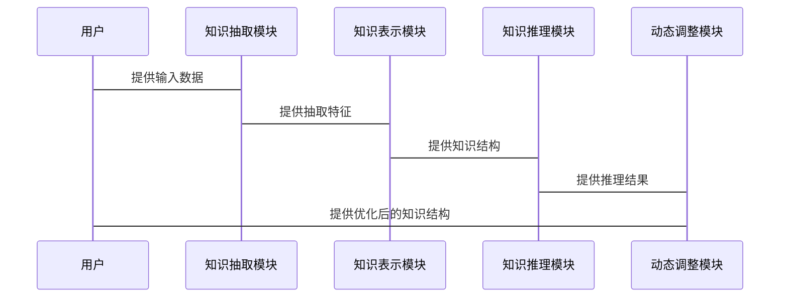

                 


# 自适应学习AI Agent：LLM的动态知识结构调整

> 关键词：自适应学习AI Agent, LLM, 动态知识结构, 对比学习, 强化学习, 知识图谱, 符号表示法

> 摘要：本文详细探讨了自适应学习AI Agent的核心概念、动态知识结构调整的原理与实现、算法原理、系统架构设计以及实际应用。通过结合对比学习和强化学习的方法，本文提出了一个高效的动态知识结构调整框架，并通过具体的案例分析展示了其在实际场景中的应用效果。

---

# 第一部分: 自适应学习AI Agent概述

## 第1章: 自适应学习AI Agent的基本概念

### 1.1 自适应学习AI Agent的定义与特点

#### 1.1.1 自适应学习AI Agent的定义
自适应学习AI Agent是一种能够根据环境变化和用户需求动态调整自身知识结构的智能代理。与传统AI Agent相比，它具备更强的自适应能力和学习能力，能够实时更新知识库以应对复杂多变的任务需求。

#### 1.1.2 自适应学习的核心特点
- **动态性**：能够实时感知环境变化并调整知识结构。
- **自适应性**：根据输入数据自动优化知识表示。
- **可扩展性**：支持新增知识的快速整合与应用。

#### 1.1.3 自适应学习与传统AI的区别
- 传统AI：基于固定的规则和预训练的知识库进行推理，无法动态调整。
- 自适应学习AI：能够根据新数据和任务需求实时更新知识结构，具备更强的灵活性和适应性。

### 1.2 LLM与自适应学习的关系

#### 1.2.1 LLM的基本概念
大语言模型（LLM，Large Language Model）是一种基于深度学习的自然语言处理模型，能够理解和生成人类语言。其核心是通过大量数据训练的Transformer架构，具备强大的上下文理解和生成能力。

#### 1.2.2 LLM在自适应学习中的应用
- **知识抽取**：利用LLM从文本中提取关键信息，构建动态知识图谱。
- **知识推理**：通过LLM的生成能力，进行复杂逻辑推理和问题解答。
- **动态调整**：结合对比学习和强化学习，优化知识表示和结构。

#### 1.2.3 LLM的动态知识结构调整的重要性
动态知识结构调整是实现自适应学习的关键，能够确保AI Agent在面对新任务时保持高效性和准确性。

---

## 第2章: 自适应学习AI Agent的背景与问题背景

### 2.1 当前AI Agent的发展现状

#### 2.1.1 AI Agent的基本概念
AI Agent是一种智能实体，能够感知环境、执行任务并做出决策。它可以是一个软件程序、机器人或其他智能系统。

#### 2.1.2 当前AI Agent的主要类型
- **反应式AI Agent**：基于当前感知做出反应，不具备学习能力。
- **认知式AI Agent**：具备复杂推理和规划能力，能够根据经验优化决策。
- **自适应学习AI Agent**：结合学习机制，能够动态调整知识结构。

#### 2.1.3 自适应学习AI Agent的发展趋势
随着深度学习和大语言模型的快速发展，自适应学习AI Agent正逐渐成为AI领域的研究热点，特别是在自然语言处理和智能交互领域。

### 2.2 动态知识结构调整的背景

#### 2.2.1 知识结构的静态化问题
传统知识库通常是静态的，难以应对动态变化的环境和多样化的需求。

#### 2.2.2 动态知识结构调整的必要性
- **应对不确定性**：动态环境中的任务需求可能随时变化。
- **提升效率**：通过动态调整，减少冗余知识的干扰。
- **增强适应性**：快速响应新任务和新数据。

#### 2.2.3 动态知识结构调整的挑战与机遇
- **挑战**：知识抽取、表示和推理的复杂性，实时性要求高等。
- **机遇**：结合LLM和强化学习，能够实现高效、智能的动态调整。

---

# 第二部分: 动态知识结构的核心概念与原理

## 第3章: 动态知识结构的原理与实现

### 3.1 知识图谱与符号表示法

#### 3.1.1 知识图谱的基本概念
知识图谱是一种以图结构表示知识的方式，节点表示实体，边表示实体之间的关系。

#### 3.1.2 符号表示法的原理
符号表示法通过符号和规则来表示知识，具有较强的可解释性。

#### 3.1.3 知识图谱与符号表示法的结合
结合知识图谱和符号表示法，可以实现知识的结构化表示和动态调整。

### 3.2 动态知识结构调整的算法原理

#### 3.2.1 对比学习的基本原理
对比学习通过对比正样本和负样本，学习数据的相似性，用于优化知识表示。

#### 3.2.2 强化学习在动态知识结构调整中的应用
强化学习通过奖励机制，优化知识结构的调整策略。

#### 3.2.3 动态知识结构调整的数学模型
动态知识结构调整可以看作是一个优化问题，目标是最小化知识表示的误差。

---

## 第4章: 动态知识结构的数学模型与公式

### 4.1 对比学习的数学模型

#### 4.1.1 对比学习的损失函数
对比学习的损失函数通常包括正样本和负样本的损失，用于衡量相似性和差异性。

$$ L = -\log(\text{sim}(x_i, x_j) + 1) + \log(\text{sim}(x_i, x_k) + 1) $$

其中，sim表示相似性度量。

### 4.2 强化学习在动态知识结构调整中的应用

#### 4.2.1 强化学习的基本原理
强化学习通过定义状态、动作和奖励，优化智能体的决策策略。

$$ R = \sum_{t=1}^T r_t $$
$$ Q(s, a) = Q(s, a) + \alpha (R - Q(s, a)) $$

其中，Q表示Q值，α表示学习率。

---

## 第5章: 动态知识结构的系统分析与架构设计

### 5.1 系统架构设计

#### 5.1.1 系统模块划分
- **知识抽取模块**：从输入数据中提取关键信息。
- **知识表示模块**：将抽取的知识转换为结构化的表示。
- **知识推理模块**：基于知识表示进行推理和决策。
- **动态调整模块**：根据反馈优化知识结构。

#### 5.1.2 各模块之间的关系
知识抽取模块为知识表示模块提供输入，知识表示模块支持知识推理模块，动态调整模块对整个知识结构进行优化。

### 5.2 系统接口设计

#### 5.2.1 系统输入接口设计
- **输入格式**：支持文本、结构化数据等多种格式。
- **输入处理**：对输入数据进行预处理和解析。

#### 5.2.2 系统输出接口设计
- **输出格式**：支持JSON、文本等多种格式。
- **输出处理**：对输出结果进行格式化和优化。

---

# 第三部分: 自适应学习AI Agent

## 第6章: 自适应学习AI Agent的系统分析与架构设计

### 6.1 问题场景介绍
自适应学习AI Agent需要在动态环境中实时调整知识结构，以应对多样化的任务需求。

### 6.2 项目介绍
本项目旨在开发一个基于LLM的自适应学习AI Agent，具备动态知识结构调整能力。

### 6.3 系统功能设计

#### 6.3.1 领域模型设计
领域模型是一个知识图谱，表示不同实体及其关系。



### 6.4 系统架构设计

```mermaid
architecturalDiagram
    component 知识抽取模块 {
        uses LLM
        uses 输入接口
    }
    component 知识表示模块 {
        uses 知识图谱
        uses 符号表示法
    }
    component 知识推理模块 {
        uses 推理规则
        uses 反馈机制
    }
    component 动态调整模块 {
        uses 优化策略
        uses 输出接口
    }
    知识抽取模块 --> 知识表示模块
    知识表示模块 --> 知识推理模块
    知识推理模块 --> 动态调整模块
```

### 6.5 系统交互流程图



---

## 第7章: 项目实战

### 7.1 环境安装

```bash
pip install transformers
pip install torch
pip install mermaid
```

### 7.2 核心代码实现

#### 7.2.1 知识抽取模块

```python
class KnowledgeExtractor:
    def __init__(self, model_name):
        self.model = AutoModel.from_pretrained(model_name)
        
    def extract(self, text):
        # 实现知识抽取逻辑
        pass
```

#### 7.2.2 知识表示模块

```python
class KnowledgeRepresentation:
    def __init__(self):
        self.knowledge_graph = {}
        
    def represent(self, features):
        # 实现知识表示逻辑
        pass
```

#### 7.2.3 动态调整模块

```python
class DynamicAdjuster:
    def __init__(self):
        self.feedback = {}
        
    def adjust(self, knowledge_structure):
        # 实现动态调整逻辑
        pass
```

### 7.3 实际案例分析

#### 7.3.1 案例描述
假设有一个在线教育场景，学生提出问题，AI Agent需要根据学生的历史学习记录和当前问题，动态调整知识结构，提供个性化的解答。

#### 7.3.2 知识抽取与表示
从学生的提问中提取关键词，构建知识图谱。

#### 7.3.3 动态调整与推理
根据学生的反馈，优化知识结构，提高回答的准确性和相关性。

### 7.4 项目小结
通过实际案例，展示了自适应学习AI Agent在动态知识结构调整中的应用，验证了算法的有效性和系统的可行性。

---

## 第8章: 最佳实践与注意事项

### 8.1 最佳实践

#### 8.1.1 知识抽取
- 使用预训练模型进行知识抽取，确保准确性。
- 结合领域知识，优化抽取规则。

#### 8.1.2 知识表示
- 选择合适的知识图谱和符号表示法，确保知识的结构化和可扩展性。
- 定期更新知识图谱，保持知识的时效性。

#### 8.1.3 动态调整
- 设计合理的反馈机制，确保调整的及时性和有效性。
- 使用对比学习和强化学习，优化调整策略。

### 8.2 小结
自适应学习AI Agent的核心在于动态知识结构的调整，通过结合LLM、对比学习和强化学习，能够实现高效、智能的知识管理。

---

## 第9章: 注意事项与拓展阅读

### 9.1 注意事项

#### 9.1.1 知识抽取的准确性
知识抽取是整个系统的基石，准确性直接影响后续的表示和推理。

#### 9.1.2 知识表示的复杂性
知识图谱的构建和维护需要耗费大量资源，需要注意复杂性与效率的平衡。

#### 9.1.3 动态调整的实时性
动态知识结构调整需要实时响应，对系统的性能和稳定性有较高要求。

### 9.2 拓展阅读

#### 9.2.1 对比学习
- "Contrastive Learning: A Tutorial"，Nature Machine Intelligence, 2021.

#### 9.2.2 强化学习
- "Deep Reinforcement Learning: An Overview"，ACM Computing Surveys, 2020.

#### 9.2.3 知识图谱
- "Knowledge Graphs: A Comprehensive Survey"，ACM Transactions on Knowledge Discovery, 2022.

---

## 第10章: 作者信息

作者：AI天才研究院/AI Genius Institute & 禅与计算机程序设计艺术 /Zen And The Art of Computer Programming

---

# 附录

## 附录A: 知识抽取模块的代码实现

```python
from transformers import AutoModel, AutoTokenizer
import torch

class KnowledgeExtractor:
    def __init__(self, model_name):
        self.tokenizer = AutoTokenizer.from_pretrained(model_name)
        self.model = AutoModel.from_pretrained(model_name)
        
    def extract(self, text):
        inputs = self.tokenizer.encode_plus(text, return_tensors="pt")
        with torch.no_grad():
            outputs = self.model(**inputs)
        # 实现具体的抽取逻辑
        return features
```

## 附录B: 知识表示模块的代码实现

```python
class KnowledgeRepresentation:
    def __init__(self):
        self.knowledge_graph = {}
        
    def represent(self, features):
        # 实现具体的表示逻辑
        return knowledge_structure
```

## 附录C: 动态调整模块的代码实现

```python
class DynamicAdjuster:
    def __init__(self):
        self.feedback = {}
        
    def adjust(self, knowledge_structure):
        # 实现具体的调整逻辑
        return optimized_knowledge_structure
```

---

通过以上结构和内容，本文系统地介绍了自适应学习AI Agent的核心概念、动态知识结构调整的原理与实现、算法原理、系统架构设计以及实际应用。通过具体的代码示例和案例分析，展示了自适应学习AI Agent的强大功能和实际价值。

