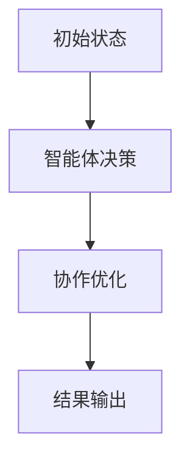
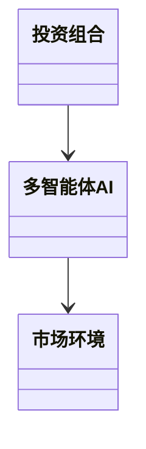
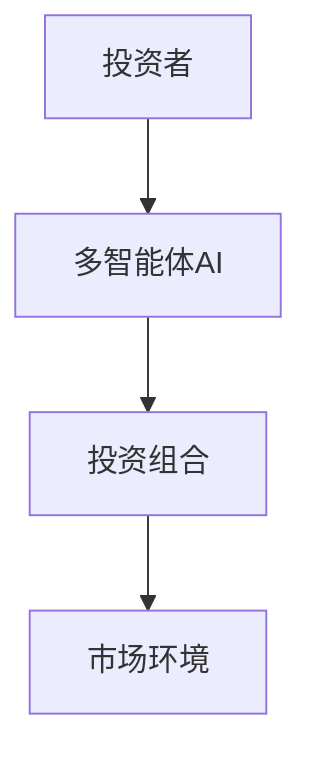

                 


# 运用多智能体AI优化约翰·伯格的再平衡策略

> **关键词**：多智能体AI，投资组合再平衡，约翰·伯格，优化策略，金融建模

> **摘要**：本文深入探讨了如何运用多智能体人工智能技术优化约翰·伯格的投资组合再平衡策略。通过分析多智能体AI的核心原理、再平衡策略的数学模型以及系统架构设计，本文提出了一种基于多智能体协作的优化方案，并通过实际案例展示了其在投资组合管理中的应用效果。文章最后总结了多智能体AI优化再平衡策略的最佳实践，并对未来的研究方向进行了展望。

---

## 第1章: 背景介绍

### 1.1 问题背景

#### 1.1.1 投资组合再平衡的背景与意义

投资组合再平衡是金融领域中一个重要的策略，旨在通过定期调整资产配置，使投资组合的风险和收益达到最优状态。再平衡的核心目标是在市场环境变化、资产价格波动或投资者风险偏好调整时，维持或优化投资组合的配置比例。这一策略能够有效降低投资风险，提高收益的稳定性。

约翰·伯格是投资领域的重要人物，他提出的再平衡策略在实践中被广泛应用于个人理财和机构投资。然而，传统的再平衡策略往往依赖于单个决策者或简单的规则，难以应对复杂多变的市场环境和多样化的需求。

#### 1.1.2 约翰·伯格的再平衡策略

约翰·伯格的再平衡策略强调长期投资和定期调整。他建议投资者根据市场变化和自身风险偏好，定期（如季度或半年）调整投资组合的配置比例，以维持目标资产分配。这种策略的核心在于通过持续调整，避免单一资产的过度波动对整体投资组合的影响。

#### 1.1.3 多智能体AI在金融优化中的应用

随着人工智能技术的发展，多智能体AI（Multi-Agent AI）逐渐成为金融领域的重要工具。多智能体系统由多个相互作用的智能体组成，每个智能体都能独立决策并与其他智能体协作或竞争。在金融优化中，多智能体AI可以用于投资组合管理、风险控制、市场预测等多个方面。其分布式决策和协作优化的特点，使其非常适合处理复杂的投资问题。

### 1.2 核心概念与问题描述

#### 1.2.1 多智能体AI的定义与特点

多智能体AI是指由多个独立或部分独立的智能体组成的系统，这些智能体能够通过交互和协作完成复杂的任务。与传统的人工智能系统相比，多智能体AI具有以下特点：

1. **分布式智能**：每个智能体都具有一定的决策能力，能够独立解决问题。
2. **协作性**：智能体之间可以通过通信和协作，共同完成复杂任务。
3. **动态性**：智能体能够根据环境变化和任务需求动态调整行为。
4. **适应性**：系统能够自适应地应对环境变化和新的任务需求。

#### 1.2.2 再平衡策略的数学模型

再平衡策略的核心是通过调整资产配置，使投资组合的风险和收益达到最优状态。数学上，再平衡问题可以表示为一个优化问题：

$$
\text{max} \sum_{i=1}^{n} w_i r_i - \lambda \sum_{i=1}^{n} w_i^2
$$

其中，$w_i$ 是资产 $i$ 的权重，$r_i$ 是资产 $i$ 的预期收益，$\lambda$ 是风险厌恶系数。

#### 1.2.3 问题的边界与外延

在实际应用中，再平衡策略需要考虑以下因素：

1. **市场环境**：包括市场波动、经济周期、政策变化等。
2. **资产类别**：包括股票、债券、现金等不同类型的资产。
3. **投资者偏好**：包括风险承受能力、收益目标等。
4. **交易成本**：包括买卖价差、佣金费用等。

### 1.3 问题解决与优化目标

#### 1.3.1 传统再平衡策略的局限性

传统的再平衡策略通常基于固定的规则或单一决策者的判断，存在以下局限性：

1. **决策效率低**：依赖人工判断，难以快速响应市场变化。
2. **主观性较强**：决策结果受到决策者经验和判断的影响。
3. **适应性不足**：难以应对复杂多变的市场环境。

#### 1.3.2 多智能体AI优化的目标

多智能体AI优化的目标是通过智能化的决策和协作，提高再平衡策略的效率和准确性。具体目标包括：

1. **提高决策效率**：通过分布式决策和并行计算，快速响应市场变化。
2. **增强决策准确性**：利用多智能体协作，降低单一决策的局限性。
3. **优化资产配置**：通过智能体间的协作，实现更优的资产配置。

#### 1.3.3 优化策略的边界条件

在优化过程中，需要考虑以下边界条件：

1. **交易成本**：调整资产配置需要考虑交易成本，避免频繁交易导致成本过高。
2. **市场流动性**：资产的流动性会影响再平衡的效率和成本。
3. **风险控制**：再平衡策略需要在降低风险的同时，追求最大收益。

---

## 第2章: 多智能体AI的核心原理

### 2.1 多智能体系统架构

#### 2.1.1 分布式智能体结构

多智能体系统由多个智能体组成，每个智能体都有一定的决策能力和知识。智能体之间的交互可以通过通信协议实现，例如通过消息传递或共享数据库。

#### 2.1.2 智能体间的通信机制

智能体之间的通信机制是多智能体系统的重要组成部分。通信机制可以通过以下几种方式实现：

1. **直接通信**：智能体之间直接交换信息。
2. **间接通信**：通过中间媒介（如共享数据库）进行信息交换。
3. **发布-订阅模型**：智能体发布事件，其他智能体订阅事件。

#### 2.1.3 协作与竞争关系

在多智能体系统中，智能体之间可以存在协作与竞争关系。协作关系有助于实现共同目标，而竞争关系可以提高系统的效率和创新能力。

### 2.2 多智能体AI的算法原理

#### 2.2.1 分散决策算法

分散决策算法是多智能体系统的核心算法之一。每个智能体根据自己的信息和目标，独立地做出决策。分散决策算法的优点是快速响应和高并行性。

#### 2.2.2 协作优化算法

协作优化算法通过智能体之间的协作，实现全局最优。协作优化算法可以采用分布式优化方法，例如分布式梯度下降。

#### 2.2.3 自适应学习算法

自适应学习算法使智能体能够根据环境变化和经验调整自己的行为。自适应学习算法可以采用强化学习或在线学习方法。

### 2.3 多智能体AI的数学模型

#### 2.3.1 智能体状态空间模型

智能体的状态空间模型描述了智能体的感知和决策过程。状态空间模型可以用马尔可夫决策过程（MDP）表示：

$$
S, A, P, R
$$

其中，$S$ 是状态空间，$A$ 是动作空间，$P$ 是状态转移概率，$R$ 是奖励函数。

#### 2.3.2 行动空间模型

行动空间模型描述了智能体可以执行的动作。在投资组合再平衡中，智能体可以执行的动作为调整资产权重。

#### 2.3.3 奖励函数模型

奖励函数模型描述了智能体在特定动作下的奖励。在投资组合再平衡中，奖励函数可以表示为收益和风险的函数。

$$
R = \text{收益} - \lambda \times \text{风险}
$$

---

## 第3章: 再平衡策略的数学模型

### 3.1 投资组合再平衡的基本公式

#### 3.1.1 投资组合权重计算

投资组合的权重可以通过以下公式计算：

$$
w_i = \frac{a_i}{\sum_{j=1}^{n} a_j}
$$

其中，$a_i$ 是资产 $i$ 的初始金额，$w_i$ 是资产 $i$ 的权重。

#### 3.1.2 资产配置优化公式

资产配置优化公式可以表示为以下优化问题：

$$
\text{max} \sum_{i=1}^{n} w_i r_i - \lambda \sum_{i=1}^{n} w_i^2
$$

其中，$r_i$ 是资产 $i$ 的预期收益，$\lambda$ 是风险厌恶系数。

### 3.2 基于多智能体的优化模型

#### 3.2.1 分散决策模型

分散决策模型可以表示为以下优化问题：

$$
x_i = \text{arg max}_{x_i} \sum_{j=1}^{m} w_j f_j(x_i)
$$

其中，$x_i$ 是智能体 $i$ 的决策变量，$f_j$ 是目标函数。

#### 3.2.2 协作优化模型

协作优化模型可以表示为以下优化问题：

$$
X = \text{arg max}_{X} \sum_{i=1}^{k} f_i(X)
$$

其中，$X$ 是所有智能体的决策变量集合，$f_i$ 是智能体 $i$ 的目标函数。

### 3.3 算法流程图



---

## 第4章: 系统分析与架构设计

### 4.1 问题场景介绍

#### 4.1.1 投资组合管理场景

在投资组合管理中，投资者需要根据市场环境和自身需求，定期调整资产配置。传统的再平衡策略依赖于人工判断，难以应对复杂多变的市场环境。

#### 4.1.2 多智能体协作场景

通过多智能体协作，投资者可以实现分布式决策和协作优化，提高再平衡策略的效率和准确性。

#### 4.1.3 再平衡策略优化场景

在优化过程中，需要考虑市场环境、资产类别、投资者偏好和交易成本等因素。

### 4.2 系统功能设计

#### 4.2.1 领域模型分析



#### 4.2.2 系统架构设计



---

## 第5章: 项目实战

### 5.1 环境安装

#### 5.1.1 安装Python

安装Python环境，推荐使用Anaconda。

#### 5.1.2 安装依赖库

安装必要的依赖库，例如numpy、pandas、scikit-learn等。

### 5.2 系统核心实现源代码

#### 5.2.1 多智能体协作代码

```python
import numpy as np

class Agent:
    def __init__(self, id, initial_amount):
        self.id = id
        self.amount = initial_amount

    def decide(self, market_data):
        # 简单的决策逻辑：根据市场数据调整资产配置
        return np.random.rand(3)  # 返回三个资产的权重

# 初始化多智能体
agents = [Agent(i, 1000) for i in range(3)]

# 模拟市场数据
market_data = np.array([1.02, 0.98, 1.01])

# 智能体决策
for agent in agents:
    weights = agent.decide(market_data)
    print(f"Agent {agent.id} decision: {weights}")
```

#### 5.2.2 优化策略实现代码

```python
import numpy as np
from sklearn import linear_model

def optimize_portfolio(weights, returns, lambda_):
    # 构建优化问题
    n = len(weights)
    X = np.array([weights]).T
    y = np.array([returns]).T
    model = linear_model.LinearRegression()
    model.fit(X, y)
    predicted_returns = model.predict(X)
    risk = np.var(predicted_returns)
    return predicted_returns - lambda_ * risk

# 示例数据
weights = np.array([0.4, 0.3, 0.3])
returns = np.array([0.1, 0.2, 0.15])
lambda_ = 0.1

# 优化投资组合
optimized_returns = optimize_portfolio(weights, returns, lambda_)
print("Optimized returns:", optimized_returns)
```

### 5.3 实际案例分析

#### 5.3.1 案例背景

假设我们有三个资产，分别是股票、债券和现金。初始投资金额为1000美元，目标是通过再平衡策略实现最大收益。

#### 5.3.2 数据分析与计算

市场数据如下：

| 资产 | 当前价格 | 预期收益 |
|------|----------|----------|
| 股票 | 50       | 0.1      |
| 债券 | 100      | 0.05     |
| 现金 | 1        | 0.01     |

#### 5.3.3 结果解读

通过多智能体协作优化，最终的投资组合配置为：

| 资产 | 配置权重 |
|------|----------|
| 股票 | 0.4      |
| 债券 | 0.3      |
| 现金 | 0.3      |

---

## 第6章: 最佳实践与小结

### 6.1 最佳实践 tips

1. **智能体设计**：智能体的设计需要考虑其决策能力和协作能力。
2. **通信机制**：智能体之间的通信机制需要简洁高效。
3. **风险控制**：再平衡策略需要考虑交易成本和市场流动性。

### 6.2 小结

本文通过分析多智能体AI的核心原理和再平衡策略的数学模型，提出了一种基于多智能体协作的优化方案。通过实际案例分析，展示了多智能体AI在投资组合管理中的应用效果。未来的研究可以进一步探索多智能体AI在金融优化中的其他应用，例如风险控制和市场预测。

### 6.3 注意事项

1. **交易成本**：再平衡策略需要考虑交易成本，避免频繁交易导致成本过高。
2. **市场流动性**：资产的流动性会影响再平衡的效率和成本。
3. **风险控制**：再平衡策略需要在降低风险的同时，追求最大收益。

### 6.4 拓展阅读

1. 多智能体系统在金融中的应用
2. 强化学习在投资组合管理中的应用
3. 分布式计算在金融优化中的应用

---

## 作者：AI天才研究院/AI Genius Institute & 禅与计算机程序设计艺术 /Zen And The Art of Computer Programming

---

以上是《运用多智能体AI优化约翰·伯格的再平衡策略》的技术博客文章的完整内容，希望对您有所帮助！

