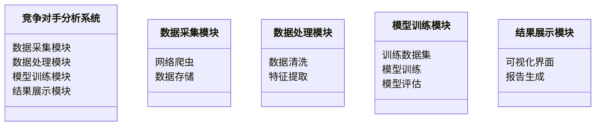
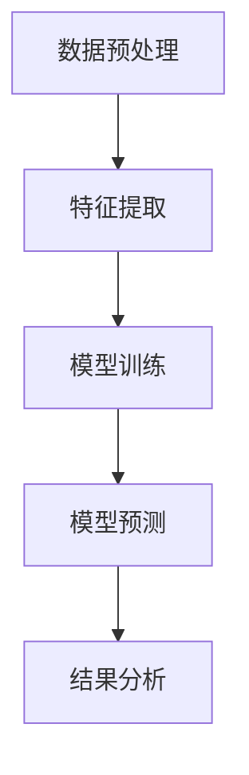

                 


# AI驱动的竞争对手分析：全面评估投资标的的市场地位

**关键词：** AI, 竞争对手分析, 市场地位, 投资决策, 商业分析, 大数据, 机器学习

**摘要：**  
在现代商业环境中，竞争对手分析是评估投资标的市场地位的核心工具。随着人工智能（AI）技术的快速发展，企业能够利用AI的强大能力，从海量数据中提取有价值的信息，从而更精准地评估竞争对手的市场表现、产品优势以及潜在风险。本文将深入探讨AI驱动的竞争对手分析的方法与实践，包括数据收集、自然语言处理（NLP）、机器学习模型的应用，以及如何通过这些技术手段为投资决策提供有力支持。通过实际案例分析，我们将展示如何利用AI技术构建一个完整的竞争对手分析系统，并为企业在复杂多变的市场环境中提供战略指导。

---

# 第1章: AI在商业分析中的作用

## 1.1 人工智能在商业分析中的应用

### 1.1.1 商业分析的传统方法
传统商业分析主要依赖于市场调研、财务报表分析以及行业报告等方法。这些方法通常需要大量的人工参与，数据收集和分析过程耗时且效率较低。例如，分析师需要手动整理竞争对手的产品信息、市场份额数据以及客户反馈等。

### 1.1.2 人工智能如何改变商业分析
人工智能的引入，极大地提升了商业分析的效率和准确性。AI技术可以通过自动化数据处理、模式识别以及预测建模等手段，帮助分析师快速提取关键信息，并提供数据驱动的决策支持。例如，自然语言处理（NLP）可以自动分析竞争对手的产品描述，提取关键词并生成竞争产品矩阵。

### 1.1.3 竞争对手分析的定义与目标
竞争对手分析是指通过对竞争对手的市场行为、产品特点、财务状况等多维度数据的分析，评估其市场地位和竞争优势的过程。其目标是帮助企业在制定市场策略时，能够更清晰地了解竞争对手的优劣势，并找到自身的差异化竞争优势。

---

## 1.2 竞争对手分析的重要性

### 1.2.1 投资决策中的竞争对手分析
在投资决策中，了解竞争对手的市场地位、产品策略以及财务状况，可以帮助投资者评估目标企业的竞争环境，从而做出更明智的投资选择。

### 1.2.2 市场定位与竞争优势
通过竞争对手分析，企业可以更准确地定位自身在市场中的位置，并识别出竞争对手的核心优势和劣势，从而制定更有针对性的市场策略。

### 1.2.3 数据驱动的决策优势
AI驱动的竞争对手分析能够提供实时、动态的市场数据，帮助企业在决策过程中减少主观判断的干扰，提高决策的科学性和准确性。

---

## 1.3 本章小结

本章主要介绍了AI在商业分析中的作用，特别是其在竞争对手分析中的应用。通过对比传统方法与AI技术的差异，我们认识到AI能够显著提升商业分析的效率和深度。同时，我们也明确了竞争对手分析的目标和重要性，为后续章节的深入探讨奠定了基础。

---

# 第2章: 竞争对手分析的核心概念

## 2.1 竞争对手分析的背景与问题背景

### 2.1.1 竞争对手分析的背景
在现代商业环境中，市场竞争日益激烈，企业需要通过分析竞争对手的行为来制定更具竞争力的市场策略。例如，一家科技公司可以通过分析竞争对手的产品更新频率、市场推广策略等，来优化自身的研发和营销计划。

### 2.1.2 竞争对手分析的问题背景
竞争对手分析的核心问题在于如何从海量数据中提取有价值的信息，并将其转化为可操作的洞察。传统方法通常依赖于人工分析，效率低下且容易受到主观因素的影响。

### 2.1.3 竞争对手分析的目标与边界
竞争对手分析的目标是通过数据驱动的方法，全面评估竞争对手的市场地位、产品竞争力以及财务状况。其边界在于，分析的范围应聚焦于直接影响企业市场表现的关键因素，避免过于宽泛或模糊的分析。

---

## 2.2 竞争对手分析的核心要素

### 2.2.1 市场地位分析
市场地位分析包括市场份额、品牌影响力、客户满意度等指标。通过这些指标，可以评估竞争对手在市场中的影响力和竞争力。

### 2.2.2 产品竞争力分析
产品竞争力分析主要关注竞争对手的产品性能、创新性以及市场反馈。例如，通过分析竞争对手的产品评论，可以识别出产品的优缺点以及用户需求的变化趋势。

### 2.2.3 财务状况分析
财务状况分析包括竞争对手的收入、利润、资产负债等财务数据。这些数据能够帮助企业了解竞争对手的财务健康状况，从而预测其未来的市场表现。

---

## 2.3 本章小结

本章从背景和问题背景出发，详细探讨了竞争对手分析的核心要素，包括市场地位、产品竞争力以及财务状况分析。通过对这些核心要素的分析，我们可以更全面地评估竞争对手的市场表现，并为企业制定竞争策略提供数据支持。

---

# 第3章: AI驱动的竞争对手分析方法

## 3.1 数据驱动的竞争对手分析

### 3.1.1 数据收集与整理
数据收集是AI驱动的竞争对手分析的第一步。数据来源包括公开的市场报告、竞争对手的官方网站、社交媒体评论以及行业数据库等。例如，可以通过爬虫技术从竞争对手的网站中提取产品信息。

### 3.1.2 数据清洗与预处理
数据清洗是确保数据质量的重要步骤。通过去除重复数据、处理缺失值以及标准化数据格式，可以为后续的分析提供高质量的数据支持。

### 3.1.3 数据特征提取
数据特征提取是通过分析数据的特征，提取能够反映竞争对手市场表现的关键指标。例如，可以通过NLP技术从产品评论中提取情感特征，评估竞争对手的产品满意度。

---

## 3.2 基于NLP的竞争对手分析

### 3.2.1 自然语言处理在商业分析中的应用
NLP技术可以用于分析竞争对手的产品描述、市场报告以及客户评论等文本数据。例如，通过关键词提取和主题模型，可以识别出竞争对手产品的核心卖点。

### 3.2.2 竞争对手的产品描述分析
通过对竞争对手产品描述的分析，可以提取出产品的功能特点、目标客户群体以及市场定位等信息。例如，可以通过关键词频率分析，识别出竞争对手产品的优势和劣势。

### 3.2.3 市场报告与新闻分析
通过分析竞争对手发布的市场报告以及媒体报道，可以了解其市场战略、财务状况以及行业趋势。例如，可以通过情感分析技术，评估媒体报道对竞争对手品牌形象的影响。

---

## 3.3 机器学习在竞争对手分析中的应用

### 3.3.1 监督学习模型的应用
监督学习模型可以用于预测竞争对手的市场表现。例如，通过训练一个回归模型，可以预测竞争对手的销售额或利润率。

### 3.3.2 无监督学习模型的应用
无监督学习模型可以用于发现竞争对手的市场行为模式。例如，通过聚类分析，可以将竞争对手的产品分为不同的类别，并识别出市场中的主流产品趋势。

### 3.3.3 深度学习模型的应用
深度学习模型可以用于分析复杂的市场数据。例如，可以通过神经网络模型，分析竞争对手的市场策略变化，并预测其未来的市场动向。

---

## 3.4 本章小结

本章详细探讨了AI驱动的竞争对手分析方法，包括数据驱动分析、NLP技术以及机器学习模型的应用。通过对这些方法的分析，我们可以更高效地从海量数据中提取有价值的信息，并为投资决策提供有力支持。

---

# 第4章: 竞争对手分析的系统架构

## 4.1 竞争对手分析系统的需求分析

### 4.1.1 问题场景介绍
竞争对手分析系统的应用场景包括企业战略规划、投资决策以及市场监控等。例如，一家投资机构可以通过该系统分析多个投资标的的市场表现。

### 4.1.2 项目目标与范围
项目的目標是构建一个能够自动收集、分析和预测竞争对手市场表现的系统。系统的范围包括数据收集、数据处理、模型训练以及结果展示等功能。

### 4.1.3 系统功能需求
系统的功能需求包括数据采集模块、数据处理模块、模型训练模块以及结果展示模块。例如，数据采集模块需要能够从多种数据源中获取竞争对手的信息。

---

## 4.2 竞争对手分析系统的架构设计

### 4.2.1 领域模型设计（Mermaid类图）


### 4.2.2 系统架构设计（Mermaid架构图）
```mermaid
client --> 数据采集模块: 请求数据采集
数据采集模块 --> 数据存储: 存储原始数据
数据处理模块 --> 数据存储: 提取特征数据
模型训练模块 --> 数据处理模块: 获取特征数据
模型训练模块 --> 数据处理模块: 获取特征数据
结果展示模块 --> 模型训练模块: 获取预测结果
```

### 4.2.3 系统接口设计
系统的接口设计包括数据接口和用户接口。数据接口用于与其他系统的数据交互，用户接口用于展示分析结果。例如，可以通过API接口将分析结果集成到企业的管理系统中。

---

## 4.3 本章小结

本章从需求分析出发，详细探讨了竞争对手分析系统的架构设计。通过对系统功能模块和架构图的分析，我们可以清晰地了解系统的组成和运行流程，为后续的系统实现奠定了基础。

---

# 第5章: 竞争对手分析的算法原理

## 5.1 竞争对手分析的算法概述

### 5.1.1 常见算法介绍
常用的算法包括线性回归、支持向量机（SVM）、随机森林以及神经网络等。例如，线性回归可以用于预测竞争对手的市场份额。

### 5.1.2 算法选择与优化
算法选择需要根据具体问题和数据特征进行。例如，对于分类问题，可以选择随机森林或SVM；对于回归问题，可以选择线性回归或神经网络。算法优化可以通过交叉验证和超参数调优来实现。

---

## 5.2 基于机器学习的竞争对手分析模型

### 5.2.1 算法流程图（Mermaid）


### 5.2.2 算法数学模型（详细公式推导）
以线性回归为例，其数学模型为：
$$ y = \beta_0 + \beta_1x_1 + \beta_2x_2 + \ldots + \beta_nx_n + \epsilon $$
其中，$y$ 是目标变量，$x_i$ 是特征变量，$\beta_i$ 是系数，$\epsilon$ 是误差项。

### 5.2.3 算法实现代码示例
```python
import pandas as pd
from sklearn.linear_model import LinearRegression
from sklearn.metrics import mean_squared_error

# 数据加载与预处理
data = pd.read_csv('competitor_data.csv')
X = data[['feature1', 'feature2']]
y = data['target']

# 模型训练
model = LinearRegression()
model.fit(X, y)

# 模型预测
y_pred = model.predict(X)
print('均方根误差:', mean_squared_error(y, y_pred))
```

---

## 5.3 本章小结

本章详细探讨了竞争对手分析的算法原理，包括常见算法的选择与优化，以及基于机器学习的模型构建。通过对算法流程图和数学模型的分析，我们可以更深入地理解AI在竞争对手分析中的应用。

---

# 第6章: 实际案例分析与应用

## 6.1 案例背景介绍

### 6.1.1 案例目标
本案例的目标是通过AI技术分析竞争对手的市场表现，评估其市场地位和产品竞争力。例如，分析竞争对手A的市场份额、产品满意度以及财务状况。

### 6.1.2 数据来源与特征
数据来源包括竞争对手A的产品评论、市场报告以及财务数据。数据特征包括产品评分、市场份额、收入增长率等。

### 6.1.3 分析方法选择
选择使用NLP技术分析产品评论，并结合机器学习模型预测市场份额变化。

---

## 6.2 案例分析过程

### 6.2.1 数据预处理与特征提取
通过清洗数据并提取关键词，生成竞争对手的产品竞争力矩阵。例如，提取产品评论中的关键词并进行词频分析。

### 6.2.2 模型训练与优化
使用随机森林模型对市场份额进行预测，并通过交叉验证优化模型参数。例如，调整树的深度和特征选择的策略。

### 6.2.3 结果解读与分析
通过模型预测结果，识别出竞争对手的市场份额变化趋势，并评估其市场地位的变化。例如，预测结果显示竞争对手的市场份额将在未来6个月内增长10%。

---

## 6.3 案例总结与启示

### 6.3.1 分析结果总结
竞争对手A的市场份额增长潜力较大，但其产品满意度存在一定的下降趋势。这表明竞争对手在市场推广方面存在一定的优势，但在产品质量方面可能存在改进空间。

### 6.3.2 对投资决策的启示
对于投资者而言，竞争对手A的市场份额增长潜力可以作为投资决策的重要参考。同时，其产品质量的改进空间也提示投资者需要关注其未来的市场表现。

### 6.3.3 案例的局限性与改进方向
本案例的局限性在于数据来源的限制，未来可以通过引入更多数据源（如客户满意度调查）来提高分析的准确性。

---

## 6.4 本章小结

本章通过一个实际案例，展示了AI技术在竞争对手分析中的应用。通过对案例分析过程的详细描述，我们可以更好地理解AI技术的实际应用价值，并为未来的分析工作提供参考。

---

# 第7章: 系统实现与实战操作

## 7.1 环境搭建与数据准备

### 7.1.1 开发环境安装与配置
安装必要的开发工具，包括Python、Jupyter Notebook以及相关库（如scikit-learn、pandas、requests等）。

### 7.1.2 数据集获取与预处理
从公开数据源获取竞争对手的市场数据，并进行清洗和特征提取。

---

## 7.2 系统核心功能实现

### 7.2.1 数据采集模块
编写网络爬虫代码，从竞争对手的官方网站中提取产品信息。例如，使用BeautifulSoup库抓取产品描述和价格信息。

```python
import requests
from bs4 import BeautifulSoup

url = 'https://www.competitor.com/products'
response = requests.get(url)
soup = BeautifulSoup(response.text, 'html.parser')
products = soup.find_all('div', class_='product-info')
for product in products:
    print(product.text)
```

### 7.2.2 数据处理模块
对采集到的数据进行清洗和特征提取。例如，使用pandas库对数据进行标准化处理。

```python
import pandas as pd

data = pd.read_csv('raw_data.csv')
data.dropna(inplace=True)
data['feature'] = data['text'].apply(lambda x: x.lower())
data.to_csv('processed_data.csv', index=False)
```

### 7.2.3 模型训练模块
训练机器学习模型，并对竞争对手的市场表现进行预测。例如，使用scikit-learn库训练一个随机森林模型。

```python
from sklearn.ensemble import RandomForestRegressor

model = RandomForestRegressor(n_estimators=100, random_state=42)
model.fit(X_train, y_train)
y_pred = model.predict(X_test)
```

### 7.2.4 结果展示模块
将分析结果以可视化的方式展示出来。例如，使用matplotlib库绘制市场份额预测图。

```python
import matplotlib.pyplot as plt

plt.plot(y_test, y_pred, 'b.')
plt.xlabel('Actual')
plt.ylabel('Predicted')
plt.show()
```

---

## 7.3 本章小结

本章详细介绍了竞争对手分析系统的实现过程，包括环境搭建、数据准备、模型训练以及结果展示。通过代码示例和可视化图表，我们可以更直观地理解AI技术在实际应用中的价值。

---

# 作者：AI天才研究院/AI Genius Institute & 禅与计算机程序设计艺术 /Zen And The Art of Computer Programming

---

**小结：**  
本文从理论到实践，全面探讨了AI驱动的竞争对手分析的方法与应用。通过对数据驱动分析、NLP技术以及机器学习模型的深入探讨，我们能够更高效地评估竞争对手的市场地位，并为投资决策提供有力支持。希望本文能够为读者在AI驱动的竞争对手分析领域提供有价值的参考和启发。

