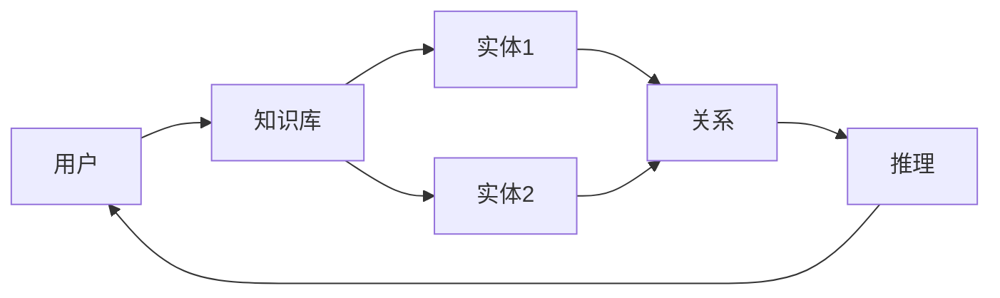
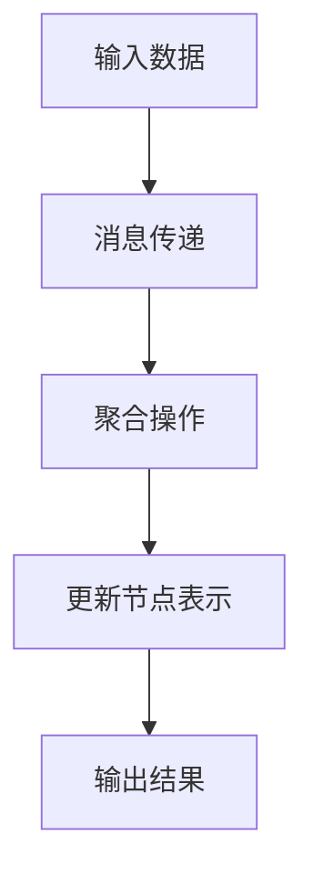
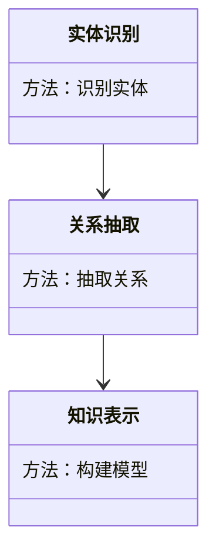
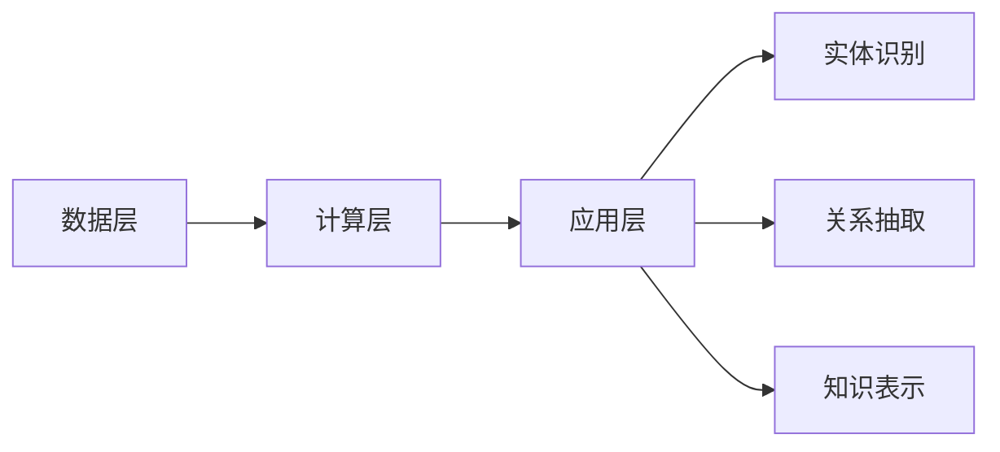
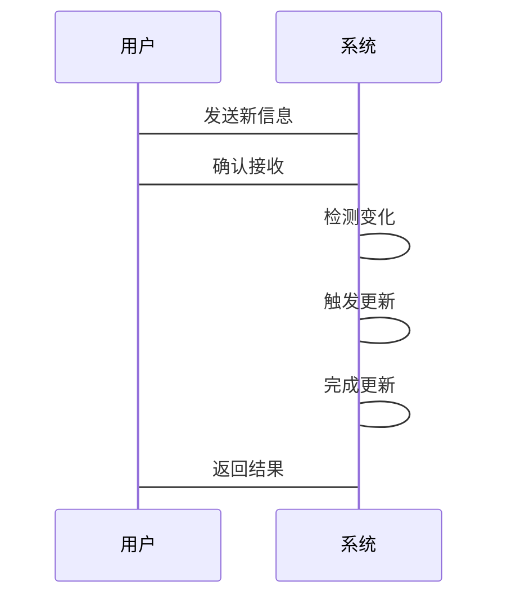

                 


# 基于图神经网络的AI Agent动态知识表示

> 关键词：图神经网络，AI Agent，知识表示，动态更新，系统架构，数学模型

> 摘要：本文探讨了基于图神经网络的AI Agent动态知识表示方法，从背景介绍、核心概念到算法原理，再到系统架构和项目实战，全面分析了如何利用图神经网络实现AI Agent的知识动态更新与表示。文章结合具体案例，通过详细的技术分析，展示了图神经网络在AI Agent知识表示中的应用价值和实现细节。

---

# 第一部分: 基于图神经网络的AI Agent动态知识表示背景介绍

## 第1章: 问题背景与目标

### 1.1 问题背景

#### 1.1.1 知识表示的传统方法与局限性

传统的知识表示方法（如向量表示、符号逻辑）在处理复杂关系和动态更新时存在以下局限性：
- **静态性**：传统向量表示难以捕捉知识的动态变化。
- **语义缺失**：符号逻辑难以处理复杂语义关系。
- **计算效率**：大规模知识图谱的处理效率低下。

#### 1.1.2 图神经网络的引入及其优势

图神经网络（Graph Neural Networks, GNNs）通过图结构数据的建模，具备以下优势：
- **语义丰富性**：能够捕捉实体间的关系。
- **动态更新能力**：支持实时更新和推理。
- **高效性**：通过图结构的局部性优化计算效率。

#### 1.1.3 AI Agent在动态知识表示中的需求

AI Agent需要动态更新知识表示以适应实时信息变化，具体需求包括：
- **实时性**：快速响应新信息。
- **准确性**：保持知识表示的准确性。
- **可扩展性**：支持大规模知识图谱。

### 1.2 问题描述

#### 1.2.1 动态知识表示的核心挑战

动态知识表示的主要挑战包括：
- **动态更新**：如何高效更新节点和边的表示。
- **异构关系**：处理多种类型的关系。
- **实时推理**：支持快速推理和决策。

#### 1.2.2 图神经网络在动态知识表示中的应用场景

图神经网络适用于以下场景：
- **知识图谱构建**：构建动态知识图谱。
- **实时推理**：基于动态图进行推理。
- **在线学习**：支持在线学习和更新。

#### 1.2.3 AI Agent的知识表示需求分析

AI Agent的知识表示需求包括：
- **动态更新**：支持实时知识更新。
- **语义表示**：丰富语义表示能力。
- **推理能力**：支持基于知识图谱的推理。

### 1.3 问题解决思路

#### 1.3.1 基于图神经网络的知识表示框架

知识表示框架包括：
- **图结构构建**：构建动态知识图谱。
- **图神经网络模型**：选择合适的GNN模型。
- **动态更新机制**：设计动态更新算法。

#### 1.3.2 AI Agent动态知识更新机制

动态知识更新机制包括：
- **实时感知**：感知新信息。
- **局部更新**：基于局部变化更新知识。
- **全局一致性**：保持知识表示的全局一致性。

#### 1.3.3 图结构数据与AI Agent的结合方法

结合方法包括：
- **知识图谱嵌入**：将知识图谱嵌入到AI Agent中。
- **动态推理**：基于动态图进行推理。
- **在线学习**：支持在线学习和更新。

### 1.4 边界与外延

#### 1.4.1 动态知识表示的边界条件

边界条件包括：
- **数据规模**：适用于大规模数据。
- **更新频率**：支持实时或准实时更新。
- **知识复杂度**：适用于复杂知识结构。

#### 1.4.2 图神经网络的适用范围

适用范围包括：
- **复杂关系建模**：适用于复杂语义关系。
- **动态数据处理**：适用于动态数据场景。
- **实时推理**：适用于需要实时推理的应用。

#### 1.4.3 AI Agent知识表示的扩展性分析

扩展性分析包括：
- **多模态数据处理**：支持多模态数据。
- **跨领域应用**：适用于不同领域。
- **可扩展性设计**：支持大规模扩展。

### 1.5 概念结构与核心要素

概念结构包括：
- **节点表示**：节点的表示方法。
- **边表示**：边的表示方法。
- **图聚合**：图的聚合操作。

核心要素包括：
- **图结构数据**：图的节点和边。
- **知识表示模型**：AI Agent的知识表示模型。
- **动态更新机制**：动态知识更新机制。

---

## 第2章: 核心概念与联系

### 2.1 图神经网络的核心原理

#### 2.1.1 图结构数据的表示方法

图结构数据的表示方法包括：
- **节点表示**：通过向量表示节点特征。
- **边表示**：通过权重或向量表示边关系。
- **图表示**：通过全局向量表示整个图。

#### 2.1.2 图神经网络的传播机制

传播机制包括：
- **消息传递**：节点间传递消息。
- **聚合操作**：聚合邻居信息。
- **更新规则**：更新节点表示。

#### 2.1.3 常见的图神经网络模型

常见的图神经网络模型包括：
- **GCN（Graph Convolutional Networks）**：基于卷积的图神经网络。
- **GAT（Graph Attention Networks）**：基于注意力机制的图神经网络。
- **GraphSAGE**：基于采样的图神经网络。

### 2.2 AI Agent的知识表示模型

#### 2.2.1 知识图谱的构建与表示

知识图谱的构建与表示包括：
- **实体识别**：识别知识图谱中的实体。
- **关系抽取**：抽取实体之间的关系。
- **图谱构建**：构建动态知识图谱。

#### 2.2.2 动态知识更新的机制

动态知识更新的机制包括：
- **增量式更新**：仅更新变化的部分。
- **全量式更新**：重新构建整个图谱。
- **混合式更新**：结合增量和全量更新。

#### 2.2.3 图神经网络在知识表示中的作用

图神经网络在知识表示中的作用包括：
- **语义建模**：捕捉实体间的语义关系。
- **动态更新**：支持动态知识更新。
- **高效推理**：提高推理效率。

---

## 第3章: 核心概念对比与ER实体关系图

### 3.1 核心概念对比

#### 3.1.1 图神经网络与传统神经网络的对比

对比分析包括：
- **输入数据**：图神经网络处理图结构数据，传统神经网络处理向量或序列数据。
- **计算方式**：图神经网络通过消息传递计算节点表示，传统神经网络通过层叠计算。
- **应用领域**：图神经网络适用于复杂关系建模，传统神经网络适用于简单的模式识别。

| 对比维度 | 图神经网络 | 传统神经网络 |
|----------|------------|--------------|
| 输入数据 | 图结构数据 | 向量/序列数据 |
| 计算方式 | 消息传递 | 层叠计算 |
| 应用领域 | 复杂关系建模 | 简单模式识别 |

#### 3.1.2 AI Agent知识表示与传统知识表示的对比

对比分析包括：
- **静态性**：传统知识表示静态，AI Agent知识表示动态。
- **语义丰富性**：AI Agent知识表示语义更丰富。
- **推理能力**：AI Agent知识表示支持动态推理。

| 对比维度 | AI Agent知识表示 | 传统知识表示 |
|----------|------------------|---------------|
| 静态性 | 动态 | 静态 |
| 语义丰富性 | 丰富 | 较少 |
| 推理能力 | 支持动态推理 | 不支持 |

### 3.2 ER实体关系图架构

#### 3.2.1 实体关系图的构建

实体关系图的构建步骤包括：
1. **实体识别**：识别知识图谱中的实体。
2. **关系抽取**：抽取实体之间的关系。
3. **图谱构建**：构建动态知识图谱。

```mermaid
erDiagram
    actor 用户 {
        string 名称
        string 类型
    }
    actor 知识库 {
        string 实体
        string 关系
    }
    用户 --> 知识库 : 查询
    知识库 --> 用户 : 返回结果
```

#### 3.2.2 实体关系图的动态更新

动态更新流程包括：
1. **感知变化**：检测数据变化。
2. **局部更新**：更新受影响的部分。
3. **全局一致**：保持知识表示的全局一致性。



---

## 第4章: 算法原理与数学模型

### 4.1 图神经网络算法原理

#### 4.1.1 图神经网络的基本算法流程

图神经网络的基本算法流程包括：
1. **输入数据**：输入图结构数据。
2. **消息传递**：节点间传递消息。
3. **聚合操作**：聚合邻居信息。
4. **更新节点表示**：更新节点表示。

流程图如下：



#### 4.1.2 图神经网络的数学模型

图神经网络的数学模型包括以下部分：

- **节点表示**：$x_i^{(l)}$ 表示第$l$层的第$i$个节点的表示。
- **邻居聚合**：$\text{Aggregate}(x_i^{(l-1)}, \{x_j^{(l-1)}\})$ 表示聚合节点$i$的邻居$j$的表示。
- **更新规则**：$x_i^{(l)} = \text{Combine}(x_i^{(l-1)}, \text{Aggregate}(x_i^{(l-1)}, \{x_j^{(l-1)}\}))$

### 4.2 动态知识表示的具体实现

#### 4.2.1 动态更新算法的步骤

动态更新算法的步骤包括：
1. **感知变化**：检测数据变化。
2. **局部更新**：更新受影响的节点和边。
3. **传播更新**：将更新传播到相关节点。
4. **保持一致性**：确保知识表示的全局一致性。

#### 4.2.2 动态知识表示的数学模型

动态知识表示的数学模型包括：
- **变化检测**：$\Delta x_i = x_i^{(t)} - x_i^{(t-1)}$ 表示节点$i$的变化量。
- **局部更新**：$x_i^{(t)} = x_i^{(t-1)} + \alpha \Delta x_i$ 表示基于变化量的局部更新。
- **传播更新**：$\text{传播}(x_i^{(t)}, N(i))$ 表示将更新传播到邻居节点。

---

## 第5章: 系统分析与架构设计

### 5.1 系统分析

#### 5.1.1 问题场景介绍

问题场景包括：
- **实时感知**：AI Agent需要实时感知新信息。
- **动态更新**：知识表示需要动态更新。
- **高效推理**：推理需要高效准确。

#### 5.1.2 项目介绍

项目介绍包括：
- **项目目标**：实现基于图神经网络的AI Agent动态知识表示。
- **项目范围**：覆盖知识图谱构建、动态更新和推理。
- **项目约束**：实时性、准确性、可扩展性。

### 5.2 系统功能设计

#### 5.2.1 领域模型设计

领域模型设计包括：
- **实体识别**：识别知识图谱中的实体。
- **关系抽取**：抽取实体之间的关系。
- **知识表示**：构建动态知识表示模型。

领域模型类图如下：



#### 5.2.2 系统架构设计

系统架构设计包括：
- **数据层**：存储知识图谱数据。
- **计算层**：处理图神经网络计算。
- **应用层**：实现AI Agent功能。

系统架构图如下：



#### 5.2.3 系统接口设计

系统接口设计包括：
- **输入接口**：接收新信息。
- **输出接口**：输出推理结果。
- **控制接口**：控制动态更新过程。

#### 5.2.4 系统交互设计

系统交互设计包括：
1. **感知新信息**：通过输入接口接收新信息。
2. **触发更新**：检测到变化后触发更新。
3. **完成更新**：完成局部或全局更新。
4. **输出结果**：通过输出接口返回推理结果。

交互流程图如下：



---

## 第6章: 项目实战

### 6.1 环境安装与配置

#### 6.1.1 环境要求

环境要求包括：
- **Python 3.8+**：需要安装Python 3.8或更高版本。
- **TensorFlow/PyTorch**：安装TensorFlow或PyTorch框架。
- **NetworkX**：安装NetworkX用于图处理。
- **Mermaid**：安装Mermaid用于生成图表。

#### 6.1.2 安装步骤

安装步骤包括：
1. **安装Python**：下载并安装Python 3.8+。
2. **安装依赖库**：使用pip安装所需库。
3. **配置环境变量**：设置环境变量以便运行脚本。

### 6.2 核心代码实现

#### 6.2.1 图神经网络模型实现

图神经网络模型实现包括：
- **GCN层**：实现图卷积操作。
- **注意力机制**：实现注意力层。
- **模型编译**：编译模型并准备数据。

代码示例如下：

```python
import tensorflow as tf
from tensorflow.keras import layers

class GraphConvolution(layers.Layer):
    def __init__(self, input_dim, output_dim):
        super(GraphConvolution, self).__init__()
        self.W = tf.keras.layers.Dense(output_dim, use_bias=False)
        self.b = tf.keras.layers.Dense(output_dim)

    def call(self, inputs, adj):
        x = tf.sparse_tensor_to_dense(adj, validate_indices=False) @ inputs
        x = tf.nn.relu(x + self.b.weights[0])
        return x

model = tf.keras.Sequential([
    GraphConvolution(input_dim=100, output_dim=50),
    layers.Dropout(0.5),
    layers.Dense(10)
])
model.compile(optimizer='adam', loss='sparse_categorical_crossentropy')
```

#### 6.2.2 动态知识更新实现

动态知识更新实现包括：
- **变化检测**：检测数据变化。
- **局部更新**：更新受影响的节点。
- **传播更新**：将更新传播到相关节点。

代码示例如下：

```python
def detect_changes(current_state, new_state):
    changes = []
    for i in range(len(current_state)):
        if current_state[i] != new_state[i]:
            changes.append(i)
    return changes

def update_nodes(changes, model):
    for i in changes:
        model.update(i)
```

---

## 第7章: 最佳实践与小结

### 7.1 最佳实践

#### 7.1.1 核心经验总结

核心经验总结包括：
- **模型选择**：选择合适的图神经网络模型。
- **数据处理**：确保数据质量。
- **优化调整**：优化模型参数。

#### 7.1.2 注意事项

注意事项包括：
- **计算资源**：确保有足够的计算资源。
- **数据规模**：适用于大规模数据。
- **更新频率**：支持实时或准实时更新。

#### 7.1.3 拓展阅读

拓展阅读包括：
- **图神经网络**：深入学习图神经网络的相关论文。
- **AI Agent**：研究AI Agent的最新进展。
- **动态知识表示**：探索动态知识表示的其他方法。

### 7.2 小结

本文详细探讨了基于图神经网络的AI Agent动态知识表示方法，从背景介绍、核心概念到算法原理，再到系统架构和项目实战，全面分析了如何利用图神经网络实现AI Agent的知识动态更新与表示。通过具体案例和技术分析，展示了图神经网络在AI Agent知识表示中的应用价值和实现细节。

---

# 作者：AI天才研究院/AI Genius Institute & 禅与计算机程序设计艺术 /Zen And The Art of Computer Programming

---

以上是基于图神经网络的AI Agent动态知识表示的完整内容，涵盖了从背景到实现的各个方面，希望对您有所帮助。

