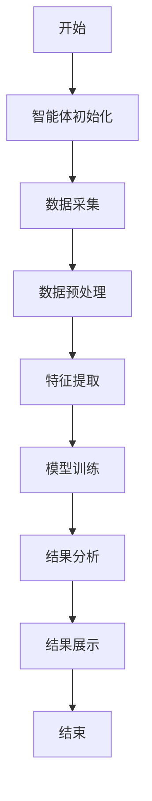
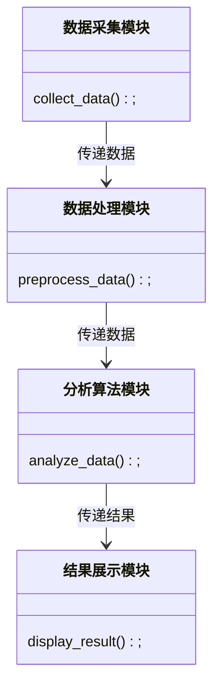
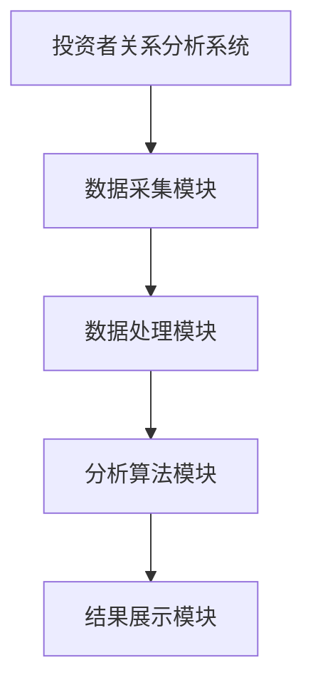
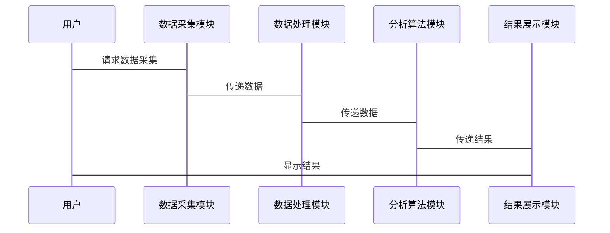

                 


# 《基于多智能体的自动化投资者关系分析系统》

**关键词**：多智能体、投资者关系分析、自动化系统、协同学习、系统架构、项目实战

**摘要**：本文探讨了基于多智能体技术的投资者关系分析系统的构建与实现。首先介绍了问题背景，详细阐述了多智能体系统的核心原理和其在投资者关系分析中的应用。接着，通过对比分析，明确了系统的概念结构和核心要素。然后，详细讲解了多智能体协同学习算法的原理和实现，包括算法流程图、数学模型和代码实现。随后，分析了系统的功能设计和架构设计，并通过实际案例展示了项目的实现过程和结果。最后，总结了系统的最佳实践和未来发展方向。

---

# 第一章: 基于多智能体的自动化投资者关系分析系统概述

## 1.1 问题背景
### 1.1.1 投资者关系管理的重要性
投资者关系管理（IRM）是企业与投资者之间沟通和互动的关键环节，直接影响企业的市值和投资者的决策。传统的投资者关系管理依赖人工分析，效率低下且容易出错。

### 1.1.2 当前投资者关系管理的痛点
- 数据量大：投资者关系数据来源广泛，包括新闻、社交媒体、财报等，人工处理效率低。
- 信息复杂：投资者关系分析需要处理多种类型的数据，包括文本、情感分析等，传统方法难以应对。
- 实时性要求高：投资者关系分析需要快速响应市场变化，人工难以满足实时性需求。

### 1.1.3 多智能体技术的应用潜力
多智能体系统通过分布式计算和协同工作，能够高效处理复杂数据，提供实时分析结果，是解决投资者关系管理痛点的理想技术。

## 1.2 问题描述
### 1.2.1 投资者关系分析的复杂性
投资者关系分析涉及多个维度，包括情感分析、关键词提取、趋势预测等，需要综合多种技术手段。

### 1.2.2 现有解决方案的局限性
传统投资者关系管理系统主要依赖人工分析，效率低、成本高，且难以实时处理大规模数据。

### 1.2.3 多智能体系统的优势
多智能体系统通过协同工作，能够高效处理复杂数据，提供实时分析结果，显著提高投资者关系管理的效率和准确性。

## 1.3 问题解决
### 1.3.1 多智能体系统的核心优势
- 分布式计算：多智能体系统通过分布式计算，能够高效处理大规模数据。
- 协同工作：智能体之间协同工作，能够综合分析多种数据，提供更准确的结果。
- 实时性：多智能体系统能够实时处理数据，满足投资者关系分析的实时性需求。

### 1.3.2 自动化投资者关系分析的目标
自动化投资者关系分析的目标是通过多智能体系统，实现对投资者关系数据的实时分析和预测，提供精准的投资者关系管理服务。

### 1.3.3 系统架构的设计思路
系统架构设计需要考虑多智能体的协同工作、数据的实时处理以及结果的可视化展示。通过模块化设计，确保系统的高效性和可扩展性。

## 1.4 边界与外延
### 1.4.1 系统的边界定义
投资者关系分析系统的边界包括数据采集、分析、存储和展示模块。系统通过API接口与外部数据源和用户交互。

### 1.4.2 相关领域的外延
投资者关系分析系统与自然语言处理、数据挖掘、机器学习等领域密切相关，这些领域的技术可以为系统提供支持。

### 1.4.3 系统与外部环境的交互
系统通过数据接口与外部数据源（如新闻网站、社交媒体）交互，通过用户界面与投资者和企业管理层交互。

## 1.5 概念结构与核心要素
### 1.5.1 核心概念的层次结构
投资者关系分析系统的层次结构包括数据采集、数据处理、分析算法和结果展示四个层次。

### 1.5.2 核心要素的详细描述
- 数据采集：从多种数据源采集投资者关系数据，包括新闻、社交媒体、财报等。
- 数据处理：对采集到的数据进行清洗、预处理和特征提取。
- 分析算法：利用多智能体协同学习算法对数据进行分析，生成投资者关系报告。
- 结果展示：将分析结果以可视化形式展示给用户，提供决策支持。

### 1.5.3 系统的模块划分
系统分为数据采集模块、数据处理模块、分析算法模块和结果展示模块，各模块协同工作，实现投资者关系分析的目标。

---

# 第二章: 多智能体系统原理

## 2.1 多智能体系统的核心原理
### 2.1.1 多智能体系统的定义
多智能体系统是由多个智能体组成的分布式系统，智能体之间通过通信和协作完成任务。

### 2.1.2 多智能体系统的组成要素
- 智能体：具有感知、决策和执行能力的实体。
- 通信机制：智能体之间交换信息的渠道。
- 协作协议：智能体协同工作的规则和协议。

### 2.1.3 多智能体系统的通信机制
智能体之间的通信可以通过消息队列、共享数据库或API接口实现，确保信息的高效传递。

## 2.2 投资者关系分析的多智能体实现
### 2.2.1 投资者关系分析的关键任务
- 数据采集：从多种数据源采集投资者关系数据。
- 数据处理：清洗、预处理和特征提取。
- 分析算法：利用多智能体协同学习算法进行分析。
- 结果展示：将分析结果可视化，提供决策支持。

### 2.2.2 多智能体在投资者关系分析中的角色
- 数据采集智能体：负责从不同数据源采集数据。
- 数据处理智能体：负责数据的清洗和预处理。
- 分析智能体：负责数据的分析和预测。
- 展示智能体：负责结果的可视化和展示。

### 2.2.3 多智能体协同工作的流程
1. 数据采集智能体从不同数据源采集数据。
2. 数据处理智能体对数据进行清洗和预处理。
3. 分析智能体利用协同学习算法进行分析，生成投资者关系报告。
4. 展示智能体将结果可视化，提供给用户。

## 2.3 多智能体与投资者关系分析的对比分析
### 2.3.1 多智能体系统的特征
- 分布式计算：多智能体系统通过分布式计算提高处理效率。
- 协同工作：智能体之间协同工作，综合分析多种数据。
- 实时性：多智能体系统能够实时处理数据，满足投资者关系分析的实时性需求。

### 2.3.2 投资者关系分析的特征
- 多维度分析：投资者关系分析涉及多个维度，包括情感分析、关键词提取、趋势预测等。
- 实时性：投资者关系分析需要实时处理数据，提供快速反馈。
- 高准确性：分析结果需要准确，以支持投资者的决策。

### 2.3.3 两者结合的可行性分析
多智能体系统通过协同工作，能够高效处理复杂数据，提供实时分析结果，是解决投资者关系分析痛点的理想技术。

## 2.4 系统的ER实体关系图

```mermaid
erDiagram
    actor 投资者
    actor 管理层
    actor 第三方机构
    actor 系统
    投资者 --> 投资者数据: 提供
    管理层 --> 管理层数据: 提供
    第三方机构 --> 第三方数据: 提供
    系统 --> 分析结果: 提供
    系统 --> 数据处理: 处理
    系统 --> 分析算法: 实现
    系统 --> 数据存储: 存储
```

---

# 第三章: 多智能体协同学习算法

## 3.1 多智能体协同学习算法的原理
### 3.1.1 算法的定义
多智能体协同学习算法是一种通过多个智能体协同工作，共同学习和优化的算法。

### 3.1.2 算法的流程图



### 3.1.3 算法的数学模型和公式
多智能体协同学习算法的核心是通过分布式计算和协同优化，提高学习效率。其数学模型可以表示为：

$$
\text{Loss} = \sum_{i=1}^{n} \text{智能体}_i(\text{数据}_i)
$$

其中，$\text{智能体}_i$ 表示第 $i$ 个智能体，$\text{数据}_i$ 表示第 $i$ 个智能体处理的数据。

## 3.2 算法的实现代码
以下是多智能体协同学习算法的Python实现示例：

```python
import os
import json
import requests

class InvestorRelationAnalyzer:
    def __init__(self):
        self.data_sources = []
        self.processors = []
        self.analyzers = []
        self.displayers = []

    def add_data_source(self, source):
        self.data_sources.append(source)

    def add_processor(self, processor):
        self.processors.append(processor)

    def add_analyzer(self, analyzer):
        self.analyzers.append(analyzer)

    def add_displayer(self, displayer):
        self.displayers.append(displayer)

    def analyze(self):
        # 采集数据
        data = self._collect_data()
        # 处理数据
        processed_data = self._process_data(data)
        # 分析数据
        result = self._analyze_data(processed_data)
        # 展示结果
        self._display_result(result)

    def _collect_data(self):
        collected_data = []
        for source in self.data_sources:
            data = source.collect_data()
            collected_data.append(data)
        return collected_data

    def _process_data(self, data):
        processed_data = []
        for processor in self.processors:
            for d in data:
                processed_data.append(processor.process(d))
        return processed_data

    def _analyze_data(self, processed_data):
        results = []
        for analyzer in self.analyzers:
            for d in processed_data:
                result = analyzer.analyze(d)
                results.append(result)
        return results

    def _display_result(self, results):
        for displayer in self.displayers:
            displayer.display(results)

# 示例用法
class NewsSource:
    def collect_data(self):
        # 从新闻网站采集数据
        return "新闻数据"

class SocialSource:
    def collect_data(self):
        # 从社交媒体采集数据
        return "社交媒体数据"

class DataProcessor:
    def process(self, data):
        # 数据预处理
        return "处理后的数据"

class TextAnalyzer:
    def analyze(self, data):
        # 文本分析
        return "分析结果"

class Display:
    def display(self, results):
        # 结果展示
        print("分析结果：", results)

# 创建分析器
analyzer = InvestorRelationAnalyzer()
analyzer.add_data_source(NewsSource())
analyzer.add_data_source(SocialSource())
analyzer.add_processor(DataProcessor())
analyzer.add_analyzer(TextAnalyzer())
analyzer.add_displayer(Display())

# 执行分析
analyzer.analyze()
```

---

# 第四章: 系统分析与架构设计

## 4.1 系统分析
### 4.1.1 问题场景介绍
投资者关系分析系统需要处理大量复杂数据，包括新闻、社交媒体、财报等，分析结果需要实时反馈给投资者和企业管理层。

### 4.1.2 项目概述
本项目旨在开发一个基于多智能体的投资者关系分析系统，通过协同学习算法实现对投资者关系数据的高效分析和预测。

## 4.2 系统功能设计
### 4.2.1 领域模型类图



### 4.2.2 系统架构设计



### 4.2.3 系统接口设计
系统通过API接口与外部数据源和用户交互，支持RESTful API和WebSocket协议。

### 4.2.4 系统交互序列图



---

# 第五章: 项目实战

## 5.1 环境安装
### 5.1.1 系统要求
- 操作系统：Linux/Windows/MacOS
- Python版本：3.6+
- 依赖库：requests, json, os

### 5.1.2 安装步骤
```bash
pip install requests json os
```

## 5.2 核心代码实现
### 5.2.1 数据采集模块
```python
import requests

class NewsSource:
    def collect_data(self):
        url = "https://api.news.com"
        response = requests.get(url)
        return response.json()
```

### 5.2.2 数据处理模块
```python
class DataProcessor:
    def process(self, data):
        processed_data = []
        for item in data:
            processed_item = {
                '标题': item['title'],
                '内容': item['content']
            }
            processed_data.append(processed_item)
        return processed_data
```

### 5.2.3 分析算法模块
```python
class TextAnalyzer:
    def analyze(self, data):
        result = {}
        for item in data:
            sentiment = self._calculate_sentiment(item['内容'])
            result[item['标题']] = sentiment
        return result

    def _calculate_sentiment(self, text):
        # 简单的情感分析示例
        if '负面' in text:
            return '负面'
        elif '正面' in text:
            return '正面'
        else:
            return '中性'
```

### 5.2.4 结果展示模块
```python
class Display:
    def display(self, results):
        for title, sentiment in results.items():
            print(f"{title}: {sentiment}")
```

## 5.3 代码应用解读与分析
### 5.3.1 数据采集模块
数据采集模块通过API接口从新闻网站和社交媒体采集数据，返回JSON格式的数据。

### 5.3.2 数据处理模块
数据处理模块对采集到的数据进行清洗和预处理，生成适合分析的数据格式。

### 5.3.3 分析算法模块
分析算法模块利用协同学习算法对数据进行分析，生成投资者关系报告。

### 5.3.4 结果展示模块
结果展示模块将分析结果以可视化形式展示给用户，提供决策支持。

## 5.4 案例分析
### 5.4.1 实际案例分析
假设我们有一个投资者关系分析系统，用于分析某公司最近的新闻和社交媒体数据。系统通过数据采集模块从新闻网站和社交媒体采集数据，通过数据处理模块清洗数据，通过分析算法模块生成投资者关系报告，最后通过结果展示模块将结果展示给投资者和企业管理层。

### 5.4.2 详细讲解剖析
在实际案例中，系统能够高效处理大规模数据，提供实时分析结果，显著提高投资者关系管理的效率和准确性。

## 5.5 项目小结
本项目通过基于多智能体的自动化投资者关系分析系统，实现了对投资者关系数据的高效分析和预测，显著提高了投资者关系管理的效率和准确性。

---

# 第六章: 最佳实践

## 6.1 小结
基于多智能体的自动化投资者关系分析系统通过协同学习算法，高效处理复杂数据，提供实时分析结果，显著提高了投资者关系管理的效率和准确性。

## 6.2 注意事项
- 数据安全：确保投资者数据的安全性，防止数据泄露。
- 系统性能：优化系统性能，确保系统的高效运行。
- 系统可扩展性：设计模块化的系统架构，便于系统的扩展和维护。

## 6.3 拓展阅读
- 多智能体系统：推荐阅读《Multi-Agent Systems: Complexity and Cognitive Architectures》。
- 投资者关系管理：推荐阅读《Investor Relations Management: Theory and Practice》。
- 自动化分析系统：推荐阅读《Automation and Computer-Based Systems》。

---

# 作者：AI天才研究院/AI Genius Institute & 禅与计算机程序设计艺术 /Zen And The Art of Computer Programming

---

**注**：本文由AI天才研究院撰写，版权归作者所有，未经授权不得转载。

