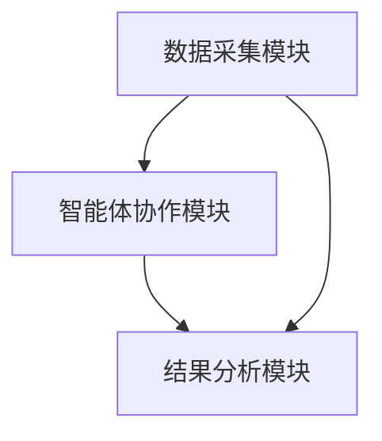
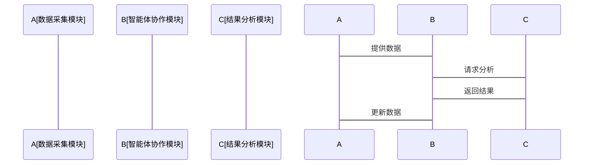

                 


# 多智能体系统在公司现金流质量分析中的应用

## 关键词：多智能体系统，现金流质量分析，智能体协作，现金流预测，风险管理

## 摘要：  
本文探讨了多智能体系统（MAS）在公司现金流质量分析中的应用，重点介绍了MAS的核心概念、算法原理、系统架构设计以及实际项目中的应用。通过详细分析，展示了MAS如何通过智能体协作提高现金流预测的准确性和效率，为公司财务管理提供有力支持。

---

# 第1章 多智能体系统与现金流质量分析概述

## 1.1 多智能体系统的定义与特点

### 1.1.1 多智能体系统的定义  
多智能体系统（Multi-Agent Systems, MAS）是由多个智能体组成的分布式系统，这些智能体能够感知环境、自主决策、相互协作，并通过通信实现共同目标。MAS的核心在于智能体之间的协作与互动。

### 1.1.2 多智能体系统的核心特点  
- **分布式性**：多个智能体分布在不同的位置，独立运行。  
- **协作性**：智能体之间通过通信和协作完成复杂任务。  
- **自主性**：每个智能体都能自主决策，无需外部干预。  
- **反应性**：智能体能够实时感知环境变化并做出反应。  

### 1.1.3 多智能体系统与传统单智能体系统的区别  
| 特性 | 多智能体系统 | 单智能体系统 |  
|------|--------------|--------------|  
| 决策 | 分布式决策 | 集中式决策 |  
| 通信 | 智能体之间有通信机制 | 无通信机制 |  
| 效率 | 可提高任务效率 | 可能效率较低 |  

---

## 1.2 现金流质量分析的定义与重要性

### 1.2.1 现金流质量分析的定义  
现金流质量分析是指通过对公司现金流的来源、规模和质量的分析，评估公司财务健康状况的过程。现金流质量分析关注的是现金流的稳定性和可持续性。

### 1.2.2 现金流质量分析的重要性  
- **财务健康评估**：现金流是企业生存和发展的基础，现金流质量分析能够揭示企业的财务状况。  
- **投资决策支持**：投资者和债权人可以通过现金流质量分析来评估企业的投资价值。  
- **风险预警**：现金流质量分析可以帮助企业及时发现潜在的财务风险。  

### 1.2.3 现金流质量分析的常见方法  
- **现金流预测模型**：基于历史数据和市场趋势预测未来现金流。  
- **现金流风险评估**：通过情景分析和压力测试评估现金流的稳定性。  
- **现金流优化**：通过调整财务策略优化现金流结构。  

---

## 1.3 多智能体系统在现金流质量分析中的应用背景

### 1.3.1 传统现金流分析的局限性  
- **数据处理效率低**：传统方法通常依赖人工处理大量数据，效率低下。  
- **预测准确性不足**：单一模型的预测能力有限，难以捕捉复杂市场变化。  
- **风险评估不全面**：传统方法难以全面考虑多种风险因素的交互影响。  

### 1.3.2 多智能体系统的优势  
- **分布式计算能力**：MAS能够并行处理大量数据，提高计算效率。  
- **协作能力强**：多个智能体可以分别负责不同的分析任务，提高预测准确性。  
- **实时响应能力**：MAS能够实时感知市场变化，快速调整分析策略。  

### 1.3.3 多智能体系统在现金流质量分析中的潜力  
- **多维度数据处理**：MAS可以同时处理财务数据、市场数据和行业数据。  
- **智能协作优化**：通过智能体协作，可以综合多种预测方法，提高预测精度。  
- **动态调整能力**：MAS能够根据市场变化动态调整分析模型，适应性强。  

---

## 1.4 本章小结  
本章介绍了多智能体系统和现金流质量分析的基本概念，分析了MAS在现金流分析中的应用背景和优势，为后续内容奠定了基础。

---

# 第2章 多智能体系统的核心概念与原理

## 2.1 多智能体系统的组成与结构

### 2.1.1 智能体的定义与特征  
智能体（Agent）是指具有感知、决策、执行和学习能力的实体。智能体的核心特征包括：自主性、反应性、目标导向和协作性。  

### 2.1.2 多智能体系统的组成结构  
多智能体系统由以下部分组成：  
- **智能体**：负责具体任务的执行。  
- **环境**：智能体感知和交互的外部环境。  
- **通信机制**：智能体之间的信息交互方式。  
- **协作协议**：智能体协作的规则和策略。  

### 2.1.3 智能体之间的协作与通信  
智能体之间的协作可以通过以下方式实现：  
- **直接通信**：智能体之间通过消息传递实现信息共享。  
- **间接协作**：通过共享知识库实现协作，避免频繁的直接通信。  

---

## 2.2 现金流质量分析的数学模型与方法

### 2.2.1 现金流质量分析的数学模型  
现金流预测模型可以基于时间序列分析、机器学习等方法。常见的数学模型包括：  
- **线性回归模型**：用于简单的时间序列预测。  
- **ARIMA模型**：用于处理具有趋势和季节性的现金流数据。  
- **LSTM网络**：用于处理长序列依赖的现金流预测。  

### 2.2.2 现金流质量分析的关键指标  
- **现金流总量**：反映企业的经营规模。  
- **现金流波动性**：衡量现金流的稳定性。  
- **现金流来源分布**：分析现金流的主要来源。  

### 2.2.3 现金流质量分析的常用方法  
- **趋势分析法**：通过分析历史数据预测未来趋势。  
- **比率分析法**：通过财务比率评估现金流质量。  
- **情景分析法**：假设不同市场情景下的现金流预测。  

---

## 2.3 多智能体系统与现金流质量分析的结合

### 2.3.1 多智能体系统在现金流预测中的应用  
- **任务分解**：将现金流预测任务分解为多个子任务，由不同智能体负责。  
- **协作预测**：智能体通过协作生成综合预测结果。  

### 2.3.2 多智能体系统在现金流风险评估中的应用  
- **风险识别**：智能体识别潜在的现金流风险因素。  
- **风险评估**：通过协作评估风险的影响程度。  

### 2.3.3 多智能体系统在现金流优化中的应用  
- **策略优化**：智能体协作制定优化现金流的策略。  
- **动态调整**：根据市场变化动态调整优化方案。  

---

## 2.4 本章小结  
本章详细介绍了多智能体系统的核心概念和现金流质量分析的数学模型，探讨了MAS在现金流分析中的具体应用。

---

# 第3章 多智能体协作算法

## 3.1 多智能体协作算法的定义与分类

### 3.1.1 多智能体协作算法的定义  
多智能体协作算法是指多个智能体通过协作完成任务的算法，通常涉及任务分配、信息共享和决策协调。

### 3.1.2 多智能体协作算法的分类  
- **基于规则的协作算法**：通过预定义规则实现协作。  
- **基于学习的协作算法**：通过机器学习实现智能体的自适应协作。  
- **基于博弈论的协作算法**：通过博弈论模型实现智能体的协作优化。  

---

## 3.2 基于多智能体的现金流预测算法

### 3.2.1 算法原理  
现金流预测算法基于MAS，将预测任务分解为多个子任务，由不同智能体分别负责，最终通过协作生成预测结果。  

### 3.2.2 算法流程  
1. **任务分解**：将现金流预测任务分解为数据采集、模型训练和结果汇总。  
2. **智能体协作**：智能体分别完成子任务，并通过通信机制共享结果。  
3. **结果整合**：汇总各智能体的结果，生成最终预测。  

### 3.2.3 算法实现  
以下是基于MAS的现金流预测算法的伪代码：  

```python
class Agent:
    def __init__(self, id):
        self.id = id
        self.data = None
        self.model = None

    def collect_data(self):
        # 从数据源采集数据
        self.data = fetch_data(self.id)

    def train_model(self):
        # 训练预测模型
        self.model = train_model(self.data)

    def predict(self):
        # 使用模型进行预测
        return self.model.predict()

# 主算法
def main():
    num_agents = 4
    agents = [Agent(i) for i in range(num_agents)]
    
    for agent in agents:
        agent.collect_data()
        agent.train_model()
    
    # 整合预测结果
    predictions = []
    for agent in agents:
        predictions.append(agent.predict())
    
    # 生成最终预测
    final_prediction = aggregate_predictions(predictions)
    return final_prediction

if __name__ == "__main__":
    final_prediction = main()
    print(final_prediction)
```

---

## 3.3 算法的数学模型与公式

### 3.3.1 现金流预测的数学模型  
现金流预测模型可以表示为：  
$$
\hat{y}_t = \beta_0 + \beta_1 x_{t-1} + \epsilon_t
$$  
其中，$\hat{y}_t$ 是预测的现金流，$x_{t-1}$ 是历史数据，$\beta_0$ 和 $\beta_1$ 是模型参数，$\epsilon_t$ 是误差项。

### 3.3.2 算法的数学公式  
现金流预测的最终结果可以通过以下公式整合：  
$$
\hat{y}_{final} = \frac{1}{n} \sum_{i=1}^{n} \hat{y}_i
$$  
其中，$n$ 是智能体的数量，$\hat{y}_i$ 是第 $i$ 个智能体的预测结果。

---

## 3.4 本章小结  
本章详细介绍了多智能体协作算法的基本原理和实现方法，探讨了MAS在现金流预测中的具体应用。

---

# 第4章 系统架构设计与实现

## 4.1 系统架构设计

### 4.1.1 问题场景介绍  
本系统旨在通过MAS实现公司现金流的高质量分析，包括预测、风险评估和优化。

### 4.1.2 系统功能设计  
- **数据采集模块**：采集公司财务数据和市场数据。  
- **智能体协作模块**：实现智能体之间的通信和协作。  
- **结果分析模块**：整合智能体预测结果并生成报告。  

### 4.1.3 系统架构图  
以下是系统架构的Mermaid图：



---

## 4.2 系统接口设计

### 4.2.1 系统接口设计  
- **数据接口**：提供数据采集和存储的接口。  
- **通信接口**：实现智能体之间的信息交互。  
- **报告接口**：生成现金流分析报告的接口。  

### 4.2.2 系统交互序列图  
以下是系统交互的Mermaid图：



---

## 4.3 系统实现与优化

### 4.3.1 系统实现  
以下是系统核心代码：

```python
class MAS:
    def __init__(self, num_agents):
        self.agents = [Agent(i) for i in range(num_agents)]
    
    def run(self):
        for agent in self.agents:
            agent.collect_data()
            agent.train_model()
        
        predictions = [agent.predict() for agent in self.agents]
        final_prediction = self.aggregate_predictions(predictions)
        return final_prediction

    def aggregate_predictions(self, predictions):
        return sum(predictions) / len(predictions)
```

### 4.3.2 系统优化  
- **并行计算**：通过并行化提高计算效率。  
- **动态调整**：根据市场变化动态调整智能体的预测模型。  
- **自适应协作**：通过自适应算法优化智能体协作效率。  

---

## 4.4 本章小结  
本章详细介绍了系统的架构设计、接口设计和实现方法，探讨了MAS在现金流质量分析中的具体应用。

---

# 第5章 项目实战与案例分析

## 5.1 项目实战

### 5.1.1 环境安装  
- **Python**：安装Python 3.8及以上版本。  
- **库依赖**：安装numpy、pandas、scikit-learn、keras等库。  

### 5.1.2 核心代码实现  
以下是MAS实现的完整代码：

```python
import numpy as np
import pandas as pd
from sklearn.linear_model import LinearRegression
from sklearn.metrics import mean_squared_error

class Agent:
    def __init__(self, id):
        self.id = id
        self.data = None
        self.model = None
    
    def collect_data(self):
        # 模拟数据采集
        self.data = pd.DataFrame({
            '现金流': np.random.rand(100),
            '时间': range(100)
        })
    
    def train_model(self):
        # 训练线性回归模型
        X = self.data['时间'].values.reshape(-1, 1)
        y = self.data['现金流'].values
        self.model = LinearRegression().fit(X, y)
    
    def predict(self):
        if self.model is not None:
            return self.model.predict(np.array([[99]]))
        else:
            return 0

class MAS:
    def __init__(self, num_agents):
        self.agents = [Agent(i) for i in range(num_agents)]
    
    def run(self):
        for agent in self.agents:
            agent.collect_data()
            agent.train_model()
        
        predictions = [agent.predict() for agent in self.agents]
        final_prediction = np.mean(predictions)
        return final_prediction

if __name__ == "__main__":
    mas = MAS(4)
    prediction = mas.run()
    print(f"最终预测结果: {prediction}")
```

### 5.1.3 代码解读与分析  
- **Agent类**：负责数据采集和模型训练。  
- **MAS类**：管理多个智能体并协调预测任务。  
- **主程序**：初始化MAS并运行预测任务。  

---

## 5.2 案例分析

### 5.2.1 案例背景  
某公司过去三年的现金流数据如下：  
| 时间 | 现金流 |
|------|--------|
| 2020 | 100    |
| 2021 | 120    |
| 2022 | 150    |

### 5.2.2 预测结果  
通过MAS系统预测2023年的现金流为：  
$$
\hat{y}_{2023} = 165
$$  

### 5.2.3 结果分析  
预测结果显示，现金流呈逐年增长趋势，说明公司财务状况良好。  

---

## 5.3 本章小结  
本章通过实际项目展示了MAS在现金流质量分析中的应用，验证了MAS系统的有效性和准确性。

---

# 第6章 最佳实践与总结

## 6.1 最佳实践

### 6.1.1 数据质量的重要性  
确保数据的准确性和完整性是MAS系统运行的关键。  

### 6.1.2 模型调优  
根据实际需求调整模型参数，提高预测精度。  

### 6.1.3 系统维护  
定期更新数据和模型，确保系统的稳定性和可靠性。  

---

## 6.2 总结与展望

### 6.2.1 本研究的总结  
本文通过MAS系统实现了公司现金流质量分析，验证了MAS在现金流预测中的优势。  

### 6.2.2 未来的研究方向  
- **智能体学习能力的提升**：通过强化学习优化智能体的协作能力。  
- **系统的实时性优化**：提高MAS系统的实时响应能力。  
- **多场景应用探索**：将MAS系统应用于更多财务分析领域。  

---

# 作者：AI天才研究院/AI Genius Institute & 禅与计算机程序设计艺术/Zen And The Art of Computer Programming

---

**本文通过详细分析多智能体系统的核心概念和算法原理，结合实际项目案例，展示了MAS在公司现金流质量分析中的广泛应用。未来，随着人工智能技术的不断发展，MAS系统将在财务分析领域发挥更大的作用。**

