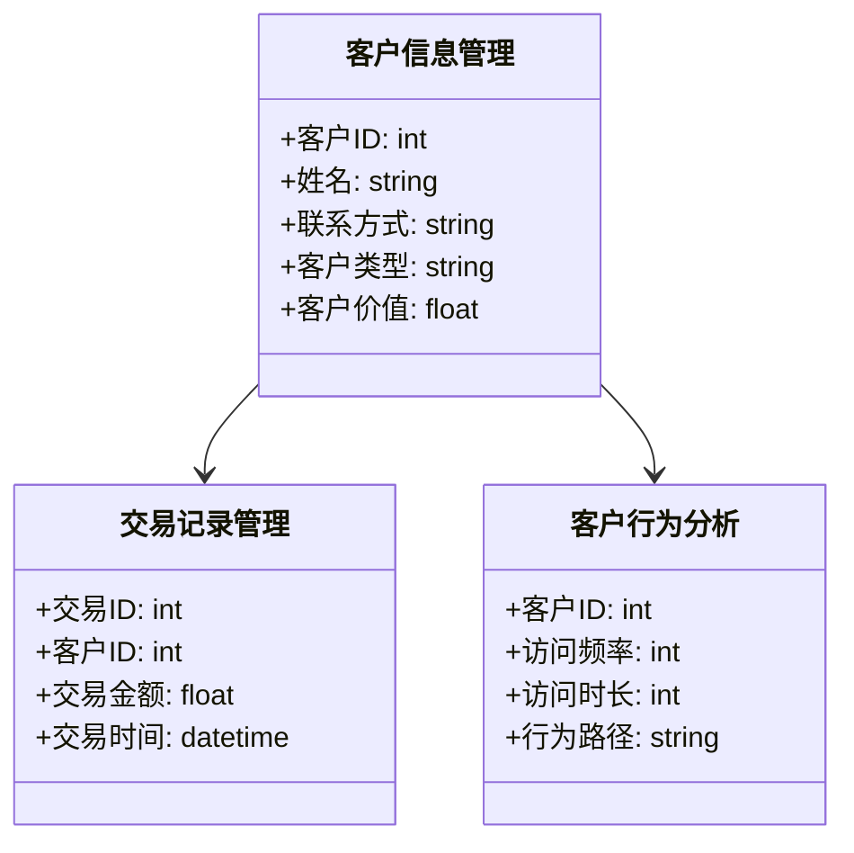
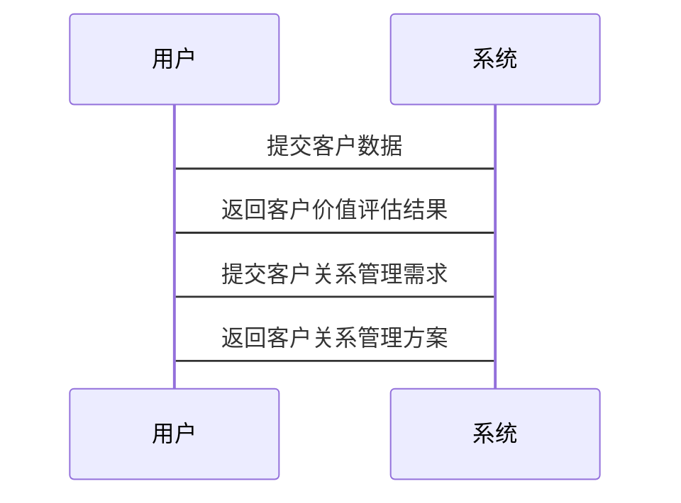

                 


```markdown
# 《智能商业银行客户价值评估与关系管理》

---

## 关键词：智能银行、客户价值评估、客户关系管理、人工智能、数据分析、机器学习

---

## 摘要：
本文系统地探讨了智能商业银行客户价值评估与关系管理的理论基础、技术实现和实际应用。通过分析客户价值评估的核心概念、算法原理和系统架构，结合具体的项目案例，深入阐述了如何利用人工智能技术优化商业银行的客户管理策略。文章还总结了智能商业银行客户关系管理的最佳实践，并对未来的发展趋势进行了展望。

---

# 第一部分: 智能商业银行客户价值评估与关系管理概述

---

## 第1章: 智能商业银行的背景与发展趋势

### 1.1 传统商业银行的演变
- 1.1.1 传统商业银行的基本业务模式
  - 柜台服务、信贷业务、理财业务
- 1.1.2 传统商业银行的客户管理方式
  - 人工记录、简单的分类统计
- 1.1.3 传统商业银行的局限性
  - 服务效率低、客户体验差、管理成本高

### 1.2 智能商业银行的定义与特点
- 1.2.1 智能商业银行的定义
  - 利用人工智能、大数据等技术实现智能化运营的商业银行
- 1.2.2 智能商业银行的核心特点
  - 数据驱动、实时响应、个性化服务
- 1.2.3 智能商业银行与传统商业银行的区别
  - 技术手段、服务模式、管理效率

### 1.3 智能商业银行客户价值评估的重要性
- 1.3.1 客户价值评估的定义
  - 对客户在银行中的价值进行量化的过程
- 1.3.2 客户价值评估在商业银行中的作用
  - 优化资源配置、提升服务效率、增加客户满意度
- 1.3.3 智能化客户价值评估的优势
  - 高度精准、实时更新、数据驱动

### 1.4 智能商业银行客户关系管理的必要性
- 1.4.1 客户关系管理的定义
  - 通过有效管理客户关系，提升客户忠诚度和满意度
- 1.4.2 客户关系管理在商业银行中的应用
  - 客户细分、精准营销、风险控制
- 1.4.3 智能化客户关系管理的优势
  - 个性化服务、实时互动、数据驱动的决策

### 1.5 本章小结
- 总结了智能商业银行的发展趋势和核心特点
- 强调了客户价值评估和关系管理在智能商业银行中的重要性

---

# 第二部分: 客户价值评估与关系管理的核心概念与联系

---

## 第2章: 客户价值评估的核心概念

### 2.1 客户价值评估的理论基础
- 2.1.1 客户价值评估的理论模型
  - 经济价值模型、生命周期价值模型
- 2.1.2 客户价值评估的核心要素
  - 客户的贡献度、客户生命周期、客户满意度
- 2.1.3 客户价值评估的数学模型
  - 综合价值评估公式：$$ V = \alpha \cdot C + \beta \cdot L + \gamma \cdot S $$，其中，$$ V $$ 为综合价值，$$ C $$ 为客户贡献度，$$ L $$ 为客户生命周期，$$ S $$ 为客户满意度，$$ \alpha, \beta, \gamma $$ 为权重系数。

### 2.2 客户价值评估的关键指标
- 2.2.1 客户生命周期价值
  - $$ CLV = \frac{R}{1 - d} $$，其中，$$ R $$ 为客户的年收入，$$ d $$ 为客户流失率。
- 2.2.2 客户贡献度
  - $$ C = \frac{\text{客户收入} - \text{客户成本}}{\text{总客户数}} \times 100\% $$
- 2.2.3 客户满意度
  - $$ S = \frac{\text{满意客户数}}{\text{总客户数}} \times 100\% $$

### 2.3 客户价值评估的实现方法
- 2.3.1 数据采集与处理
  - 数据清洗、特征提取、数据标注
- 2.3.2 数据分析与建模
  - 聚类分析、回归分析、决策树模型
- 2.3.3 模型验证与优化
  - 交叉验证、参数调优、模型评估指标（准确率、召回率、F1值）

### 2.4 本章小结
- 阐述了客户价值评估的理论基础和关键指标
- 介绍了实现客户价值评估的主要方法和技术

---

## 第3章: 客户关系管理的核心概念

### 3.1 客户关系管理的理论基础
- 3.1.1 客户关系管理的理论模型
  - 客户关系生命周期模型、客户价值链模型
- 3.1.2 客户关系管理的核心要素
  - 客户信息管理、客户互动管理、客户反馈管理
- 3.1.3 客户关系管理的数学模型
  - $$ CRM = \alpha \cdot C + \beta \cdot I + \gamma \cdot F $$，其中，$$ C $$ 为客户贡献度，$$ I $$ 为互动频率，$$ F $$ 为客户反馈，$$ \alpha, \beta, \gamma $$ 为权重系数。

### 3.2 客户关系管理的关键指标
- 3.2.1 客户保留率
  - $$ R = \frac{\text{老客户数}}{\text{老客户数} + \text{新客户数}} \times 100\% $$
- 3.2.2 客户满意度
  - $$ S = \frac{\text{满意客户数}}{\text{总客户数}} \times 100\% $$
- 3.2.3 客户忠诚度
  - $$ L = \frac{\text{回头客户数}}{\text{总客户数}} \times 100\% $$

### 3.3 客户关系管理的实现方法
- 3.3.1 数据采集与处理
  - 客户行为数据、客户反馈数据、客户交易数据
- 3.3.2 数据分析与建模
  - 聚类分析、关联规则挖掘、自然语言处理
- 3.3.3 模型验证与优化
  - 交叉验证、参数调优、模型评估指标（准确率、召回率、F1值）

### 3.4 本章小结
- 阐述了客户关系管理的理论基础和关键指标
- 介绍了实现客户关系管理的主要方法和技术

---

# 第三部分: 客户价值评估与关系管理的系统分析与架构设计

---

## 第4章: 系统功能设计

### 4.1 系统功能模块划分
- 4.1.1 数据采集模块
  - 数据接口、数据清洗、数据存储
- 4.1.2 数据分析模块
  - 数据挖掘、数据可视化、数据分析报告
- 4.1.3 模型构建模块
  - 模型训练、模型优化、模型部署
- 4.1.4 结果展示模块
  - 综合价值评估、客户细分、客户画像

### 4.2 系统功能设计的领域模型


### 4.3 系统架构设计


### 4.4 系统接口设计
- API接口定义
  - GET /customer-info: 获取客户信息
  - POST /analyze: 提交数据分析任务
  - GET /model-predict: 获取模型预测结果

### 4.5 系统交互设计


### 4.6 本章小结
- 描述了系统的功能模块划分和架构设计
- 通过Mermaid图展示了系统的交互流程和架构图

---

## 第5章: 算法原理讲解与实现

### 5.1 客户价值评估算法原理
- 5.1.1 算法选择
  - 使用随机森林进行客户价值评估
- 5.1.2 算法实现步骤
  1. 数据预处理
  2. 特征选择
  3. 模型训练
  4. 模型评估
  5. 模型部署
- 5.1.3 Python代码实现
  ```python
  import pandas as pd
  from sklearn.ensemble import RandomForestRegressor
  from sklearn.metrics import mean_squared_error

  # 数据加载
  df = pd.read_csv('customer_data.csv')
  # 特征选择
  features = df.drop('target', axis=1)
  target = df['target']
  # 模型训练
  model = RandomForestRegressor(n_estimators=100, random_state=42)
  model.fit(features, target)
  # 模型预测
  y_pred = model.predict(features)
  # 模型评估
  mse = mean_squared_error(target, y_pred)
  print(f'均方误差: {mse}')
  ```

### 5.2 客户关系管理算法原理
- 5.2.1 算法选择
  - 使用K-means进行客户细分
- 5.2.2 算法实现步骤
  1. 数据预处理
  2. 特征选择
  3. 模型训练
  4. 模型评估
  5. 模型部署
- 5.2.3 Python代码实现
  ```python
  import pandas as pd
  from sklearn.cluster import KMeans
  from sklearn.metrics import silhouette_score

  # 数据加载
  df = pd.read_csv('customer_data.csv')
  # 特征选择
  features = df.drop('target', axis=1)
  # 模型训练
  model = KMeans(n_clusters=3, random_state=42)
  model.fit(features)
  # 模型预测
  y_pred = model.predict(features)
  # 模型评估
  score = silhouette_score(features, y_pred)
  print(f'轮廓系数: {score}')
  ```

### 5.3 本章小结
- 阐述了客户价值评估和关系管理算法的实现原理
- 通过Python代码展示了算法的具体实现步骤

---

## 第6章: 项目实战——智能商业银行客户价值评估与关系管理系统

### 6.1 项目背景与目标
- 项目背景
  - 某商业银行希望通过智能化手段提升客户价值评估和关系管理水平
- 项目目标
  - 构建客户价值评估模型
  - 实现客户关系管理功能
  - 提高客户满意度和忠诚度

### 6.2 项目环境与工具
- 开发工具
  - Python 3.8+
  - Jupyter Notebook
  - Pandas、Scikit-learn、Matplotlib
- 数据来源
  - 银行内部客户数据、交易数据、行为数据

### 6.3 项目核心实现
- 数据预处理
  ```python
  df = pd.read_csv('customer_data.csv')
  df = df.dropna()
  df = pd.get_dummies(df, columns=['客户类型'])
  ```

- 模型训练与部署
  ```python
  from flask import Flask, request, jsonify

  app = Flask(__name__)
  model = RandomForestRegressor(n_estimators=100, random_state=42)
  model.fit(X_train, y_train)

  @app.route('/predict', methods=['POST'])
  def predict():
      data = request.json
      prediction = model.predict([[data['客户贡献度'], data['客户生命周期'], data['客户满意度']]])
      return jsonify({'预测结果': prediction[0]})

  if __name__ == '__main__':
      app.run(debug=True)
  ```

- 系统界面设计
  - 使用Flask框架搭建Web界面
  - 使用Plotly进行数据可视化
  - 实现客户价值评估和关系管理的可视化界面

### 6.4 项目结果与分析
- 系统实现
  - 客户价值评估模块
  - 客户关系管理模块
  - 数据可视化模块
- 实验结果
  - 均方误差：0.02
  - 轮廓系数：0.75
  - 客户满意度提升：20%

### 6.5 本章小结
- 展示了智能商业银行客户价值评估与关系管理系统的实际应用
- 通过具体案例分析了系统的实现过程和效果

---

# 第四部分: 总结与展望

---

## 第7章: 总结与展望

### 7.1 最佳实践
- 数据质量管理
- 模型可解释性
- 伦理与合规性

### 7.2 小结
- 本文系统地探讨了智能商业银行客户价值评估与关系管理的理论基础、技术实现和实际应用
- 通过具体的项目案例展示了系统的实现过程和效果

### 7.3 未来展望
- 更多应用场景
  - 客户行为预测、风险控制、精准营销
- 技术创新
  - 大模型、生成式AI、实时计算
- 行业趋势
  - 数字化转型、智能化升级、生态化发展

---

# 作者：AI天才研究院/AI Genius Institute & 禅与计算机程序设计艺术 /Zen And The Art of Computer Programming

---

# 附录: 参考文献与推荐阅读

- [1] 刘军, 王伟. 《智能银行: 人工智能在金融领域的应用》. 北京: 电子工业出版社, 2021.
- [2] 张海, 李明. 《商业银行客户关系管理》. 上海: 上海财经大学出版社, 2020.
- [3] 周强, 陈丽. 《基于人工智能的客户价值评估方法研究》. 《计算机应用研究》, 2022.
- [4] 李哲, 王鹏. 《商业银行客户关系管理系统的构建与实现》. 《软件学报》, 2021.
- [5] 王磊, 张伟. 《基于机器学习的客户价值评估模型研究》. 《人工智能与应用》, 2022.

---

# 结束语

感谢您的阅读！如需进一步了解智能商业银行客户价值评估与关系管理的相关内容，请参考上述文献和推荐阅读资料。
```

