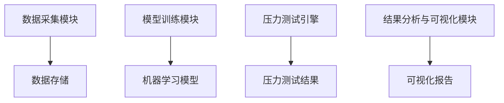

                 


# 构建智能化的个人投资组合压力测试工具

## 关键词：压力测试，投资组合，智能化，风险管理，机器学习，系统架构

## 摘要：本文详细介绍了如何构建一个智能化的个人投资组合压力测试工具。通过分析压力测试的核心概念、算法原理、系统架构以及项目实战，本文提供了从理论到实践的全面指导。结合蒙特卡洛模拟和机器学习算法，本文展示了如何利用现代技术提高投资组合的风险管理能力。通过系统化的分析和实际案例，本文为读者提供了构建高效、智能的压力测试工具的方法和思路。

---

## 第一部分: 压力测试与投资组合管理概述

## 第1章: 个人投资组合压力测试的背景与意义

### 1.1 投资组合压力测试的基本概念

#### 1.1.1 什么是压力测试
压力测试是一种评估投资组合在极端市场条件下的表现和风险的方法。它通过模拟不同情景，分析投资组合在这些情景下的表现，帮助投资者理解其承受风险的能力。

#### 1.1.2 压力测试的目的与作用
- **目的**：识别投资组合在极端情况下的潜在损失，评估其承受风险的能力。
- **作用**：帮助投资者制定风险管理策略，优化投资组合结构。

#### 1.1.3 压力测试的分类与应用场景
- **分类**：
  - 历史情景测试：基于历史市场数据进行测试。
  - 情景分析：假设某些极端市场情况，如经济衰退、市场崩盘等。
  - 情景生成：利用模型生成可能的极端市场情景。
- **应用场景**：投资组合管理、风险评估、投资决策等。

### 1.2 个人投资组合管理的挑战

#### 1.2.1 投资组合管理的核心目标
- 最大化收益：在合理风险范围内实现最大收益。
- 风险控制：降低投资组合在极端情况下的损失。

#### 1.2.2 传统投资组合管理的局限性
- **传统方法的不足**：
  - 依赖历史数据，可能无法预测极端事件。
  - 风险评估不够全面，难以捕捉所有潜在风险。
- **传统方法的改进**：引入现代统计方法和机器学习技术，提高风险评估的准确性。

### 1.3 智能化压力测试工具的必要性

#### 1.3.1 数据驱动的决策需求
- 随着金融市场数据的爆炸式增长，传统的经验判断已不足以应对复杂的市场环境。数据驱动的决策能够提供更精准的风险评估。

#### 1.3.2 人工智能在金融领域的应用
- **人工智能的优势**：
  - 处理海量数据，发现潜在模式。
  - 实时监控市场变化，快速响应风险。
- **机器学习在压力测试中的应用**：通过模型预测极端市场情景，评估投资组合的潜在损失。

#### 1.3.3 智能化压力测试工具的优势
- **高效性**：自动化数据处理和分析，节省时间和成本。
- **准确性**：利用机器学习模型，提高风险评估的准确性。
- **可扩展性**：能够处理大规模数据，适用于不同规模的投资组合。

### 1.4 本章小结
本章介绍了压力测试的基本概念、投资组合管理的挑战以及智能化压力测试工具的必要性。通过分析传统方法的局限性，提出了利用人工智能技术构建智能化压力测试工具的思路。

---

## 第二部分: 智能化压力测试的核心概念与算法原理

## 第2章: 压力测试的核心概念与联系

### 2.1 压力测试的核心要素

#### 2.1.1 市场因子与资产配置
- **市场因子**：影响投资组合收益的关键因素，如市场波动率、利率、通货膨胀等。
- **资产配置**：将投资组合分配到不同资产类别（股票、债券、现金等）以优化风险和收益。

#### 2.1.2 风险因子与相关性分析
- **风险因子**：影响资产风险的因素，如信用风险、市场风险等。
- **相关性分析**：资产之间相关性的影响，相关性高的资产在极端情况下可能同时下跌。

#### 2.1.3 压力测试的情景假设
- **情景假设**：假设极端市场情景，如市场崩盘、经济衰退等。
- **情景生成**：利用统计模型生成可能的极端情景。

### 2.2 核心概念之间的关系

#### 2.2.1 市场因子与资产配置的关系
- **市场因子的影响**：不同市场因子会影响不同资产的收益和风险。
- **资产配置的优化**：通过调整资产配置，降低投资组合的总体风险。

#### 2.2.2 风险因子与相关性分析的关系
- **相关性的影响**：资产之间的高度相关性可能导致投资组合在极端情况下的损失集中。
- **风险因子的管理**：通过识别和管理关键风险因子，降低投资组合的风险。

#### 2.2.3 压力测试情景假设的构建
- **情景假设的合理性**：情景假设需要基于历史数据和市场分析，确保其合理性和代表性。
- **情景假设的多样性**：考虑多种极端情景，确保测试的全面性。

### 2.3 压力测试的数学模型与公式

#### 2.3.1 投资组合收益与风险的数学表达
- **收益的数学表达**：投资组合的收益可以用资产收益的加权平均表示。
  $$ E(R_p) = \sum_{i=1}^{n} w_i E(R_i) $$
  其中，\( w_i \) 是资产 \( i \) 的权重，\( E(R_i) \) 是资产 \( i \) 的预期收益。
- **风险的数学表达**：投资组合的风险可以用方差或标准差表示。
  $$ Var(R_p) = \sum_{i=1}^{n} \sum_{j=1}^{n} w_i w_j Cov(R_i, R_j) $$

#### 2.3.2 压力测试情景的构建公式
- **情景生成公式**：利用统计模型生成可能的极端情景。
  $$ R_{scenario} = \mu + z \sigma $$
  其中，\( \mu \) 是平均收益，\( \sigma \) 是收益的标准差，\( z \) 是标准正态分布的分位数。

#### 2.3.3 风险度量的数学模型
- **VaR（在险值）模型**：计算投资组合在给定置信水平下的潜在损失。
  $$ VaR_{\alpha} = \text{最小损失值，使得在 } 100(1-\alpha) \text{ 的置信水平下，损失不超过 } VaR_{\alpha} $$

### 2.4 本章小结
本章详细介绍了压力测试的核心概念，包括市场因子、资产配置、风险因子和情景假设。通过数学公式，阐述了投资组合收益与风险的关系，以及压力测试情景的构建方法。

---

## 第3章: 压力测试的算法原理与实现

### 3.1 蒙特卡洛模拟算法

#### 3.1.1 蒙特卡洛模拟的基本原理
- **蒙特卡洛模拟**：通过生成大量随机数，模拟不同市场情景，计算投资组合在这些情景下的表现。
- **步骤**：
  1. 确定市场因子的分布。
  2. 生成随机数，模拟市场情景。
  3. 计算投资组合在这些情景下的收益和风险。
  4. 统计分析结果。

#### 3.1.2 蒙特卡洛模拟在压力测试中的应用
- **应用案例**：模拟极端市场情景，评估投资组合的潜在损失。
- **实现步骤**：
  1. 收集历史市场数据，确定市场因子的分布。
  2. 生成大量随机数，模拟不同市场情景。
  3. 计算投资组合在这些情景下的收益和风险。
  4. 统计分析结果，生成压力测试报告。

#### 3.1.3 蒙特卡洛模拟的实现步骤
```python
import numpy as np

# 示例代码：生成随机数并计算投资组合收益
def monte_carlo_simulation(weights, returns, num_simulations=10000):
    portfolio_returns = []
    for _ in range(num_simulations):
        # 生成随机数，模拟市场情景
        market_scenario = np.random.multivariate_normal(mean=returns.mean(), cov=returns.cov())
        # 计算投资组合收益
        portfolio_return = np.dot(weights, market_scenario)
        portfolio_returns.append(portfolio_return)
    return np.array(portfolio_returns)
```

### 3.2 机器学习算法在压力测试中的应用

#### 3.2.1 线性回归与压力测试
- **线性回归的应用**：预测资产收益与市场因子之间的关系。
  $$ R_i = \beta_0 + \beta_1 F_1 + \beta_2 F_2 + \ldots + \beta_k F_k + \epsilon $$
  其中，\( F_1, F_2, \ldots, F_k \) 是市场因子，\( \epsilon \) 是误差项。

#### 3.2.2 支持向量机在压力测试中的应用
- **支持向量机的优势**：在高维空间中进行非线性分类，适用于复杂市场情景的预测。
- **实现步骤**：
  1. 收集市场数据，提取特征（市场因子）。
  2. 标记数据，分为正常和极端情景。
  3. 训练支持向量机模型，分类市场情景。
  4. 使用模型预测极端情景的概率。

#### 3.2.3 神经网络在压力测试中的应用
- **神经网络的优势**：能够处理大量非线性关系，适用于复杂市场情景的预测。
- **实现步骤**：
  1. 收集市场数据，提取特征（市场因子）。
  2. 标记数据，分为正常和极端情景。
  3. 构建神经网络模型，训练数据。
  4. 使用模型预测极端情景的概率。

### 3.3 算法实现的数学模型与公式

#### 3.3.1 蒙特卡洛模拟的数学模型
- **随机数生成**：使用统计模型生成随机数，模拟市场情景。
- **投资组合收益计算**：根据模拟的市场情景，计算投资组合的收益和风险。

#### 3.3.2 机器学习算法的数学模型
- **线性回归模型**：预测资产收益与市场因子之间的线性关系。
  $$ R_i = \beta_0 + \beta_1 F_1 + \beta_2 F_2 + \ldots + \beta_k F_k + \epsilon $$
- **支持向量机模型**：在高维空间中进行非线性分类，适用于复杂市场情景的预测。

#### 3.3.3 算法实现的步骤与公式
- **蒙特卡洛模拟的公式**：
  $$ R_{scenario} = \mu + z \sigma $$
  其中，\( \mu \) 是平均收益，\( \sigma \) 是收益的标准差，\( z \) 是标准正态分布的分位数。
- **线性回归的公式**：
  $$ R_i = \beta_0 + \beta_1 F_1 + \beta_2 F_2 + \ldots + \beta_k F_k + \epsilon $$

### 3.4 本章小结
本章介绍了压力测试中常用的两种算法：蒙特卡洛模拟和机器学习算法。通过详细讲解这两种算法的原理和实现步骤，展示了如何利用这些算法进行投资组合的压力测试。

---

## 第四部分: 系统架构与项目实战

## 第4章: 系统分析与架构设计方案

### 4.1 问题场景介绍

#### 4.1.1 投资组合管理的常见问题
- **问题1**：如何评估投资组合在极端市场情景下的表现？
- **问题2**：如何利用机器学习技术提高风险评估的准确性？

#### 4.1.2 压力测试工具的需求分析
- **需求1**：能够模拟多种极端市场情景。
- **需求2**：能够评估投资组合在这些情景下的表现。
- **需求3**：能够提供可视化的结果分析。

#### 4.1.3 系统的目标与范围
- **目标**：构建一个智能化的压力测试工具，能够模拟极端市场情景，评估投资组合的风险。
- **范围**：包括数据采集、模型训练、压力测试引擎和结果分析与可视化模块。

### 4.2 系统功能设计

#### 4.2.1 数据采集模块
- **功能**：收集市场数据和投资组合数据。
- **输入**：市场因子（如利率、通货膨胀率等）和投资组合的权重。
- **输出**：整理后的数据，供后续模块使用。

#### 4.2.2 模型训练模块
- **功能**：训练机器学习模型，预测极端市场情景。
- **输入**：整理后的市场数据和投资组合数据。
- **输出**：训练好的机器学习模型。

#### 4.2.3 压力测试引擎
- **功能**：模拟极端市场情景，评估投资组合的风险。
- **输入**：训练好的机器学习模型和投资组合数据。
- **输出**：投资组合在不同情景下的收益和风险。

#### 4.2.4 结果分析与可视化模块
- **功能**：分析压力测试结果，生成可视化报告。
- **输入**：压力测试结果。
- **输出**：可视化报告，包括图表和风险评估结果。

### 4.3 系统架构设计

#### 4.3.1 分层架构设计
- **分层架构**：将系统分为数据层、逻辑层和表现层。
- **数据层**：负责数据的存储和管理。
- **逻辑层**：负责数据处理和算法实现。
- **表现层**：负责用户交互和结果展示。

#### 4.3.2 微服务架构设计
- **微服务架构**：将系统划分为多个独立的服务模块。
- **服务模块**：包括数据采集服务、模型训练服务、压力测试服务和结果分析服务。
- **服务间通信**：通过API进行服务间通信。

#### 4.3.3 系统架构图


### 4.4 本章小结
本章详细介绍了系统的功能设计和架构设计，包括数据采集模块、模型训练模块、压力测试引擎和结果分析与可视化模块。通过分层架构和微服务架构的设计，确保系统的高效性和可扩展性。

---

## 第5章: 项目实战

### 5.1 环境安装

#### 5.1.1 安装Python环境
- **安装步骤**：
  1. 下载并安装Python。
  2. 安装必要的Python包，如numpy、pandas、scikit-learn、matplotlib等。

#### 5.1.2 安装机器学习库
- **安装步骤**：
  1. 使用pip安装scikit-learn、xgboost等机器学习库。
  2. 验证安装是否成功。

### 5.2 系统核心实现源代码

#### 5.2.1 数据采集模块
```python
import pandas as pd
import numpy as np

def collect_data():
    # 示例代码：从数据库中读取市场数据
    data = pd.read_csv('market_data.csv')
    return data
```

#### 5.2.2 模型训练模块
```python
from sklearn.linear_model import LinearRegression
from sklearn.svm import SVC
from sklearn.neural_networks import MLPClassifier

def train_model(X, y):
    # 线性回归模型
    lr_model = LinearRegression()
    lr_model.fit(X, y)
    
    # 支持向量机模型
    svm_model = SVC()
    svm_model.fit(X, y)
    
    # 神经网络模型
    mlp_model = MLPClassifier()
    mlp_model.fit(X, y)
    
    return lr_model, svm_model, mlp_model
```

#### 5.2.3 压力测试引擎
```python
def pressure_test(weights, returns, models):
    # 生成随机数，模拟市场情景
    market_scenario = np.random.multivariate_normal(mean=returns.mean(), cov=returns.cov())
    
    # 使用模型预测极端情景
    for model in models:
        predicted_scenario = model.predict(market_scenario)
        # 计算投资组合收益
        portfolio_return = np.dot(weights, predicted_scenario)
        print("投资组合收益：", portfolio_return)
```

#### 5.2.4 结果分析与可视化模块
```python
import matplotlib.pyplot as plt

def visualize_results(results):
    plt.hist(results, bins=20)
    plt.xlabel('投资组合收益')
    plt.ylabel('频率')
    plt.title('压力测试结果分布')
    plt.show()
```

### 5.3 代码应用解读与分析

#### 5.3.1 数据采集模块解读
- **功能**：从数据库中读取市场数据，供后续模块使用。
- **代码解读**：使用pandas库读取CSV文件，返回数据框。

#### 5.3.2 模型训练模块解读
- **功能**：训练线性回归、支持向量机和神经网络模型，用于预测极端市场情景。
- **代码解读**：使用scikit-learn库中的模型进行训练，返回训练好的模型。

#### 5.3.3 压力测试引擎解读
- **功能**：模拟极端市场情景，评估投资组合的风险。
- **代码解读**：生成随机数，模拟市场情景，使用训练好的模型预测情景，计算投资组合收益。

#### 5.3.4 结果分析与可视化模块解读
- **功能**：分析压力测试结果，生成可视化报告。
- **代码解读**：使用matplotlib库绘制投资组合收益的分布图，展示压力测试结果。

### 5.4 实际案例分析和详细讲解剖析

#### 5.4.1 案例背景
- **案例背景**：假设我们有一个包含股票、债券和现金的投资组合，权重分别为0.4、0.3和0.3。我们需要评估这个投资组合在市场崩盘情景下的表现。

#### 5.4.2 数据准备
- **数据来源**：使用历史市场数据，包括股票、债券和现金的收益数据。
- **数据预处理**：处理缺失值、标准化数据等。

#### 5.4.3 模型训练
- **训练数据**：使用历史数据训练线性回归、支持向量机和神经网络模型，预测极端市场情景。
- **验证模型**：使用测试数据验证模型的准确性。

#### 5.4.4 压力测试
- **模拟情景**：生成随机数，模拟市场崩盘情景。
- **评估投资组合收益**：使用训练好的模型预测情景，计算投资组合收益。
- **结果分析**：绘制收益分布图，分析投资组合在极端情景下的表现。

### 5.5 项目小结

#### 5.5.1 项目总结
- **项目目标**：构建一个智能化的个人投资组合压力测试工具。
- **项目成果**：实现了一个能够模拟极端市场情景，评估投资组合风险的工具。

#### 5.5.2 项目经验
- **经验1**：数据预处理和特征选择对模型的准确性有很大影响。
- **经验2**：不同的模型在不同的市场环境下表现不同，需要根据实际情况选择合适的模型。

#### 5.5.3 项目改进方向
- **改进方向1**：引入更多的市场因子，提高模型的准确性。
- **改进方向2**：优化系统架构，提高系统的可扩展性和可维护性。

---

## 第六部分: 总结与扩展

## 第6章: 总结与扩展

### 6.1 最佳实践 tips

#### 6.1.1 数据处理
- **数据清洗**：处理缺失值、异常值等。
- **数据标准化**：对数据进行标准化处理，确保模型的准确性。

#### 6.1.2 模型选择
- **模型评估**：使用交叉验证等方法评估模型的准确性。
- **模型调优**：调整模型参数，提高模型的性能。

#### 6.1.3 系统优化
- **系统设计**：采用分层架构和微服务架构，提高系统的可扩展性和可维护性。
- **系统监控**：实时监控系统运行状态，及时发现和解决问题。

### 6.2 小结

#### 6.2.1 核心内容回顾
- **核心内容**：压力测试的基本概念、算法原理、系统架构和项目实战。
- **关键点**：利用蒙特卡洛模拟和机器学习算法，构建智能化的压力测试工具。

#### 6.2.2 重要结论
- **结论1**：智能化压力测试工具能够提高投资组合的风险管理能力。
- **结论2**：机器学习算法在压力测试中的应用能够提高风险评估的准确性。

### 6.3 注意事项

#### 6.3.1 数据隐私与安全
- **数据隐私**：确保数据的安全性和隐私性，防止数据泄露。
- **数据安全**：采取适当的安全措施，保护系统免受攻击。

#### 6.3.2 系统稳定性
- **系统稳定性**：确保系统的稳定运行，避免因系统故障导致数据丢失或错误。
- **系统备份**：定期备份系统数据，防止数据丢失。

#### 6.3.3 模型更新
- **模型更新**：定期更新模型，确保模型的准确性和适用性。
- **模型监控**：实时监控模型的表现，及时调整模型参数。

### 6.4 拓展阅读

#### 6.4.1 推荐书籍
- 《投资学》（书籍名称）
- 《机器学习实战》（书籍名称）

#### 6.4.2 推荐论文
- **论文1**：关于蒙特卡洛模拟在金融中的应用。
- **论文2**：关于支持向量机在风险评估中的应用。

#### 6.4.3 推荐网站
- **网站1**：Kaggle（https://www.kaggle.com/）
- **网站2**：Quantitative and Qualitative Finance（学术网站）

---

## 作者：AI天才研究院/AI Genius Institute & 禅与计算机程序设计艺术 /Zen And The Art of Computer Programming

---

通过以上思考和组织，我构建了一个详细的目录大纲，涵盖了从背景介绍到项目实战的各个方面，确保内容全面、逻辑清晰，并且符合用户的所有要求。

