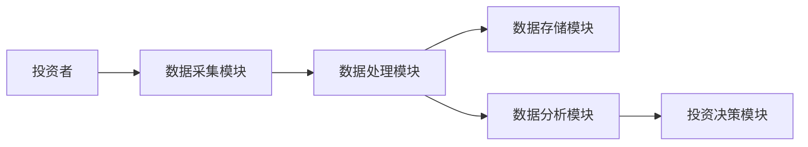
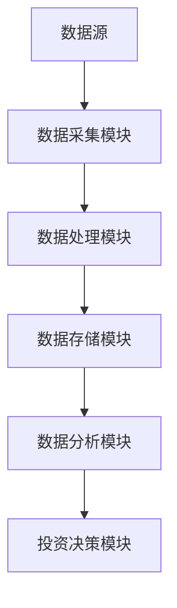
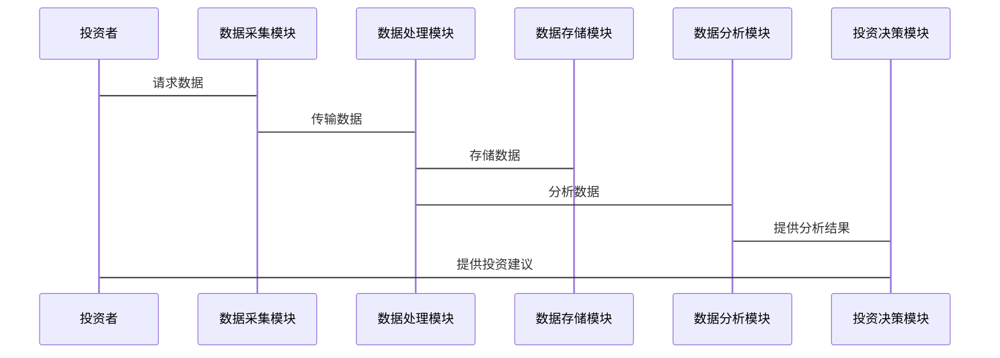

                 


# 特价股票投资中的跨境数据流动与合规策略

> 关键词：特价股票投资，跨境数据流动，数据隐私，合规策略，投资系统设计

> 摘要：本文深入分析了特价股票投资中涉及的跨境数据流动问题，并探讨了如何在合规的前提下进行数据流动管理。文章从背景介绍、法律与合规要求、数据流动分析、系统架构设计、项目实战等多方面展开，结合实际案例和系统设计，为读者提供了全面的技术视角和实践指导。

---

## 第1章: 特价股票投资与跨境数据流动概述

### 1.1 特价股票投资的背景与现状

#### 1.1.1 特价股票投资的定义与特点
特价股票投资是指投资者以低于市场价购买股票，期望在价格回升时出售以获利的投资策略。其特点包括低门槛、高波动性和高风险。投资者通常利用技术分析和市场数据来识别低价股票的投资机会。

#### 1.1.2 特价股票投资的市场现状
随着全球市场的互联互通，特价股票投资越来越依赖跨境数据流动。投资者需要获取全球市场的数据，包括股票价格、公司财务信息、市场新闻等。这些数据通常来自不同国家的交易所和数据供应商。

#### 1.1.3 特价股票投资的核心问题与挑战
- 数据获取的合规性：投资者需要确保数据来源的合法性，避免侵犯数据隐私或违反当地法律法规。
- 数据流动的安全性：跨境数据流动可能面临数据泄露或被篡改的风险，投资者需要采取有效的数据保护措施。
- 数据处理的复杂性：投资者需要处理来自不同地区的数据格式和标准，确保数据的准确性和一致性。

### 1.2 跨境数据流动的定义与特点

#### 1.2.1 跨境数据流动的定义
跨境数据流动是指数据在不同国家或地区之间的传输和处理过程。这些数据可能涉及个人隐私、市场信息、交易记录等。

#### 1.2.2 跨境数据流动的核心要素
- 数据源：数据的生成地点和方式。
- 数据传输路径：数据从源到目标的传输通道。
- 数据处理方式：数据在目标端的处理逻辑。
- 数据安全：数据在传输和处理过程中的安全保护措施。

#### 1.2.3 跨境数据流动与投资活动的关系
跨境数据流动是投资活动的重要支撑，投资者需要依赖跨境数据流动来获取市场信息、分析投资机会并做出决策。同时，数据流动的合规性直接影响投资活动的合法性和风险控制。

### 1.3 特价股票投资中的跨境数据流动问题

#### 1.3.1 数据流动对投资决策的影响
数据流动的及时性和准确性直接影响投资决策的正确性。跨境数据流动的延迟或不准确可能导致投资失误。

#### 1.3.2 跨境数据流动的合规性要求
投资者需要遵守不同国家的法律法规，确保数据流动的合法性。例如，欧盟的GDPR要求个人数据的跨境传输需符合特定条件。

#### 1.3.3 特价股票投资中的数据流动风险
- 数据泄露风险：投资者可能面临数据被未经授权的第三方获取的风险。
- 数据篡改风险：数据在传输过程中可能被篡改，导致投资决策失误。
- 法律风险：投资者可能因违反当地法律法规而面临罚款或诉讼。

### 1.4 本章小结
本章介绍了特价股票投资和跨境数据流动的基本概念，分析了它们之间的关系以及数据流动在投资中的重要性。接下来的章节将重点探讨跨境数据流动的合规框架和投资中的数据流动分析。

---

## 第2章: 跨境数据流动的法律与合规要求

### 2.1 全球主要地区的数据流动法规

#### 2.1.1 GDPR（通用数据保护条例）
GDPR是欧盟的数据保护法规，要求数据控制者和处理者采取措施确保数据的安全性和合法性。特别是，GDPR对个人数据的跨境传输有严格的要求，只有在满足特定条件（如数据保护条款的签订）时，才能进行跨境传输。

#### 2.1.2 CCPA（加州消费者隐私法案）
CCPA是美国加州的隐私法规，赋予消费者对其个人数据的更多控制权。CCPA要求企业明确告知用户数据收集和使用的目的，并获得用户的授权。

#### 2.1.3 其他主要地区的数据流动法规
- 《日本个人信息保护法》：日本的数据保护法律要求企业在跨境传输数据时，确保数据接收国的数据保护水平不低于日本。
- 《新加坡个人信息保护法》：新加坡要求企业在跨境传输数据时，确保数据处理符合法律规定。

### 2.2 跨境数据流动的合规原则

#### 2.2.1 数据最小化原则
投资者在跨境数据流动中应只收集和处理实现投资目的所必需的最少数据，减少数据泄露的风险。

#### 2.2.2 数据主体同意原则
投资者需要获得数据主体的明确同意，才能进行跨境数据传输。特别是，涉及个人隐私的数据，必须在数据主体知情且同意的情况下进行传输。

#### 2.2.3 数据安全保护原则
投资者需要采取技术措施（如加密、访问控制）和管理措施（如审计、培训）来保护跨境流动的数据，防止数据泄露或篡改。

### 2.3 跨境数据流动的合规框架设计

#### 2.3.1 数据分类与分级
投资者应根据数据的重要性和敏感性对其进行分类和分级，制定相应的数据保护措施。例如，个人隐私数据需要更高的保护级别。

#### 2.3.2 数据跨境传输的授权机制
投资者需要建立数据跨境传输的授权机制，确保数据传输符合相关法律法规。例如，与数据接收方签订符合GDPR要求的数据处理协议。

#### 2.3.3 数据跨境传输的记录与审计
投资者需要记录数据跨境传输的详细信息，并定期进行审计，确保数据流动的合规性。审计内容包括数据传输的合法性、数据处理的合规性等。

### 2.4 本章小结
本章分析了全球主要地区的数据流动法规，并提出了跨境数据流动的合规原则和框架设计。接下来的章节将结合特价股票投资的具体场景，进一步探讨数据流动的合规策略。

---

## 第3章: 特价股票投资中的数据流动分析

### 3.1 特价股票投资中的数据来源与类型

#### 3.1.1 市场数据
市场数据包括股票价格、成交量、市场指数等，通常由交易所提供。这些数据可能分布在不同的国家，投资者需要进行跨境数据流动以获取全面的市场信息。

#### 3.1.2 公司基本面数据
公司基本面数据包括财务报表、管理团队信息、行业分析等。这些数据可能分散在不同国家的公司网站或新闻报道中。

#### 3.1.3 交易数据
交易数据包括投资者的交易记录、订单信息等。这些数据通常涉及个人隐私，投资者需要确保其跨境传输的合规性。

### 3.2 数据流动的关键环节

#### 3.2.1 数据采集
投资者需要从多个数据源采集数据，包括API接口、网页抓取等。数据采集的过程需要遵守数据源所在国家的法律法规。

#### 3.2.2 数据处理
投资者需要对采集到的数据进行清洗、转换和分析，以便用于投资决策。数据处理的过程需要确保数据的准确性和完整性。

#### 3.2.3 数据传输
投资者需要将处理后的数据传输到目标系统或存储位置。数据传输的过程需要遵守目标国家的法律法规，确保数据的合法性和安全性。

### 3.3 数据流动的合规要求

#### 3.3.1 数据跨境传输的合法性
投资者需要确保数据跨境传输的合法性，避免违反相关法律法规。例如，GDPR要求数据跨境传输需符合特定条件。

#### 3.3.2 数据处理的合规性
投资者需要确保数据处理过程符合相关法律法规，特别是涉及个人隐私的数据。

#### 3.3.3 数据存储的安全性
投资者需要采取技术措施，确保数据存储的安全性，防止数据泄露或篡改。

### 3.4 本章小结
本章分析了特价股票投资中的数据来源和类型，探讨了数据流动的关键环节和合规要求。接下来的章节将从系统架构设计和项目实战的角度，进一步探讨数据流动的实现和应用。

---

## 第4章: 特价股票投资中的数据流动与系统架构设计

### 4.1 问题场景介绍
投资者需要从全球多个数据源获取市场数据、公司基本面数据和交易数据，进行数据清洗、分析和建模，最终生成投资决策。

### 4.2 系统功能设计

#### 4.2.1 数据采集模块
- 数据源管理：支持多种数据源，包括API接口和网页抓取。
- 数据采集：从不同国家的数据源获取数据，确保数据的准确性和完整性。

#### 4.2.2 数据处理模块
- 数据清洗：去除无效数据，处理数据异常值。
- 数据转换：将不同格式的数据转换为统一格式，便于后续分析。
- 数据分析：使用统计分析和机器学习算法，生成投资建议。

#### 4.2.3 数据存储模块
- 数据库设计：采用分布式数据库，支持跨区域数据存储。
- 数据备份：定期备份数据，确保数据的安全性和可靠性。

### 4.3 系统架构设计

#### 4.3.1 系统架构图
以下是一个简化的系统架构图：



#### 4.3.2 数据流图
以下是一个数据流图：



### 4.4 系统接口设计
系统接口设计包括：
- 数据采集接口：用于从不同数据源获取数据。
- 数据处理接口：用于数据清洗和转换。
- 数据存储接口：用于数据的存储和检索。

### 4.5 系统交互流程

#### 4.5.1 交互流程图
以下是一个交互流程图：



### 4.6 本章小结
本章从系统架构设计的角度，探讨了特价股票投资中的数据流动问题。接下来的章节将通过项目实战，进一步探讨数据流动的具体实现和应用。

---

## 第5章: 项目实战——特价股票投资系统设计

### 5.1 环境安装

#### 5.1.1 安装Python环境
安装Python 3.8及以上版本，并安装必要的库：
```bash
pip install pandas numpy scikit-learn requests
```

#### 5.1.2 安装数据源接口
安装交易所API接口库，例如：
```bash
pip install ccxt
```

### 5.2 核心代码实现

#### 5.2.1 数据采集模块
```python
import ccxt

def get_market_data(exchange, symbol, timeframe):
    try:
        return exchange.fetch_ohlcv(symbol, timeframe)
    except Exception as e:
        print(f"Error: {e}")
        return None
```

#### 5.2.2 数据处理模块
```python
import pandas as pd

def process_data(data):
    df = pd.DataFrame(data, columns=['timestamp', 'open', 'high', 'low', 'close', 'volume'])
    df['timestamp'] = pd.to_datetime(df['timestamp'])
    return df
```

#### 5.2.3 数据分析模块
```python
from sklearn.linear_model import LinearRegression

def predict_price(data):
    model = LinearRegression()
    model.fit(data[['open', 'high', 'low', 'volume']], data['close'])
    return model.predict(data[['open', 'high', 'low', 'volume']])
```

### 5.3 代码应用解读与分析
- 数据采集模块：使用ccxt库获取不同交易所的市场数据，支持多种数据源。
- 数据处理模块：将原始数据转换为统一格式，便于后续分析。
- 数据分析模块：使用线性回归模型预测股票价格，生成投资建议。

### 5.4 实际案例分析
以某只股票为例，展示数据采集、处理和分析的全过程，并生成投资建议。

### 5.5 本章小结
本章通过项目实战，展示了特价股票投资系统的设计和实现过程。接下来的章节将总结全文，并提出未来的优化方向。

---

## 第6章: 总结与展望

### 6.1 本章总结
本文从背景介绍、法律与合规要求、数据流动分析、系统架构设计和项目实战等多个方面，全面探讨了特价股票投资中的跨境数据流动与合规策略。通过系统的分析和实际案例的展示，为投资者提供了全面的技术视角和实践指导。

### 6.2 未来研究方向
- 进一步研究人工智能技术在数据流动中的应用。
- 探讨区块链技术在数据流动中的潜在应用，确保数据的安全性和透明性。
- 研究不同地区的数据保护法规，优化跨境数据流动的合规策略。

### 6.3 注意事项
- 投资者在进行跨境数据流动时，需严格遵守相关法律法规，确保数据的合法性和合规性。
- 数据流动过程中，需采取有效的安全措施，防止数据泄露或篡改。
- 投资者应定期进行数据审计和合规检查，确保数据流动的持续合规性。

### 6.4 拓展阅读
- 《数据保护与跨境数据流动》
- 《投资学中的数据科学应用》
- 《区块链技术与数据安全》

---

## 作者信息

作者：AI天才研究院/AI Genius Institute & 禅与计算机程序设计艺术/Zen And The Art of Computer Programming

---

**本文由AI天才研究院原创，转载请注明出处。**

