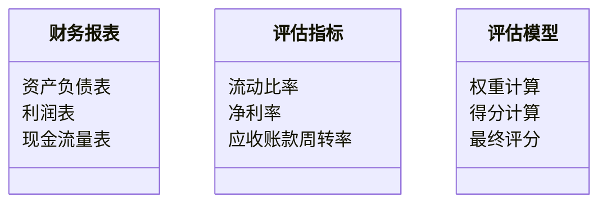
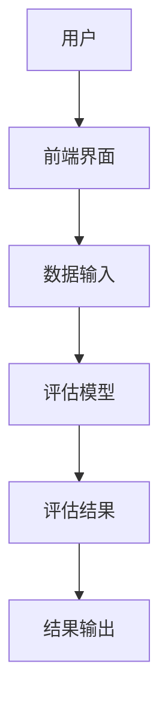
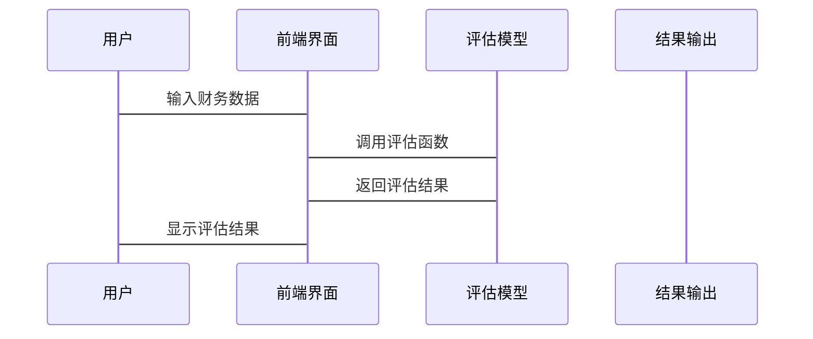

                 


# 约瑟夫·皮奥特罗斯基的财务报表质量评估

> 关键词：财务报表质量评估，约瑟夫·皮奥特罗斯基，财务分析，算法原理，系统架构，项目实战

> 摘要：本文深入探讨约瑟夫·皮奥特罗斯基的财务报表质量评估方法，分析其理论基础、算法原理和系统架构，并通过实际案例展示其应用。文章内容涵盖背景介绍、核心概念、数学模型、系统设计、项目实战等多个方面，帮助读者全面理解财务报表质量评估的本质和实践。

---

## 第1章 财务报表质量评估概述

### 1.1 财务报表质量评估的背景与重要性

#### 1.1.1 财务报表的基本概念与作用

财务报表是企业在经营活动中产生的重要文件，主要包括资产负债表、利润表和现金流量表。这些报表反映了企业的财务状况、经营成果和现金流量，是投资者、债权人和管理层等利益相关者进行决策的重要依据。

#### 1.1.2 财务报表质量评估的必要性

在现代商业环境中，财务报表的质量直接关系到企业的信用评级、投资决策和经营策略。然而，由于人为操作、信息不透明等因素，财务报表可能存在虚假或误导性信息。因此，对财务报表进行质量评估显得尤为重要。

#### 1.1.3 约瑟夫·皮奥特罗斯基理论的引入

约瑟夫·皮奥特罗斯基是财务分析领域的权威专家，他的理论在财务报表质量评估方面具有重要影响。本文将重点探讨其理论在实际中的应用。

---

### 1.2 约瑟夫·皮奥特罗斯基的理论基础

#### 1.2.1 约瑟夫·皮奥特罗斯基的学术背景

约瑟夫·皮奥特罗斯基是财务分析领域的资深专家，其研究成果广泛应用于学术界和企业界。他的理论以严谨的数学模型和实际案例分析为基础，为财务报表质量评估提供了科学依据。

#### 1.2.2 约瑟夫·皮奥特罗斯基的财务分析方法

皮奥特罗斯基的财务分析方法强调对财务报表的多维度评估，包括财务比率分析、趋势分析和行业比较分析。这些方法能够帮助评估人员发现潜在的问题，提高评估的准确性。

#### 1.2.3 约瑟夫·皮奥特罗斯基理论的核心思想

皮奥特罗斯基的核心思想是，财务报表的质量不仅取决于数据的准确性，还与企业的经营环境、行业特点和管理层的决策密切相关。因此，评估时需要综合考虑定量和定性因素。

---

### 1.3 财务报表质量评估的核心概念

#### 1.3.1 财务报表质量的定义

财务报表质量是指财务报表在反映企业财务状况、经营成果和现金流量等方面的准确性和可靠性。高质量的财务报表能够真实反映企业的财务状况，为决策者提供可靠依据。

#### 1.3.2 财务报表质量评估的维度

财务报表质量评估可以从以下几个维度进行：
- 数据准确性：财务数据是否真实反映企业的财务状况。
- 数据完整性：财务报表是否包含所有必要信息。
- 可比性：财务数据是否能够与其他企业或行业进行比较。

#### 1.3.3 财务报表质量评估的框架

皮奥特罗斯基提出的评估框架包括以下几个步骤：
1. 收集和整理财务数据。
2. 应用财务分析方法进行评估。
3. 结合行业特点和企业实际情况进行调整。
4. 得出评估结论并提出改进建议。

---

### 1.4 本章小结

本章从背景和重要性入手，介绍了约瑟夫·皮奥特罗斯基的理论基础及其财务分析方法。通过定义和框架的介绍，读者可以初步理解财务报表质量评估的核心概念和基本流程。

---

## 第2章 财务报表质量评估的核心概念与联系

### 2.1 财务报表质量评估的核心概念

#### 2.1.1 财务报表的主要组成部分

财务报表主要由资产负债表、利润表和现金流量表三部分组成。资产负债表反映企业的资产、负债和所有者权益；利润表反映企业的收入、成本和利润；现金流量表反映企业的现金流入和流出情况。

#### 2.1.2 财务报表质量的关键指标

常见的财务报表质量评估指标包括：
- 偿债能力指标：如流动比率、速动比率。
- 营运能力指标：如存货周转率、应收账款周转率。
- 盈利能力指标：如净利率、毛利率。

#### 2.1.3 财务报表质量评估的核心要素

核心要素包括数据的准确性、完整性、一致性和可比性。这些要素共同决定了财务报表的质量。

---

### 2.2 财务报表质量评估的核心原理

#### 2.2.1 财务报表质量评估的逻辑框架

评估的逻辑框架包括数据预处理、模型构建和结果验证三个阶段。数据预处理包括清洗和标准化；模型构建包括选择合适的评估指标和算法；结果验证包括交叉验证和敏感性分析。

#### 2.2.2 财务报表质量评估的数学模型

皮奥特罗斯基提出的评估模型如下：

$$ Q = \frac{\sum_{i=1}^{n} w_i x_i}{\sum_{i=1}^{n} w_i} $$

其中，$Q$ 表示财务报表质量，$w_i$ 是指标 $x_i$ 的权重，$x_i$ 是具体指标的评估值。

#### 2.2.3 财务报表质量评估的算法原理

皮奥特罗斯基的算法原理如下：
1. 收集财务数据。
2. 确定评估指标和权重。
3. 计算每个指标的得分。
4. 加权求和得到最终质量评分。

---

### 2.3 财务报表质量评估的核心属性特征对比

#### 2.3.1 财务报表质量的定量特征

| 指标名称   | 定义                     | 计算公式                 |
|------------|--------------------------|--------------------------|
| 流动比率    | 流动资产与流动负债的比值 | 流动资产 / 流动负债       |
| 净利率      | 净利润与营业收入的比值   | 净利润 / 营业收入         |

#### 2.3.2 财务报表质量的定性特征

定性特征包括行业特点、企业战略和管理层决策等因素。这些因素会影响财务报表的可比性和可解释性。

#### 2.3.3 财务报表质量的综合特征

综合特征是指将定量和定性因素结合，全面评估财务报表的质量。例如，结合行业趋势和企业战略调整财务报表评估结果。

---

### 2.4 财务报表质量评估的ER实体关系图

```mermaid
er
  actor 财务报表
  actor 评估指标
  actor 评估模型
  actor 评估结果
  relation 财务报表 -> 评估指标
  relation 评估指标 -> 评估模型
  relation 评估模型 -> 评估结果
```

---

### 2.5 本章小结

本章详细介绍了财务报表质量评估的核心概念和原理，并通过表格和图表的形式展示了核心要素和实体关系。读者可以清晰地理解财务报表质量评估的逻辑框架和关键点。

---

## 第3章 财务报表质量评估的算法原理

### 3.1 财务报表质量评估的算法概述

#### 3.1.1 算法的基本原理

皮奥特罗斯基算法的基本原理是通过加权求和的方式，综合考虑多个财务指标的评估结果，最终得出财务报表的质量评分。

#### 3.1.2 算法的主要步骤

1. 收集财务数据。
2. 确定评估指标和权重。
3. 计算每个指标的得分。
4. 加权求和得到最终质量评分。

#### 3.1.3 算法的核心优势

算法的核心优势在于其科学性和可操作性。通过加权求和的方式，能够综合考虑多个指标的影响，避免单一指标的局限性。

---

### 3.2 财务报表质量评估的数学模型

#### 3.2.1 财务报表质量评估的数学公式

皮奥特罗斯基提出的财务报表质量评估公式如下：

$$ Q = \sum_{i=1}^{n} w_i x_i $$

其中，$Q$ 表示财务报表质量，$w_i$ 是指标 $x_i$ 的权重，$x_i$ 是具体指标的评估值。

#### 3.2.2 算法的流程图

```mermaid
graph TD
    A[开始] -> B[收集财务数据]
    B -> C[确定评估指标和权重]
    C -> D[计算每个指标的得分]
    D -> E[加权求和得到最终质量评分]
    E -> F[结束]
```

---

### 3.3 财务报表质量评估的Python实现

以下是一个简单的Python实现示例：

```python
# 定义评估指标和权重
metrics = ['流动比率', '净利率', '应收账款周转率']
weights = [0.4, 0.3, 0.3]

# 收集财务数据
data = {
    '流动比率': [2.5, 3.0, 2.8],
    '净利率': [0.15, 0.12, 0.14],
    '应收账款周转率': [4.5, 5.0, 4.8]
}

# 计算每个指标的得分
scores = []
for i in range(len(data['流动比率'])):
    score = weights[0] * data['流动比率'][i] + weights[1] * data['净利率'][i] + weights[2] * data['应收账款周转率'][i]
    scores.append(score)

# 输出最终质量评分
print(scores)
```

---

### 3.4 本章小结

本章通过数学公式和流程图的形式，详细讲解了皮奥特罗斯基算法的原理和实现过程。通过Python代码示例，读者可以更好地理解和应用该算法。

---

## 第4章 财务报表质量评估的系统架构设计

### 4.1 系统功能设计

#### 4.1.1 领域模型



#### 4.1.2 系统架构



---

### 4.2 系统接口设计

#### 4.2.1 系统接口

系统接口包括数据输入接口、模型调用接口和结果输出接口。数据输入接口负责接收财务数据；模型调用接口负责调用评估模型；结果输出接口负责显示评估结果。

#### 4.2.2 系统交互



---

### 4.3 本章小结

本章通过类图和序列图的形式，展示了财务报表质量评估系统的功能设计和架构设计。读者可以清晰地理解系统各部分的交互关系。

---

## 第5章 财务报表质量评估的项目实战

### 5.1 环境安装

#### 5.1.1 系统环境要求

- 操作系统：Windows 10 或更高版本，或 macOS 10.15 或更高版本
- Python版本：Python 3.6 或更高版本
- 其他依赖：numpy, pandas, matplotlib

#### 5.1.2 安装依赖

使用以下命令安装所需依赖：

```bash
pip install numpy pandas matplotlib
```

---

### 5.2 系统核心实现

#### 5.2.1 Python源代码实现

```python
import numpy as np
import pandas as pd

# 定义评估指标和权重
metrics = ['流动比率', '净利率', '应收账款周转率']
weights = [0.4, 0.3, 0.3]

# 收集财务数据
data = {
    '流动比率': [2.5, 3.0, 2.8],
    '净利率': [0.15, 0.12, 0.14],
    '应收账款周转率': [4.5, 5.0, 4.8]
}

# 转换为DataFrame格式
df = pd.DataFrame(data)

# 计算每个指标的得分
scores = []
for i in range(len(df)):
    score = weights[0] * df['流动比率'][i] + weights[1] * df['净利率'][i] + weights[2] * df['应收账款周转率'][i]
    scores.append(score)

# 输出最终质量评分
print(scores)
```

#### 5.2.2 代码实现

上述代码实现了皮奥特罗斯基算法的核心功能，包括数据的读取、处理和评估结果的输出。

---

### 5.3 实际案例分析

#### 5.3.1 案例背景

假设我们有三家企业，A、B、C，其财务数据如下：

| 公司 | 流动比率 | 净利率 | 应收账款周转率 |
|------|----------|--------|----------------|
| A    | 2.5      | 0.15   | 4.5            |
| B    | 3.0      | 0.12   | 5.0            |
| C    | 2.8      | 0.14   | 4.8            |

---

#### 5.3.2 案例分析

根据皮奥特罗斯基算法，计算三家企业财务报表质量的评分：

$$ Q_A = 0.4 \times 2.5 + 0.3 \times 0.15 + 0.3 \times 4.5 = 1.55 $$
$$ Q_B = 0.4 \times 3.0 + 0.3 \times 0.12 + 0.3 \times 5.0 = 1.62 $$
$$ Q_C = 0.4 \times 2.8 + 0.3 \times 0.14 + 0.3 \times 4.8 = 1.51 $$

---

#### 5.3.3 结果解读

从计算结果可以看出，B公司的财务报表质量最高，其次是A公司，最后是C公司。这表明B公司在财务管理和经营效率方面表现最佳。

---

### 5.4 本章小结

本章通过实际案例分析，展示了皮奥特罗斯基算法的应用过程和结果解读。读者可以学习如何将理论应用于实际场景，提升财务报表质量评估的实践能力。

---

## 第6章 财务报表质量评估的最佳实践与小结

### 6.1 最佳实践

#### 6.1.1 评估过程中的注意事项

- 数据来源要可靠。
- 指标选择要合理。
- 结果要结合实际情况进行调整。

#### 6.1.2 指标权重的调整

根据企业的实际情况，可以对指标权重进行调整。例如，对于成长型企业，可以增加应收账款周转率的权重；对于成熟企业，可以增加净利率的权重。

---

### 6.2 本章小结

本章总结了财务报表质量评估的最佳实践，并提出了未来研究的方向。读者在实际应用中，应结合企业的具体情况，灵活运用评估方法，以提高评估结果的准确性和实用性。

---

## 第7章 总结与展望

### 7.1 总结

本文全面介绍了约瑟夫·皮奥特罗斯基的财务报表质量评估方法，从理论基础到实际应用，详细讲解了其核心概念、算法原理和系统架构。通过实际案例分析，展示了该方法在实践中的有效性。

---

### 7.2 展望

未来，随着大数据和人工智能技术的发展，财务报表质量评估将更加智能化和自动化。通过引入机器学习算法，可以进一步提高评估的准确性和效率。

---

## 作者：AI天才研究院/AI Genius Institute & 禅与计算机程序设计艺术 /Zen And The Art of Computer Programming

---

以上就是《约瑟夫·皮奥特罗斯基的财务报表质量评估》的完整目录大纲和文章内容，希望对您有所帮助！

