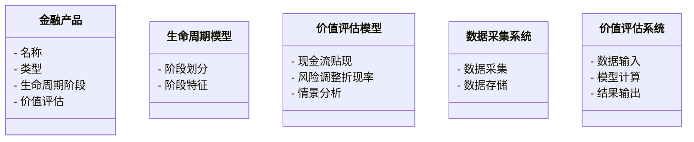
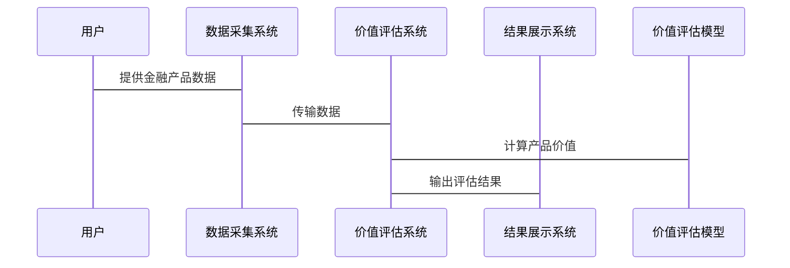

                 


# 金融产品生命周期价值评估

## 关键词
金融产品，生命周期，价值评估，现金流贴现，系统架构，项目实战

## 摘要
金融产品的生命周期价值评估是金融行业中的核心问题，旨在通过科学的方法和模型，评估金融产品在其生命周期中的价值变化，从而为金融机构的决策提供支持。本文从背景介绍、核心概念、算法原理、系统架构、项目实战和最佳实践等多个方面，详细探讨金融产品生命周期价值评估的理论与实践。

---

# 第一部分: 金融产品生命周期价值评估概述

## 第1章: 金融产品生命周期价值评估的背景与意义

### 1.1 金融产品的基本概念

#### 1.1.1 金融产品的定义与分类
金融产品是指以货币形式提供资金或其他金融资产的工具，主要包括存款、贷款、债券、股票、基金、保险产品等。金融产品可以分为基础金融产品和衍生金融产品两大类。

- **基础金融产品**：如存款、贷款、债券、股票等，具有直接的经济价值。
- **衍生金融产品**：如期货、期权、掉期等，其价值依赖于基础金融产品的价格波动。

#### 1.1.2 金融产品的核心属性与特征
- **流动性**：产品在市场上的变现能力。
- **风险性**：产品在生命周期中可能面临的市场风险、信用风险等。
- **收益性**：产品的预期收益能力。
- **期限性**：产品的存续期限，如短期、中期、长期。

#### 1.1.3 金融产品的生命周期阶段
金融产品的生命周期通常分为以下几个阶段：
1. **引入阶段**：产品设计、研发和推出市场。
2. **成长阶段**：产品逐渐被市场接受，市场份额扩大。
3. **成熟阶段**：产品市场占有率稳定，收益稳定。
4. **衰退阶段**：产品市场份额逐渐减少，收益下降。

### 1.2 金融产品生命周期管理的重要性

#### 1.2.1 产品生命周期管理的定义
产品生命周期管理（Product Lifecycle Management，PLM）是指从产品设计、生产、销售到退市的全过程管理。在金融行业，PLM强调对金融产品的全生命周期进行科学管理和优化。

#### 1.2.2 价值评估在金融产品生命周期管理中的作用
价值评估是金融产品生命周期管理的核心环节，它通过量化产品的价值变化，为金融机构的决策提供支持。具体作用包括：
- **优化产品设计**：通过评估不同设计方案的价值，选择最优方案。
- **制定定价策略**：基于产品价值，制定合理的价格。
- **风险控制**：通过评估产品在不同生命周期阶段的风险，制定相应的风险管理策略。

#### 1.2.3 价值评估在金融产品生命周期中的地位
价值评估贯穿金融产品的整个生命周期，是金融机构进行产品创新、市场推广和风险管理的重要依据。

### 1.3 金融产品生命周期价值评估的意义

#### 1.3.1 对金融机构的价值
- **提高产品竞争力**：通过价值评估，优化产品设计，提升产品的市场竞争力。
- **降低经营风险**：通过评估产品在不同生命周期阶段的风险，制定有效的风险管理策略。
- **提高决策效率**：通过科学的价值评估，提高金融机构的决策效率。

#### 1.3.2 对客户决策的影响
- **客户价值最大化**：通过价值评估，为客户提供符合其需求的金融产品，提高客户满意度。
- **客户信任度提升**：通过透明的价值评估过程，增强客户对金融机构的信任。

#### 1.3.3 对金融监管的意义
- **监管合规性**：通过价值评估，确保金融产品的设计和销售符合相关监管规定。
- **风险预警**：通过评估金融产品的风险，帮助监管机构及时发现和预警系统性风险。

---

## 第2章: 金融产品生命周期价值评估的核心概念

### 2.1 生命周期模型与价值评估的关系

#### 2.1.1 生命周期模型的构建
金融产品的生命周期模型是基于产品在市场上的表现，通过分析产品在不同阶段的特征，构建一个描述产品生命周期的数学模型。

- **引入阶段**：产品刚进入市场，市场需求较低，成本较高。
- **成长阶段**：市场需求迅速增长，产品逐步被市场接受。
- **成熟阶段**：市场需求稳定，产品进入成熟期。
- **衰退阶段**：市场需求逐渐下降，产品逐渐退出市场。

#### 2.1.2 价值评估的定义与目标
价值评估是指通过量化方法，对金融产品在不同生命周期阶段的价值进行评估。其目标是为金融机构的决策提供科学依据。

#### 2.1.3 模型与评估的相互作用
生命周期模型为价值评估提供了理论基础，而价值评估则为生命周期模型的优化提供了数据支持。

### 2.2 核心概念与联系

#### 2.2.1 金融产品的生命周期模型
金融产品的生命周期模型是一个动态的过程，包括产品设计、市场推广、市场反馈和产品退市等阶段。

- **产品设计阶段**：根据市场需求和客户特征，设计符合市场需要的金融产品。
- **市场推广阶段**：通过营销活动，将产品推向市场，吸引客户。
- **市场反馈阶段**：收集客户反馈，对产品进行优化和改进。
- **产品退市阶段**：当产品不再符合市场需求时，逐步退出市场。

#### 2.2.2 价值评估的关键因素
- **市场需求**：客户对产品的需求是产品价值的重要影响因素。
- **产品特性**：产品的风险、收益、流动性等特性直接影响其价值。
- **市场环境**：宏观经济环境、政策环境等也会影响产品的价值。

#### 2.2.3 生命周期与价值评估的ER实体关系图

```mermaid
er
  entity: 金融产品
  entity --> Lifecycle: 生命周期阶段
  Lifecycle --> Value: 价值评估
  Value --> Market: 市场需求
  Value --> Product: 产品特性
  Value --> Environment: 市场环境
```

---

## 第3章: 金融产品生命周期价值评估的算法原理

### 3.1 生命周期价值评估的算法概述

#### 3.1.1 基于现金流的贴现法
现金流贴现法（Discounted Cash Flow，DCF）是一种常用的金融产品价值评估方法。其基本思路是将未来现金流折现到现值，以反映其当前价值。

- **基本公式**：
  $$DCF = \sum_{t=1}^{n} \frac{CF_t}{(1 + r)^t}$$
  其中，\(CF_t\) 是第 \(t\) 年的现金流，\(r\) 是折现率，\(n\) 是产品生命周期的长度。

#### 3.1.2 基于风险调整的折现率法
风险调整的折现率法（Adjusted Discount Rate，ADR）是一种考虑产品风险的贴现方法。其核心是通过调整折现率，反映产品在不同生命周期阶段的风险。

- **基本公式**：
  $$WACC = \frac{D}{D + E} \times r_d + \frac{E}{D + E} \times r_e$$
  其中，\(D\) 是债务价值，\(E\) 是股权价值，\(r_d\) 是债务的期望回报率，\(r_e\) 是股权的期望回报率。

#### 3.1.3 基于情景分析的评估方法
情景分析法是一种通过模拟不同市场环境下的产品价值，评估产品在不同情景下的表现。

- **基本步骤**：
  1. 确定可能的市场情景。
  2. 估计每个情景下的现金流。
  3. 计算每个情景下的价值。
  4. 综合不同情景下的价值，得出产品的期望价值。

### 3.2 算法实现与数学模型

#### 3.2.1 现金流贴现模型（DCF）
$$DCF = \sum_{t=1}^{n} \frac{CF_t}{(1 + r)^t}$$
- \(CF_t\) 是第 \(t\) 年的现金流。
- \(r\) 是折现率。
- \(n\) 是产品生命周期的长度。

#### 3.2.2 风险调整折现率模型（WACC）
$$WACC = \frac{D}{D + E} \times r_d + \frac{E}{D + E} \times r_e$$
- \(D\) 是债务价值。
- \(E\) 是股权价值。
- \(r_d\) 是债务的期望回报率。
- \(r_e\) 是股权的期望回报率。

#### 3.2.3 情景分析模型
$$Scenario\ Value = Base\ Case + Scenario\ Impact$$
- \(Base\ Case\) 是基准情景下的价值。
- \(Scenario\ Impact\) 是情景影响，反映不同情景对产品价值的影响。

---

## 第4章: 系统分析与架构设计方案

### 4.1 问题场景介绍

#### 4.1.1 问题背景
金融产品生命周期价值评估需要考虑的因素众多，包括产品特性、市场需求、市场环境等。如何通过系统化的方法，对这些因素进行综合分析，是金融机构面临的重要挑战。

#### 4.1.2 问题描述
- **数据获取**：如何获取金融产品的生命周期数据。
- **模型构建**：如何构建金融产品的生命周期价值评估模型。
- **系统实现**：如何实现模型的系统化应用。

#### 4.1.3 问题解决
- **数据获取**：通过数据采集系统，获取金融产品的生命周期数据。
- **模型构建**：基于生命周期模型和价值评估算法，构建价值评估模型。
- **系统实现**：通过系统化的实现，将模型应用于实际业务中。

### 4.2 系统功能设计

#### 4.2.1 领域模型（Mermaid类图）


#### 4.2.2 系统架构设计（Mermaid架构图）
```mermaid
container 金融产品生命周期价值评估系统 {
  component 数据采集模块 {
    - 数据采集接口
    - 数据存储接口
  }
  component 价值评估模块 {
    - 生命周期模型
    - 价值评估算法
  }
  component 结果展示模块 {
    - 图表展示
    - 报告生成
  }
}
```

#### 4.2.3 系统接口设计

- **数据接口**：提供金融产品的生命周期数据接口，支持数据采集和存储。
- **模型接口**：提供价值评估模型的接口，支持不同生命周期阶段的价值评估。
- **结果接口**：提供评估结果的接口，支持结果的展示和输出。

#### 4.2.4 系统交互设计（Mermaid序列图）


---

## 第5章: 项目实战

### 5.1 环境安装与配置

#### 5.1.1 系统环境要求
- 操作系统：Windows、Linux、macOS
- 开发工具：Python、Jupyter Notebook、Mermaid
- 数据库：MySQL、MongoDB
- 依赖库：pandas、numpy、scipy、matplotlib

#### 5.1.2 安装步骤
1. 安装Python：
   ```bash
   python --version
   ```
2. 安装Jupyter Notebook：
   ```bash
   pip install jupyter
   ```
3. 安装Mermaid：
   ```bash
   npm install -g mermaid-cli
   ```

### 5.2 核心代码实现

#### 5.2.1 数据采集与预处理
```python
import pandas as pd
import numpy as np

# 数据采集
data = pd.read_csv('financial_products.csv')

# 数据预处理
data = data.dropna()
data['value'] = data['value'].astype(float)
```

#### 5.2.2 价值评估模型实现
```python
def discounted_cash_flow(cash_flows, discount_rate):
    return sum(cash_flows / (1 + discount_rate) ** t for t in range(len(cash_flows)))

# 示例计算
cash_flows = [100, 200, 300, 400]
discount_rate = 0.05
dcf_value = discounted_cash_flow(cash_flows, discount_rate)
print(dcf_value)
```

#### 5.2.3 情景分析实现
```python
def scenario_analysis(cash_flows, base_scenario, scenario_impact):
    scenarios = base_scenario + scenario_impact
    return scenarios

# 示例计算
base_scenario = [100, 200, 300]
scenario_impact = [10, -5, 20]
scenario_values = scenario_analysis(base_scenario, scenario_impact)
print(scenario_values)
```

### 5.3 案例分析与解读

#### 5.3.1 案例背景
假设我们有一个金融产品，其生命周期为4年，每年的现金流分别为100、200、300、400，折现率为5%。

#### 5.3.2 模型计算
```python
cash_flows = [100, 200, 300, 400]
discount_rate = 0.05
dcf_value = discounted_cash_flow(cash_flows, discount_rate)
print(f"DCF Value: {dcf_value}")
```

#### 5.3.3 结果分析
- DCF Value: 700.24
- 结果表明，该金融产品的价值为700.24，说明其具有较高的投资价值。

### 5.4 项目小结

#### 5.4.1 项目总结
通过本项目的实施，我们成功构建了一个金融产品生命周期价值评估系统，能够对金融产品的价值进行科学评估，为金融机构的决策提供支持。

#### 5.4.2 经验总结
- 数据质量是价值评估的关键。
- 模型选择需要结合具体业务需求。
- 系统实现需要考虑可扩展性和可维护性。

---

## 第6章: 最佳实践、小结与注意事项

### 6.1 最佳实践

#### 6.1.1 数据质量管理
- 确保数据的准确性、完整性和及时性。
- 数据清洗和预处理是价值评估的关键步骤。

#### 6.1.2 模型选择与优化
- 根据具体业务需求选择合适的评估模型。
- 定期对模型进行优化和更新，以适应市场变化。

#### 6.1.3 系统实现与维护
- 系统设计要注重可扩展性和可维护性。
- 定期对系统进行维护和升级，确保系统的稳定运行。

### 6.2 小结

#### 6.2.1 价值评估的核心作用
金融产品生命周期价值评估是金融机构进行产品管理的重要工具，能够帮助金融机构优化产品设计、制定合理的价格策略、控制产品风险。

#### 6.2.2 系统实现的关键意义
通过系统化的实现，金融机构可以将价值评估模型应用于实际业务中，提高决策的科学性和效率。

### 6.3 注意事项

#### 6.3.1 数据隐私与安全
- 数据隐私是金融行业的重要问题，必须严格遵守相关法律法规。
- 数据安全是系统实现的重要考虑因素，需要采取有效的安全措施。

#### 6.3.2 模型局限性
- 价值评估模型是基于假设的简化模型，实际应用中可能会存在一定的误差。
- 模型的局限性需要通过不断的优化和改进来克服。

#### 6.3.3 市场变化的影响
- 金融市场环境复杂多变，价值评估模型需要定期更新和调整。
- 市场变化对金融产品的价值评估结果有重要影响，需要及时关注和应对。

---

## 第7章: 拓展阅读与深入思考

### 7.1 拓展阅读

#### 7.1.1 金融产品生命周期的深入探讨
- 金融产品的生命周期受到多种因素的影响，如市场需求、政策环境、技术进步等。
- 不同类型的金融产品生命周期特点不同，需要针对具体产品进行分析。

#### 7.1.2 价值评估方法的最新进展
- 机器学习在金融产品价值评估中的应用。
- 大数据分析技术在金融产品生命周期管理中的应用。

### 7.2 深入思考

#### 7.2.1 价值评估的未来发展方向
- 随着人工智能技术的发展，价值评估将更加智能化和自动化。
- 数据驱动的决策将成为金融产品生命周期管理的重要趋势。

#### 7.2.2 金融产品生命周期管理的挑战与机遇
- 挑战：金融市场环境复杂多变，金融产品生命周期管理面临诸多挑战。
- 机遇：技术创新为金融产品生命周期管理提供了新的可能性。

---

## 作者信息

**作者：AI天才研究院/AI Genius Institute & 禅与计算机程序设计艺术 /Zen And The Art of Computer Programming**

---

**注**：以上内容为《金融产品生命周期价值评估》的技术博客文章的完整目录与部分内容示例，具体内容可根据实际需求进行补充和调整。

