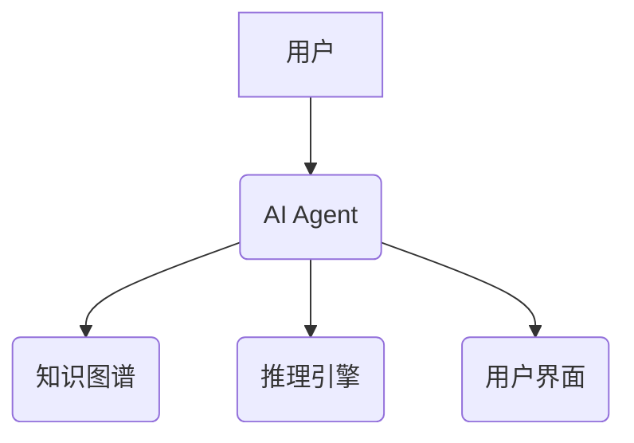

                 


# AI Agent的知识图谱在法律咨询中的应用

## 关键词：AI Agent, 知识图谱, 法律咨询, 算法原理, 系统架构, 项目实战

## 摘要：  
本文探讨AI Agent与知识图谱在法律咨询中的应用，分析其核心概念、算法原理、系统架构，并通过项目实战展示其在法律咨询中的具体实现与案例。文章详细阐述了AI Agent的知识图谱构建、法律咨询场景分析、系统设计与实现，最后总结了AI Agent在法律咨询中的优势与未来发展方向。

---

# 第一部分：AI Agent与知识图谱的背景与基础

## 第1章：AI Agent与知识图谱的概述

### 1.1 AI Agent的基本概念

#### 1.1.1 AI Agent的定义与特点  
AI Agent（人工智能代理）是指能够感知环境、自主决策并执行任务的智能系统。其特点包括：  
- **自主性**：无需外部干预，自主完成任务。  
- **反应性**：能够实时感知环境并做出反应。  
- **目标导向**：以特定目标为导向，优化决策过程。  

#### 1.1.2 AI Agent的核心功能与应用场景  
AI Agent的核心功能包括：  
- **感知与推理**：通过传感器或数据输入，理解环境并进行逻辑推理。  
- **决策与规划**：基于推理结果，制定行动计划。  
- **执行与反馈**：执行任务并根据反馈调整策略。  

应用场景：  
- 智能助手（如Siri、Alexa）。  
- 智能客服与咨询系统。  
- 智能推荐系统。  

#### 1.1.3 AI Agent与传统程序的主要区别  
| **维度**       | **传统程序**                | **AI Agent**                   |  
|-----------------|-----------------------------|---------------------------------|  
| 行为方式         | 预设规则，被动执行           | 主动感知、推理与决策             |  
| 适应性           | 固定，难以应对变化           | 具备学习与自适应能力             |  
| 交互能力         | 单向输入输出                 | 支持多轮交互与动态反馈             |  

---

### 1.2 知识图谱的基本概念

#### 1.2.1 知识图谱的定义与特点  
知识图谱是一种以图结构表示知识的语义网络，节点表示实体或概念，边表示实体之间的关系。其特点包括：  
- **结构化**：通过实体与关系构建网络，便于计算机理解。  
- **语义丰富**：能够表示复杂的语义关系。  
- **可扩展性**：支持大规模数据的构建与扩展。  

#### 1.2.2 知识图谱的构建过程与方法  
知识图谱的构建过程包括：  
1. 数据采集：从多种数据源（如文本、数据库）获取数据。  
2. 数据清洗：去除噪声数据，确保数据质量。  
3. 实体识别与链接：通过NLP技术识别实体并建立关联。  
4. 关系抽取：提取实体之间的关系。  
5. 知识融合：整合多源数据，消除冲突。  
6. 存储与管理：将知识图谱存储于数据库或知识图谱管理系统中。  

#### 1.2.3 知识图谱的应用领域与优势  
- **应用领域**：自然语言处理、搜索引擎优化、智能推荐、法律咨询等。  
- **优势**：提升信息检索效率，增强语义理解能力，支持智能决策。  

---

### 1.3 AI Agent与知识图谱的结合

#### 1.3.1 AI Agent与知识图谱的协同工作原理  
AI Agent通过知识图谱获取语义信息，利用推理能力进行决策。例如，在法律咨询中，AI Agent可以通过知识图谱快速检索相关法律条文和案例，辅助用户进行决策。  

#### 1.3.2 知识图谱在AI Agent中的作用与价值  
- **知识表示**：知识图谱为AI Agent提供结构化的知识库，支持高效的语义理解。  
- **推理与决策**：基于知识图谱，AI Agent能够进行逻辑推理，优化决策过程。  
- **动态更新**：知识图谱支持实时更新，确保AI Agent的知识库始终保持最新。  

#### 1.3.3 AI Agent与知识图谱的未来发展趋势  
随着技术的进步，AI Agent与知识图谱的结合将更加紧密，未来可能会出现以下趋势：  
- **更强大的推理能力**：基于知识图谱的深度推理，提升AI Agent的决策能力。  
- **跨领域应用**：知识图谱的通用性使得AI Agent能够在更多领域中发挥作用。  
- **人机协作**：AI Agent与人类专家协同工作，共同完成复杂任务。  

---

## 第2章：法律咨询中的知识图谱应用背景

### 2.1 法律咨询的基本特点

#### 2.1.1 法律咨询的复杂性与多样性  
法律咨询涉及广泛的法律领域，每个案例可能需要综合多个法律条文和判例。  

#### 2.1.2 法律咨询的痛点与挑战  
- **信息分散**：法律条文、判例分散在不同来源，难以快速检索。  
- **查询效率低**：传统法律咨询依赖人工检索，效率低下。  
- **专业性要求高**：需要专业的法律知识支持，非专业人士难以应对。  

#### 2.1.3 法律咨询的传统模式与现状  
- **传统模式**：依赖律师或法律专家的个人知识与经验。  
- **现状**：随着信息技术的发展，部分法律咨询开始采用信息化手段，但效率仍有提升空间。  

---

### 2.2 知识图谱在法律咨询中的应用背景

#### 2.2.1 知识图谱在法律领域的适用性  
- **法律知识的结构化**：法律条文、判例等可以通过知识图谱进行结构化表示。  
- **语义关联**：知识图谱能够揭示法律条文之间的语义关联，便于快速检索与推理。  

#### 2.2.2 法律知识图谱的构建与特点  
- **构建**：通过爬取法律条文、判例等数据，利用NLP技术提取实体与关系，构建法律知识图谱。  
- **特点**：  
  - **全面性**：涵盖广泛的法律领域。  
  - **准确性**：依赖高质量的数据与算法支持。  
  - **动态更新**：根据最新法律动态实时更新。  

#### 2.2.3 知识图谱在法律咨询中的优势与潜力  
- **优势**：  
  - 快速检索相关法律条文与判例。  
  - 提供语义关联的法律信息，支持深度分析。  
- **潜力**：  
  - 支持智能法律推理，辅助律师与非专业人士进行法律咨询。  
  - 通过知识图谱的动态更新，确保法律信息的实时性与准确性。  

---

### 2.3 AI Agent在法律咨询中的应用背景

#### 2.3.1 AI Agent在法律咨询中的角色定位  
AI Agent在法律咨询中可以扮演以下角色：  
- **智能检索工具**：快速检索相关法律条文与案例。  
- **语义分析助手**：通过自然语言处理技术，理解用户需求并提供精准的法律建议。  
- **决策支持系统**：基于知识图谱的推理能力，辅助用户制定最优决策。  

#### 2.3.2 AI Agent在法律咨询中的优势与挑战  
- **优势**：  
  - 24/7可用性，随时提供法律咨询服务。  
  - 高效性，快速检索与分析法律信息。  
- **挑战**：  
  - 法律知识的复杂性要求AI Agent具备强大的推理能力。  
  - 数据隐私与安全问题。  

#### 2.3.3 法律咨询中AI Agent与知识图谱的结合  
- **结合方式**：  
  - 知识图谱为AI Agent提供法律知识库，支持语义理解与推理。  
  - AI Agent通过知识图谱快速检索与分析法律信息，为用户提供精准的法律建议。  

---

## 第3章：知识图谱与AI Agent的核心概念与联系

### 3.1 知识图谱的核心概念

#### 3.1.1 知识图谱的构建过程  
1. **数据采集**：从法律数据库、官方网站等来源获取法律条文、判例等数据。  
2. **数据清洗**：去除噪声数据，确保数据质量。  
3. **实体识别与链接**：通过NLP技术识别法律条文中的实体（如人名、机构名）并建立关联。  
4. **关系抽取**：提取实体之间的关系（如“某公司违反《合同法》”）。  
5. **知识融合**：整合多源数据，消除冲突。  
6. **存储与管理**：将知识图谱存储于数据库或知识图谱管理系统中。  

#### 3.1.2 知识图谱的表示方法  
知识图谱通常使用图结构表示，节点表示实体或概念，边表示实体之间的关系。例如：  
- 节点：中国法律体系、《民法典》、合同法。  
- 边：《民法典》包含合同法，合同法属于中国法律体系。  

---

### 3.2 AI Agent的核心概念

#### 3.2.1 AI Agent的感知与推理能力  
AI Agent通过感知环境（如用户输入）进行推理，基于知识图谱中的信息得出结论。例如：  
- 用户输入：“我的合同是否符合《民法典》的要求？”  
- AI Agent通过知识图谱检索相关法律条文，分析合同内容，得出结论并提供建议。  

#### 3.2.2 AI Agent的决策与规划能力  
AI Agent基于推理结果制定行动计划。例如：  
- 推理结果：合同内容符合《民法典》要求。  
- 行动计划：向用户确认合同内容无误，并提供进一步的法律建议。  

---

### 3.3 知识图谱与AI Agent的联系

#### 3.3.1 知识图谱为AI Agent提供知识库  
知识图谱作为AI Agent的知识库，支持其进行语义理解与推理。例如：  
- 在法律咨询中，AI Agent通过知识图谱快速检索相关法律条文与判例，辅助用户进行决策。  

#### 3.3.2 AI Agent为知识图谱提供动态更新能力  
AI Agent可以通过用户反馈不断优化知识图谱，提升其准确性和适用性。例如：  
- 用户对AI Agent的建议提出反馈，AI Agent根据反馈更新知识图谱中的相关知识。  

---

### 3.4 知识图谱与AI Agent的对比分析

| **维度**         | **知识图谱**               | **AI Agent**                   |  
|-------------------|---------------------------|---------------------------------|  
| 核心功能         | 存储与表示知识             | 感知、推理与决策                 |  
| 应用场景         | 辅助信息检索与分析         | 法律咨询、智能推荐等             |  
| 依赖性           | 依赖于数据质量与构建方法   | 依赖于知识图谱与算法             |  

---

## 第4章：知识图谱与AI Agent的协同工作原理

### 4.1 知识图谱与AI Agent的协同流程

#### 4.1.1 数据输入  
用户输入法律咨询问题，例如：“在劳动合同中，如何约定试用期？”  

#### 4.1.2 数据处理  
AI Agent将用户的问题输入知识图谱，进行语义解析与实体识别。  

#### 4.1.3 知识检索与推理  
AI Agent基于知识图谱检索相关法律条文与判例，并进行逻辑推理，得出结论。  

#### 4.1.4 结果输出  
AI Agent将推理结果返回给用户，提供法律建议或解决方案。  

---

### 4.2 知识图谱与AI Agent的协同优势

#### 4.2.1 提高法律咨询效率  
知识图谱的结构化表示与快速检索能力显著提高了法律咨询的效率。  

#### 4.2.2 增强语义理解能力  
AI Agent结合知识图谱的语义理解能力，能够更准确地理解用户需求并提供精准的法律建议。  

#### 4.2.3 实现动态更新与优化  
AI Agent通过用户反馈不断优化知识图谱，确保法律信息的准确性和适用性。  

---

### 4.3 知识图谱与AI Agent的协同案例

#### 4.3.1 案例背景  
用户咨询：“如果公司未按时支付工资，员工该怎么办？”  

#### 4.3.2 协作过程  
1. **数据输入**：用户输入问题。  
2. **知识检索**：AI Agent通过知识图谱检索相关法律条文（如《劳动合同法》）。  
3. **推理与分析**：AI Agent分析法律条文，得出公司应支付工资的法律依据。  
4. **结果输出**：AI Agent向用户解释相关法律条文，并提供解决方案（如申请劳动仲裁）。  

---

## 第5章：知识图谱与AI Agent的算法原理

### 5.1 知识图谱构建中的算法原理

#### 5.1.1 实体识别与链接算法  
- **算法原理**：基于NLP技术（如命名实体识别）识别文本中的实体，并通过字符串匹配或语义相似度进行实体链接。  
- **代码示例**：  
  ```python
  import spacy
  nlp = spacy.load("zh_core_web_sm")
  text = "中华人民共和国合同法规定了合同的基本条款。"
  doc = nlp(text)
  entities = [ent.text for ent in doc.ents]
  print(entities)
  ```

---

#### 5.1.2 关系抽取算法  
- **算法原理**：基于关系抽取模型（如基于规则的模型或深度学习模型）提取实体之间的关系。  
- **代码示例**：  
  ```python
  from spacy.matcher import Matcher
  matcher = Matcher(nlp.vocab)
  pattern = [
      ({"POS": "VERB"}, {"POS": "NOUN"}),
  ]
  matcher.add("法律关系", [pattern])
  matches = matcher(doc)
  for start, end in matches:
      print(doc[start:end].text)
  ```

---

### 5.2 AI Agent中的推理算法

#### 5.2.1 基于规则的推理算法  
- **算法原理**：根据预定义的规则进行推理。例如，如果A是B的子集，则A与B存在包含关系。  
- **代码示例**：  
  ```python
  def infer_subset(A, B, knowledge_graph):
      if A in B:
          return True
      else:
          return False
  ```

---

#### 5.2.2 基于机器学习的推理算法  
- **算法原理**：利用机器学习模型（如图神经网络）进行推理。  
- **代码示例**：  
  ```python
  import tensorflow as tf
  model = tf.keras.Sequential([
      tf.keras.layers.Dense(128, activation='relu'),
      tf.keras.layers.Dense(1, activation='sigmoid')
  ])
  model.compile(optimizer='adam', loss='binary_crossentropy')
  model.fit(X_train, y_train, epochs=10, batch_size=32)
  ```

---

## 第6章：知识图谱与AI Agent的系统架构

### 6.1 法律咨询场景下的系统设计

#### 6.1.1 系统功能模块设计
1. **知识图谱构建模块**：负责构建与更新法律知识图谱。  
2. **AI Agent模块**：负责用户交互、推理与决策。  
3. **用户界面模块**：提供用户与系统交互的界面。  

---

#### 6.1.2 系统功能流程设计  
- **用户输入**：用户提出法律咨询问题。  
- **知识检索**：AI Agent通过知识图谱检索相关法律信息。  
- **推理与分析**：AI Agent基于检索结果进行推理，得出结论。  
- **结果输出**：系统将结论以用户友好的方式呈现。  

---

### 6.2 系统架构设计

#### 6.2.1 系统架构图


---

#### 6.2.2 关键模块实现细节  
- **知识图谱构建模块**：负责从法律数据库中抽取实体与关系，构建知识图谱。  
- **推理引擎**：基于知识图谱进行逻辑推理，支持多种推理策略（如基于规则的推理、基于机器学习的推理）。  

---

### 6.3 系统接口设计

#### 6.3.1 用户与AI Agent的交互接口  
- **输入接口**：用户输入法律咨询问题。  
- **输出接口**：系统返回推理结果。  

#### 6.3.2 知识图谱与推理引擎的接口  
- **输入接口**：推理引擎输入查询条件。  
- **输出接口**：知识图谱返回相关实体与关系。  

---

## 第7章：知识图谱与AI Agent的项目实战

### 7.1 环境安装与配置

#### 7.1.1 安装Python环境  
```bash
python --version
pip install --upgrade pip
```

#### 7.1.2 安装相关库  
```bash
pip install spacy
pip install networkx
pip install matplotlib
```

---

### 7.2 知识图谱构建与AI Agent实现

#### 7.2.1 知识图谱构建代码  
```python
import networkx as nx
G = nx.DiGraph()
G.add_node("合同法", label="合同法")
G.add_node("民法典", label="民法典")
G.add_edge("合同法", "民法典", label="包含于")
G.add_node("违约责任", label="违约责任")
G.add_edge("合同法", "违约责任", label="包含")
```

#### 7.2.2 AI Agent实现代码  
```python
class AIAgent:
    def __init__(self, knowledge_graph):
        self.knowledge_graph = knowledge_graph
    
    def infer(self, query):
        # 简单的推理逻辑
        if query in self.knowledge_graph.nodes():
            return True
        else:
            return False
```

---

### 7.3 实际案例分析与解读

#### 7.3.1 案例背景  
用户咨询：“在合同履行过程中，违约方需要承担哪些责任？”  

#### 7.3.2 知识图谱检索  
AI Agent通过知识图谱检索到“违约责任”相关法律条文。  

#### 7.3.3 推理与分析  
AI Agent基于知识图谱推理出违约方需要承担的民事责任。  

#### 7.3.4 结果输出  
系统向用户解释违约责任的具体内容，并提供相关法律依据。  

---

## 第8章：总结与展望

### 8.1 总结

#### 8.1.1 本文核心内容回顾  
本文详细探讨了AI Agent与知识图谱在法律咨询中的应用，分析了其核心概念、算法原理与系统架构，并通过项目实战展示了其具体实现与应用案例。  

#### 8.1.2 本文的主要结论  
- AI Agent与知识图谱的结合能够显著提升法律咨询的效率与准确性。  
- 知识图谱为AI Agent提供了强大的知识库支持，而AI Agent则为知识图谱提供了动态更新与优化的能力。  

---

### 8.2 展望

#### 8.2.1 技术发展与优化方向  
- **更强大的推理能力**：开发更复杂的推理算法，提升AI Agent的决策能力。  
- **多模态知识图谱**：结合图像、音频等多种数据形式，构建更丰富的知识图谱。  

#### 8.2.2 应用场景的扩展  
- **法律教育**：通过AI Agent与知识图谱辅助法律教育与学习。  
- **司法辅助**：支持法官、检察官的案件审理与判决。  

---

## 作者：AI天才研究院/AI Genius Institute & 禅与计算机程序设计艺术 /Zen And The Art of Computer Programming  

---

