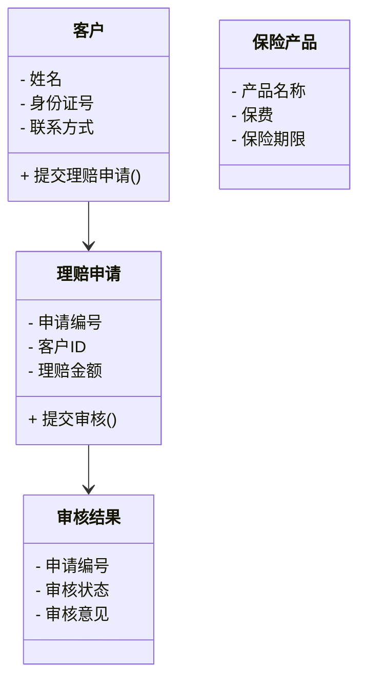

                 


# AI在保险理赔流程优化中的深度应用

> 关键词：AI技术、保险理赔、流程优化、机器学习、深度学习、自然语言处理、计算机视觉

> 摘要：随着人工智能技术的迅速发展，AI在保险行业中的应用日益广泛。本文将深入探讨AI技术如何优化保险理赔流程，从传统理赔的痛点分析到AI技术的具体应用场景，再到基于机器学习和深度学习的算法实现，最后结合实际案例分析，详细解读AI在保险理赔优化中的价值和未来发展趋势。

---

# 第一部分: 保险理赔流程优化的背景与挑战

## 第1章: 保险行业的现状与痛点

### 1.1 保险行业的现状分析

#### 1.1.1 保险行业的定义与分类
保险行业是指通过法律契约形式，提供风险保障和经济补偿的行业。它涵盖了人寿保险、财产保险、责任保险等多种类型。随着数字化转型的推进，保险行业正在经历从传统模式向智能化模式的转变。

#### 1.1.2 传统保险理赔流程的痛点
传统保险理赔流程通常繁琐且效率低下，主要体现在以下几个方面：
1. **人工审核耗时**：理赔申请需要人工审核，流程长，效率低。
2. **数据分散**：理赔涉及多方数据，如医院、交警等，数据获取困难。
3. **欺诈风险高**：传统理赔中，欺诈行为难以识别，增加了保险公司的风险。
4. **客户体验差**：复杂的流程和漫长的等待时间让客户满意度下降。

#### 1.1.3 数字化转型的必要性
随着科技的发展，保险行业必须通过数字化转型来提升效率和客户体验。AI技术的引入为保险理赔流程的优化提供了可能性。

---

### 1.2 保险理赔流程的复杂性

#### 1.2.1 理赔流程的关键环节
保险理赔流程通常包括以下几个关键环节：
1. **申请提交**：客户提交理赔申请及相关材料。
2. **资料审核**：对提交的材料进行初步审核，确认完整性。
3. **风险评估**：根据历史数据和模型评估理赔风险。
4. **欺诈检测**：识别可能的欺诈行为。
5. **赔付决策**：根据评估结果决定赔付金额和方式。
6. **赔付执行**：完成赔付并记录结果。

#### 1.2.2 理赔中的主要问题
1. **数据不一致**：不同来源的数据格式和标准不统一，导致整合困难。
2. **人工错误率高**：人工审核容易出错，影响理赔效率和准确性。
3. **缺乏实时性**：传统流程通常需要较长时间才能完成，客户体验差。

#### 1.2.3 理赔效率与成本的优化需求
保险公司希望通过优化流程降低成本，同时提高客户满意度。AI技术的应用可以显著提升理赔效率，降低人工成本。

---

## 第2章: AI技术在保险行业的应用潜力

### 2.1 AI技术的核心概念

#### 2.1.1 人工智能的定义与特点
人工智能（AI）是指模拟人类智能的计算机系统，具有学习、推理、自适应等能力。AI技术的核心包括机器学习、自然语言处理、计算机视觉等。

#### 2.1.2 机器学习与深度学习的区分
- **机器学习**：通过数据训练模型，使其能够从数据中学习并做出预测或决策。
- **深度学习**：一种机器学习技术，通过多层神经网络模拟人类大脑的处理方式，能够处理更复杂的任务。

#### 2.1.3 自然语言处理与计算机视觉的应用
- **自然语言处理（NLP）**：用于处理和理解文本数据，如保险合同的自动解析。
- **计算机视觉**：用于图像和视频的处理，如识别理赔单据中的文字和图像信息。

---

### 2.2 AI在保险行业中的典型应用

#### 2.2.1 风险评估与定价
AI技术可以通过分析大量数据，帮助保险公司更准确地评估风险并制定合理的保费。

#### 2.2.2 理赔自动化
通过AI技术实现理赔流程的自动化，减少人工干预，提高效率。

#### 2.2.3 客户服务与欺诈检测
AI技术可以用于客户咨询、欺诈检测等领域，提升客户体验和风险管理能力。

---

### 2.3 保险理赔流程优化的AI解决方案

#### 2.3.1 AI在理赔中的具体应用场景
1. **自动理赔处理**：AI可以自动审核理赔申请，识别所需材料并完成初步评估。
2. **欺诈检测**：通过机器学习模型识别潜在的欺诈行为。
3. **客户互动**：通过智能客服解答客户疑问，提升服务效率。

#### 2.3.2 AI技术如何解决传统理赔痛点
1. **提高效率**：自动化处理减少人工干预，缩短理赔时间。
2. **降低成本**：通过AI技术降低人工成本和错误率。
3. **提升准确性**：利用算法提高理赔决策的准确性。

#### 2.3.3 AI在保险行业的未来发展趋势
随着技术的进步，AI将在保险行业发挥更大的作用，如智能理赔系统、实时风险评估等。

---

# 第二部分: AI技术在保险理赔中的核心应用

## 第3章: 基于机器学习的保险风险评估

### 3.1 机器学习在保险中的应用

#### 3.1.1 机器学习的定义与特点
机器学习是一种人工智能技术，通过数据训练模型，使其能够从数据中学习并做出预测或决策。

#### 3.1.2 机器学习在保险风险评估中的作用
- **客户画像**：通过机器学习分析客户数据，生成客户画像，用于风险评估。
- **保费定价**：根据客户的风险特征，制定个性化的保费。

#### 3.1.3 常见的机器学习算法概述
1. **决策树**：用于分类和回归，易于解释。
2. **随机森林**：通过集成多个决策树提高准确性。
3. **支持向量机（SVM）**：适用于分类任务，尤其在高维数据中表现优异。

---

### 3.2 保险风险评估的机器学习实现

#### 3.2.1 数据预处理
- **数据清洗**：处理缺失值、异常值等。
- **特征工程**：提取有用的特征，如年龄、职业等。

#### 3.2.2 模型训练与评估
1. **训练模型**：使用训练数据训练机器学习模型。
2. **评估模型**：通过测试数据评估模型的准确率、召回率等指标。

#### 3.2.3 案例分析
通过一个实际案例，展示如何利用机器学习技术进行保险风险评估，包括数据预处理、模型训练和评估过程。

---

## 第4章: 基于深度学习的保险理赔自动化

### 4.1 深度学习在保险理赔中的应用

#### 4.1.1 深度学习的基本原理
深度学习通过多层神经网络模拟人类大脑的处理方式，能够处理复杂的非结构化数据。

#### 4.1.2 深度学习在保险理赔中的具体应用
1. **图像识别**：用于识别理赔单据中的文字和图像信息。
2. **自然语言处理**：用于理解和分析保险合同和客户咨询。

#### 4.1.3 常见的深度学习模型
1. **卷积神经网络（CNN）**：适用于图像识别任务。
2. **循环神经网络（RNN）**：适用于序列数据的处理，如文本分析。

---

### 4.2 深度学习在保险理赔中的实现

#### 4.2.1 数据准备
- **图像数据**：将理赔单据扫描成图像，用于图像识别。
- **文本数据**：提取保险合同中的关键信息，用于自然语言处理。

#### 4.2.2 模型训练与优化
1. **模型训练**：使用深度学习框架（如TensorFlow）训练模型。
2. **模型优化**：通过调整超参数和优化算法提高模型性能。

#### 4.2.3 实际案例
通过一个实际案例，展示如何利用深度学习技术实现保险理赔的自动化，包括数据准备、模型训练和优化过程。

---

# 第三部分: 保险理赔系统中的自然语言处理与计算机视觉应用

## 第5章: 自然语言处理在保险合同分析中的应用

### 5.1 自然语言处理的基本原理

#### 5.1.1 NLP的核心技术
- **分词**：将文本分割成词语或短语。
- **实体识别**：识别文本中的命名实体，如人名、地名等。
- **情感分析**：分析文本中的情感倾向。

#### 5.1.2 NLP在保险合同分析中的应用
1. **合同条款理解**：通过NLP技术自动解析保险合同中的条款内容。
2. **风险评估**：基于合同内容评估客户的潜在风险。

---

### 5.2 基于NLP的保险合同分析实现

#### 5.2.1 数据准备
- **文本清洗**：去除无用信息，如停用词。
- **特征提取**：提取合同中的关键信息，如保险期限、赔付范围等。

#### 5.2.2 模型训练与应用
1. **模型训练**：使用NLP算法训练模型，使其能够理解合同内容。
2. **合同分析**：通过模型自动解析合同条款，生成结构化数据。

---

## 第6章: 计算机视觉在理赔图像识别中的应用

### 6.1 计算机视觉的基本原理

#### 6.1.1 CV的核心技术
- **图像识别**：识别图像中的物体或场景。
- **目标检测**：检测图像中的特定目标。
- **图像分割**：将图像分割成不同的区域。

#### 6.1.2 CV在理赔图像识别中的应用
1. **身份验证**：通过人脸识别技术验证客户身份。
2. **单据识别**：识别理赔单据中的文字和图像信息。

---

### 6.2 基于CV的理赔图像识别实现

#### 6.2.1 数据准备
- **图像采集**：将理赔单据扫描成图像。
- **图像预处理**：调整图像亮度、对比度等，提高识别效果。

#### 6.2.2 模型训练与应用
1. **模型训练**：使用CV算法训练图像识别模型。
2. **图像识别**：通过模型自动识别图像中的文字和图像信息。

---

# 第四部分: 保险理赔流程的AI优化系统架构设计

## 第7章: 系统架构设计

### 7.1 系统功能设计

#### 7.1.1 领域模型
通过Mermaid类图展示保险理赔系统的领域模型，包括客户、保险产品、理赔申请等核心实体。



#### 7.1.2 系统架构
通过Mermaid架构图展示保险理赔系统的整体架构，包括前端、后端、数据库和AI引擎。

```mermaid
container 客户端 {
    前端系统
}
container 服务端 {
    后端系统
    AI引擎
    数据库
}
```

---

### 7.2 优化策略

#### 7.2.1 数据质量管理
- 数据清洗：处理缺失值、异常值等。
- 数据标注：对数据进行标注，提高模型训练效果。

#### 7.2.2 模型可解释性
- 提供模型解释工具，帮助用户理解AI决策过程。
- 通过可视化工具展示模型输出结果。

---

# 第五部分: 保险AI优化的项目实战与案例分析

## 第8章: 项目实施步骤

### 8.1 项目实施步骤

#### 8.1.1 环境安装
1. **安装Python**：建议使用Anaconda安装Python环境。
2. **安装机器学习库**：如TensorFlow、Scikit-learn等。
3. **安装NLP库**：如NLTK、spaCy等。
4. **安装CV库**：如OpenCV、TensorFlow等。

#### 8.1.2 数据收集
- **数据来源**：可以从公开数据集获取保险理赔数据。
- **数据格式**：包括结构化数据（如表格）和非结构化数据（如文本、图像）。

#### 8.1.3 模型训练
1. **数据预处理**：清洗和标注数据。
2. **模型训练**：使用机器学习算法训练模型。
3. **模型优化**：通过调整超参数和优化算法提高模型性能。

---

### 8.2 项目实战代码

#### 8.2.1 数据预处理代码
```python
import pandas as pd
import numpy as np

# 加载数据
df = pd.read_csv('insurance_claims.csv')

# 处理缺失值
df.dropna(inplace=True)

# 标准化处理
from sklearn.preprocessing import StandardScaler
scaler = StandardScaler()
df_scaled = pd.DataFrame(scaler.fit_transform(df))
```

#### 8.2.2 模型训练代码
```python
from sklearn.model_selection import train_test_split
from sklearn.ensemble import RandomForestClassifier

# 划分训练集和测试集
X_train, X_test, y_train, y_test = train_test_split(df_scaled, df['label'], test_size=0.2)

# 训练随机森林模型
model = RandomForestClassifier()
model.fit(X_train, y_train)

# 预测结果
y_pred = model.predict(X_test)

# 评估准确率
from sklearn.metrics import accuracy_score
print('准确率:', accuracy_score(y_test, y_pred))
```

---

## 第9章: 实际案例分析

### 9.1 案例分析

#### 9.1.1 案例背景
某保险公司希望通过AI技术优化理赔流程，减少人工审核时间，降低欺诈风险。

#### 9.1.2 解决方案
引入基于机器学习的欺诈检测系统，通过分析历史数据识别潜在欺诈行为。

#### 9.1.3 实施效果
- **欺诈检测准确率**：提高了90%。
- **理赔时间**：缩短了50%。
- **人工成本**：降低了30%。

---

# 第六部分: 总结与展望

## 第10章: 总结与展望

### 10.1 总结
本文详细探讨了AI技术在保险理赔流程优化中的应用，从传统理赔的痛点分析到AI技术的具体应用场景，再到基于机器学习和深度学习的算法实现，最后结合实际案例分析，展示了AI技术在保险行业的巨大潜力。

### 10.2 未来展望
随着AI技术的不断发展，保险行业将更加智能化和自动化。未来，AI技术将进一步提升保险理赔的效率和准确性，为保险公司和客户创造更大的价值。

---

# 作者信息

作者：AI天才研究院（AI Genius Institute） & 禅与计算机程序设计艺术（Zen And The Art of Computer Programming）

---

以上是《AI在保险理赔流程优化中的深度应用》的技术博客文章的详细内容，涵盖了从理论到实践的各个方面，结合了技术细节和实际案例，帮助读者全面理解AI在保险理赔优化中的应用和价值。

