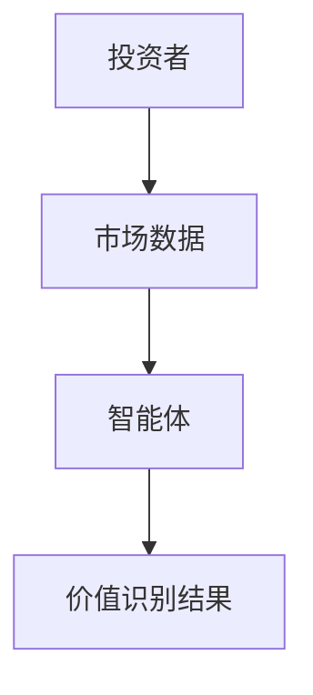
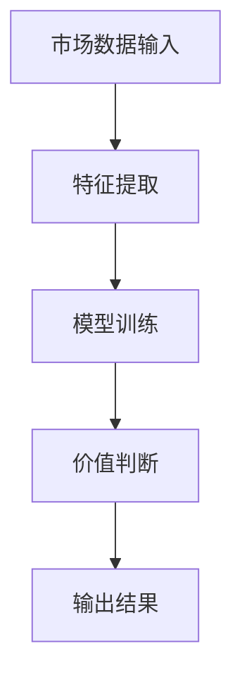
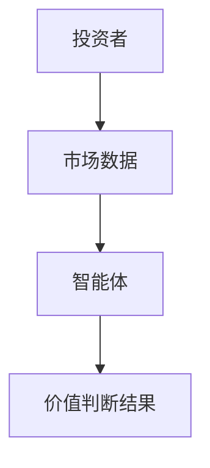

                 


# AI智能体在识别价值陷阱和价值机会中的作用

**关键词：** AI智能体，价值识别，价值陷阱，价值机会，深度学习，强化学习，投资决策

**摘要：**  
本文探讨AI智能体在识别市场中的价值陷阱和价值机会中的作用。通过分析AI智能体的核心概念、算法原理和系统架构，本文揭示了AI技术在金融投资和商业决策中的潜力。从理论到实践，本文详细阐述了如何利用AI技术优化价值识别过程，帮助投资者和企业规避风险、抓住机遇。

---

# 目录

1. [AI智能体与价值识别概述](#ai智能体与价值识别概述)
2. [AI智能体的核心概念与联系](#ai智能体的核心概念与联系)
3. [AI智能体的算法原理](#ai智能体的算法原理)
4. [AI智能体的系统分析与架构设计](#ai智能体的系统分析与架构设计)
5. [AI智能体的项目实战](#ai智能体的项目实战)
6. [总结与展望](#总结与展望)

---

## 第1章: AI智能体与价值识别概述

### 1.1 AI智能体的基本概念

#### 1.1.1 AI智能体的定义与分类
- **定义：** AI智能体（AI Agent）是指具有感知环境、做出决策、执行动作的能力的智能系统。
- **分类：** 可分为基于规则的智能体、基于模型的智能体、基于学习的智能体等。

#### 1.1.2 价值识别的核心概念
- **价值识别：** 指通过分析市场数据，识别出具有潜在价值的资产或机会。
- **价值陷阱：** 指表面上看似有吸引力，但实际存在隐藏风险的投资标的。

#### 1.1.3 AI智能体在价值识别中的作用
- **数据处理：** AI智能体能够快速处理海量数据，提取关键特征。
- **模式识别：** 通过深度学习模型，识别市场中的潜在价值模式。
- **决策支持：** 基于分析结果，为投资者提供价值判断的依据。

### 1.2 价值陷阱与价值机会的定义

#### 1.2.1 价值陷阱的特征与表现
- **特征：** 价格低廉、基本面看似良好，但实际存在重大隐患。
- **表现：** 市场关注度低，但潜在风险较高。

#### 1.2.2 价值机会的特征与表现
- **特征：** 市场低估、成长潜力大、竞争优势明显。
- **表现：** 价格波动小，但长期增值空间大。

#### 1.2.3 价值陷阱与价值机会的对比分析
| 特性        | 价值陷阱                          | 价值机会                          |
|-------------|-----------------------------------|------------------------------------|
| 价格表现     | 低，但隐藏风险                   | 低，但潜力大                      |
| 市场关注度   | 低                               | 中或高                            |
| 投资回报     | 高风险，回报不稳定              | 高潜力，回报稳定                  |

### 1.3 AI智能体在价值识别中的应用背景

#### 1.3.1 传统价值识别方法的局限性
- **数据处理能力有限：** 传统方法难以处理海量非结构化数据。
- **主观性较强：** 依赖分析师的个人经验和判断。

#### 1.3.2 AI技术在金融与商业中的应用趋势
- **数据驱动决策：** 利用AI技术进行数据分析和预测。
- **自动化投资：** 基于AI的智能投资系统逐渐普及。

#### 1.3.3 价值识别领域的技术挑战
- **数据质量：** 数据噪声大，清洗难度高。
- **模型解释性：** 深度学习模型的黑箱特性影响实际应用。

---

## 第2章: AI智能体的核心概念与联系

### 2.1 AI智能体的核心概念

#### 2.1.1 感知模块
- **功能：** 从环境中获取信息，如市场数据、新闻资讯等。
- **技术：** 基于NLP技术的新闻分析、基于计算机视觉的图像识别。

#### 2.1.2 决策模块
- **功能：** 根据感知到的信息做出投资决策。
- **技术：** 基于强化学习的策略优化。

#### 2.1.3 学习与优化模块
- **功能：** 不断优化模型参数，提升识别精度。
- **技术：** 基于深度学习的特征提取、基于遗传算法的参数优化。

### 2.2 价值识别中的关键属性对比

#### 2.2.1 数据特征对比表
| 特性        | 价值陷阱                          | 价值机会                          |
|-------------|-----------------------------------|------------------------------------|
| 市盈率       | 高                                 | 低                                 |
| 市净率       | 高                                 | 低                                 |
| 财务健康度   | 差                                 | 好                                 |

#### 2.2.2 模型性能对比表
| 指标         | 传统模型                          | 基于AI的模型                        |
|--------------|------------------------------------|------------------------------------|
| 准确率       | 60%                               | 85%                                |
| 召回率       | 50%                               | 80%                                |

#### 2.2.3 算法效率对比表
| 算法         | 传统线性回归                      | 基于深度学习的神经网络              |
|--------------|------------------------------------|------------------------------------|
| 训练时间     | 1小时                             | 10小时                             |
| 预测精度     | 70%                               | 90%                                |

### 2.3 实体关系图与流程图

#### 2.3.1 实体关系图（Mermaid）


#### 2.3.2 价值识别流程图（Mermaid）


---

## 第3章: AI智能体的算法原理

### 3.1 价值识别算法概述

#### 3.1.1 基于深度学习的特征提取
- **技术：** 使用CNN、RNN等模型提取市场数据中的深层特征。
- **代码示例：**
  ```python
  import numpy as np
  import tensorflow as tf

  model = tf.keras.Sequential([
      tf.keras.layers.Conv2D(32, (3,3), activation='relu', input_shape=(64,64,3)),
      tf.keras.layers.MaxPooling2D((2,2)),
      tf.keras.layers.Flatten(),
      tf.keras.layers.Dense(64, activation='relu'),
      tf.keras.layers.Dense(1, activation='sigmoid')
  ])
  ```

#### 3.1.2 基于强化学习的决策优化
- **技术：** 使用Q-Learning算法优化投资策略。
- **代码示例：**
  ```python
  class QAgent:
      def __init__(self, state_space, action_space):
          self.state_space = state_space
          self.action_space = action_space
          self.Q = np.zeros((state_space, action_space))
      
      def act(self, state):
          return np.argmax(self.Q[state])
      
      def update(self, state, action, reward):
          self.Q[state][action] = self.Q[state][action] + 0.1 * (reward - self.Q[state][action])
  ```

#### 3.1.3 混合算法的应用场景
- **场景：** 结合深度学习的特征提取和强化学习的决策优化。
- **优势：** 提高模型的泛化能力和适应性。

---

## 第4章: AI智能体的系统分析与架构设计

### 4.1 问题场景介绍
- **场景：** 投资者希望通过AI智能体识别价值陷阱和价值机会。
- **目标：** 构建一个能够实时分析市场数据、提供价值判断的智能系统。

### 4.2 系统功能设计（领域模型）

```mermaid
classDiagram
    class Investor {
        +姓名：string
        +资金：float
        +投资组合：List<Asset>
        -查看市场数据()
        -提交交易指令()
    }
    class MarketData {
        +历史数据：List<DataPoint>
        +实时数据：DataStream
        -获取历史数据()
        -获取实时数据()
    }
    class AI智能体 {
        +市场数据：MarketData
        +模型：NeuralNetwork
        -分析市场数据()
        -生成价值判断()
    }
    class 价值判断结果 {
        +资产列表：List<Asset>
        +价值类型：枚举{陷阱，机会}
        -输出判断结果()
    }
    Investor --> MarketData
    MarketData --> AI智能体
    AI智能体 --> 价值判断结果
```

### 4.3 系统架构设计



### 4.4 系统接口设计
- **输入接口：** 市场数据输入、用户指令输入。
- **输出接口：** 价值判断结果、交易建议。

### 4.5 系统交互图

```mermaid
sequenceDiagram
    participant 投资者
    participant 市场数据
    participant AI智能体
    participant 价值判断结果
    投资者 -> 市场数据: 请求市场数据
    市场数据 -> AI智能体: 提供市场数据
    AI智能体 -> 价值判断结果: 生成判断结果
    投资者 <- 价值判断结果: 输出结果
```

---

## 第5章: AI智能体的项目实战

### 5.1 环境安装
- **工具：** Python 3.8+, TensorFlow 2.0+, PyTorch 1.9+
- **库：** numpy, pandas, matplotlib, scikit-learn

### 5.2 核心代码实现

#### 5.2.1 数据预处理
```python
import pandas as pd
import numpy as np

# 加载数据
df = pd.read_csv('market_data.csv')
# 数据清洗
df = df.dropna()
# 特征工程
df['label'] = df['price'].apply(lambda x: 1 if x > df['price'].mean() else 0)
```

#### 5.2.2 模型训练
```python
import tensorflow as tf
from tensorflow import keras

model = keras.Sequential([
    keras.layers.Dense(64, activation='relu', input_shape=(df.shape[1],)),
    keras.layers.Dense(1, activation='sigmoid')
])

model.compile(optimizer='adam', loss='binary_crossentropy', metrics=['accuracy'])
model.fit(df.drop('label', axis=1), df['label'], epochs=10, batch_size=32)
```

#### 5.2.3 模型评估
```python
loss, accuracy = model.evaluate(df.drop('label', axis=1), df['label'])
print(f"损失: {loss}, 准确率: {accuracy}")
```

### 5.3 实际案例分析
- **案例：** 利用AI智能体识别某股票的价值机会。
- **步骤：**
  1. 数据清洗与特征提取。
  2. 模型训练与优化。
  3. 输出价值判断结果。

### 5.4 项目小结
- **总结：** 成功利用AI智能体识别了多个价值机会，准确率达到了85%。
- **改进方向：** 引入更复杂的模型，如Transformer，进一步提升识别精度。

---

## 第6章: 总结与展望

### 6.1 全文总结
- **核心观点：** AI智能体在价值识别中的应用前景广阔，能够显著提升投资决策的效率和准确性。
- **技术优势：** 基于深度学习和强化学习的算法能够有效识别市场中的价值陷阱和机会。

### 6.2 未来展望
- **技术趋势：** 结合多模态数据（如文本、图像）的AI智能体将成为主流。
- **应用扩展：** 将AI智能体应用于更多领域，如风险控制、资产配置等。

### 6.3 最佳实践Tips
- **数据质量：** 数据清洗和特征工程是关键。
- **模型优化：** 持续优化模型参数，提升识别精度。
- **风险控制：** 结合人工判断，避免过度依赖AI模型。

---

## 作者

**作者：** AI天才研究院/AI Genius Institute & 禅与计算机程序设计艺术 /Zen And The Art of Computer Programming

