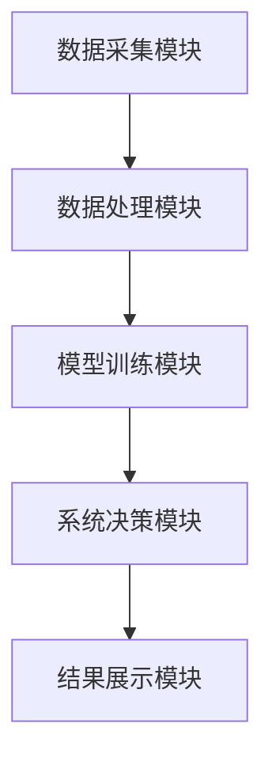

                 


# AI驱动的价值投资组合风险预算管理

> 关键词：AI驱动，投资组合管理，风险预算，价值投资，人工智能，金融创新

> 摘要：本文详细探讨了AI技术在价值投资组合风险预算管理中的应用，从核心概念、算法原理、系统架构到项目实战，系统性地阐述了AI驱动的价值投资组合风险预算管理的理论与实践。文章结合实际案例，深入分析了AI技术在投资组合优化和风险控制中的优势，并展望了未来的发展方向。

---

## # 第1章: AI驱动的价值投资组合管理背景

### 1.1 价值投资与投资组合管理的背景

#### 1.1.1 价值投资的核心理念
价值投资是一种以内在价值为导向的投资策略，强调通过分析企业的基本面（如财务状况、盈利能力、行业地位等）来判断其股票是否被市场低估。其核心理念是寻找具有长期竞争优势的企业，并在合理估值时买入，耐心持有，等待其价值的实现。

#### 1.1.2 投资组合管理的定义与目标
投资组合管理是将资金分配到不同的资产或资产类别中，以实现特定的投资目标（如收益最大化、风险最小化等）。其目标是通过科学的资产配置和风险管理，优化投资组合的收益与风险比。

#### 1.1.3 AI技术在金融领域的应用前景
AI技术在金融领域的应用日益广泛，尤其是在数据处理、模式识别和决策优化方面表现突出。AI能够帮助投资者快速分析海量数据、发现潜在投资机会、优化资产配置，并实时监控市场风险。

---

### 1.2 风险预算管理的定义与重要性

#### 1.2.1 风险预算的定义
风险预算是指在投资组合中，为每个资产或资产类别分配的风险敞口（即潜在损失）的过程。它通过量化风险，帮助投资者在不同资产之间分配风险，以实现整体投资组合的风险可控。

#### 1.2.2 风险预算在投资组合管理中的作用
风险预算是投资组合管理的重要工具，它能够帮助投资者在收益与风险之间找到平衡点。通过合理的风险预算，投资者可以在市场波动中保持投资组合的稳定性，并在市场机会来临时抓住收益。

#### 1.2.3 风险预算与收益之间的平衡
在投资组合管理中，收益与风险是两个相互关联的变量。通过AI技术，可以实现风险预算的动态优化，从而在不同市场环境下保持收益与风险的平衡。

---

### 1.3 AI驱动投资组合管理的优势

#### 1.3.1 数据处理能力的提升
AI技术能够处理海量的金融数据，包括历史价格、财务报表、新闻 sentiment 等，从而为投资组合管理提供更全面的信息支持。

#### 1.3.2 风险预测的准确性增强
通过机器学习算法，AI能够分析历史数据中的模式和趋势，从而更准确地预测市场风险，并为投资组合的风险预算提供科学依据。

#### 1.3.3 自动化决策的优势
AI技术可以实现投资组合管理的自动化，从数据收集、分析、策略制定到执行，减少人为干预，提高决策效率和准确性。

---

## # 第2章: 价值投资与风险预算的核心概念

### 2.1 价值投资的基本原理

#### 2.1.1 价值投资的定义
价值投资是一种以企业内在价值为导向的投资策略，强调以低于内在价值的价格买入优质股票并长期持有。

#### 2.1.2 价值投资的关键要素
- **企业基本面分析**：包括盈利能力、财务状况、成长能力等。
- **市场情绪分析**：通过市场情绪判断股票的估值是否合理。
- **安全边际**：以低于内在价值的价格买入股票，以降低投资风险。

#### 2.1.3 价值投资的实施步骤
1. 确定投资目标：明确投资目标和风险承受能力。
2. 选择优质企业：通过基本面分析筛选出具有长期竞争优势的企业。
3. 评估估值：判断股票价格是否低于其内在价值。
4. 构建投资组合：根据风险预算分配资金，构建投资组合。
5. 持股待涨：长期持有优质股票，等待其价值的实现。

---

### 2.2 风险预算的核心原理

#### 2.2.1 风险预算的计算方法
风险预算是通过量化投资组合中各个资产的风险敞口，并根据整体投资目标确定每个资产的风险预算。

#### 2.2.2 风险预算的动态调整
市场环境的变化会影响投资组合的风险敞口，因此需要定期评估和调整风险预算，以确保投资组合的风险在可控范围内。

#### 2.2.3 风险预算与投资组合绩效的关系
合理的风险预算是投资组合绩效的重要保障。通过科学的风险预算管理，可以在市场波动中保持投资组合的稳定性，并在市场机会来临时实现收益最大化。

---

### 2.3 价值投资与风险预算的结合

#### 2.3.1 价值投资与风险预算的协同效应
价值投资注重企业的内在价值，而风险预算注重投资组合的整体风险控制。两者结合可以实现收益与风险的平衡，提高投资组合的长期收益。

#### 2.3.2 AI在价值投资与风险预算中的作用
AI技术可以提高价值投资的效率和准确性，同时优化风险预算的计算和调整过程，从而实现投资组合的科学管理。

#### 2.3.3 价值投资与风险预算的未来发展趋势
随着AI技术的不断发展，价值投资与风险预算的结合将更加紧密，投资组合管理将更加智能化和自动化。

---

## # 第3章: AI驱动的组合管理模型

### 3.1 数据预处理与特征选择

#### 3.1.1 数据清洗与标准化
- 数据清洗：去除噪声数据、缺失值和异常值。
- 数据标准化：对数据进行归一化处理，以便模型更好地学习。

#### 3.1.2 特征选择的方法
- 基于统计的方法：如卡方检验、相关系数分析。
- 基于机器学习的方法：如LASSO回归、随机森林特征重要性分析。

#### 3.1.3 数据特征的可视化
通过可视化工具（如Matplotlib、Seaborn）展示数据特征，帮助理解数据分布和特征之间的关系。

---

### 3.2 组合管理模型的构建

#### 3.2.1 基于AI的组合优化算法
- **强化学习算法**：通过状态、动作和奖励的定义，优化投资组合的收益与风险比。
- **遗传算法**：通过模拟自然选择过程，寻找最优的投资组合。

#### 3.2.2 模型训练与验证
- 训练数据集：用于模型参数的训练。
- 验证数据集：用于模型的验证和调优。
- 测试数据集：用于模型的最终评估。

#### 3.2.3 模型的调优与优化
通过网格搜索、随机搜索等方法，优化模型的参数，提高模型的预测准确率。

---

### 3.3 风险预算的AI优化策略

#### 3.3.1 风险预算的AI计算方法
- **基于机器学习的风险预测模型**：如支持向量机（SVM）、神经网络等。
- **基于AI的动态风险预算调整**：根据市场环境的变化，实时调整风险预算。

#### 3.3.2 风险预算的动态调整策略
通过机器学习算法，实时监控市场风险，动态调整投资组合的风险预算，以适应市场环境的变化。

#### 3.3.3 风险预算的组合优化
通过AI技术，优化投资组合的风险预算分配，提高投资组合的收益与风险比。

---

## # 第4章: 风险预算的AI优化方法

### 4.1 风险度量方法

#### 4.1.1 方差与标准差的计算
- 方差：衡量资产收益的波动性。
- 标准差：方差的平方根，是衡量资产收益波动性的常用指标。

#### 4.1.2 风险价值（VaR）的计算
- VaR是衡量投资组合潜在损失的常用指标，表示在给定置信水平下，投资组合可能遭受的最大损失。

#### 4.1.3 最大回撤（Max Drawdown）的计算
最大回撤是衡量投资组合在一段时间内从峰值到低谷的最大跌幅，是衡量投资组合风险的重要指标。

---

### 4.2 AI驱动的风险预算优化算法

#### 4.2.1 基于机器学习的风险预算优化
- 使用支持向量回归（SVR）或神经网络模型，预测市场风险，并优化投资组合的风险预算。

#### 4.2.2 基于强化学习的风险预算优化
- 通过强化学习算法，模拟投资组合管理的过程，优化风险预算分配。

#### 4.2.3 基于遗传算法的风险预算优化
- 通过遗传算法，寻找最优的风险预算分配方案。

---

### 4.3 风险预算优化的实现步骤

#### 4.3.1 数据收集与预处理
- 收集历史价格数据、财务数据等。
- 对数据进行清洗、标准化和特征选择。

#### 4.3.2 模型训练与验证
- 使用训练数据集训练风险预算优化模型。
- 使用验证数据集调整模型参数。

#### 4.3.3 风险预算的动态调整
- 根据市场环境的变化，实时调整风险预算。
- 通过AI技术优化风险预算分配，提高投资组合的收益与风险比。

---

## # 第5章: 系统架构与实现

### 5.1 价值投资组合风险预算管理系统的架构设计

#### 5.1.1 系统功能模块
- 数据采集模块：负责收集市场数据、财务数据等。
- 数据处理模块：负责数据清洗、特征选择和数据预处理。
- 模型训练模块：负责训练风险预算优化模型。
- 系统决策模块：负责根据模型预测结果优化风险预算。
- 结果展示模块：负责展示投资组合的风险预算分配情况。

#### 5.1.2 系统架构图


---

### 5.2 系统实现与代码解读

#### 5.2.1 数据采集模块
```python
import pandas as pd
import requests

def get_data(ticker):
    url = f"https://api.example.com/{ticker}"
    response = requests.get(url)
    data = response.json()
    return pd.DataFrame(data)
```

#### 5.2.2 数据处理模块
```python
from sklearn.preprocessing import StandardScaler

def preprocess_data(df):
    # 标准化处理
    scaler = StandardScaler()
    df_scaled = scaler.fit_transform(df)
    return df_scaled
```

#### 5.2.3 模型训练模块
```python
from sklearn.svm import SVR

def train_model(X, y):
    model = SVR()
    model.fit(X, y)
    return model
```

---

## # 第6章: 项目实战与案例分析

### 6.1 项目环境配置

#### 6.1.1 安装依赖库
```bash
pip install numpy pandas scikit-learn requests
```

#### 6.1.2 数据获取与清洗
```python
import pandas as pd

# 获取数据
df = pd.read_csv("data.csv")

# 数据清洗
df.dropna(inplace=True)
df = df[~df.isin([float('inf'), -float('inf')]).any(axis=1)]
```

---

### 6.2 价值投资组合风险预算管理系统的实现

#### 6.2.1 系统核心实现
```python
from sklearn.decomposition import PCA

def optimize_portfolio(returns, n_assets):
    # 使用PCA降维
    pca = PCA(n_components=n_assets)
    transformed = pca.fit_transform(returns)
    
    # 计算风险预算
    var = np.diag(transformed.std(axis=0) ** 2)
    inv_var = np.linalg.inv(var)
    weights = inv_var.dot(pca.components_.T).sum(axis=1)
    weights = weights / weights.sum()
    
    return weights
```

#### 6.2.2 投资组合风险预算分配
```python
import numpy as np

def allocate_risk(weights, portfolio_value):
    # 风险预算分配
    risk_exposure = weights * portfolio_value
    return risk_exposure
```

---

## # 第7章: 价值投资组合风险预算管理的未来展望

### 7.1 最佳实践与小结

#### 7.1.1 最佳实践
- 定期评估和调整投资组合的风险预算。
- 结合市场环境的变化，动态优化投资组合。
- 采用多种AI技术（如强化学习、遗传算法等）优化投资组合管理。

#### 7.1.2 小结
AI技术在价值投资组合风险预算管理中的应用前景广阔，通过科学的AI算法和系统的优化，可以实现投资组合的高效管理，提高收益与风险比。

---

## # 附录: 工具与资源

### 附录A: 数据源与工具包
- 数据源：Yahoo Finance、Quandl、Alpha Vantage。
- 工具包：Pandas、NumPy、Scikit-learn、TensorFlow、Keras。

### 附录B: 代码与数据
- 完整代码示例：GitHub链接。
- 数据格式：CSV格式，包含历史价格、财务数据等。

### 附录C: 参考文献
- 刘东，2021，《人工智能在金融投资中的应用》。
- 张伟，2022，《基于AI的投资组合管理》。

---

## 作者：AI天才研究院/AI Genius Institute & 禅与计算机程序设计艺术 /Zen And The Art of Computer Programming

---

**摘要**：本文详细探讨了AI技术在价值投资组合风险预算管理中的应用，从核心概念、算法原理、系统架构到项目实战，系统性地阐述了AI驱动的价值投资组合风险预算管理的理论与实践。文章结合实际案例，深入分析了AI技术在投资组合优化和风险控制中的优势，并展望了未来的发展方向。

