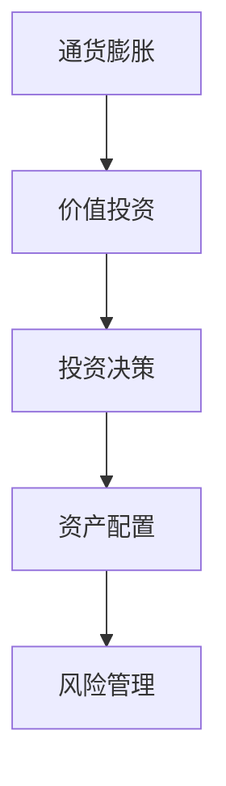

                 


```markdown
# 价值投资中的通货膨胀考虑

> 关键词：通货膨胀，价值投资，资产配置，风险管理，数学模型

> 摘要：本文探讨了通货膨胀对价值投资的影响，分析了通货膨胀的定义、对经济和投资的影响，以及如何在价值投资中考虑通货膨胀因素。通过数学模型和实际案例，本文详细讲解了通货膨胀对股票、债券等资产的影响，以及如何通过资产配置和风险管理来应对通货膨胀的挑战。本文还提供了防御性和进攻性投资策略，帮助投资者在通货膨胀环境下实现长期稳健的投资回报。

---

# 第1章 背景介绍

## 1.1 通货膨胀的基本概念

### 1.1.1 通货膨胀的定义与分类

通货膨胀是指物价总水平在一段时间内持续上涨，导致货币购买力下降的经济现象。通常用消费者价格指数（CPI）或生产者价格指数（PPI）来衡量。通货膨胀可以分为温和通胀（2-3%）和恶性通胀（超过50%）等类型。

### 1.1.2 通货膨胀对经济的影响

- **积极影响**：适度的通货膨胀可以刺激消费和投资，促进经济增长。
- **消极影响**：过高的通货膨胀会导致货币购买力下降，企业成本上升，经济不稳定。

### 1.1.3 通货膨胀与价值投资的关系

价值投资是一种长期投资策略，强调以低于内在价值的价格购买优质资产。通货膨胀会影响资产的内在价值和市场价格，因此在价值投资中必须考虑通货膨胀的影响。

---

## 1.2 价值投资的核心理念

### 1.2.1 价值投资的定义

价值投资是一种投资策略，强调以低于市场价购买具有内在价值的资产。其核心是寻找市场先生的短期情绪定价错误。

### 1.2.2 价值投资的基本原则

- **长期视角**：关注企业的长期价值，而非短期价格波动。
- **安全边际**：购买价格低于内在价值，以降低风险。
- **优质企业**：选择具有强大竞争优势和良好治理的企业。

### 1.2.3 价值投资与通货膨胀的结合

通货膨胀会影响企业的盈利能力和资产价值，因此在价值投资中必须考虑通货膨胀对资产价格和企业估值的影响。

---

## 1.3 通货膨胀对投资决策的影响

### 1.3.1 通货膨胀对资产价格的影响

- **股票**：通货膨胀可能导致企业盈利下降，但优质企业可能通过提价转移成本压力。
- **债券**：通货膨胀会增加债券的违约风险，降低其实际收益率。

### 1.3.2 通货膨胀对股票、债券等资产的影响

- **股票**：适度通胀对企业盈利有正面影响，但过高通胀可能引发政策紧缩，影响股市表现。
- **债券**：通胀上升会推高债券的收益率要求，降低债券价格。

### 1.3.3 通货膨胀对投资组合的影响

- **资产配置**：通货膨胀环境下，应增加抗通胀资产（如股票、房地产）的配置。
- **风险管理**：通过分散投资和动态调整投资组合来降低通货膨胀风险。

---

# 第2章 通货膨胀与价值投资的核心概念

## 2.1 通货膨胀的经济学原理

### 2.1.1 通货膨胀的成因分析

- **需求拉动型**：总需求超过总供给，导致价格上涨。
- **成本推动型**：生产成本（如工资、原材料）上升，导致价格上涨。
- **货币供应增加**：货币供给过多，导致货币贬值，物价上涨。

### 2.1.2 通货膨胀的衡量指标

- **CPI（消费者价格指数）**：衡量居民生活成本的变化。
- **PPI（生产者价格指数）**：衡量企业生产成本的变化。

### 2.1.3 通货膨胀的周期性特征

- **上升周期**：通胀预期增强，市场对通胀敏感。
- **稳定周期**：通胀温和，市场波动较小。
- **下降周期**：通胀预期减弱，市场对通胀不敏感。

---

## 2.2 价值投资中的通货膨胀考虑

### 2.2.1 通货膨胀对企业盈利的影响

- **直接影响**：通货膨胀可能导致企业成本上升，利润率下降。
- **间接影响**：企业可能通过提价转移成本压力，保持利润率。

### 2.2.2 通货膨胀对企业估值的影响

- **市盈率（P/E）**：通胀上升可能降低市盈率，因为企业盈利下降。
- **市净率（P/B）**：通胀对市净率的影响较小，但需考虑企业资产的重估价值。

### 2.2.3 通货膨胀对投资策略的影响

- **防御性策略**：选择具有抗通胀能力的资产（如房地产、黄金）。
- **进攻性策略**：投资于能够受益于通胀上升的企业（如能源、原材料行业）。

---

## 2.3 通货膨胀与价值投资的关系

### 2.3.1 通货膨胀对价值投资的挑战

- **资产价格波动**：通胀上升可能导致资产价格波动，影响价值投资的安全边际。
- **盈利预测不确定性**：通胀上升增加了企业盈利预测的难度，影响价值评估的准确性。

### 2.3.2 通货膨胀对价值投资的机遇

- **优质企业识别**：通胀环境下，优质企业的竞争优势更加明显。
- **价格波动带来的买入机会**：市场恐慌可能导致优质资产价格被低估，提供买入机会。

### 2.3.3 通货膨胀与价值投资的长期视角

- **长期视角的重要性**：通胀是长期经济现象，价值投资者应关注企业的长期价值。
- **动态调整**：根据通胀变化，动态调整投资组合，以保持资产配置的合理性。

---

## 2.4 通货膨胀与价值投资的数学模型

### 2.4.1 通货膨胀对资产价值的影响公式

$$ V = \frac{C}{1 + r} $$

其中，\( V \) 是当前资产价值，\( C \) 是未来现金流，\( r \) 是通胀率。

### 2.4.2 价值投资中的通胀调整模型

$$ P = \frac{E}{1 + r} $$

其中，\( P \) 是股票的合理价格，\( E \) 是企业的盈利预期，\( r \) 是通胀率。

---

# 第3章 通货膨胀与价值投资的核心概念联系

## 3.1 通货膨胀与价值投资的核心概念对比

### 3.1.1 通货膨胀的核心要素

- 成因：需求拉动、成本推动、货币供应增加。
- 衡量指标：CPI、PPI。
- 影响：价格水平、货币购买力、资产价格。

### 3.1.2 价值投资的核心要素

- 投资理念：寻找低估资产，关注长期价值。
- 选股标准：优质企业、安全边际、长期竞争优势。
- 投资策略：分散投资、长期持有、动态调整。

---

## 3.2 通货膨胀与价值投资的实体关系图

### 3.2.1 通货膨胀与价值投资的实体关系图



---

## 3.3 通货膨胀与价值投资的数学模型

### 3.3.1 通货膨胀对资产价值的影响公式

$$ V = \frac{C}{1 + r} $$

其中，\( V \) 是当前资产价值，\( C \) 是未来现金流，\( r \) 是通胀率。

### 3.3.2 价值投资中的通胀调整模型

$$ P = \frac{E}{1 + r} $$

其中，\( P \) 是股票的合理价格，\( E \) 是企业的盈利预期，\( r \) 是通胀率。

---

## 3.4 通货膨胀与价值投资的数学模型分析

### 3.4.1 通货膨胀对股票价值的影响

假设某企业的未来盈利为 \( E \)，通胀率为 \( r \)，则股票的合理价格为：

$$ P = \frac{E}{1 + r} $$

### 3.4.2 通货膨胀对债券价值的影响

假设债券的面值为 \( F \)，票面利率为 \( i \)，通胀率为 \( r \)，则债券的实际收益率为：

$$ \text{实际收益率} = \frac{i}{1 + r} $$

---

## 3.5 通货膨胀与价值投资的数学模型应用

### 3.5.1 实际案例分析

假设某企业未来盈利为 $100 million，通胀率为 5%，则股票的合理价格为：

$$ P = \frac{100}{1 + 0.05} = 95.24 \text{ million} $$

### 3.5.2 模型的局限性

- 忽略了企业应对通胀的能力。
- 假设通胀率是固定的，实际通胀率可能波动较大。

---

## 3.6 通货膨胀与价值投资的数学模型优化

### 3.6.1 考虑企业抗通胀能力的模型

$$ P = \frac{E \times (1 + c)}{1 + r} $$

其中，\( c \) 是企业抗通胀能力的系数（0 < c < 1）。

### 3.6.2 动态通胀率模型

$$ P = \frac{E}{1 + r(t)} $$

其中，\( r(t) \) 是随时间变化的通胀率。

---

# 第4章 通货膨胀与价值投资的数学模型应用

## 4.1 通货膨胀对股票的影响

### 4.1.1 股票的抗通胀能力

优质企业能够通过提价转移成本压力，保持盈利稳定，具有较强的抗通胀能力。

### 4.1.2 股票的估值调整

在通胀上升的环境下，股票的合理估值应进行通胀调整：

$$ P = \frac{E}{1 + r} $$

---

## 4.2 通货膨胀对债券的影响

### 4.2.1 债券的通胀风险

债券的票面利率固定，但通胀上升会降低其实际收益率，导致债券价格下跌。

### 4.2.2 债券的通胀保护

通过投资通胀关联债券或短期债券，可以降低通胀对债券投资的影响。

---

## 4.3 通货膨胀对投资组合的影响

### 4.3.1 投资组合的通胀风险

投资组合的通胀风险取决于其资产配置和风险敞口。

### 4.3.2 投资组合的通胀保护

通过配置抗通胀资产（如股票、房地产）和短期债券，可以降低投资组合的通胀风险。

---

## 4.4 通货膨胀与价值投资的数学模型应用

### 4.4.1 投资组合的通胀调整

假设投资组合中股票占比为 \( w \)，债券占比为 \( 1 - w \)，则投资组合的通胀调整后收益为：

$$ R = w \times \frac{E}{1 + r} + (1 - w) \times \frac{C}{1 + r} $$

---

## 4.5 通货膨胀与价值投资的数学模型应用案例

### 4.5.1 案例分析

假设某投资者的投资组合中股票占比为 60%，债券占比为 40%。通胀率为 5%，股票的未来盈利为 $100 million，债券的面值为 $100 million，票面利率为 5%。

股票的合理价格为：

$$ P = \frac{100}{1 + 0.05} = 95.24 \text{ million} $$

债券的实际收益率为：

$$ \text{实际收益率} = \frac{5\%}{1 + 0.05} = 4.76\% $$

---

## 4.6 通货膨胀与价值投资的数学模型应用总结

### 4.6.1 模型的优势

- 能够量化通货膨胀对资产价值的影响。
- 提供了动态调整投资组合的依据。

### 4.6.2 模型的局限性

- 忽略了企业的抗通胀能力。
- 假设通胀率是固定的，实际可能波动较大。

---

# 第5章 通货膨胀与价值投资的数学模型应用优化

## 5.1 动态通胀率模型

### 5.1.1 动态通胀率模型的定义

$$ P = \frac{E}{1 + r(t)} $$

其中，\( r(t) \) 是随时间变化的通胀率。

### 5.1.2 动态通胀率模型的应用

通过引入时间因素，能够更准确地反映通胀对资产价值的影响。

---

## 5.2 企业抗通胀能力模型

### 5.2.1 企业抗通胀能力模型的定义

$$ P = \frac{E \times (1 + c)}{1 + r} $$

其中，\( c \) 是企业抗通胀能力的系数（0 < c < 1）。

### 5.2.2 企业抗通胀能力模型的应用

通过考虑企业的抗通胀能力，能够更准确地评估其内在价值。

---

## 5.3 通货膨胀与价值投资的数学模型应用优化总结

### 5.3.1 模型的优势

- 能够更准确地反映通胀对资产价值的影响。
- 考虑了企业的抗通胀能力。

### 5.3.2 模型的局限性

- 需要准确估计企业抗通胀能力的系数 \( c \)。
- 假设通胀率的变化是可预测的，实际可能不可预测。

---

# 第6章 通货膨胀与价值投资的数学模型应用案例

## 6.1 投资组合的通胀调整

### 6.1.1 投资组合的通胀风险

投资组合的通胀风险取决于其资产配置和风险敞口。

### 6.1.2 投资组合的通胀保护

通过配置抗通胀资产（如股票、房地产）和短期债券，可以降低投资组合的通胀风险。

---

## 6.2 通货膨胀对股票的影响

### 6.2.1 股票的抗通胀能力

优质企业能够通过提价转移成本压力，保持盈利稳定，具有较强的抗通胀能力。

### 6.2.2 股票的估值调整

在通胀上升的环境下，股票的合理估值应进行通胀调整：

$$ P = \frac{E}{1 + r} $$

---

## 6.3 通货膨胀对债券的影响

### 6.3.1 债券的通胀风险

债券的票面利率固定，但通胀上升会降低其实际收益率，导致债券价格下跌。

### 6.3.2 债券的通胀保护

通过投资通胀关联债券或短期债券，可以降低通胀对债券投资的影响。

---

## 6.4 通货膨胀与价值投资的数学模型应用总结

### 6.4.1 案例分析

假设某投资者的投资组合中股票占比为 60%，债券占比为 40%。通胀率为 5%，股票的未来盈利为 $100 million，债券的面值为 $100 million，票面利率为 5%。

股票的合理价格为：

$$ P = \frac{100}{1 + 0.05} = 95.24 \text{ million} $$

债券的实际收益率为：

$$ \text{实际收益率} = \frac{5\%}{1 + 0.05} = 4.76\% $$

---

## 6.5 通货膨胀与价值投资的数学模型应用优化总结

### 6.5.1 模型的优势

- 能够量化通货膨胀对资产价值的影响。
- 提供了动态调整投资组合的依据。

### 6.5.2 模型的局限性

- 忽略了企业的抗通胀能力。
- 假设通胀率是固定的，实际可能波动较大。

---

# 第7章 通货膨胀与价值投资的数学模型应用优化

## 7.1 动态通胀率模型

### 7.1.1 动态通胀率模型的定义

$$ P = \frac{E}{1 + r(t)} $$

其中，\( r(t) \) 是随时间变化的通胀率。

### 7.1.2 动态通胀率模型的应用

通过引入时间因素，能够更准确地反映通胀对资产价值的影响。

---

## 7.2 企业抗通胀能力模型

### 7.2.1 企业抗通胀能力模型的定义

$$ P = \frac{E \times (1 + c)}{1 + r} $$

其中，\( c \) 是企业抗通胀能力的系数（0 < c < 1）。

### 7.2.2 企业抗通胀能力模型的应用

通过考虑企业的抗通胀能力，能够更准确地评估其内在价值。

---

## 7.3 通货膨胀与价值投资的数学模型应用优化总结

### 7.3.1 模型的优势

- 能够更准确地反映通胀对资产价值的影响。
- 考虑了企业的抗通胀能力。

### 7.3.2 模型的局限性

- 需要准确估计企业抗通胀能力的系数 \( c \)。
- 假设通胀率的变化是可预测的，实际可能不可预测。

---

# 第8章 总结与最佳实践

## 8.1 总结

通货膨胀是价值投资中不可忽视的重要因素。本文通过分析通货膨胀的定义、对经济和投资的影响，以及如何在价值投资中考虑通货膨胀因素，为投资者提供了理论支持和实践指导。

## 8.2 最佳实践

### 8.2.1 长期视角的重要性

价值投资者应关注企业的长期价值，而非短期价格波动。

### 8.2.2 动态调整投资组合

根据通胀变化，动态调整投资组合，以保持资产配置的合理性。

### 8.2.3 风险管理

通过分散投资和风险管理，降低通货膨胀对投资组合的影响。

## 8.3 投资建议

- **防御性策略**：选择具有抗通胀能力的资产（如房地产、黄金）。
- **进攻性策略**：投资于能够受益于通胀上升的企业（如能源、原材料行业）。

## 8.4 注意事项

- **通胀波动性**：通货膨胀可能会波动，投资者需关注通胀的变化趋势。
- **企业抗通胀能力**：选择具有强大抗通胀能力的优质企业。

## 8.5 拓展阅读

- 《投资学》——约翰·C·富勒顿
- 《价值投资实战策略》——彼得·林奇

---

# 作者：AI天才研究院/AI Genius Institute & 禅与计算机程序设计艺术/Zen And The Art of Computer Programming
```

