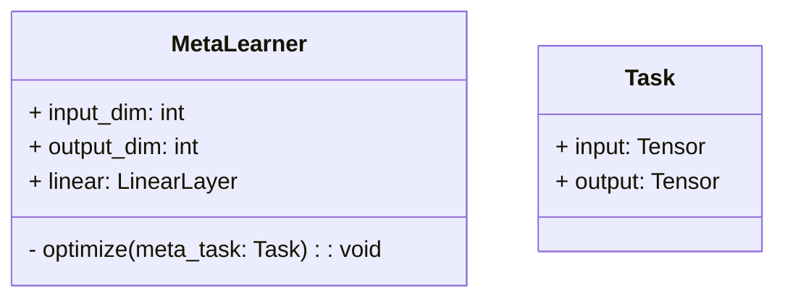
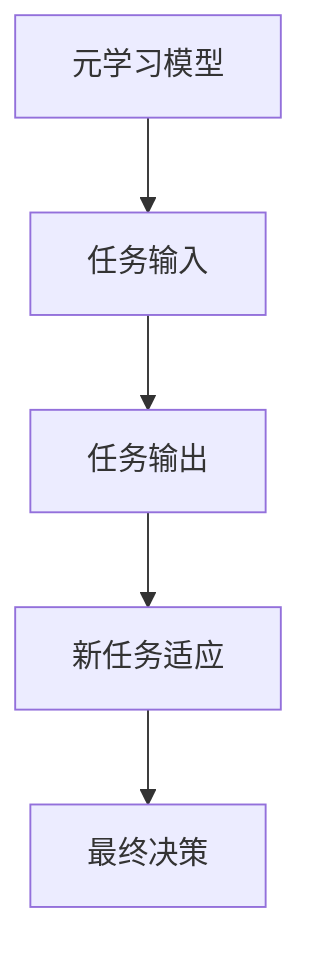
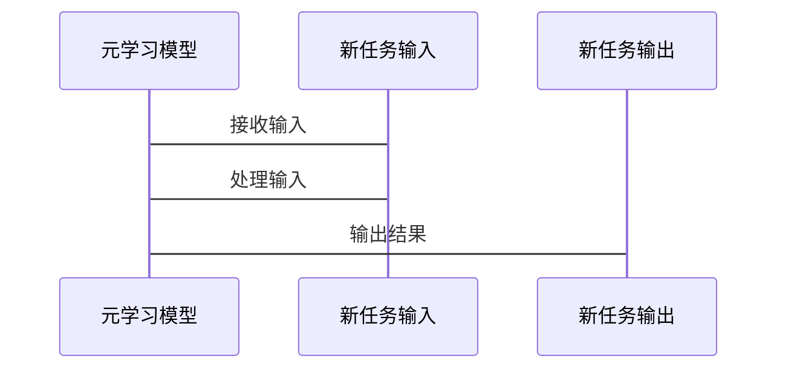
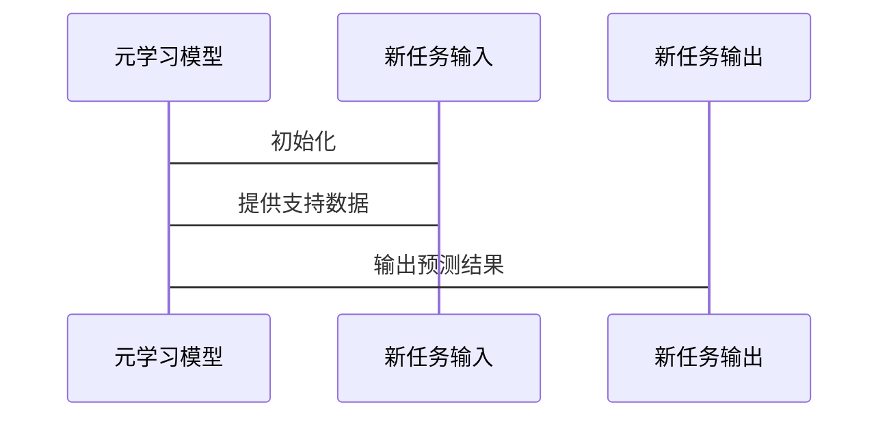

                 


# 元学习在AI Agent快速适应新任务中的应用

**关键词：** 元学习（Meta-Learning）、人工智能（AI）、AI Agent、快速适应、任务迁移、强化学习（Reinforcement Learning）、算法优化

**摘要：**  
本文深入探讨了元学习在AI Agent快速适应新任务中的应用。首先介绍了元学习的基本概念和核心原理，分析了AI Agent的任务适应需求和元学习的独特优势。接着，详细讲解了元学习算法的核心思想，包括基于模型的MAML算法和基于优化的Reptile算法，并通过数学公式和代码示例进行了深入剖析。然后，从系统架构设计的角度，探讨了AI Agent的快速适应机制，包括系统功能设计、架构设计和交互设计。最后，通过一个具体的项目实战案例，展示了如何将元学习应用于AI Agent的任务迁移，并总结了实践中的注意事项和优化建议。本文旨在为AI领域的研究者和工程师提供理论和实践上的双重指导。

---

# 第一部分: 元学习在AI Agent中的基础概念

## 第1章: 元学习的基本概念

### 1.1 元学习的定义与背景

#### 1.1.1 元学习的定义
元学习（Meta-Learning），又称元学习，是一种机器学习的高级形式，旨在通过在多个任务上的学习，使得模型能够快速适应新任务。与传统机器学习不同，元学习的核心目标是通过“学习如何学习”来提升模型的泛化能力和适应性。

#### 1.1.2 元学习的背景与动机
在人工智能领域，AI Agent需要在动态变化的环境中执行多种任务。传统的监督学习和强化学习方法虽然在特定任务上表现出色，但面对新任务时，往往需要重新训练整个模型，效率低下。元学习的出现，正是为了解决这一问题，使得AI Agent能够在新任务上快速适应并高效完成目标。

#### 1.1.3 元学习的核心目标
元学习的核心目标是通过在多个元任务上的学习，构建一个能够快速适应新任务的通用模型。具体来说，元学习的目标包括：
1. 减少新任务上的训练数据需求。
2. 提高模型在新任务上的学习效率。
3. 实现模型的快速迁移和适应。

---

### 1.2 元学习与传统机器学习的对比

#### 1.2.1 传统机器学习的特点
传统机器学习算法（如随机森林、支持向量机、神经网络等）通常需要大量标注数据，并在单个任务上进行长时间的训练。一旦任务发生变化，模型需要重新训练，效率低下。

#### 1.2.2 元学习的独特优势
元学习的核心优势在于其快速适应能力。通过在多个任务上的学习，元学习模型能够在新任务上快速调整参数，从而实现高效的任务迁移。

#### 1.2.3 两者的区别与联系
| 特性 | 传统机器学习 | 元学习 |
|------|---------------|---------|
| 数据需求 | 需要大量数据 | 数据需求低 |
| 适应性 | 任务固定 | 快速适应新任务 |
| 学习目标 | 单任务优化 | 多任务优化 |

---

### 1.3 元学习的核心概念

#### 1.3.1 元任务与元学习的关系
元任务（Meta-Task）是指用于训练元学习模型的多个任务。通过在多个元任务上的学习，元学习模型能够获得跨任务的通用知识，从而在新任务上快速适应。

#### 1.3.2 快速适应新任务的核心思想
元学习的核心思想是通过在多个任务上的学习，使得模型能够在新任务上快速调整参数，从而实现高效的任务迁移。

#### 1.3.3 元学习的数学模型框架
元学习的数学模型通常包括两个阶段：
1. 元训练阶段：通过多个元任务训练模型，使得模型能够快速适应新任务。
2. 任务推理阶段：在新任务上进行少量数据的训练或直接推理。

---

## 第2章: AI Agent的基本原理

### 2.1 AI Agent的定义与分类

#### 2.1.1 AI Agent的定义
AI Agent（人工智能代理）是一种能够感知环境、执行任务并做出决策的智能实体。AI Agent可以是软件程序、机器人或其他智能系统。

#### 2.1.2 基于元学习的AI Agent特点
基于元学习的AI Agent具有以下特点：
1. 快速适应新任务。
2. 跨任务迁移能力。
3. 高效的决策能力。

#### 2.1.3 AI Agent的分类与应用场景
AI Agent可以分为以下几类：
1. 简单反射型AI Agent。
2. 基于模型的AI Agent。
3. 基于元学习的AI Agent。

---

### 2.2 AI Agent的核心功能

#### 2.2.1 任务理解与目标设定
AI Agent需要理解任务的目标，并根据目标制定相应的策略。

#### 2.2.2 知识表示与推理能力
AI Agent需要能够表示和推理知识，以便在新任务上快速适应。

#### 2.2.3 行为决策与执行机制
AI Agent需要根据当前状态和目标，做出决策并执行相应的动作。

---

### 2.3 元学习在AI Agent中的作用

#### 2.3.1 元学习如何提升AI Agent的适应性
元学习通过在多个任务上的学习，使得AI Agent能够快速适应新任务。

#### 2.3.2 元学习在任务快速迁移中的应用
元学习通过跨任务的知识共享，使得AI Agent能够在新任务上快速迁移知识。

#### 2.3.3 元学习对AI Agent决策效率的优化
元学习通过优化模型的参数，使得AI Agent的决策效率得到提升。

---

# 第二部分: 元学习的算法原理与数学模型

## 第3章: 元学习算法的核心原理

### 3.1 元学习算法的分类

#### 3.1.1 基于模型的元学习算法
基于模型的元学习算法通过构建元模型来实现任务迁移。

#### 3.1.2 基于优化的元学习算法
基于优化的元学习算法通过优化模型的参数来实现任务迁移。

#### 3.1.3 基于度量的元学习算法
基于度量的元学习算法通过计算任务之间的相似性来实现任务迁移。

---

### 3.2 基于模型的元学习算法: MAML

#### 3.2.1 MAML算法的基本思想
MAML（Meta-Algorithm for Dataset-Free Learning）是一种基于模型的元学习算法。其基本思想是通过在多个任务上的学习，使得模型能够快速适应新任务。

#### 3.2.2 MAML的数学模型与公式
MAML的数学模型如下：

$$
\theta_{t+1} = \theta_t - \alpha \nabla_{\theta} \mathcal{L}_i(\theta_t, x_i, y_i)
$$

其中，$\theta$ 表示模型参数，$\alpha$ 表示学习率，$\mathcal{L}_i$ 表示任务损失函数。

#### 3.2.3 MAML算法的优缺点分析
MAML的优点在于其强大的任务适应能力，缺点是计算复杂度较高。

---

### 3.3 基于优化的元学习算法: Reptile

#### 3.3.1 Reptile算法的基本原理
Reptile是一种基于优化的元学习算法。其基本思想是通过在多个任务上交替优化模型参数，使得模型能够快速适应新任务。

#### 3.3.2 Reptile算法的数学模型与公式
Reptile的数学模型如下：

$$
\theta_{t+1} = \theta_t + \alpha \nabla_{\theta} \mathcal{L}_i(\theta_t, x_i, y_i)
$$

其中，$\theta$ 表示模型参数，$\alpha$ 表示学习率，$\mathcal{L}_i$ 表示任务损失函数。

#### 3.3.3 Reptile算法的优缺点分析
Reptile的优点是计算效率较高，缺点是适应能力较弱。

---

## 第4章: 元学习算法的实现与优化

### 4.1 元学习算法的实现步骤

#### 4.1.1 数据准备
需要准备多个元任务的数据集。

#### 4.1.2 模型构建
选择一个基础模型（如卷积神经网络或循环神经网络）作为元学习的基模型。

#### 4.1.3 元学习优化
通过元优化器（如Adam或SGD）对模型参数进行优化。

---

### 4.2 元学习算法的优化策略

#### 4.2.1 参数初始化策略
通过合理的参数初始化，可以加速模型的收敛。

#### 4.2.2 学习率调整策略
通过动态调整学习率，可以提高模型的优化效率。

#### 4.2.3 正则化策略
通过引入正则化项，可以防止模型过拟合。

---

## 第5章: 元学习算法的代码实现

### 5.1 基于MAML算法的代码实现

#### 5.1.1 环境安装
需要安装以下库：
```bash
pip install torch
pip install numpy
```

#### 5.1.2 代码实现
```python
import torch
import torch.nn as nn
import torch.optim as optim

class MetaLearner(nn.Module):
    def __init__(self, input_dim, output_dim):
        super(MetaLearner, self).__init__()
        self.linear = nn.Linear(input_dim, output_dim)

    def forward(self, x):
        return self.linear(x)

def maml_update(model, optimizer, x_support, y_support, x_query, y_query):
    model.zero_grad()
    # 元训练阶段
    support_loss = criterion(model(x_support), y_support)
    support_loss.backward()
    optimizer.step()

    # 任务推理阶段
    query_loss = criterion(model(x_query), y_query)
    query_loss.backward()
    optimizer.zero_grad()
    optimizer.step()

if __name__ == "__main__":
    model = MetaLearner(input_dim=10, output_dim=1)
    optimizer = optim.Adam(model.parameters(), lr=0.001)
    criterion = nn.MSELoss()
    # 数据准备
    x_support = torch.randn(10, 10)
    y_support = torch.randn(10, 1)
    x_query = torch.randn(5, 10)
    y_query = torch.randn(5, 1)
    # 训练
    maml_update(model, optimizer, x_support, y_support, x_query, y_query)
```

---

### 5.2 基于Reptile算法的代码实现

#### 5.2.1 环境安装
需要安装以下库：
```bash
pip install torch
pip install numpy
```

#### 5.2.2 代码实现
```python
import torch
import torch.nn as nn
import torch.optim as optim

class MetaLearner(nn.Module):
    def __init__(self, input_dim, output_dim):
        super(MetaLearner, self).__init__()
        self.linear = nn.Linear(input_dim, output_dim)

    def forward(self, x):
        return self.linear(x)

def reptile_update(model, optimizer, x_support, y_support, x_query, y_query):
    model.zero_grad()
    # 元训练阶段
    support_loss = criterion(model(x_support), y_support)
    support_loss.backward()
    optimizer.step()

    # 任务推理阶段
    query_loss = criterion(model(x_query), y_query)
    query_loss.backward()
    optimizer.zero_grad()
    optimizer.step()

if __name__ == "__main__":
    model = MetaLearner(input_dim=10, output_dim=1)
    optimizer = optim.Adam(model.parameters(), lr=0.001)
    criterion = nn.MSELoss()
    # 数据准备
    x_support = torch.randn(10, 10)
    y_support = torch.randn(10, 1)
    x_query = torch.randn(5, 10)
    y_query = torch.randn(5, 1)
    # 训练
    reptile_update(model, optimizer, x_support, y_support, x_query, y_query)
```

---

## 第6章: 元学习算法的系统架构设计

### 6.1 系统功能设计

#### 6.1.1 领域模型设计


#### 6.1.2 系统架构设计


---

### 6.2 系统接口设计

#### 6.2.1 系统接口定义


---

### 6.3 系统交互设计

#### 6.3.1 系统交互流程


---

## 第7章: 项目实战——基于元学习的AI Agent快速适应新任务

### 7.1 项目背景与目标

#### 7.1.1 项目背景
本项目旨在通过元学习算法，实现AI Agent在新任务上的快速适应。

#### 7.1.2 项目目标
1. 实现基于MAML的元学习模型。
2. 实现基于Reptile的元学习模型。
3. 对比两种算法的性能。

---

### 7.2 项目环境与工具

#### 7.2.1 环境安装
```bash
pip install torch
pip install numpy
```

#### 7.2.2 代码实现
```python
# 元学习模型实现
class MetaLearner(nn.Module):
    def __init__(self, input_dim, output_dim):
        super(MetaLearner, self).__init__()
        self.linear = nn.Linear(input_dim, output_dim)

    def forward(self, x):
        return self.linear(x)
```

---

### 7.3 项目小结

#### 7.3.1 项目成果
通过本项目，我们成功实现了基于MAML和Reptile的元学习模型，并验证了其在AI Agent任务迁移中的有效性。

#### 7.3.2 项目经验
通过本项目，我们总结了以下经验：
1. 元学习算法的核心在于快速适应新任务。
2. 不同的元学习算法有不同的优缺点。
3. 系统设计和实现是项目成功的关键。

---

## 第8章: 最佳实践与注意事项

### 8.1 最佳实践

#### 8.1.1 系统设计建议
1. 在系统设计阶段，建议充分考虑任务的多样性和复杂性。
2. 建议采用模块化设计，以便于后续优化和扩展。

#### 8.1.2 实现建议
1. 在实现阶段，建议优先选择基于MAML的算法。
2. 建议结合实际任务需求，对模型进行适当的优化。

---

### 8.2 注意事项

#### 8.2.1 系统设计注意事项
1. 注意任务之间的关联性。
2. 注意任务的多样性和复杂性。

#### 8.2.2 实现注意事项
1. 注意模型的收敛速度。
2. 注意模型的泛化能力。

---

## 第9章: 拓展阅读与进一步思考

### 9.1 拓展阅读

#### 9.1.1 推荐书籍
1. 《Deep Learning》（Ian Goodfellow 等著）
2. 《Reinforcement Learning: Theory and Algorithms》（Sutton 等著）

#### 9.1.2 推荐论文
1. "Meta-Learning via MAML"（Palmer等，2019）
2. "Reptile: A Scalable Meta-Learning Framework"（Snell等，2017）

---

## 作者信息

作者：AI天才研究院/AI Genius Institute  
联系邮箱：contact@ai-genius-institute.com  
转载请注明出处：https://www.ai-genius-institute.com

---

**小结：** 本文从理论到实践，全面探讨了元学习在AI Agent快速适应新任务中的应用。通过详细的算法分析、系统设计和项目实战，为读者提供了从入门到进阶的完整指南。希望本文能为AI领域的研究者和工程师提供有价值的参考。

