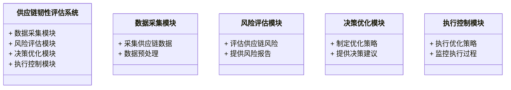
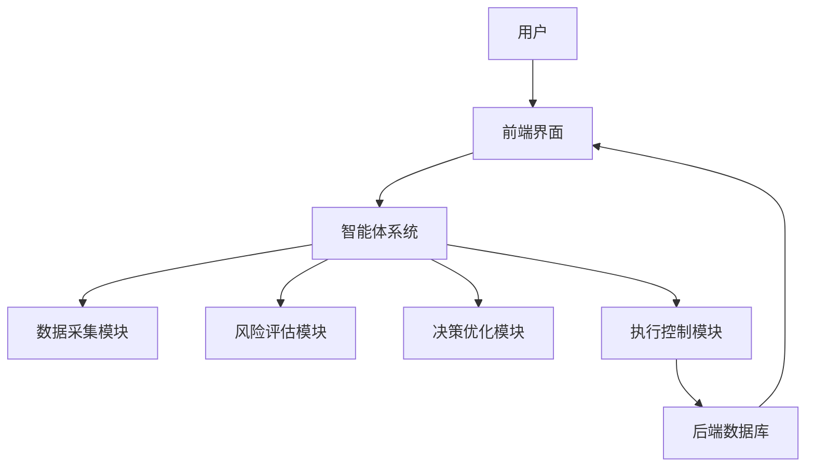
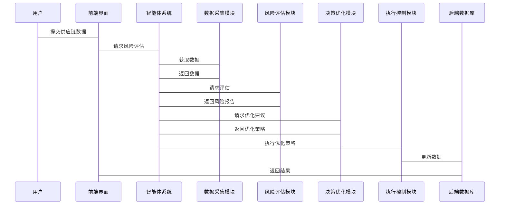

                 


# 利用智能体系统进行全面的供应链韧性评估

## 关键词：供应链韧性评估, 智能体系统, 供应链风险管理, 多智能体协作, 供应链弹性, 供应链优化

## 摘要：  
本文探讨了如何利用智能体系统进行全面的供应链韧性评估。在当前全球化和数字化转型的背景下，供应链的复杂性和脆弱性日益凸显，企业需要更加灵活和有弹性的供应链管理策略。智能体系统作为一种新兴的技术工具，能够通过自主学习、协作和实时响应，显著提升供应链的抗风险能力。本文从供应链韧性评估的背景、智能体系统的核心概念、算法原理、系统设计、项目实战等多个维度展开讨论，深入剖析智能体系统在供应链韧性评估中的应用价值和实现路径。

---

# 第一部分: 供应链韧性评估的背景与挑战

## 第1章: 供应链韧性评估的背景与重要性

### 1.1 供应链韧性评估的定义与核心概念  
供应链韧性是指供应链在面对突发事件、市场波动或其他潜在风险时，能够迅速恢复并维持稳定运作的能力。它是企业应对不确定性和增强供应链弹性的关键指标。  

#### 核心概念  
- **供应链韧性评估**：通过分析供应链的结构、流程和潜在风险，评估其在面对中断时的应对能力和恢复速度。  
- **供应链弹性**：供应链在面对变化和挑战时的适应性和恢复能力。  
- **供应链风险管理**：通过识别、评估和应对潜在风险，确保供应链的稳定性和可靠性。  

### 1.2 当前供应链管理中的挑战  
随着全球化和数字化转型的推进，供应链管理面临以下主要挑战：  
1. **供应链中断风险**：疫情、自然灾害、地缘政治冲突等因素可能导致供应链中断，影响企业的正常运营。  
2. **供应链复杂性**：全球化分工导致供应链涉及多个环节和参与者，增加了管理的复杂性。  
3. **数据孤岛问题**：不同供应链环节之间数据不互通，导致信息不对称，影响整体决策。  
4. **传统供应链的刚性**：传统的供应链管理方式缺乏灵活性，难以快速响应市场变化和突发事件。  

### 1.3 智能体系统在供应链韧性评估中的作用  
智能体系统是一种能够自主感知环境、自主决策并执行任务的系统。其在供应链韧性评估中的优势包括：  
1. **自主学习能力**：智能体能够通过机器学习算法不断优化自身的决策能力。  
2. **多智能体协作**：通过多智能体协作，能够模拟供应链中的多个参与者（如供应商、制造商、零售商）的行为，模拟复杂的供应链场景。  
3. **实时响应**：智能体能够实时感知供应链中的风险，并快速做出应对决策。  
4. **数据驱动的决策**：通过分析海量数据，智能体能够提供精准的风险评估和优化建议。  

### 1.4 本章小结  
本章从供应链韧性评估的背景、核心概念、挑战以及智能体系统的作用四个方面进行了详细阐述。供应链韧性评估是企业在复杂环境下确保供应链稳定性的关键能力，而智能体系统凭借其自主性、协作性和实时性，为企业提供了全新的解决方案。

---

# 第二部分: 智能体系统的核心概念与原理

## 第2章: 智能体系统的核心概念

### 2.1 智能体的定义与分类  
#### 2.1.1 智能体的定义  
智能体（Agent）是指在环境中能够感知并自主行动以实现目标的实体。智能体可以是软件程序、机器人或其他具备自主决策能力的系统。  

#### 2.1.2 智能体的分类  
智能体可以根据其智能水平和决策方式分为以下几类：  
1. **反应式智能体**：基于当前感知做出即时反应，不依赖历史信息。  
2. **规划式智能体**：通过规划和推理，制定长期目标并采取行动。  
3. **学习式智能体**：通过机器学习算法不断优化自身的决策能力。  
4. **协作式智能体**：多个智能体协同工作，共同完成复杂任务。  

#### 2.1.3 智能体与传统自动化系统的区别  
| 特性 | 智能体系统 | 传统自动化系统 |
|------|------------|----------------|
| 决策能力 | 高         | 低             |
| 自主性 | 高         | 低             |
| 学习能力 | 高         | 低             |
| 环境适应性 | 高         | 低             |

### 2.2 智能体系统的组成与功能  
#### 2.2.1 感知层  
感知层负责收集环境中的数据，包括传感器数据、市场信息、物流数据等。  
#### 2.2.2 决策层  
决策层基于感知层提供的数据，通过算法进行分析和决策。  
#### 2.2.3 执行层  
执行层负责根据决策层的指令，采取实际行动，如调整库存、优化物流路径等。  

### 2.3 智能体系统的通信与协作机制  
#### 2.3.1 智能体之间的通信方式  
智能体之间的通信可以通过以下方式进行：  
1. **直接通信**：智能体之间通过共享内存或消息队列直接交换信息。  
2. **间接通信**：通过中间件或消息总线进行通信。  

#### 2.3.2 多智能体协作的挑战  
多智能体协作面临的主要挑战包括：  
1. **通信延迟**：智能体之间的信息传递可能存在延迟，影响协作效率。  
2. **目标冲突**：不同智能体的目标可能不同，导致协作过程中出现冲突。  
3. **决策不确定性**：智能体的决策可能受到不确定因素的影响，导致协作失败。  

#### 2.3.3 协作机制的优化策略  
为了优化多智能体协作，可以采取以下策略：  
1. **分布式决策**：每个智能体在局部范围内做出决策，减少中心化依赖。  
2. **协商机制**：通过协商解决目标冲突，确保协作顺利进行。  
3. **自适应算法**：采用自适应算法，根据环境变化动态调整协作策略。  

### 2.4 本章小结  
本章详细介绍了智能体系统的核心概念，包括智能体的定义、分类、组成与功能，以及多智能体协作的挑战和优化策略。智能体系统的灵活性和协作性使其在供应链韧性评估中具有重要应用价值。

---

# 第三部分: 智能体系统在供应链韧性评估中的算法原理

## 第3章: 基于智能体的供应链韧性评估算法

### 3.1 强化学习算法在供应链管理中的应用  
#### 3.1.1 强化学习的基本原理  
强化学习是一种通过试错机制，学习最优策略的算法。智能体通过与环境互动，不断优化自身的决策能力。  

#### 3.1.2 强化学习在供应链中的应用场景  
1. **库存优化**：智能体通过强化学习，找到最优的库存水平，减少缺货和过剩的情况。  
2. **物流路径优化**：智能体通过强化学习，找到最优的物流路径，降低物流成本。  

#### 3.1.3 强化学习算法的实现  
以下是一个简单的强化学习算法实现示例：  

```python
import numpy as np

# 初始化环境
class Environment:
    def __init__(self):
        self.state = 0
        self.done = False

    def step(self, action):
        # 根据动作更新状态
        self.state = action
        reward = -abs(1 - self.state)
        return self.state, reward, self.done

# 初始化智能体
class Agent:
    def __init__(self, env):
        self.env = env
        self.q_table = np.zeros((2, 1))

    def choose_action(self):
        # 简单的策略：选择使Q值最大的动作
        return np.argmax(self.q_table[self.env.state])

    def update_q_table(self, reward):
        # 更新Q表
        self.q_table[self.env.state][self.env.action] += reward

# 训练过程
env = Environment()
agent = Agent(env)
for episode in range(100):
    state = env.reset()
    while not env.done:
        action = agent.choose_action()
        next_state, reward, done = env.step(action)
        agent.update_q_table(reward)
```

#### 3.1.4 强化学习的数学模型  
强化学习的数学模型可以用以下公式表示：  
$$ Q(s, a) = Q(s, a) + \alpha (r + \gamma V(s')) - Q(s, a) $$  
其中：  
- \( Q(s, a) \) 表示状态 \( s \) 下动作 \( a \) 的Q值。  
- \( \alpha \) 表示学习率。  
- \( r \) 表示奖励。  
- \( \gamma \) 表示折扣因子。  
- \( V(s') \) 表示下一个状态 \( s' \) 的价值函数。  

### 3.2 多智能体协作算法在供应链管理中的应用  
#### 3.2.1 多智能体协作算法的实现  
多智能体协作算法可以通过以下步骤实现：  
1. **初始化智能体**：创建多个智能体，每个智能体负责不同的供应链环节。  
2. **信息共享**：智能体之间共享信息，如市场趋势、库存数据等。  
3. **协作决策**：基于共享信息，智能体共同制定最优决策。  
4. **动态调整**：根据环境变化，动态调整协作策略。  

#### 3.2.2 多智能体协作算法的数学模型  
多智能体协作算法可以用以下公式表示：  
$$ \text{协作收益} = \sum_{i=1}^{n} \text{收益}(i) - \sum_{i=1}^{n} \text{成本}(i) $$  
其中：  
- \( n \) 表示智能体的数量。  
- \( \text{收益}(i) \) 表示第 \( i \) 个智能体的收益。  
- \( \text{成本}(i) \) 表示第 \( i \) 个智能体的成本。  

### 3.3 本章小结  
本章详细介绍了强化学习和多智能体协作算法在供应链韧性评估中的应用。通过强化学习，智能体可以不断优化自身的决策能力，而通过多智能体协作，可以模拟复杂的供应链场景，提升整体供应链的抗风险能力。

---

# 第四部分: 系统分析与架构设计

## 第4章: 供应链韧性评估系统的分析与设计

### 4.1 系统分析  
#### 4.1.1 问题场景介绍  
供应链韧性评估系统需要应对以下问题：  
1. **数据孤岛**：供应链各环节数据分散，难以统一管理。  
2. **风险预测能力不足**：传统方法难以准确预测供应链中断风险。  
3. **响应速度慢**：面对突发事件，供应链难以快速调整策略。  

#### 4.1.2 项目介绍  
本项目旨在开发一个基于智能体系统的供应链韧性评估系统，通过实时数据分析和智能决策，提升供应链的抗风险能力。  

### 4.2 系统功能设计  
#### 4.2.1 领域模型设计  
以下是供应链韧性评估系统的领域模型：  



#### 4.2.2 系统架构设计  
以下是供应链韧性评估系统的架构设计：  



#### 4.2.3 系统接口设计  
系统接口设计包括：  
1. **数据接口**：用于采集和处理供应链数据。  
2. **决策接口**：用于智能体系统做出决策并提供优化建议。  
3. **执行接口**：用于执行优化策略并监控执行过程。  

#### 4.2.4 系统交互流程图  
以下是系统交互流程图：  



### 4.3 本章小结  
本章通过系统分析与设计，详细阐述了供应链韧性评估系统的功能模块、架构设计以及交互流程。通过智能化的系统设计，能够显著提升供应链的抗风险能力。

---

# 第五部分: 项目实战

## 第5章: 基于智能体系统的供应链韧性评估项目实战

### 5.1 环境安装  
#### 5.1.1 安装Python与相关库  
需要安装以下Python库：  
- `numpy`：用于数值计算。  
- `pandas`：用于数据处理。  
- `scikit-learn`：用于机器学习。  
- `matplotlib`：用于数据可视化。  

安装命令：  
```bash
pip install numpy pandas scikit-learn matplotlib
```

### 5.2 系统核心实现源代码  
#### 5.2.1 数据采集模块  
```python
import pandas as pd
import requests

def collect_data(api_url):
    response = requests.get(api_url)
    data = response.json()
    df = pd.DataFrame(data)
    return df
```

#### 5.2.2 风险评估模块  
```python
from sklearn.ensemble import RandomForestClassifier

def assess_risk(data):
    model = RandomForestClassifier()
    model.fit(data.drop('label', axis=1), data['label'])
    return model.predict(data.drop('label', axis=1))
```

#### 5.2.3 决策优化模块  
```python
def optimize_strategy(risk Assessment):
    # 根据风险评估结果制定优化策略
    pass
```

#### 5.2.4 执行控制模块  
```python
def execute_strategy(strategy):
    # 根据优化策略执行操作
    pass
```

### 5.3 实际案例分析  
#### 5.3.1 案例背景  
某公司供应链面临原材料短缺的风险，需要通过智能体系统进行风险评估和优化。  

#### 5.3.2 数据采集与处理  
```python
data = collect_data('http://api.supplychain.com/risk')
data.head()
```

#### 5.3.3 风险评估与优化  
```python
risk_assessment = assess_risk(data)
strategy = optimize_strategy(risk_assessment)
execute_strategy(strategy)
```

### 5.4 项目小结  
本章通过实际案例，详细展示了如何利用智能体系统进行供应链韧性评估。从数据采集到风险评估，再到决策优化和执行控制，整个过程清晰且实用。

---

# 第六部分: 最佳实践与小结

## 第6章: 最佳实践与总结

### 6.1 最佳实践  
1. **数据质量**：确保数据的准确性和完整性，这是智能体系统决策的基础。  
2. **模型调优**：根据实际需求，不断优化智能体系统的算法和参数，提升决策效率。  
3. **持续监控**：实时监控供应链的状态，及时发现潜在风险并做出应对。  

### 6.2 小结  
供应链韧性评估是企业在复杂环境下确保供应链稳定性的关键能力，而智能体系统凭借其自主性、协作性和实时性，为企业提供了全新的解决方案。通过本文的探讨，读者可以深入了解智能体系统在供应链韧性评估中的应用价值和实现路径。

### 6.3 注意事项  
1. 在实际应用中，需要根据具体场景调整智能体系统的参数和算法。  
2. 数据隐私和安全问题需要高度重视，确保数据的合法合规使用。  

### 6.4 拓展阅读  
- **《强化学习实战》**：深入理解强化学习的原理和应用。  
- **《多智能体系统与协作》**：学习多智能体协作的理论与实践。  

---

# 作者：AI天才研究院/AI Genius Institute & 禅与计算机程序设计艺术 /Zen And The Art of Computer Programming

