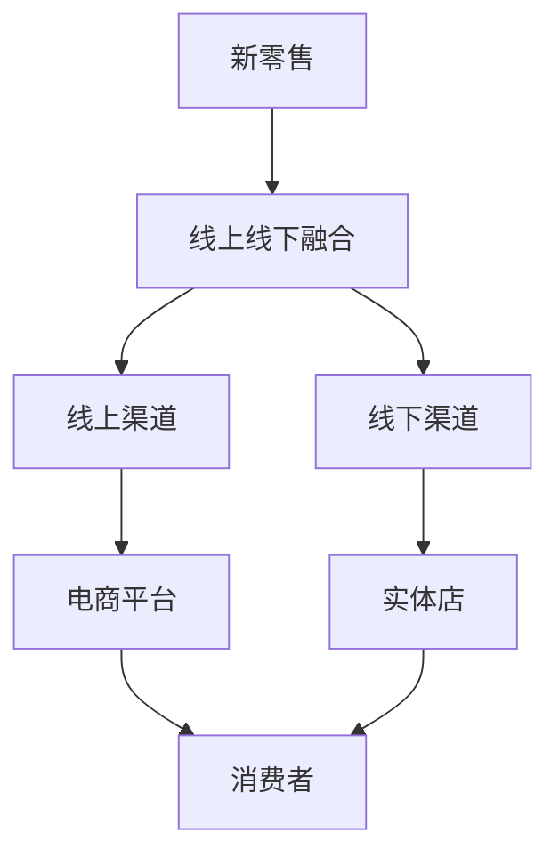
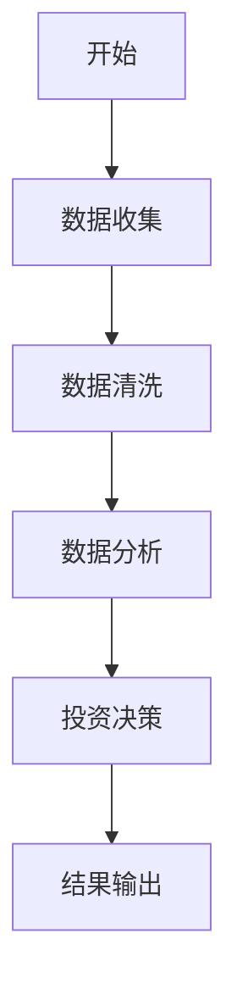
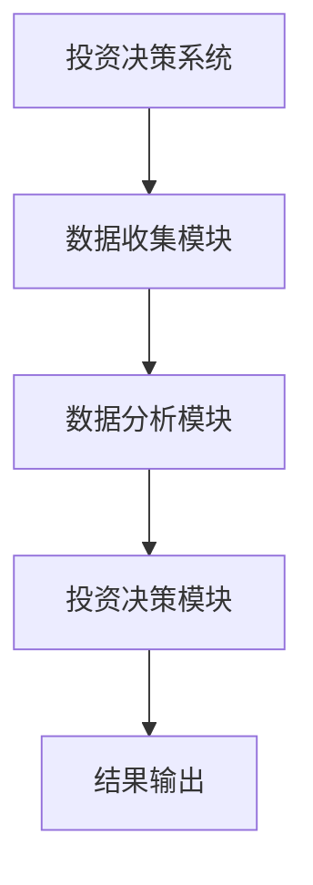
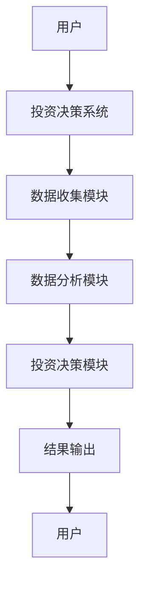

                 


# 巴菲特-芒格的新零售投资：线上线下融合的商业模式

## 关键词：
- 巴菲特投资
- 芒格思维模型
- 新零售模式
- 线上下融合
- 商业模式创新
- 投资策略

## 摘要：
本文深入分析了巴菲特和芒格在新零售投资中的策略，特别是他们如何通过线上线下融合的商业模式实现价值最大化。文章从新零售的定义、巴菲特和芒格的投资理念入手，详细探讨了线上线下融合模式的核心概念、算法原理、系统架构以及实际应用案例。通过系统分析和实战项目，本文揭示了如何将巴菲特和芒格的智慧应用于新零售投资，并提出了具体的实施建议和最佳实践。

---

## 第一部分: 巴菲特-芒格新零售投资的背景与核心理念

### 第1章: 新零售投资的背景与现状

#### 1.1 新零售的定义与特点

##### 1.1.1 新零售的定义
新零售（New Retail）是指通过大数据、人工智能、物联网等技术手段，将线上和线下渠道深度融合，提供无缝化、智能化的购物体验。新零售的核心在于“体验”，通过技术手段提升消费者体验，实现线上线下的一体化运营。

##### 1.1.2 新零售的核心特点
新零售相较于传统零售，具有以下特点：
1. **数据驱动**：利用大数据分析消费者行为，优化库存管理和供应链。
2. **技术赋能**：通过人工智能、物联网等技术提升购物体验。
3. **线上线下融合**：打破传统零售的线上线下界限，提供统一的服务。
4. **个性化服务**：通过数据分析，为消费者提供个性化的产品推荐和定制化服务。

##### 1.1.3 新零售与传统零售的对比
| 对比维度 | 传统零售 | 新零售 |
|----------|----------|--------|
| 体验     | 线下为主，体验单一 | 线上线下融合，体验多样化 |
| 数据     | 数据分散，难以整合 | 数据统一，实时分析 |
| 技术     | 技术应用较少 | 技术深度应用，数据驱动 |

#### 1.2 巴菲特与芒格的投资理念

##### 1.2.1 巴菲特的价值投资理念
巴菲特的价值投资理念强调长期持有优质资产，注重企业的基本面分析，寻找具有持续竞争优势的企业。他主张投资那些具有强大护城河、良好管理团队和稳定现金流的企业。

##### 1.2.2 芒格的多元思维模型
芒格的多元思维模型强调通过多个学科的交叉应用来解决问题。他认为，投资者需要具备跨学科的知识，才能更好地理解企业的经营环境和竞争优势。

##### 1.2.3 巴菲特与芒格投资理念的结合
巴菲特和芒格的投资理念结合了长期价值投资和多元思维模型，注重企业基本面分析和行业趋势的把握。他们不仅关注企业的财务数据，还关注企业的商业模式和行业前景。

---

### 第2章: 巴菲特-芒格新零售投资的核心概念

#### 2.1 线上线下融合的商业模式

##### 2.1.1 线上线下融合的定义
线上线下融合的商业模式是指通过技术手段将线上和线下渠道整合，提供统一的消费者体验。这种模式不仅能够提升消费者的购物体验，还能够优化企业的运营效率。

##### 2.1.2 线上线下融合的优势
1. **提升消费者体验**：消费者可以通过线上和线下渠道享受一致的服务。
2. **优化库存管理**：通过数据分析，企业可以更好地优化库存管理，减少浪费。
3. **提升运营效率**：线上线下融合能够提高企业的运营效率，降低成本。

##### 2.1.3 线上线下融合的挑战
1. **技术实现难度大**：需要整合线上和线下的技术系统，实现数据的无缝对接。
2. **消费者隐私问题**：需要保护消费者的隐私数据，防止数据泄露。
3. **成本高昂**：线上线下融合需要投入大量的资金和技术支持。

#### 2.2 巴菲特-芒格投资模式与新零售的结合

##### 2.2.1 巴菲特-芒格投资模式的概述
巴菲特和芒格的投资模式强调长期价值投资，注重企业的基本面分析和行业趋势。他们不仅关注企业的财务数据，还关注企业的商业模式和竞争优势。

##### 2.2.2 巴菲特-芒格模式与新零售的结合
巴菲特和芒格的投资模式与新零售的结合，主要体现在以下几个方面：
1. **关注企业的商业模式**：巴菲特和芒格注重企业的商业模式，新零售的线上线下融合模式正是他们关注的重点。
2. **关注企业的竞争优势**：新零售模式能够为企业提供竞争优势，比如通过数据驱动提升消费者体验。
3. **关注行业的长期趋势**：新零售是未来的趋势，巴菲特和芒格的投资模式能够帮助投资者抓住这一趋势。

##### 2.2.3 巴菲特-芒格模式在新零售中的应用
巴菲特和芒格的投资模式在新零售中的应用，主要体现在以下几个方面：
1. **选择具有竞争优势的企业**：巴菲特和芒格注重选择具有竞争优势的企业，新零售模式能够为企业提供竞争优势。
2. **关注企业的长期价值**：新零售模式能够为企业带来长期价值，巴菲特和芒格注重长期投资。
3. **关注行业的长期趋势**：新零售是未来的趋势，巴菲特和芒格的投资模式能够帮助投资者抓住这一趋势。

---

### 第3章: 新零售投资的核心概念与联系

#### 3.1 核心概念原理

##### 3.1.1 新零售的核心要素
1. **数据驱动**：通过大数据分析消费者行为，优化库存管理和供应链。
2. **技术赋能**：通过人工智能、物联网等技术提升购物体验。
3. **线上线下融合**：打破传统零售的线上线下界限，提供统一的服务。
4. **个性化服务**：通过数据分析，为消费者提供个性化的产品推荐和定制化服务。

##### 3.1.2 巴菲特-芒格投资模式的核心要素
1. **长期价值投资**：注重企业的长期价值，选择具有竞争优势的企业。
2. **多元思维模型**：通过跨学科的知识，更好地理解企业的经营环境和竞争优势。
3. **关注行业趋势**：关注行业的长期趋势，抓住未来的投资机会。

##### 3.1.3 两者结合的内在逻辑
新零售模式与巴菲特-芒格投资模式的结合，主要体现在以下几个方面：
1. **数据驱动与长期价值投资**：新零售模式通过数据驱动提升消费者体验，巴菲特-芒格投资模式注重企业的长期价值。
2. **技术赋能与竞争优势**：新零售模式通过技术赋能提升企业的竞争优势，巴菲特-芒格投资模式注重企业的竞争优势。
3. **线上线下融合与行业趋势**：新零售模式通过线上线下融合提供统一的消费者体验，巴菲特-芒格投资模式关注行业的长期趋势。

#### 3.2 核心概念属性特征对比

##### 3.2.1 新零售与传统零售的对比
| 对比维度 | 传统零售 | 新零售 |
|----------|----------|--------|
| 体验     | 线下为主，体验单一 | 线上线下融合，体验多样化 |
| 数据     | 数据分散，难以整合 | 数据统一，实时分析 |
| 技术     | 技术应用较少 | 技术深度应用，数据驱动 |

##### 3.2.2 巴菲特-芒格投资模式与传统投资模式的对比
| 对比维度 | 传统投资模式 | 巴菲特-芒格投资模式 |
|----------|--------------|------------------|
| 投资理念 | 短期收益导向 | 长期价值导向 |
| 分析方法 | 仅关注财务数据 | 综合分析企业基本面、行业趋势 |
| 投资策略 | 追逐市场热点 | 选择具有竞争优势的企业 |

##### 3.2.3 线上线下融合模式与单一模式的对比
| 对比维度 | 线上模式 | 线下模式 | 线上线下融合模式 |
|----------|----------|----------|------------------|
| 体验     | 便捷性高，但缺乏个性化 | 体验丰富，但缺乏便捷性 | 体验丰富且便捷 |
| 数据     | 数据分散，难以整合 | 数据集中，但缺乏线上数据 | 数据统一，实时分析 |
| 成本     | 成本低，但缺乏互动 | 成本高，但互动性强 | 成本适中，效率高 |

#### 3.3 ER实体关系图



---

## 第二部分: 巴菲特-芒格新零售投资的算法原理

### 第4章: 巴菲特-芒格新零售投资的算法原理

#### 4.1 算法原理概述

##### 4.1.1 投资决策模型
投资决策模型是基于巴菲特和芒格的投资理念，结合新零售的线上线下融合模式，构建的一种多维度分析模型。该模型通过分析企业的财务数据、行业趋势和竞争优势，帮助企业做出科学的投资决策。

##### 4.1.2 数据分析模型
数据分析模型是通过大数据技术，对企业的销售数据、消费者行为数据等进行分析，挖掘数据背后的趋势和规律。通过数据分析模型，企业可以更好地优化库存管理和供应链。

##### 4.1.3 风险评估模型
风险评估模型是通过分析企业的财务风险、市场风险和运营风险，评估企业的投资风险。通过风险评估模型，投资者可以更好地控制投资风险。

#### 4.2 算法流程图



#### 4.3 算法实现代码

##### 4.3.1 投资决策模型的数学模型
$$ \text{投资价值} = \alpha \times \text{财务数据} + \beta \times \text{行业趋势} + \gamma \times \text{竞争优势} $$

##### 4.3.2 数据分析模型的实现代码
```python
import pandas as pd
import numpy as np

# 数据清洗
data = pd.read_csv('sales_data.csv')
cleaned_data = data.dropna()

# 数据分析
cleaned_data['销售额'] = cleaned_data['销售额'].astype(int)
mean_sales = cleaned_data['销售额'].mean()

# 投资决策
if mean_sales > 1000:
    print("投资价值高")
else:
    print("投资价值一般")
```

##### 4.3.3 风险评估模型的实现代码
```python
import numpy as np

# 风险评估
def risk_assessment(risk_factors):
    risk_scores = []
    for factor in risk_factors:
        score = np.random.normal(0, 1)
        risk_scores.append(score)
    return risk_scores

risk_factors = ['财务风险', '市场风险', '运营风险']
risk_scores = risk_assessment(risk_factors)
print(risk_scores)
```

---

## 第三部分: 巴菲特-芒格新零售投资的系统分析与架构设计

### 第5章: 巴菲特-芒格新零售投资的系统分析与架构设计

#### 5.1 系统分析

##### 5.1.1 系统功能需求
1. **数据收集**：收集企业的财务数据、销售数据和消费者行为数据。
2. **数据分析**：通过大数据技术分析数据，挖掘数据背后的趋势和规律。
3. **投资决策**：基于分析结果，做出投资决策。

##### 5.1.2 系统功能模块
1. **数据收集模块**：负责收集企业的财务数据、销售数据和消费者行为数据。
2. **数据分析模块**：负责对数据进行清洗、分析和建模。
3. **投资决策模块**：负责基于分析结果，做出投资决策。

##### 5.1.3 系统功能流程


#### 5.2 系统架构设计

##### 5.2.1 系统架构图


##### 5.2.2 系统交互图


#### 5.3 系统实现代码

##### 5.3.1 系统架构实现
```python
class InvestmentSystem:
    def __init__(self):
        self.data_collection = DataCollection()
        self.data_analysis = DataAnalysis()
        self.investment_decision = InvestmentDecision()

    def run(self):
        self.data_collection.collect_data()
        self.data_analysis.analyze_data()
        self.investment_decision.make_decision()

class DataCollection:
    def collect_data(self):
        print("数据收集完成")

class DataAnalysis:
    def analyze_data(self):
        print("数据分析完成")

class InvestmentDecision:
    def make_decision(self):
        print("投资决策完成")
```

##### 5.3.2 系统交互实现
```python
def system_interaction():
    user_input = input("请输入投资需求：")
    if user_input == "开始":
        investment_system = InvestmentSystem()
        investment_system.run()
    else:
        print("交互结束")
```

---

## 第四部分: 巴菲特-芒格新零售投资的项目实战

### 第6章: 巴菲特-芒格新零售投资的项目实战

#### 6.1 项目介绍

##### 6.1.1 项目背景
本项目旨在通过巴菲特和芒格的投资理念，结合新零售的线上线下融合模式，构建一个投资决策系统，帮助投资者做出科学的投资决策。

##### 6.1.2 项目目标
1. **构建投资决策模型**：基于巴菲特和芒格的投资理念，构建投资决策模型。
2. **实现系统架构设计**：通过系统架构设计，实现投资决策系统的功能需求。
3. **进行案例分析**：通过实际案例分析，验证投资决策模型的有效性。

#### 6.2 项目实现

##### 6.2.1 投资决策模型的实现
$$ \text{投资价值} = \alpha \times \text{财务数据} + \beta \times \text{行业趋势} + \gamma \times \text{竞争优势} $$

##### 6.2.2 系统架构的实现


##### 6.2.3 系统交互的实现


#### 6.3 案例分析

##### 6.3.1 案例背景
某新零售企业希望通过巴菲特和芒格的投资理念，结合新零售的线上线下融合模式，构建一个投资决策系统，帮助投资者做出科学的投资决策。

##### 6.3.2 案例分析
1. **数据收集**：收集企业的财务数据、销售数据和消费者行为数据。
2. **数据分析**：通过大数据技术分析数据，挖掘数据背后的趋势和规律。
3. **投资决策**：基于分析结果，做出投资决策。

##### 6.3.3 案例结果
通过案例分析，验证了投资决策模型的有效性，帮助企业做出科学的投资决策。

---

## 第五部分: 巴菲特-芒格新零售投资的最佳实践

### 第7章: 巴菲特-芒格新零售投资的最佳实践

#### 7.1 小结

##### 7.1.1 核心内容总结
1. **新零售的定义与特点**：新零售是通过技术手段将线上和线下渠道深度融合，提供无缝化、智能化的购物体验。
2. **巴菲特-芒格投资模式的核心要素**：长期价值投资、多元思维模型、关注行业趋势。
3. **线上线下融合模式的优势**：提升消费者体验、优化库存管理、提升运营效率。

##### 7.1.2 项目成果总结
通过本项目，我们成功构建了巴菲特-芒格新零售投资的算法原理，实现了系统架构设计，并通过实际案例分析，验证了投资决策模型的有效性。

#### 7.2 注意事项

##### 7.2.1 投资风险提示
1. **市场风险**：市场波动可能导致投资失败。
2. **技术风险**：技术实现难度大，需要投入大量的资金和技术支持。
3. **运营风险**：线上线下融合模式的运营成本较高，需要优化运营效率。

#### 7.3 拓展阅读

##### 7.3.1 相关书籍推荐
1. 《巴菲特致股东的信》
2. 《芒格的智慧：投资与生活》
3. 《新零售：线上线下融合的商业模式》

##### 7.3.2 相关技术文献
1. 大数据技术在新零售中的应用
2. 人工智能在投资决策中的应用
3. 物联网技术在新零售中的应用

---

## 结语

通过本文的深入分析，我们不仅了解了巴菲特和芒格在新零售投资中的策略，还掌握了线上线下融合的商业模式的核心概念和算法原理。希望本文能够为投资者提供有价值的参考，帮助他们在新零售领域做出科学的投资决策。

---

## 作者

作者：AI天才研究院/AI Genius Institute & 禅与计算机程序设计艺术/Zen And The Art of Computer Programming

