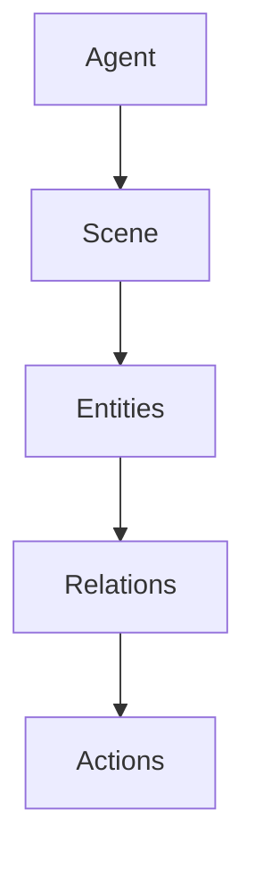
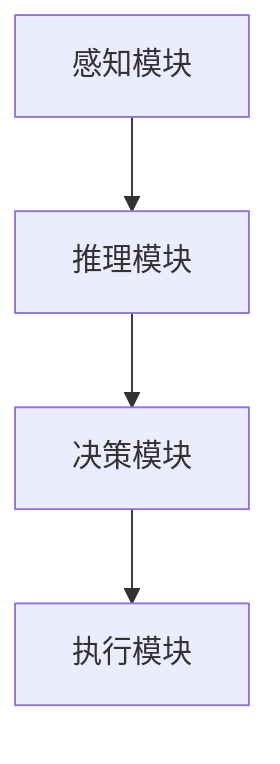

                 


# 开发具有复杂场景理解与决策能力的AI Agent

> 关键词：AI Agent、复杂场景、决策能力、深度学习、自然语言处理、强化学习

> 摘要：本文详细探讨了开发具有复杂场景理解与决策能力的AI Agent的核心概念、算法原理、系统架构设计及实际应用。通过分析AI Agent在复杂场景中的感知、推理、决策和执行过程，结合深度学习、自然语言处理和强化学习等技术，展示了如何构建具备高度智能和适应性的AI Agent系统。

---

# 第一部分: AI Agent背景与核心概念

## 第1章: AI Agent概述

### 1.1 问题背景与描述
AI Agent（人工智能代理）是一种能够感知环境、理解场景、做出决策并执行动作的智能系统。随着人工智能技术的快速发展，AI Agent在多个领域展现出巨大的潜力，尤其是在需要处理复杂场景的应用中，如自动驾驶、智能客服、机器人控制等。传统的AI技术在处理复杂场景时往往显得力不从心，因为它们缺乏对场景的深度理解和灵活的决策能力。AI Agent的出现，填补了这一技术空白，为解决复杂场景中的问题提供了新的思路。

**1.1.1 传统AI的局限性**  
传统AI技术（如基于规则的系统或简单的机器学习模型）在处理复杂场景时，往往依赖于预定义的规则或固定的模型结构，难以适应动态变化的环境。例如，在自动驾驶场景中，传统AI难以处理复杂的交通情况，如突然出现的障碍物或不可预测的人为因素。

**1.1.2 复杂场景理解与决策的必要性**  
在现实世界中，许多场景具有高度的动态性和不确定性，例如交通管理、医疗诊断、金融投资等领域。这些场景需要AI系统具备强大的感知能力、灵活的推理能力和高效的决策能力，才能真正实现智能化。

**1.1.3 AI Agent的定义与目标**  
AI Agent是一种能够与环境交互、自主决策并执行任务的智能系统。其目标是通过感知环境信息，理解场景中的实体、关系和上下文，基于这些理解做出最优或合理的决策，并通过执行动作实现目标。

### 1.2 问题解决与边界
AI Agent的目标是解决复杂场景中的问题，但其能力也有一定的边界。理解这些边界有助于明确AI Agent的应用范围和限制。

**1.2.1 复杂场景理解的核心问题**  
复杂场景理解的核心问题是如何从多模态数据中提取有意义的信息，并构建场景的语义表示。例如，在自动驾驶中，AI Agent需要理解道路、车辆、行人等实体的位置、关系和动态。

**1.2.2 AI Agent决策能力的边界**  
AI Agent的决策能力受限于其感知能力和模型的泛化能力。例如，在极端天气条件下，AI Agent可能无法做出可靠的决策，因为它可能缺乏足够的训练数据或感知信息。

**1.2.3 与相关技术的区分与联系**  
AI Agent与传统AI的区别在于其自主性和适应性。与机器学习模型相比，AI Agent具备更强的场景理解能力和动态决策能力。

### 1.3 核心概念与组成要素
AI Agent的核心概念包括感知、推理、决策和执行四个主要部分。

**1.3.1 AI Agent的核心要素**  
- **感知**：通过传感器或数据输入获取环境信息。  
- **推理**：基于感知信息进行逻辑推理，理解场景的语义。  
- **决策**：根据推理结果制定行动方案。  
- **执行**：通过执行机构将决策转化为实际动作。

**1.3.2 场景理解与决策的关系**  
场景理解是决策的基础，决策是理解的延伸。AI Agent需要通过理解场景中的实体、关系和上下文，才能做出合理的决策。

**1.3.3 系统架构与功能模块**  
AI Agent的系统架构通常包括感知模块、推理模块、决策模块和执行模块。这些模块通过协同工作，实现对复杂场景的理解与决策。

### 1.4 本章小结
本章介绍了AI Agent的背景、核心概念及其在复杂场景中的应用。通过对比传统AI与AI Agent的差异，明确了AI Agent的独特优势和应用场景。

---

## 第2章: AI Agent的核心原理

### 2.1 感知与理解
AI Agent的第一步是感知环境，获取场景中的信息。

**2.1.1 多模态感知的原理**  
AI Agent需要整合多种模态的数据，如图像、文本、语音等，以全面理解场景。例如，在自动驾驶中，AI Agent需要同时处理来自摄像头、雷达和激光雷达的数据。

**2.1.2 场景理解的层次模型**  
场景理解可以分为多个层次：从低层次的特征提取到高层次的语义理解。例如，从图像中提取边缘、纹理等特征，最终理解场景中的物体、关系和场景类别。

**2.1.3 实体识别与关系抽取**  
通过自然语言处理和计算机视觉技术，AI Agent可以识别场景中的实体，并抽取实体之间的关系。例如，在一张图片中识别出“人”、“车”等实体，并理解它们之间的关系（如“人站在车旁边”）。

### 2.2 推理与决策
在理解场景的基础上，AI Agent需要进行推理和决策。

**2.2.1 基于知识图谱的推理**  
知识图谱是一种结构化的知识表示方式，AI Agent可以通过在知识图谱上进行推理，理解场景中的隐含信息。例如，如果知道“人站在车旁边”且“下雨”，可以推理出“人可能需要打伞”。

**2.2.2 概率推理与决策树**  
概率推理是一种基于概率论的推理方法，常用于处理不确定性问题。决策树是一种直观的决策模型，可以帮助AI Agent在多个选项中选择最优的决策路径。

**2.2.3 强化学习在决策中的应用**  
强化学习是一种通过试错机制优化决策的算法。AI Agent可以通过与环境的交互，不断优化其决策策略，以实现目标。

### 2.3 行为与执行
AI Agent的最终目标是通过执行动作实现其决策。

**2.3.1 动作规划的算法**  
动作规划是将决策转化为具体动作的过程。例如，在自动驾驶中，AI Agent需要规划车辆的转向、加速和刹车动作。

**2.3.2 多阶段决策的实现**  
多阶段决策是一种动态决策方法，AI Agent在每一步做出决策后，需要根据新的环境信息调整后续决策。例如，在棋类游戏中，AI Agent需要在每一步选择最优的棋步。

**2.3.3 行为优化的策略**  
行为优化是通过不断试错，优化AI Agent的行为策略。例如，通过强化学习，AI Agent可以在复杂的环境中逐步优化其行为。

### 2.4 核心概念对比表
下表对比了AI Agent中的核心概念及其特征：

| 概念       | 特征描述                                                                 |
|------------|------------------------------------------------------------------------|
| 感知       | 从多模态数据中提取信息                                                 |
| 推理       | 基于感知信息进行逻辑推理                                             |
| 决策       | 根据推理结果制定行动方案                                             |
| 执行       | 将决策转化为具体动作                                                 |

### 2.5 ER实体关系图
以下是一个简单的实体关系图：



### 2.6 本章小结
本章详细讲解了AI Agent的核心原理，包括感知、推理和决策的实现方法。通过对比分析，明确了各部分的功能和关系。

---

## 第3章: AI Agent的算法原理

### 3.1 场景理解算法
AI Agent的场景理解依赖于多种算法。

**3.1.1 多模态感知算法**  
多模态感知算法整合了多种数据源的信息，以提高场景理解的准确性。例如，结合图像、文本和语音信息进行场景分类。

**3.1.2 基于Transformer的多模态模型**  
Transformer是一种强大的深度学习模型，广泛应用于自然语言处理和计算机视觉领域。通过将多模态数据输入到Transformer模型中，可以实现高效的场景理解。

**3.1.3 实例分析与代码实现**  
以下是一个简单的多模态感知算法的代码示例：

```python
import torch
import torch.nn as nn

class MultiModalPerceptron(nn.Module):
    def __init__(self, input_size, hidden_size, output_size):
        super().__init__()
        self.fc1 = nn.Linear(input_size, hidden_size)
        self.fc2 = nn.Linear(hidden_size, output_size)
        self.relu = nn.ReLU()

    def forward(self, x):
        x = self.fc1(x)
        x = self.relu(x)
        x = self.fc2(x)
        return x

# 使用示例
input_size = 10
hidden_size = 5
output_size = 2
model = MultiModalPerceptron(input_size, hidden_size, output_size)
input_data = torch.randn(1, input_size)
output = model(input_data)
print(output)
```

### 3.2 推理与决策算法
AI Agent的推理和决策算法是其智能的核心。

**3.2.1 基于知识图谱的推理**  
知识图谱是一种结构化的知识表示方式。通过在知识图谱上进行推理，AI Agent可以理解场景中的隐含信息。

**3.2.2 概率推理与决策树**  
概率推理是一种基于概率论的推理方法，常用于处理不确定性问题。决策树是一种直观的决策模型，可以帮助AI Agent在多个选项中选择最优的决策路径。

**3.2.3 强化学习在决策中的应用**  
强化学习是一种通过试错机制优化决策的算法。AI Agent可以通过与环境的交互，不断优化其决策策略，以实现目标。

### 3.3 动作规划算法
动作规划是AI Agent实现决策的最后一步。

**3.3.1 多阶段决策的实现**  
多阶段决策是一种动态决策方法，AI Agent在每一步做出决策后，需要根据新的环境信息调整后续决策。

**3.3.2 基于强化学习的动作规划**  
强化学习是一种有效的动作规划方法。通过不断试错，AI Agent可以在复杂的环境中逐步优化其行为策略。

**3.3.3 实例分析与代码实现**  
以下是一个简单的强化学习算法的代码示例：

```python
import gym
import numpy as np

env = gym.make('CartPole-v0')
env.seed(42)

# 初始化参数
learning_rate = 0.01
gamma = 0.99

# 创建神经网络
class PolicyNetwork(nn.Module):
    def __init__(self, input_dim, output_dim):
        super().__init__()
        self.fc1 = nn.Linear(input_dim, 128)
        self.fc2 = nn.Linear(128, output_dim)
        self.softmax = nn.Softmax(dim=-1)

    def forward(self, x):
        x = self.fc1(x)
        x = self.fc2(x)
        x = self.softmax(x)
        return x

policy = PolicyNetwork(4, 2)
optimizer = torch.optim.Adam(policy.parameters(), lr=learning_rate)

# 训练过程
num_episodes = 1000
for episode in range(num_episodes):
    state = env.reset()
    rewards = []
    while True:
        state_tensor = torch.FloatTensor(state)
        action_probs = policy(state_tensor)
        action = np.random.choice(2, p=action_probs.detach().numpy()[0])
        next_state, reward, done, _ = env.step(action)
        rewards.append(reward)
        if done:
            break
        state = next_state
    # 计算损失并反向传播
    discounted_rewards = [gamma**i * rewards[i] for i in range(len(rewards))]
    loss = -torch.mean(torch.log(action_probs) * torch.FloatTensor(discounted_rewards))
    optimizer.zero_grad()
    loss.backward()
    optimizer.step()

env.close()
```

### 3.4 本章小结
本章详细讲解了AI Agent的算法原理，包括多模态感知、基于知识图谱的推理、强化学习在决策中的应用等内容。通过实例分析和代码实现，帮助读者更好地理解这些算法的实现细节。

---

## 第4章: AI Agent的系统架构设计

### 4.1 问题场景介绍
AI Agent的系统架构设计需要结合具体的应用场景。

**4.1.1 系统功能设计**  
系统功能设计包括感知模块、推理模块、决策模块和执行模块。例如，在自动驾驶系统中，感知模块负责识别道路、车辆和行人，推理模块负责预测车辆和行人的运动轨迹，决策模块负责制定驾驶策略，执行模块负责控制车辆的转向、加速和刹车。

**4.1.2 领域模型设计**  
领域模型是系统架构设计的重要部分。例如，在医疗诊断系统中，领域模型需要包含患者的症状、病史、诊断结果等信息。

### 4.2 系统架构设计
系统架构设计需要考虑模块之间的交互和协作。

**4.2.1 系统架构设计的实现**  
系统架构设计通常采用分层架构，包括感知层、推理层、决策层和执行层。各层之间通过接口进行交互。

**4.2.2 系统架构图**  
以下是一个简单的系统架构图：



### 4.3 系统接口设计
系统接口设计需要明确各模块之间的交互方式。

**4.3.1 模块间接口设计**  
模块间接口设计通常采用消息队列或服务调用的方式。例如，感知模块将感知结果通过消息队列传递给推理模块。

**4.3.2 接口设计的实现**  
在实际实现中，可以使用消息队列（如RabbitMQ）或远程过程调用（如gRPC）来实现模块间的交互。

### 4.4 系统交互设计
系统交互设计需要考虑用户与系统之间的交互。

**4.4.1 用户界面设计**  
用户界面设计需要直观、简洁，方便用户与AI Agent进行交互。例如，在智能客服系统中，用户可以通过自然语言输入问题，AI Agent通过理解用户的问题，提供相应的解答。

**4.4.2 系统交互的实现**  
在实际实现中，可以通过自然语言处理技术，将用户的输入转化为系统可以理解的结构化数据。

### 4.5 本章小结
本章详细讲解了AI Agent的系统架构设计，包括系统功能设计、系统架构设计、系统接口设计和系统交互设计等内容。通过实际案例分析，帮助读者更好地理解这些设计的实现细节。

---

## 第5章: AI Agent的项目实战

### 5.1 环境安装与配置
**5.1.1 安装Python与相关库**  
需要安装Python 3.6及以上版本，并安装以下库：numpy、torch、gym、transformers等。

**5.1.2 安装开发环境**  
建议使用虚拟环境（如venv或conda）来管理依赖项。

### 5.2 系统核心实现
**5.2.1 感知模块的实现**  
感知模块可以通过计算机视觉或自然语言处理技术实现。例如，使用OpenCV进行图像处理，使用spaCy进行文本处理。

**5.2.2 推理模块的实现**  
推理模块可以通过知识图谱或逻辑推理算法实现。例如，使用Ontology工具构建知识图谱，使用逻辑推理算法进行推理。

**5.2.3 决策模块的实现**  
决策模块可以通过强化学习或决策树算法实现。例如，使用强化学习算法训练决策模型，使用决策树算法进行决策。

**5.2.4 执行模块的实现**  
执行模块可以通过机器人控制或自动化工具实现。例如，使用ROS（Robot Operating System）控制机器人，使用自动化工具（如Selenium）实现自动化操作。

### 5.3 代码实现与解读
以下是一个简单的AI Agent系统的核心代码示例：

```python
import torch
import torch.nn as nn
import torch.optim as optim
import gym

class AIAgent:
    def __init__(self, input_dim, hidden_dim, output_dim):
        self.model = nn.Sequential(
            nn.Linear(input_dim, hidden_dim),
            nn.ReLU(),
            nn.Linear(hidden_dim, output_dim),
            nn.Softmax(dim=-1)
        )
        self.optimizer = optim.Adam(self.model.parameters(), lr=0.01)

    def perceive(self, state):
        # 感知模块
        with torch.no_grad():
            action_probs = self.model(torch.FloatTensor(state))
        return action_probs

    def decide(self, state):
        # 决策模块
        action_probs = self.perceive(state)
        action = torch.multinomial(action_probs, 1).item()
        return action

    def learn(self, state, action, reward):
        # 学习模块
        action_probs = self.model(torch.FloatTensor(state))
        loss = -torch.log(action_probs[0, action]) * reward
        self.optimizer.zero_grad()
        loss.backward()
        self.optimizer.step()

# 创建环境和AI Agent
env = gym.make('CartPole-v0')
agent = AIAgent(input_dim=4, hidden_dim=128, output_dim=2)

# 训练过程
num_episodes = 1000
for episode in range(num_episodes):
    state = env.reset()
    rewards = []
    while True:
        action = agent.decide(state)
        next_state, reward, done, _ = env.step(action)
        agent.learn(state, action, reward)
        rewards.append(reward)
        if done:
            break
        state = next_state
```

### 5.4 案例分析与详细讲解
以下是一个AI Agent在自动驾驶场景中的应用案例：

**案例背景**  
假设我们正在开发一个自动驾驶系统，AI Agent需要感知道路、车辆和行人，推理车辆和行人的运动轨迹，制定驾驶策略，并通过执行模块控制车辆的转向、加速和刹车。

**系统实现**  
- **感知模块**：使用计算机视觉技术（如YOLO）识别道路、车辆和行人。  
- **推理模块**：基于感知结果，预测车辆和行人的运动轨迹。  
- **决策模块**：根据推理结果，制定驾驶策略（如避免碰撞、保持车速等）。  
- **执行模块**：通过控制车辆的转向、加速和刹车，实现驾驶策略。

### 5.5 本章小结
本章通过实际案例分析，展示了AI Agent的系统实现过程，包括环境安装、系统核心实现和代码实现等内容。通过详细解读，帮助读者更好地理解AI Agent的开发过程。

---

## 第6章: 总结与展望

### 6.1 核心内容回顾
AI Agent是一种能够感知环境、理解场景、做出决策并执行动作的智能系统。通过多模态感知、逻辑推理和强化学习等技术，AI Agent在复杂场景中展现了强大的智能和适应性。

### 6.2 最佳实践 tips
- **模块化设计**：建议将AI Agent系统设计为模块化结构，便于开发和维护。  
- **数据驱动**：AI Agent的性能依赖于高质量的数据，建议优先投入数据收集和处理工作。  
- **持续优化**：通过持续学习和优化，不断提升AI Agent的智能水平。

### 6.3 小结与注意事项
AI Agent的开发需要综合运用多种技术，包括多模态感知、逻辑推理和强化学习等。在实际开发中，需要注意系统的实时性和可靠性，确保AI Agent能够在复杂场景中稳定运行。

### 6.4 拓展阅读
- **《深度学习》—— Ian Goodfellow**  
- **《强化学习》—— Richard S. Sutton**  
- **《自然语言处理实战》——哈雷）

### 6.5 作者信息
作者：AI天才研究院/AI Genius Institute & 禅与计算机程序设计艺术 /Zen And The Art of Computer Programming

---

以上是《开发具有复杂场景理解与决策能力的AI Agent》的技术博客文章的详细内容，涵盖了从背景介绍、核心概念、算法原理、系统设计到项目实战的各个方面。

